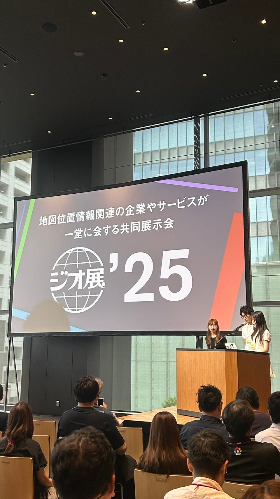
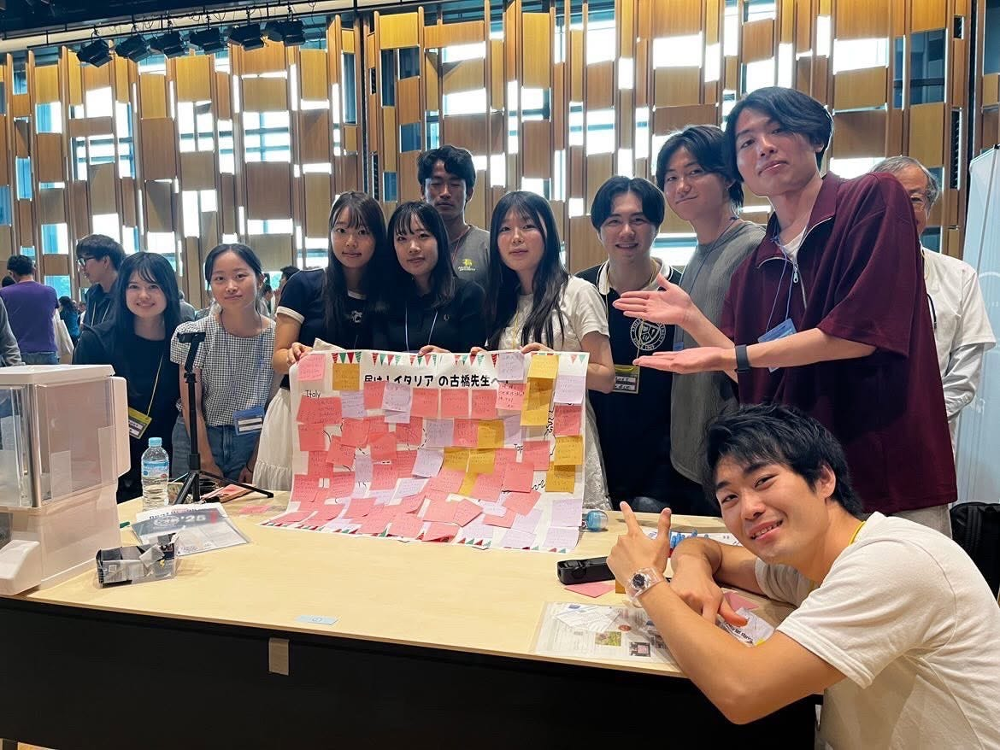
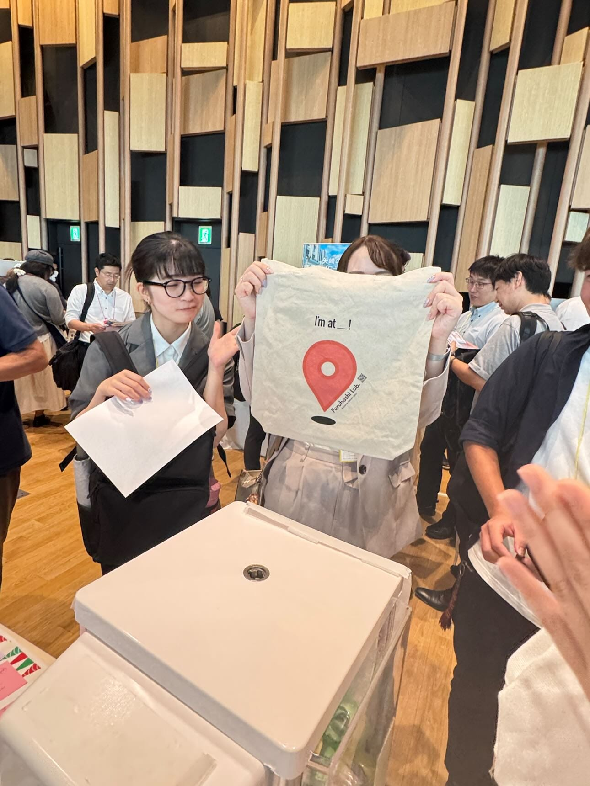
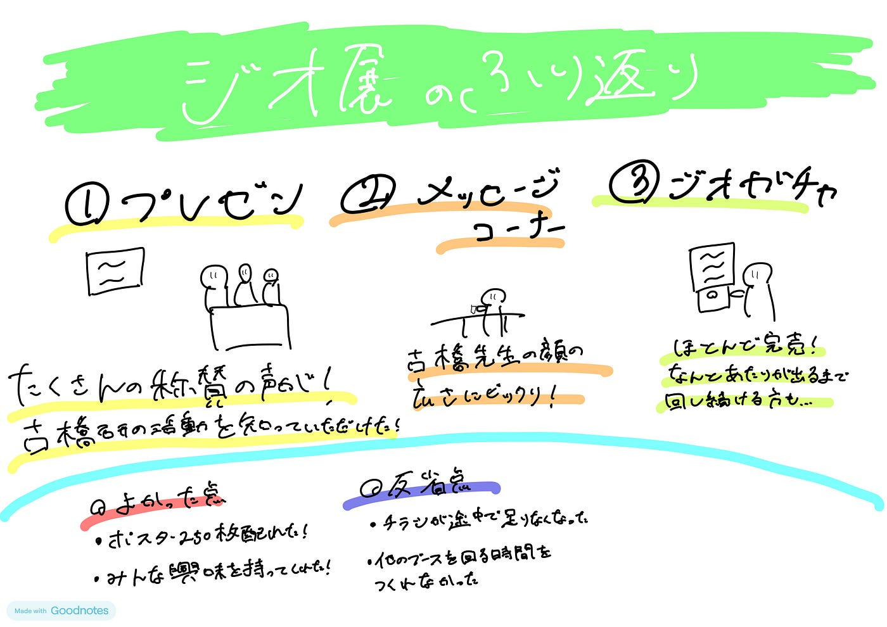
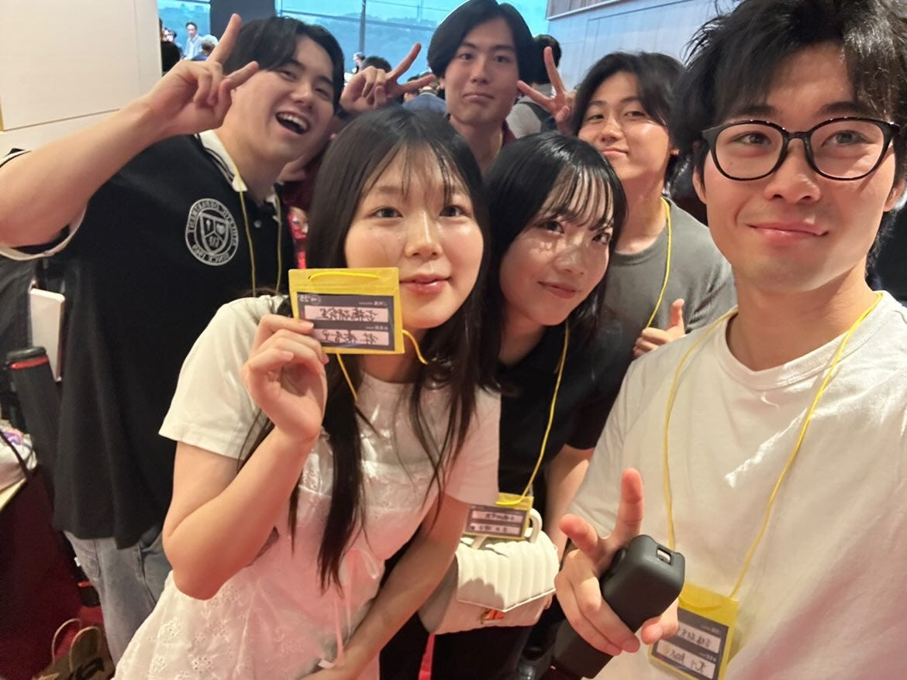

### 【Youth2週報7/8】ジオ展を終えて

みなさんこんにちは！久々に週報に登場した3年の加藤です。7/5を過ぎても結局地球は滅亡しませんでしたね。

ということで今回は[ジオ展2025](https://www.geoten.org/)を終えて私自身が実際に参加して感じた生の声をお届けできればと思います。

#### **ジオ展で古橋研は何をしたの？**

> _**1.プレゼンテーション_**

ゆかりさん、まゆさん、しょうたの3人が中心となって「古橋研究室の学生は何をしているのか！？」というテーマで発表を行いました。前日のリハでは時間がギリギリかも？という懸念点が浮き上がりましたが、古橋研持ち前の行動力でなんとか修正、本番では時間内にも収まり大成功に終わりました。

私自身発表はしていませんが、古橋研のブースに立っていると「プレゼン見たよ〜良かったよ〜」などという称賛のお声をたくさんいただきました！古橋研の活動を多くの方に知っていただけたかと思います。

> _**2.古橋先生へのメッセージコーナー_**

古橋研ブースでは、現在イタリア・ミラノへ留学？中の古橋先生へのメッセージを募りました！私は午前中に授業があったため午後から合流したのですが、私が来た時点（午後2時くらい）でびっしりとメッセージが！ブースに立っていてもたくさんの方がひっきりなしにメッセージを書いてくださりました。

ブースに来られた方に話を聞いても、肌感7から8割くらいの人が古橋先生のことをご存知でメッセージを書いてくださり、改めて地理空間情報界隈においての古橋先生の顔の広さにとても驚愕をしました。（もちろんご存知でない方にもメッセージ書いてもらいましたよ！）

> _**3.ジオガチャ_**

そしてもちろんメインのあれを忘れてはいけません。そう、ジオガチャです。

アイデアソンから遡るとおよそ1ヶ月。この間ジオガチャのことを考えなかった日はなかった“かも”しれません。

私たちが力を振り絞って作成したメガネクリーナとあたりのトートバッグ、当日はかなりの盛況でしたが残り30分になっても中にはまだ20個ほどのカプセル、あたりも3,4個残っていました。少しずつ焦りが見えてきた私たちに天使の一声が。なんと主催者さんがマイクでジオガチャの宣伝をしてくれたのです！

その結果ブースの前には大行列が！なんと当たりが出るまで回し続けてくれる方もいらっしゃいました！（お話を聞くとなんとその方は大学生でした）そして最終的にはほとんど完売しました。

こうして2025年のジオ展も大成功に終わりました。

### _**振り返りと来年に向けて_**

詳細は古橋研githubの[issues](https://github.com/furuhashilab/geogacha/issues/2)に展開してあります。よければご覧ください。

**・良かった点**

・ポスター250枚（古橋研究室紹介ポスター➕ドローンバード）を来場者に配ることができた！
・ガチャガチャ売れ残り4個（あたりは全部引いてくれました！）
・プレゼンを聞いて興味を持ってきてくれる方が多かったです！
・古橋先生のメッセージを書いてもらうことをきっかけに話しかけることができました！

**・反省点**

・チラシが12時の地点で150枚配り切ってしまったため、追加でコピーしました。
想定よりも多い来場者の方に興味を持っていただけたことは嬉しかったです。
・ジオガチャの両替の100円は100枚くらい次回はいると思います。（今回最初に30枚くらいしか用意していませんでした、、）
・作成したシフト表では、他ブースを回れる時間がなかなかとれなかった

以上の振り返りを活かして来年のジオ展も盛り上げていきたいです！

> _**番外編_**

本来は参加予定ではありませんでしたが、[小山様](https://www.facebook.com/fumy231/?locale=ja_JP)のご厚意のもと、古橋研メンバー6人がジオ展後の懇親会に参加させていただきました。地理空間情報のプロフェッショナルの方々の本音を聞くことができ、とても有意義な時間を過ごせました。この場で改めて小山様に感謝申し上げます。ありがとうございました！

