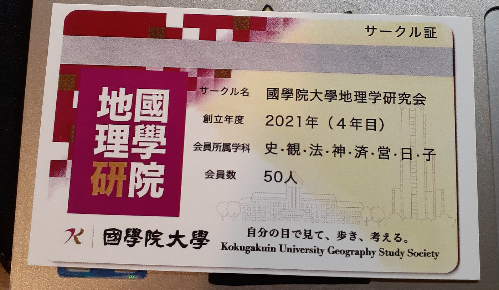
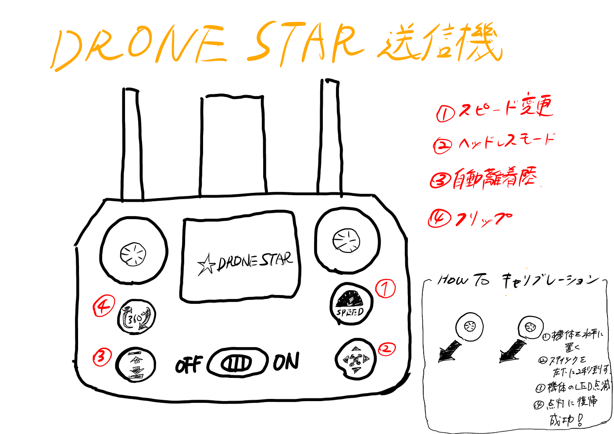

### 学びの多かった一週間

こんにちは！ドローン部②の寺土日南子です。

今回は、

7月2日（水）ジオ展2025のレポート@大手町 と

7月4日（金）ドローン飛行！＠B棟９階

の二本立てです。

早速、ジオ展2025についてです。

> まず、ジオ展とは？

_2016年に始まった、地図位置情報関連の企業やサービスが一堂に会する共同展示会。各社の製品やサービスの紹介の場であると同時に、採用の場としても利用。位置情報関連団体共同で、業界を盛り上げていく場としても期待されている。_

今回、私はジオ展に初の参加でしたが非常に多くの企業や団体が参加しており、来場者数も想像していた以上に多く非常に賑わっていました。

時間があったので私も様々なブースを見て周り、そこで同じ大学生がどのような活動を行なっているのか気になったので**國學院大學の地理学研研究会**の方々と少しお話をしました。

地理学研研究会はサークルで、特に印象に残った活動内容は**徒歩de山手線一周**でした。ひたすら山手線の駅を1日で巡るようで、青学の伝統行事らしい「**ナイトハイク**」（夜中に青山キャンパスから相模原キャンパスまで歩くイベント）も知っており盛り上がりました。私も山手線一周は興味があるので個人的にやってみようかと思います。

また、彼らは色々な場所を歩いているそうで、参加者の出身地をシールで白地図に貼るというアンケートを行っており私も貼ってみるとそこがどこの地区なのか言い当ててとても驚きました。サークルメンバーは多くが歴史の学部生で様々な時代の土地の歴史を知れて楽しいと言っていました。

（ブースの写真は撮り忘れていました、、）

今回は1団体の紹介ですが、他にも様々な団体や企業の方とお話をしてとても有意義な時間を過ごすことができました。

> ドローン飛行！

７月４日（金）にドローン部②のふうかとB棟９階でドローンを飛ばしました。

使用したドローンはJapan Drone2025で頂いたDRONE STARの屋内用ドローンです。

＊動画のリンクが貼ってあります。

#### ～飛行内容～

> [スピード切り替え](https://drive.google.com/file/d/1dEKrt0UE2fVs7qu5ssLaW2Q57KMA_bDk/view?usp=drive_link)

**①スピード変更ボタン**

低速（デフォルト）、中速、高速の三段階。

> [手動/自動 離陸・着陸](https://drive.google.com/file/d/1ptH166YJZD9je_O4JEXYSCj82-dmKHmG/view?usp=sharing)

**③自動離着陸ボタン**を押せば簡単に離着可能！

（自力で着陸できないときに使うと安心だと思いました）

> キャリブレーション機能

キャリブレーション機能とは？

水平状態が崩れる場合に、キャリブレーション機能を使うことで**水平状態を保つことが可能に。**

実際、行ってみたが水平状態が崩れる状況があまり分からず操作方法も間違えてたこともありよく分からなかった。

> [フリップ機能](https://drive.google.com/file/d/1rR-Xp8X6CY8EeSXtCx6utHyrExGDEzGx/view?usp=drive_link)

**④フリップボタン**

ボタンを押して前後左右に動かすスティックを倒すことで**宙返り**が可能！

> [ドローンカメラ](https://drive.google.com/file/d/1rQBuisat2gVy0KdRtEA9Jl1K93A214J5/view?usp=sharing)

最後に、

今回はドローンの操作方法と搭載されている機能の確認を行いました。まだまだ壁に当たって墜落ということも多く、操作に不慣れなので沢山練習して慣れていきたいと思います。

ジオ展.ジオ展2025.https://www.geoten.org .(参照日:2025/7)

#### グラレコ

