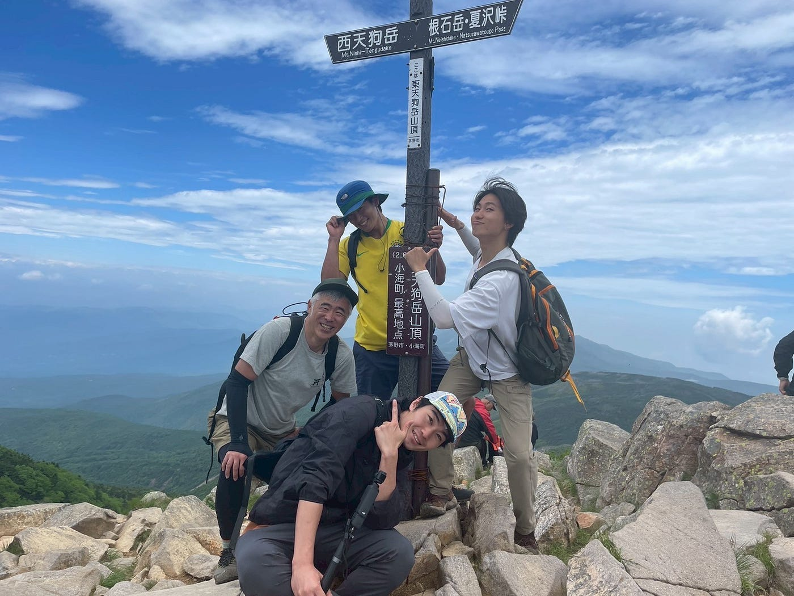
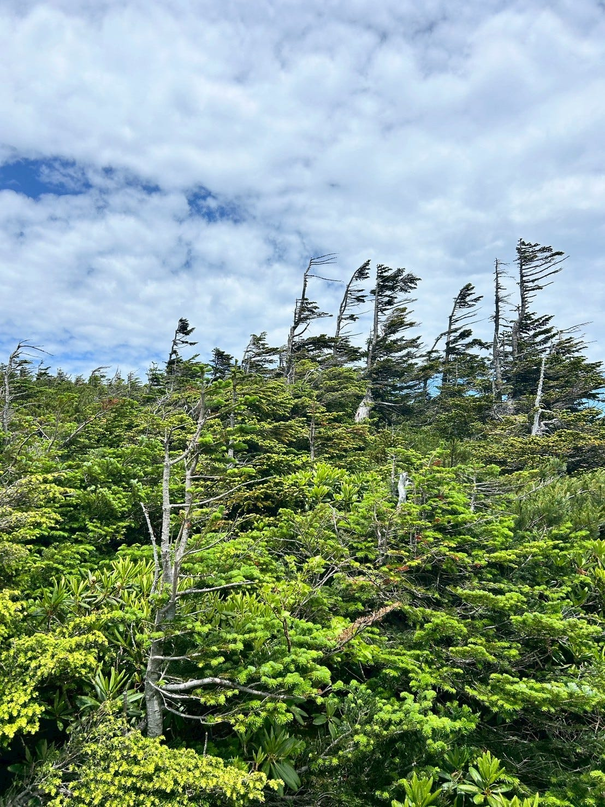
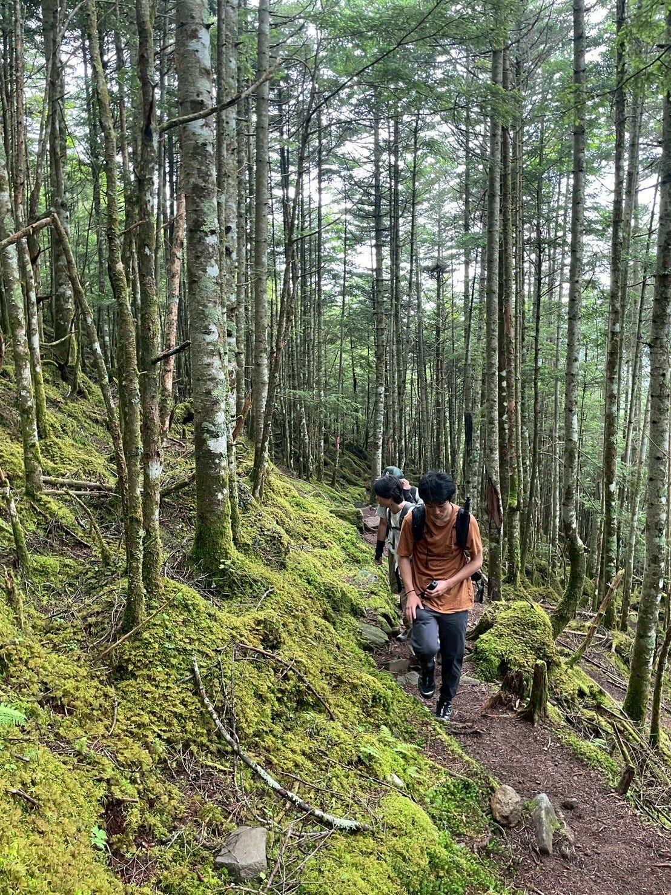
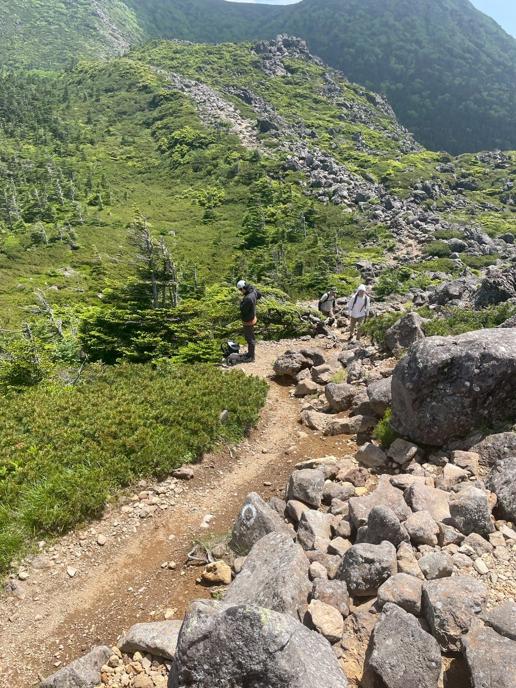
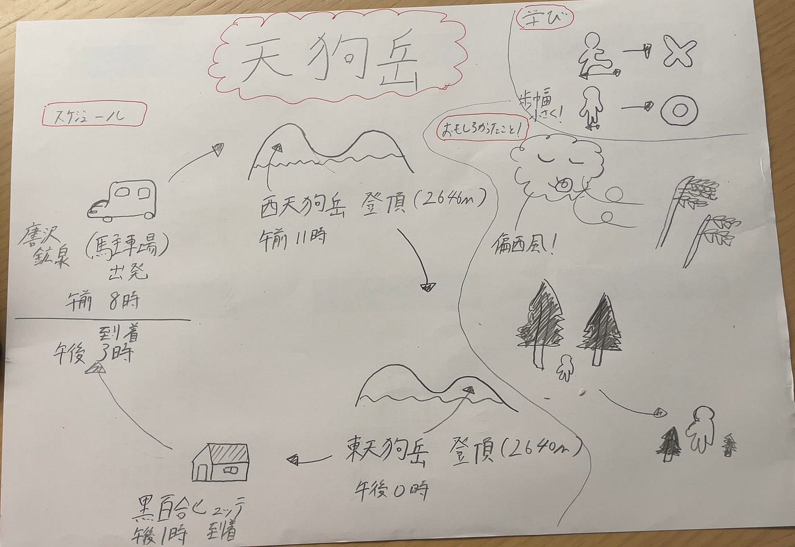

### 山登りのことを報告したっていいじゃない

こんにちは！古橋研究室ドローン部１の山﨑です。恐らく、今週はほとんどのチームが先週のジオ展について報告すると思うので、私は先週末に登った天狗岳登山について報告します！

**１八ヶ岳連峰 天狗岳について**

天狗岳は長野県茅野市にある八ヶ岳連峰の山で、標高は東天狗岳が2640メートル、西天狗岳が2645.8メートルで、日本二百名山の一つとして数えられています。天狗岳は東西二峰からなり、東天狗岳にある天狗岩と呼ぶ岩塔を天狗の鼻に見立てたことが名前の由来と考えられています。

**２メンバー紹介**

湯口さん（写真左）、山﨑（写真上）、翔太（写真下）、あきら（写真右）

**３スケジュール**

午前3時 西荻窪出発（湯口さん）

午前3時30分 山﨑合流

午前4時30分 翔太 あきら合流

午前7時30分 唐沢鉱泉 到着

午前8時 登山開始

午前11時 西天狗岳 登頂

午後0時 東天狗岳 登頂

午後1時 黒百合ヒュッテ 到着

午後3時 唐沢鉱泉 帰還

合計登山時間 約7時間 
距離 8.4キロメートル
上り/下り 916メートル/890メートル

天狗岳 YAMAP 動画

[https://youtube.com/shorts/nso5q3T0Gdk](https://youtube.com/shorts/nso5q3T0Gdk?feature=share)

[天狗岳（西天狗岳）・東天狗岳 / 山﨑りとさんの八ヶ岳（赤岳・硫黄岳・天狗岳）の活動データ | YAMAP / ヤマップ
No.1登山アプリYAMAP。オフラインの山中でも現在地を確認できる。最新のルート状況をはじめ、全国各地の登山情報を網羅。YAMAPであなたの登山はもっと楽しく、安全に。yamap.com](https://yamap.com/activities/41213034)

**４学び
**湯口さんは体力を温存するには、いかに無駄な動きをなくすか、いかに楽なルートを見つけて歩くことかが大切であると言っていました。
そこで、私は登山中に湯口さんの登り方と自分の登り方を比較してみたところ、私が大股にジャンプしながら登っているのに対し、湯口さんは歩幅がとても細かいことに気がつきました！
今まで登ってきた山は日帰りでも余裕な距離であるため体力の心配をしたことがなかったのですが、これからは歩き方も意識していこうと思います！

**５ 面白かったこと**

強風に煽られながらも生きている木々
枝に注目してみると明らかに右にしか生えていない！ことを翔太が発見！
どんなに風が強くても、生きようとする木を僕も見習いたいと思いました。

[森林限界](https://mori-naka.jp/article/3011/)を感じる登山道

標高が高くなるにつれて、大きい木がどんどん減っていき、最終的にはほとんどが自分達と同じくらいの大きさになっていた。まるで山登りをしている間に皆んなが巨人になった気分を味わえました！

**６ドローンの注意点（山編）**
ここまで読んでいただきありがとうございます！はい、、、この記事はドローンと何が関係あるんだというご指摘もあると思います。最後にドローンを山で飛ばす際の注意点を少しまとめます。

１許可書を提出する場所は複数あることも珍しくない
・私有林/民友林＝山の所有者の許可
・公有林＝都道府県/市区町村の許可書
・国立公園＝各都道府県の環境事務所の許可
・鳥獣保護区＝市役所または環境省の許可

２風が恐ろしく強い
これは今回の山登りで私が体験したことなのですが、上に行くほど木々が低くなっていき風を遮るものがなく、85キロくらいある私の体も容易に押されてしまうくらいでした。軽いドローンならいうまでもなく、コントロールを失ってしまい、木々や動物を傷つけてしまう危険性もあるので注意しましょう！

**グラレコ**

**参考文献**

１「天狗岳（てんぐだけ）」（[https://www.yamakei-online.com/yamanavi/yama.php?yama_id=446](https://www.yamakei-online.com/yamanavi/yama.php?yama_id=446)）

２「登山でのドローン撮影におすすめ3選！山でドローンを飛ばす時の注意点や許可申告の方法」([https://drone-school-lab.co.jp/mountain-climbing-drone-photography](https://drone-school-lab.co.jp/mountain-climbing-drone-photography))
