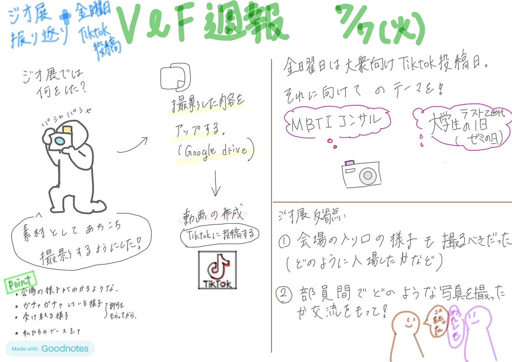

### ジオ展TikTok動画制作 【V＆F週報】

こんにちは。高井健太郎です。
今週は「ジオ展2025」の振り返り動画の制作に取り掛かりました。現在、映像の“シロ”部分（全体構成やカット編集）まで完成しました。
 現在は字幕や装飾の作業に入っており、完成次第[TikTok](https://www.tiktok.com/@55furtbrci2?_t=ZS-8xqoch6emCf&_r=1)に投稿予定です。

> **動画**

現時点での完成動画が[こちら](https://drive.google.com/file/d/1ql9kj4dXJE_c8iEvekZQrynlmm31gsiC/view?usp=drive_link)

AI音声として、[音読さん](https://ondoku3.com/ja/)を使用したのですが、音読さんを利用する場合は、[クレジット表記](https://ondoku3.com/ja/post/about-credit/)をする必要があります。
[有料プラン](https://ondoku3.com/ja/pricing/)に入った場合、クレジット表記は必要ないそうです。

また、音読さんのウェブサイト内で[CC BY 4.0](https://creativecommons.org/licenses/by/4.0/deed.ja)は確認出来ませんでした。そのため、投稿は[古橋研究室公式YouTubeチャンネル](https://www.youtube.com/@furuhashilabs)では出来ず、TikTokでの投稿のみを想定しています。

> **工夫した点・良かった点**

- **テンポの良いカット構成**：視聴者が飽きずに最後まで見られるよう、テンポよく映像を切り替えることを意識しました。

- **縦横比の統一**：横向きで使いたい映像も、違和感が出ないよう縦にトリミングして使用しました。

- **ゼミ紹介の要素を意識**：ジオ展の様子を紹介するだけでなく、古橋ゼミの活動紹介にもつながるよう編集構成を工夫しました。

> **改善点・今後に向けて**

- **素材が多すぎて選定に時間がかかった**：事前に「どのシーンを撮るか」をある程度想定しておけば、編集の効率がもっと上がったと感じました。

- **必要なシーンが撮れていなかった**：メガネ拭きなど、後から「このカット使いたいな」と思っても素材がなく、事前のカットリスト作成の重要性を痛感しました。

**反省点：やっぱり撮影前の計画が大事！**

### 今後の予定

・今日中に字幕装飾して投稿。

- 金曜日：メンバー紹介動画投稿予定。撮影は本日ゼミ終了後

> **グラレコ**

