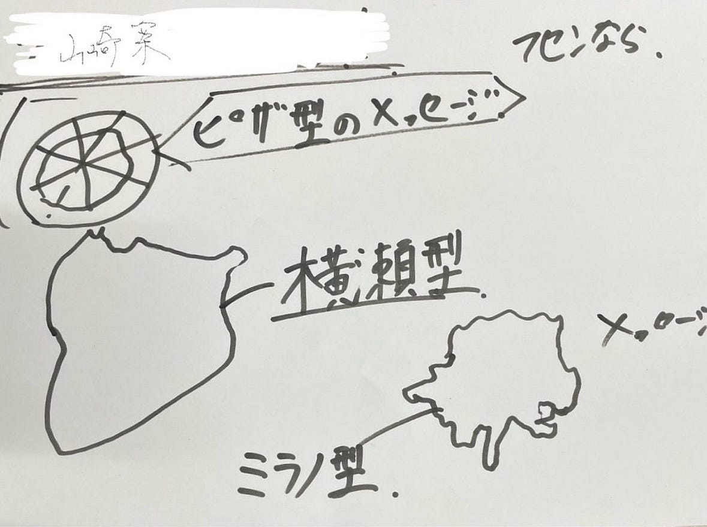
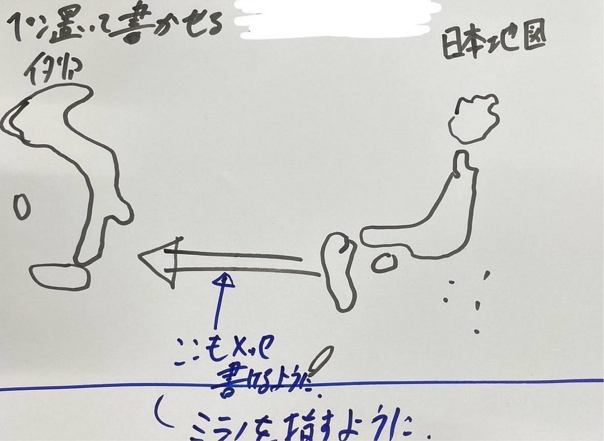
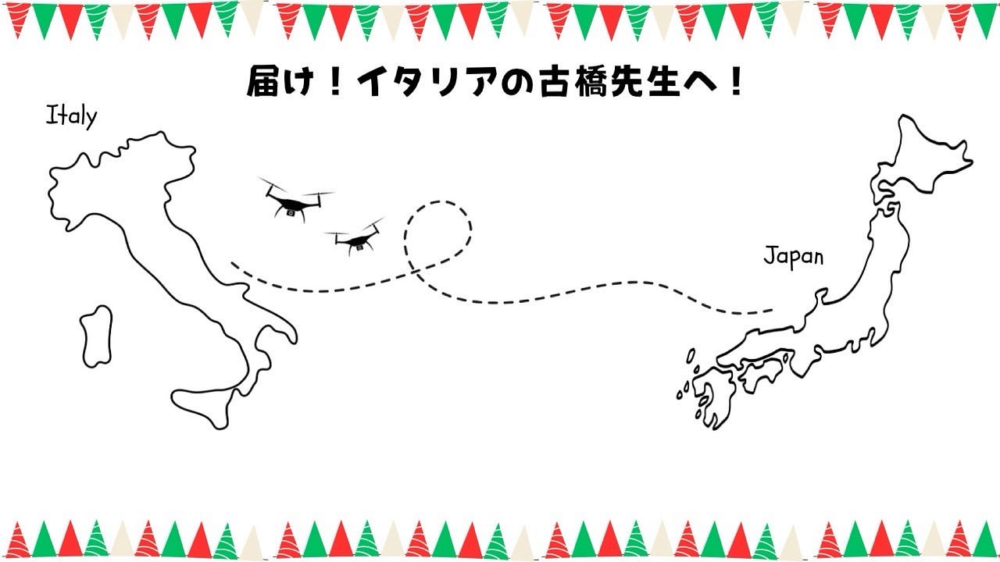
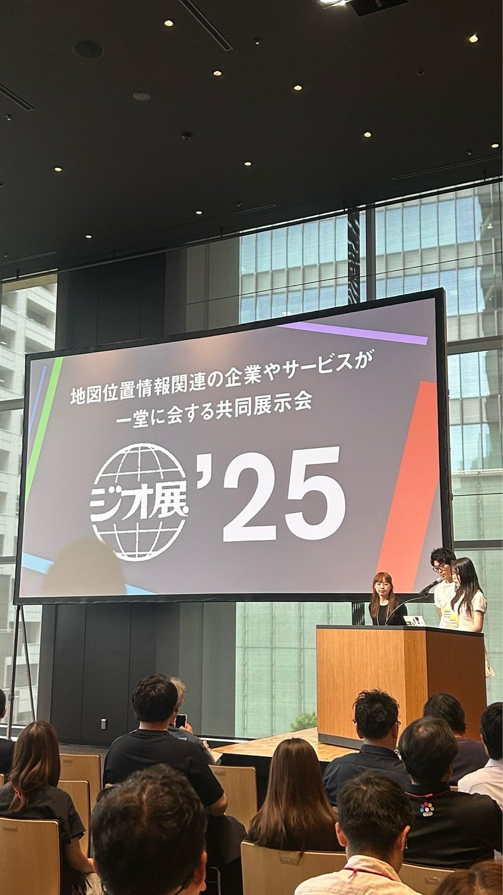
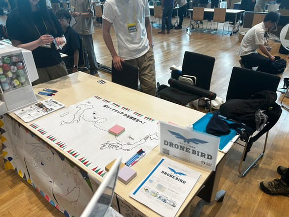
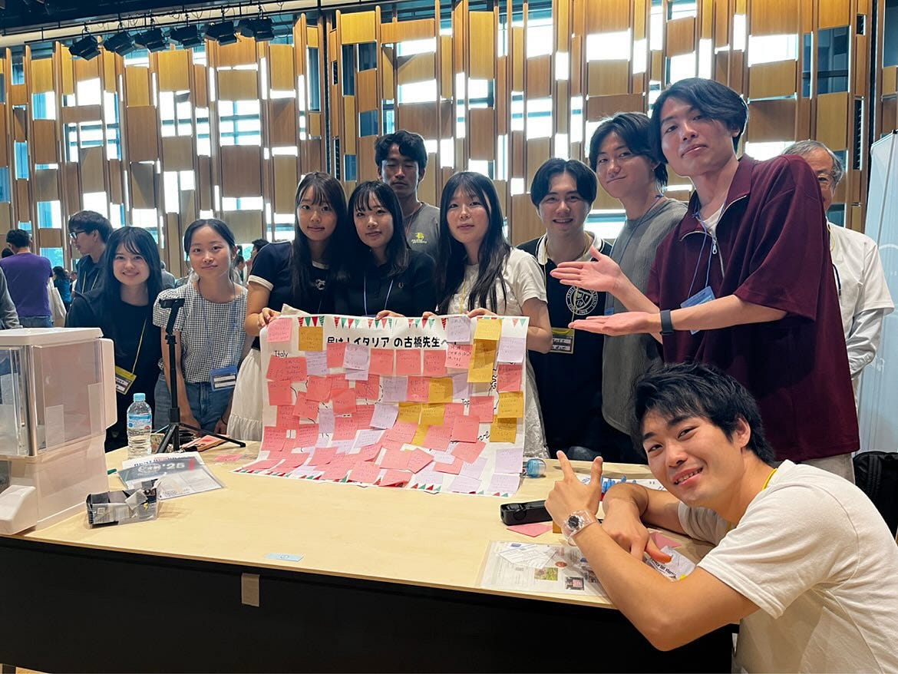
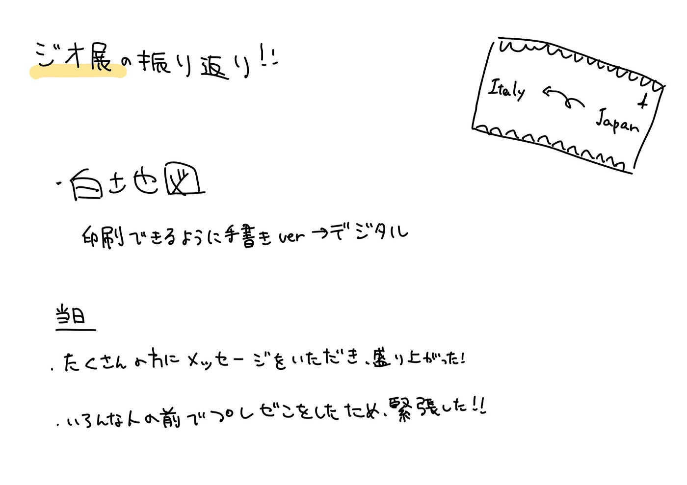

### ジオ展を振り返って（Youth1週報7/8）

暑さも本格的になり、やっとこの気温に慣れてきた4年の林（み）です。

今週は、先週水曜日の7/2に行われたジオ展の振り返りを行っていきます。

事前準備

準備についてのグループ分けなど詳しくは週報をご覧ください。

[前回の週報](https://medium.com/furuhashilab/6-24-%E9%80%B1%E5%A0%B1-%E3%82%B8%E3%82%AA%E5%B1%95%E6%BA%96%E5%82%99-81406d5221b9)にてあまり進捗がなかった白地図グループでしたが、ジオ展までになんとか間に合いました。

元々あった手書きのデザイン案をもとに、印刷用にパソコン上でデザインし直しました。

こちらが、その白地図のデジタル版になります。

(手書きver.)

(デジタルver.)

当日の様子

感想

・ジオ展のブースで来場者からの質問に答える中で、自分たちの研究室の活動内容を改めて整理できただけでなく、これまで関わったことのなかったドローンに関する知識も深めることができた。また、企業の方々や東京大学の教授の前でプレゼンをするのは非常に緊張したが、大きな学びとなる貴重な経験だった。（まゆ）

・当日は参加できなかったが、担当した白地図が盛り上がっていたと聞き、安心した。また、古橋先生にも喜んでもらえたので、よかった。(みく)

グラレコ

