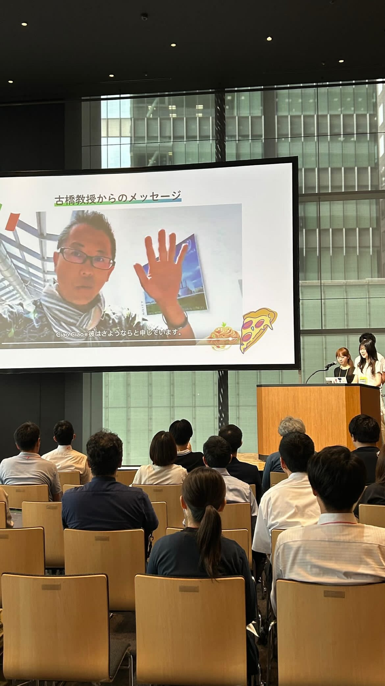
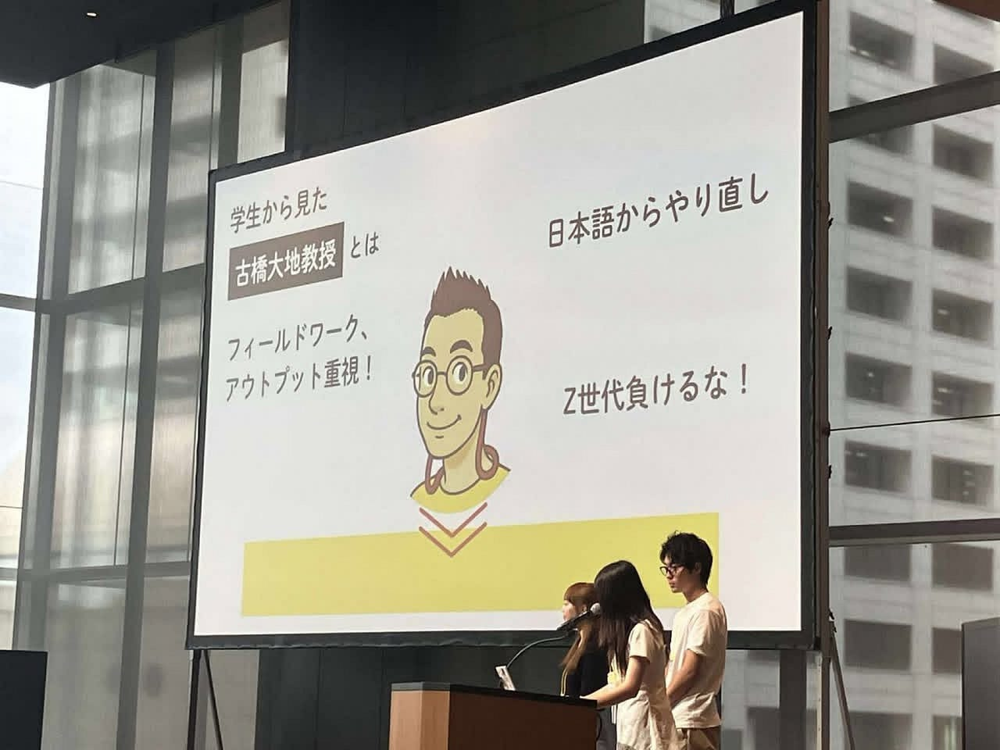
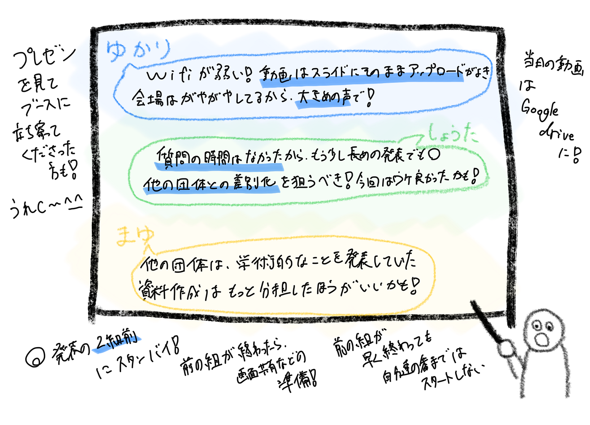

## 発表班！！駆け込み！追い込み作業！

こんにちは。ジオ展がおわってからあっという間に2週間が経とうとしています。

前期ももうそろ終わりということで時間の流れのはやさに驚きが隠せない４年の林（ゆ）です。

今回の週報では、発表班を担当した林（ゆ）、まゆ、しょーたでジオ展の振り返りをしていきたいと思います。

### 発表班の課題/改善案

＜当日の課題＞

- 会場のWifiが悪かった(会場内は1本しかたっていなかった)当日発表する人はYouTube動画を埋め込むより、スライドにそのまま動画をアップロードした方が安心。

→当日はテザリングして対応しました

- 発表会場は入口や他ブースもあったため発表は大き目の声で話すべき

- 会場では、マイクが自分の背に合わず少し焦ったが調整可能だった。

- 発表中はオーディエンスの目を見ながら明るく話すことができた。

＜作業においての課題＞

- プレゼン作成はデザインの統一などの観点から一人で行うべきだが、負担が大きいため原稿１、プレゼン１でも問題ないと感じる。

- 青学以外にも、「自分たちがどんなことをしているのか」というテーマについて話している企業はいたが、少なくとも学術については述べていた印象。

・当日の発表直前の準備は特に手間取ることはなかった。また、質疑応答の時間は設けられていなかったので動画などもう少し長めに見せてもよかったかも。

### 当日までの作業の振り返り

#### 作成した資料等

①ジオ展に向けて

[https://github.com/furuhashilab/GeoExhibition2025/blob/main/%E3%82%B7%E3%82%99%E3%82%AA%E5%B1%952025%E3%81%AB%E5%90%91%E3%81%91%E3%81%A6.pdf](https://github.com/furuhashilab/GeoExhibition2025/blob/main/%E3%82%B7%E3%82%99%E3%82%AA%E5%B1%952025%E3%81%AB%E5%90%91%E3%81%91%E3%81%A6.pdf)

②当日スクリプト

[https://github.com/furuhashilab/GeoExhibition2025/blob/main/%E5%BD%93%E6%97%A5%E3%82%B9%E3%82%AF%E3%83%AA%E3%83%95%E3%82%9A%E3%83%88.pdf](https://github.com/furuhashilab/GeoExhibition2025/blob/main/%E5%BD%93%E6%97%A5%E3%82%B9%E3%82%AF%E3%83%AA%E3%83%95%E3%82%9A%E3%83%88.pdf)

③プレゼン資料

[https://github.com/furuhashilab/GeoExhibition2025/blob/main/%E9%9D%92%E5%B1%B1%E5%AD%A6%E9%99%A2%E5%A4%A7%E5%AD%A6%20%E5%8F%A4%E6%A9%8B%E7%A0%94%E7%A9%B6%E5%AE%A4%202025%E5%B9%B4%E5%BA%A6.pdf](https://github.com/furuhashilab/GeoExhibition2025/blob/main/%E9%9D%92%E5%B1%B1%E5%AD%A6%E9%99%A2%E5%A4%A7%E5%AD%A6%20%E5%8F%A4%E6%A9%8B%E7%A0%94%E7%A9%B6%E5%AE%A4%202025%E5%B9%B4%E5%BA%A6.pdf)

### 作成時の様子

プレゼンの資料と原稿を担当した林ですが、6月末まで個人的な予定で忙しない日々を送っていたのもあり、作業に取り掛かるのが5日前とかになってしまいました、、（まゆ、しょーたくんすみません。笑）

そんななかでも、まゆ、しょーたくんが臨機応変に対応してくれてとても助かりました！

また、当日の古橋研の持ち時間は10分のうち8分くらいあるかなっていう想定で組んでいましたが、古橋先生とのリハで5.6分しかないことを教えていただき、どこを省こうかみんなと相談し、無事前日までに仕上げることができました笑（汗）

### さて当日はうまくいったのか・・・

そして、ついにジオ展当日になりました。

発表班の当日のスケジュールは以下のようになります。

#### 当日のスケジュール

10:20〜　2組前のタイミングでスタッフの方に誘導される

10:30〜　観客席に移動、前の人が終わったタイミングで使用機材の調整（音声など）

10:40〜　司会者の紹介のあとに発表

10:48 発表終了〜！

発表は前の人が早く終わっても10:40の開始時刻までは発表をスタートしない、質疑応答の時間はない

という感じでした。

#### 私たちの発表中の写真

写真撮ってくださった方ありがとうございました〜！

### 全体を通した感想

発表後には、プレゼンをきっかけにブースに立ち寄ってくださる方もいて、私たちの発表が誰かの興味を引くきっかけになったのだと実感でき、嬉しく思いました。

特に、原稿の最後に「学生の時、こんな研究室に入りたいと思っていただけたでしょうか？」という一文を入れたのですが、発表後にブースを訪れてくださった方から、「あの言葉にすごく共感しました。僕も学生の時にこんな研究室に入りたかった」と言っていただけて、とても嬉しかったです！（ありがとうございました！）

### ジオ展当日の写真や動画

今回、V&F班が中心に当日の様子を撮影してくれました！そちらはこのGoogledriveにまとめられています。GitHubにも展開済みです。

[https://drive.google.com/drive/folders/1BMMRNeL_ylzZUFYfrmKewCenPWgNQES_](https://drive.google.com/drive/folders/1BMMRNeL_ylzZUFYfrmKewCenPWgNQES_)

### グラレコ

