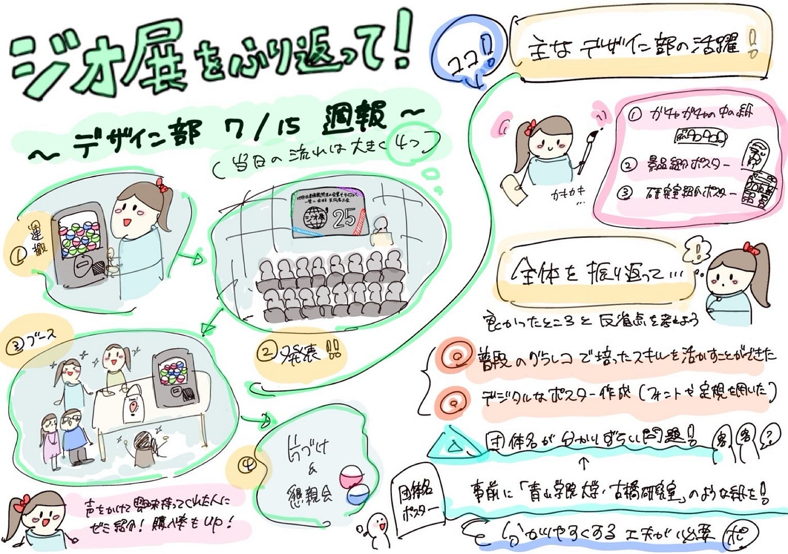

### ポスター作成！【デザイン部7/15】

こんにちは、四年の福田です。

#### **ジオ展の個人の振り返り**

こうな↓

[ジオ展2025ポスター作成と会場撮影の良かった所・反省点_Kouna Fukuda · Issue #3 · furuhashilab/geogacha
デザイン部としてのまとめ： ・デザインでは、今回のジオ展で使用するゼミ紹介ポスター、ジオガチャの中の紙とQRコードがついてるガチャガチャに貼る紙を合計3枚デザインしました。3人で分担してそれぞれデザインを作成した後に調整を行いました。…github.com](https://github.com/furuhashilab/geogacha/issues/3#issue-3221004536)

ゆうか↓

[ジオ展2025ガチャガチャ用ポスター_YukaInada · Issue #9 · furuhashilab/geogacha
ジオ展を振り返って…github.com](https://github.com/furuhashilab/geogacha/issues/9#issue-3227101153)

ちはな↓

[ジオ展ポスター・チラシ制作上の改善点 · Issue #10 · furuhashilab/geogacha
デザイン部としての反省 研究室紹介チラシのゼミ内サークルの説明をもっと充実させた方が良かった…github.com](https://github.com/furuhashilab/geogacha/issues/10#issue-3227394604)

#### 全体のまとめ

ガチャガチャ内のかみはちはな、景品紹介ポスターはゆうか、研究室紹介スターがこうなでそれぞれデザインしました。

今回私たちが作成したポスター等はこちらになります

ガチャガチャの中の紙、景品紹介ポスター↓

[ジオ展2025ジオガチャ関連ポスターの紹介(写真) · Issue #8 · furuhashilab/geogacha
ガチャガチャ内の紙 ちはなデザインgithub.com](https://github.com/furuhashilab/geogacha/issues/8)

研究室紹介ポスター↓

[GeoExhibition2025/研究室紹介ポスター.jpeg at 8aaf7568167fe5ec3f197d7f9cff102ff0a39ee3 ·…
Contribute to furuhashilab/GeoExhibition2025 development by creating an account on GitHub.github.com](https://github.com/furuhashilab/GeoExhibition2025/blob/8aaf7568167fe5ec3f197d7f9cff102ff0a39ee3/%E7%A0%94%E7%A9%B6%E5%AE%A4%E7%B4%B9%E4%BB%8B%E3%83%9D%E3%82%B9%E3%82%BF%E3%83%BC.jpeg)

#### 全体を振り返って

普段から毎週書いていたグラフィックレコーディングにおける文字の大きさや内容を工夫してイラストなどとともに記載するスキルを活かすことができて良かったです。

文化祭や体育祭のポスターを手書きで描いたことはあっても、今回のガチャガチャ用の紙やポスターのように、文字のフォントを選んだり、iPad内の定規を用いて線を引いたりして作ったことはなかったため、カクカクした文字を絵と違和感のないように入れ込むことの難しさなどもありながら、完成させることができて良かったです。

デザイン部としてはいくつか反省点がありました。どの団体として出展しているのか分かりづらかったので、事前に机の前に「青山学院大学・古橋研究室」のように貼れる紙をデザインした方が良い、配るチラシが無くなった時用に同じ内容のポスターが貼ってあった方が良い、ジオガチャが有料である事、中身がゼミに関わるデザインのメガネ拭きである事が一目で分かるようにデザインした方が良いなどの意見が出ました。

#### グラレコ

