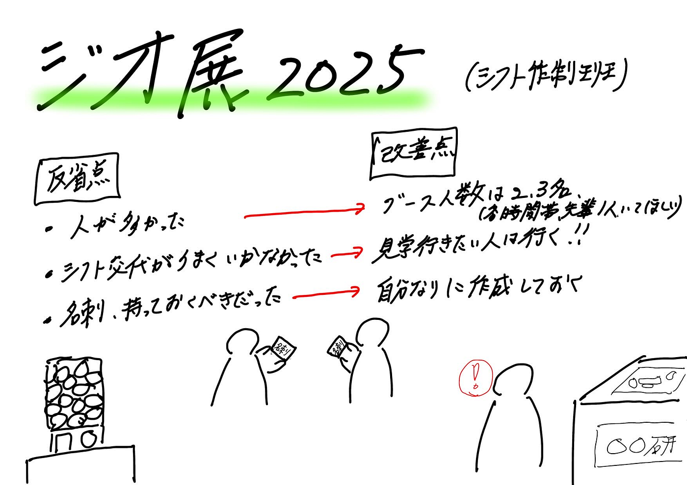

### 報告少なめです。。。【シフト作成班】

こんにちは！寺土日南子です。

ジオ展2025の振り返りということで、私とあきらが担当したシフト制作について簡単に反省点と改善点を上げていきたいとおもいます！

> 反省点

- ブースの人数が多かった（多い時間は8名ほど）

- 当日の必要人数把握が不十分だった

- 時間的考慮が必要な人の把握、共有ができていなかった

- シフト交代がうまくいかなかった

- 飽和状態だったため、ブースを担当することができない人もいた

- プレゼン発表の時間も吉田さんがブースにいてくださったようで、滞りなく済んだようです。

> 改善点

- ブース人数は2,3名で十分かと（他団体もそのくらいの人数だった）

- シフト交代次や人数が多い場合、見学に行きたい人には行ってもらうなど配慮する

- 2,3名で慣れていなかったら、サポート役として入ってもOK

- シフト作成は一人かどこかの部門に合体させても良いと感じた

最後に、

個人的な反省点としては、先輩方に頼り切りになってしまった部分があり、もう少し積極的に関わるべきだと思いました。また、会場に入る際に名刺の有無や他団体や企業を見回っていたときに、名刺交換ができなかったので、自分の名刺は持つべきだと身に染みて感じてます。

[シフト交代の課題 · Issue #12 · furuhashilab/geogacha
課題：シフト交代がうまくいかなかった 理由 当日の必要人数の把握が不十分だった ブースの人数が多かった（多い時間は8名ほどに） 当日の結果 交代がうまくいかず ブース紹介に携われない人がいた…github.com](https://github.com/furuhashilab/geogacha/issues/12)

[名刺があったら良かった、、 · Issue #28 · furuhashilab/geogacha
課題：個人／古橋研究室の名刺がない 理由 受付の際に、名刺の有無を聞かれた 他大学も作っていた 企業の方と名刺交換ができなかった 改善点 古橋研究室全体の名刺があると良いと思う（ポスターでも良いと思うがそれとは別に作成しても良いかと）…github.com](https://github.com/furuhashilab/geogacha/issues/28)

グラレコ

