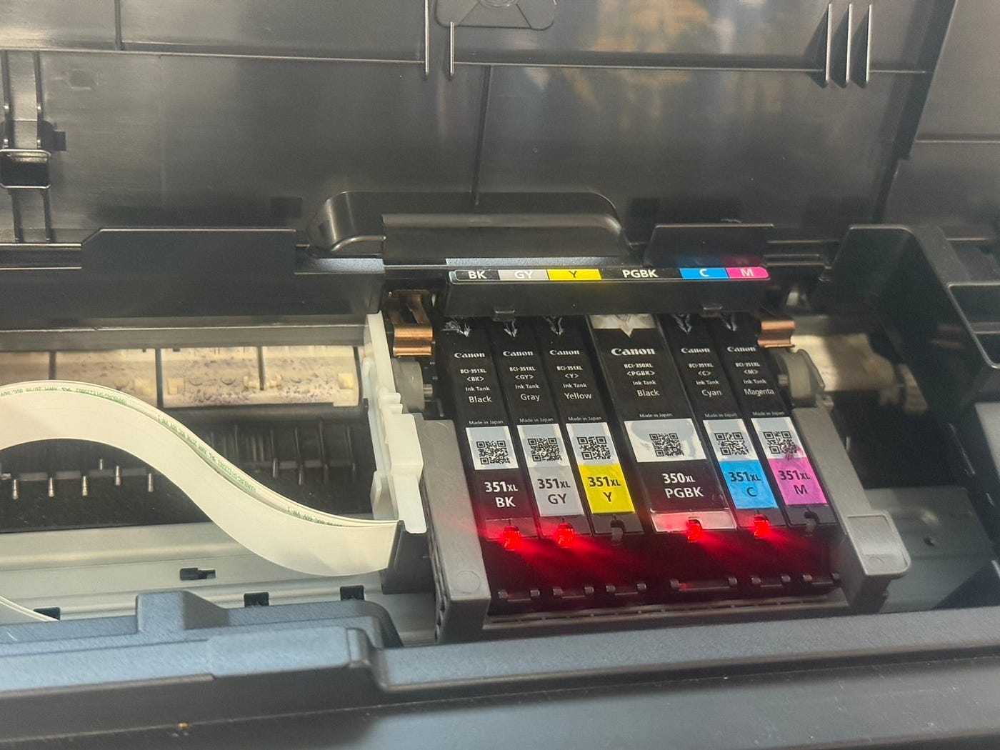
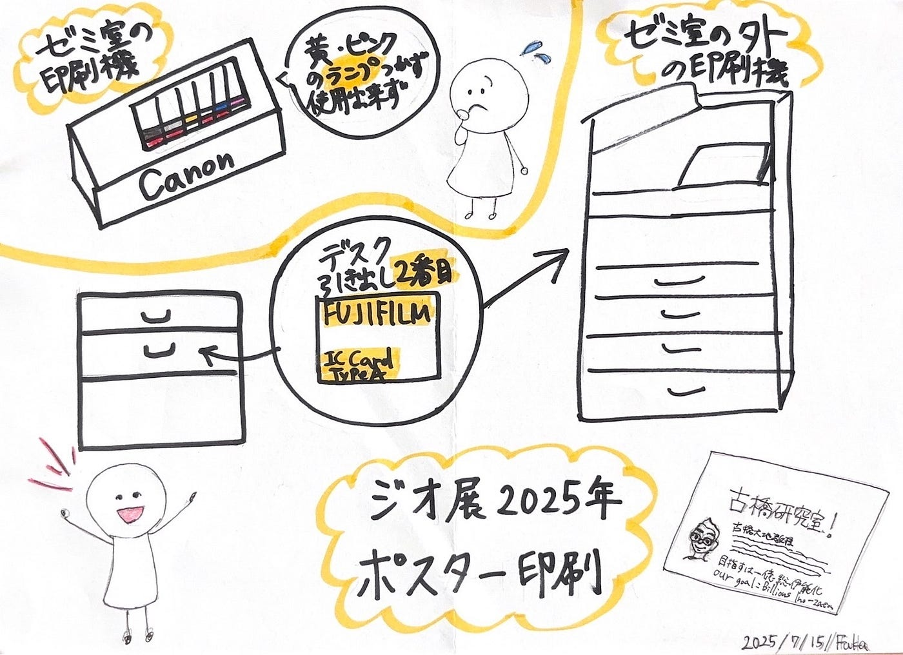

### ジオ展報告【ポスター印刷班】

こんにちは！3年の小崎です。7月も中頃になり、もうすぐ前期が終わりそうです。時が経つのは早いですね。

今週は、7月2日に開催されたジオ展2025での活動についてご報告します。

メンバー：ふうか、みあ

内容：ポスターのデザイン印刷、ポスター作成班が作成したガチャガチャに入れるためのデザインの印刷

当日参加できるかわからなかったので、準備段階での活動がメインでした。

#### 発生した問題

印刷に使うためのプリンターが使えない事件が発生しました。

ゼミ室のプリンターを使おうとしたのですが、インクが不足していたため新しいインクに差し替えました。

しかし、画像のように黄色とマゼンダのインクカードリッジを認識するランプが点灯せず、使うことができませんでした。

新品のインク且つこれまで使っていたインクと同じ種類のものを使っていたので、プリンター側に何かしらの問題があると思います。

#### 対処法

プリンターを修理するのは現実的ではなかったので、応急処置としてゼミ室の外にあるプリンターを利用することにしました。

以下ふうかが作成してくれたグラレコです！

