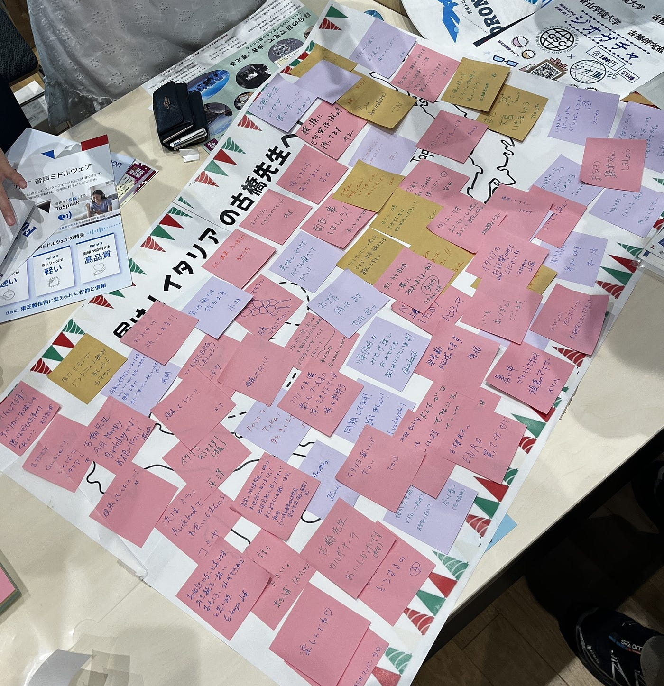
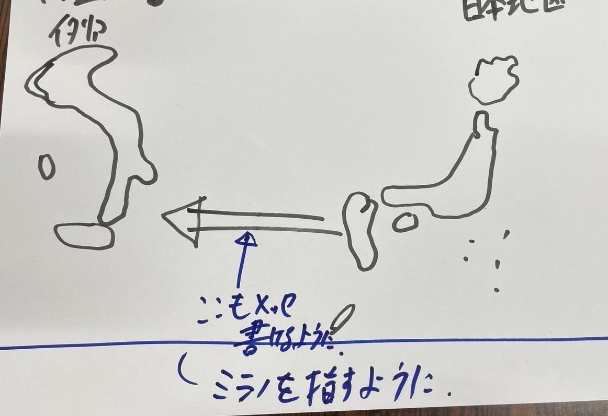
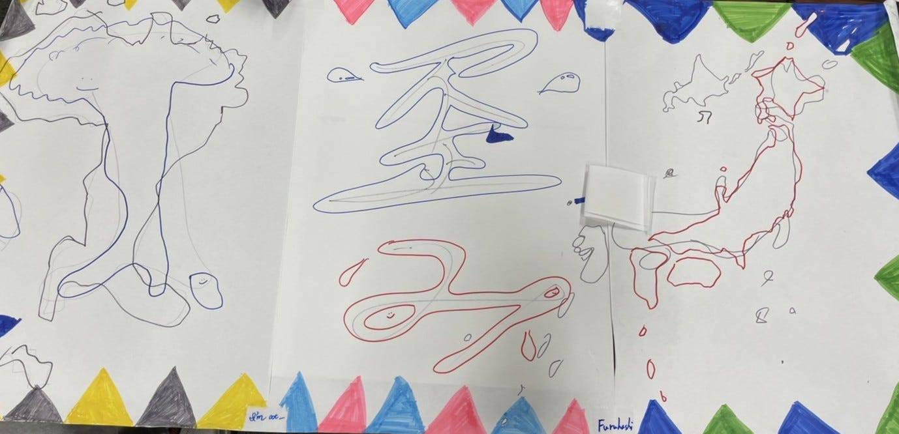
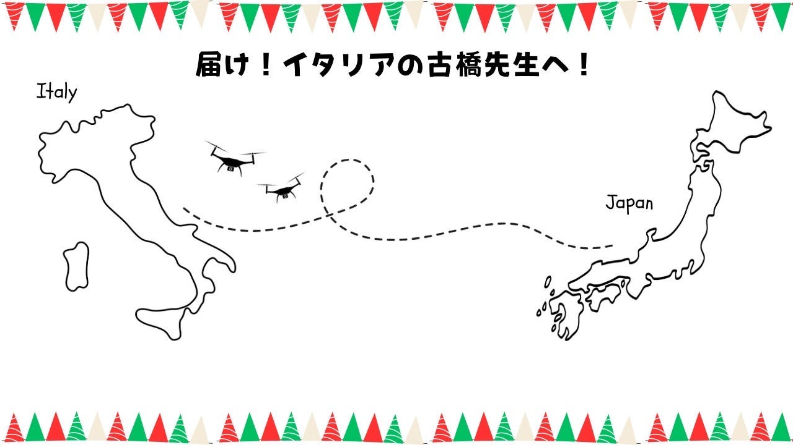
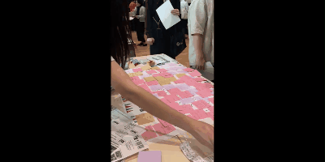
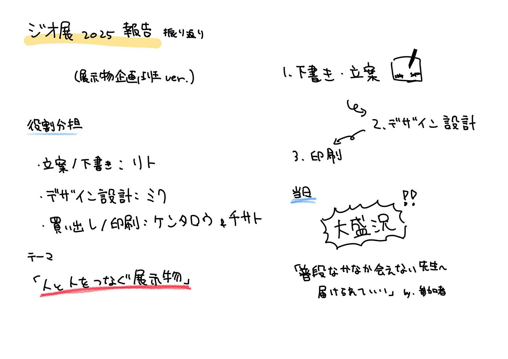

### イタリアの先生に届け！ジオ展メッセージ作戦【展示物企画班】

こんにちは。高井健太郎です。

今週は、[ジオ展2025](https://www.geoten.org/)で**展示物企画班**を担当した私たちの活動についてご報告します。

**メンバー**：りと、みく、ちさと、けんたろう

今年は、古橋先生がイタリアに滞在中のため、ジオ展に参加されませんでした。そこで私たちは、「ジオ展の空気を少しでも先生に届けたい」という思いから、「会場にいなくても、気持ちはつながる」ということを形にできる企画を考えました。その中で掲げたテーマが、「人と人とのつながり」です。

私たちは、ジオガチャに加えて、来場者から古橋先生へのメッセージを集める「メッセージボード」を制作・設置しました。

> **当日までの作業の振り返り**

**役割分担は以下の通りです：**

- **原案企画・下書き制作**：りと

- **デザイン設計**：みく

- **買い出し・印刷**：けんたろう、ちさと

まず、りとが初期案を出してくれて、メッセージボードの下書きも制作してくれました。（※実物の画像はこちら）

しかし、私たち4年生（けんたろう、みく、ちさと）がその段階で動けておらず、りとからの指摘でようやく本格的に作業に取りかかることができました。
 この点は、上級生として反省すべきポイントだったと感じています。

その後、みくがりとの下書きをもとに、メッセージボードのデザイン設計をしてくれました（※実物の画像はこちら）。

完成後、けんたろう・ちさとで印刷対応や付箋の買い出しなどを行い、展示準備を整えました。

> **当日の反響**

私は当日現地で運営を担当しましたが、多くの来場者の方が足を止めてくださり、メッセージを書いてくださいました。
 当日の様子は、来場者の記入風景をタイムラプス動画にまとめています。

> **メンバーの振り返り（GitHubから抜粋）**

### 全体

#### 【良かった点】

- 昨年は参加したゼミ生が2名のみだったのに対し、今年は多くのゼミ生が参加し、ブースも昨年以上に盛り上がった。([けんたろう](https://github.com/furuhashilab/geogacha/issues/23#issue-3231022321))

- 地理空間と一括りで話せないほど沢山の企業がビジネスを展開していて刺激になった。([りと](https://github.com/furuhashilab/geogacha/issues/13#issue-3228733045))

#### 【改善点】

- 当日まで、各班での活動がメインだったため、全体で共有することが少なかったように感じた。([みく](https://github.com/furuhashilab/geogacha/issues/17#issue-3229427863))

- ゼミ室に滞在する機会の多いメンバーへの業務負担が集中してしまった。([ちさと](https://github.com/furuhashilab/geogacha/issues/25#issue-3231058697))

- 準備期間中は各班が個別に作業を進めることが多く、研究室全体としての進捗の共有や横断的な連携があまり取れていなかった。([ちさと](https://github.com/furuhashilab/geogacha/issues/25#issue-3231058697))

- 専門の方々と話すと自分の知識不足もあり、表面的な会話しかできなかったのが悔しかった。([りと](https://github.com/furuhashilab/geogacha/issues/13#issue-3228733045))

### 展示物企画班

#### 【良かった点】

- 当日は大盛況で、古橋先生と関わりのある方はもちろん、初対面の方にもメッセージを書いていただき、ブース全体が盛り上がった。([けんたろう](https://github.com/furuhashilab/geogacha/issues/23#issue-3231022321))

- 昨年の経験をもとに、机のサイズに合わせて紙の大きさを調整し、ぴったりのサイズで印刷することができた。([けんたろう](https://github.com/furuhashilab/geogacha/issues/23#issue-3231022321))

#### 【改善点】

- 企画段階で4年生の動きが鈍く、りとに負担が集中してしまった。([けんたろう](https://github.com/furuhashilab/geogacha/issues/23#issue-3231022321))

- 作成するメンバーがなかなか揃わずコミュニケーションが難しかった。([りと](https://github.com/furuhashilab/geogacha/issues/13#issue-3228733045))

- 実行するプロジェクトに応じて結成するチームのメンバーを決める方が良い。（オンラインでできるプロジェクトとオフラインでしかできないプロジェクトを区別するなど）([りと](https://github.com/furuhashilab/geogacha/issues/13#issue-3228733045))

#### 次年度への提案

- 古橋ゼミの名刺を作成したい。([りと](https://github.com/furuhashilab/geogacha/issues/13#issue-3228733045))

- 古橋研究室の学生としての存在感をより出すために、ゼミオリジナルのTシャツを作成するのも面白いと思った。([けんたろう](https://github.com/furuhashilab/geogacha/issues/23#issue-3231022321))

- 初期段階での役割の明確化と、小まめな進捗共有、気軽に意見を出し合える雰囲気づくりが重要であると思う。([ちさと](https://github.com/furuhashilab/geogacha/issues/25#issue-3231058697))

- 一定のメンバーだけに責任が集中するのではなく、メンバー一人ひとりが「自分ごと」として動けるチームづくりができれば、来年度以降さらに良いものが作れると思う。([ちさと](https://github.com/furuhashilab/geogacha/issues/25#issue-3231058697))

- 来年は自分たちが主体的に動けるようにしたい。([りと](https://github.com/furuhashilab/geogacha/issues/13#issue-3228733045))

> **まとめ**

想像以上に盛り上がり、企画して本当に良かったと思います。

準備の段階では、4年生の動きが遅かったり、りとに負担が集中してしまったりと、正直反省点も多かったです。

しかし、当日はたくさんの方が立ち止まってメッセージを書いてくれて、

結果的に「人と人とのつながり」というテーマが、ちゃんと形になったんじゃないかと思います。

> **グラレコ**

