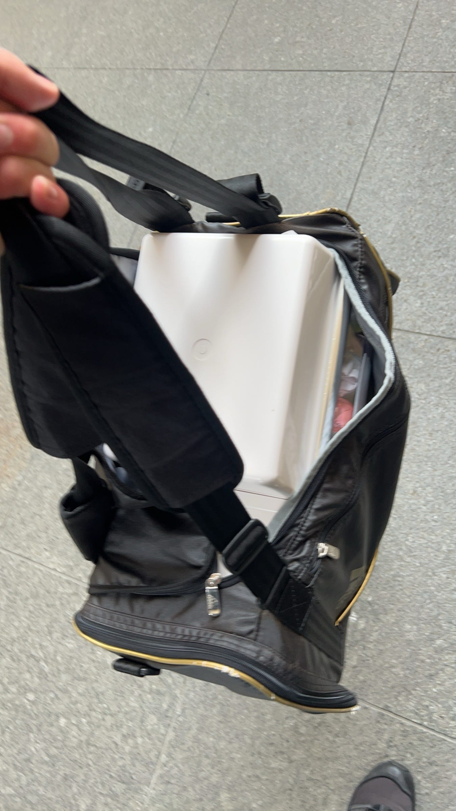
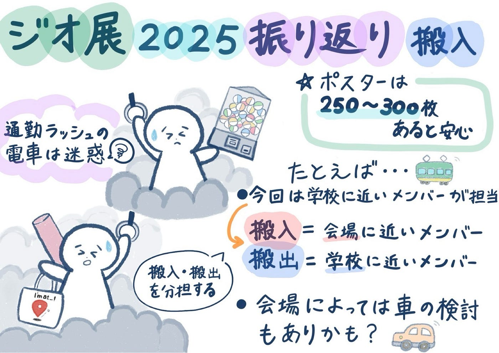

## ジオ展振り返り【備品搬入班】

こんにちは､3年の井上です。

今回はジオ展の振り返りをチームごとに行いました。

当日の備品搬入班は井上､安生､林（ゆ）の3人で､まずは井上､安生の振り返りを紹介します。

井上↓

[ジオ展2025振り返り_Rensei_Inoue · Issue #20 · furuhashilab/geogacha
ジオ展全体の反省 ・シフトの引き継ぎが曖昧で人が多かったり少なかったりすることがあった…github.com](https://github.com/furuhashilab/geogacha/issues/20)

安生↓

[ジオ展2025振り返り_MoeAnjo · Issue #16 · furuhashilab/geogacha
全体として 古橋研究室を知らない人にも活動内容が伝わるように、研究室の目的や取り組みをメンバー全員が自分の言葉で説明できる状態にしておくことが必要。…github.comまとめ](https://github.com/furuhashilab/geogacha/issues/16)

当日の備品搬入の様子はこちらです。

#### まとめ

今回のジオ展を通じて、自分たちの準備の甘さやゼミに対する理解度の低さなど、改善点が多く見つかりました。一方で、急な対応にも柔軟に連携できた点は成果だったと思います。

来年は役割分担の見直しや事前準備の強化を意識して､より良い発信と運営を目指したいです‼︎

#### グラレコ

