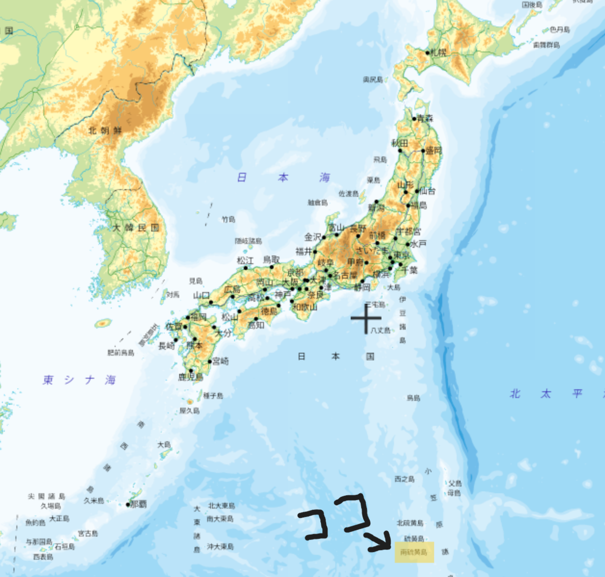
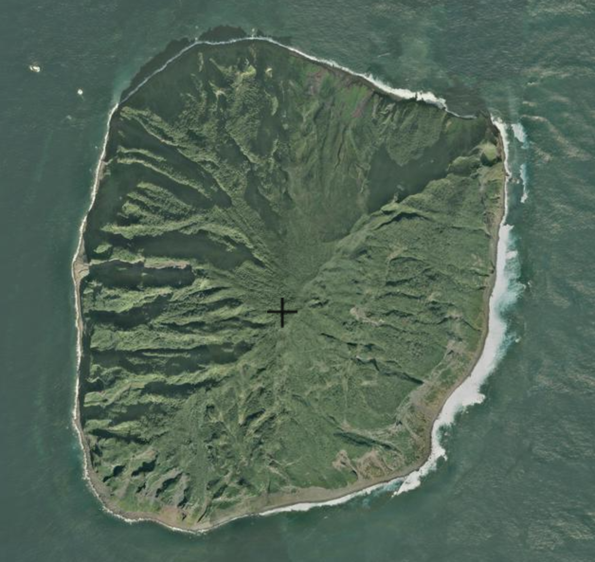
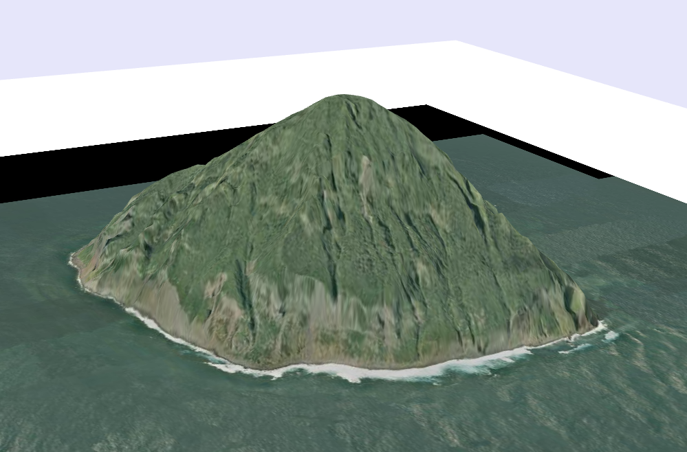
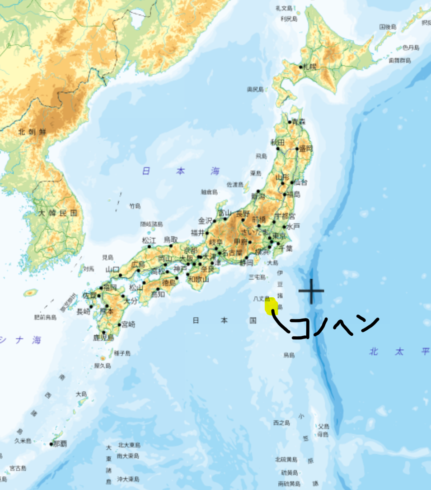
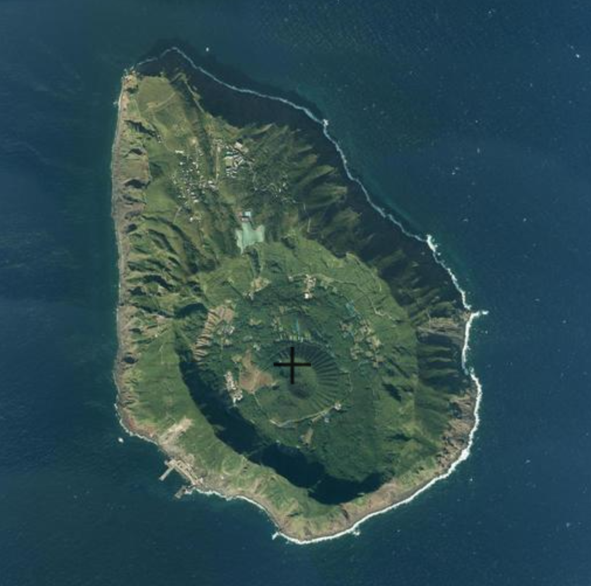
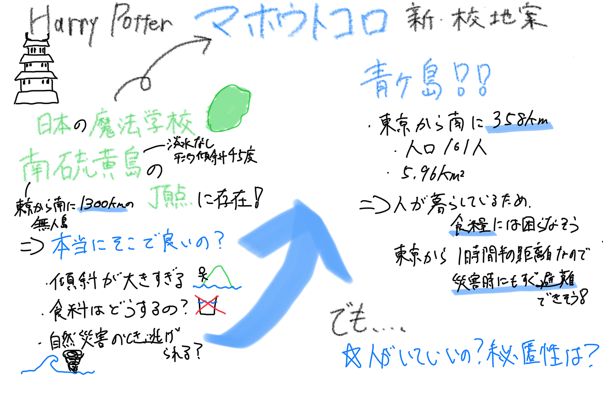

### 【7/22 Youth1週報】J・K・ローリングにマジレス。日本の魔法学校 "マホウトコロ" は本当にそこでいいの？

こんにちは！先日、不在者投票に行ってきました荒川です。記入台がトイレの子ども用の手洗い台ぐらい低くて書きにくかったです。

今週の週報では、Youth2のほうでマッパソンについて報告してくれるので、私の方では地理学・地理空間情報学をカジュアルに、視点を変えて捉えてみようと思います。

#### マホウトコロとは？

マホウトコロとは、J・K・ローリングさんの著書[『ハリー・ポッター』シリーズ](https://www.harrypotter.com/ja)の魔法世界に存在する、日本の魔法学校です。

『ハリー・ポッター』シリーズの作品では、イギリス・スコットランド地方の"どこか"に存在している[ホグワーツ魔法魔術学校](https://www.harrypotter.com/ja/fact-file/locations/hogwarts?utm_source=chatgpt.com)を主な舞台として物語が進んでいきます。しかし、このホグワーツは、『ハリー・ポッター』の世界唯一の魔法学校というわけではなく、ホグワーツを含めた計8校の設定が公開されているのです！ビックリ！（設定上11校存在するが、詳細が公開されているのは8校のみ）

その中の一つが、今回マジレスする"マホウトコロ"というわけであります。

#### なんで"マホウトコロ"にマジレス？

『ハリー・ポッター』の世界では、映画にも登場した[ボーバトン](https://www.harrypotter.com/ja/writing-by-jk-rowling/beauxbatons-academy-of-magic)（フランス）、[ダームストラング](https://www.harrypotter.com/ja/writing-by-jk-rowling/durmstrang-institute)（スウェーデンorノルウェー）といった学校の他にも、ブラジルやアメリカにも同様に魔法学校が存在するとされています。

その中で_「所在地」_が詳しく発表されているのが日本の"マホウトコロ"です。

他の魔法学校に関しては、詳しい所在地が公開されていない中、マホウトコロは、_「[南硫黄島の頂点に建っている](https://www.harrypotter.com/ja/writing-by-jk-rowling/mahoutokoro)」_と明記されているのです！！！！！ビーーーックリ！

作者であるJ・K・ローリングさんが、『ハリー・ポッター』シリーズの世界と現実世界を結び付けてくれたのです！

そこで今回はその設定をありがたく、敬意をこめて利用し、南硫黄島を地理的特徴から考察し、「本当に南硫黄島にある設定でいいの？もっと適切な場所があるんじゃない？」といったマジレスをしてみようと思います。

#### 南硫黄島の特徴

[小笠原村](https://www.vill.ogasawara.tokyo.jp/ioutou_index/ioutou_south/)の情報によると、南硫黄島は東京から約1300㎞南に離れた場所に位置し、面積は3.5㎢、標高は916mの円錐形の火山島です。島内には定住者はおらず、淡水も存在しません。

また、[小笠原観光局](https://www.visitogasawara.com/archive/archive-3504/)に掲載されている記事には、島の平均傾斜は45度と記述があり、人が暮らすには過酷すぎる環境です。

#### 問題点

1. 傾斜

寮生活や授業を考えると、この傾斜の環境で学ぶのは難しいかなと思います。

2. 食糧問題

淡水が存在しないこの島では、食糧問題が深刻だと考えます。南硫黄島から約300㎞の距離には父島が位置しますが、そもそも父島も東京からかなり離れていることや輸送時間などを考えると、この島で生活は困難だと言えます。

3. 自然災害

近くに位置する[硫黄島](https://www.vill.ogasawara.tokyo.jp/ioutou_index/ioutou_development/#:~:text=%E4%BA%9C%E7%86%B1%E5%B8%AF%E6%B5%B7%E6%B4%8B%E6%80%A7%E6%B0%97%E5%80%99%E3%81%A7%E3%80%81%E5%B9%B4%E5%B9%B3%E5%9D%87%E6%B0%97%E6%B8%A9%E3%81%AF%EF%BC%92%EF%BC%94%E2%84%83%E3%81%A7%E3%81%99%E3%80%82%20%E6%9C%80%E9%AB%98%E6%B0%97%E6%B8%A9%E3%81%AF%E3%80%81%EF%BC%94%EF%BC%90%E2%84%83%E8%BF%91%E3%81%84%E6%97%A5%E3%82%82%E3%81%82%E3%82%8A%E3%80%81%EF%BC%96%E6%9C%88%E4%B8%AD%E6%97%AC%EF%BD%9E%EF%BC%91%EF%BC%90%E6%9C%88%E4%B8%8A%E6%97%AC%E3%81%BE%E3%81%A7%E3%81%AF%EF%BC%93%EF%BC%90%E2%84%83%E3%82%92%E8%B6%8A%E3%81%88%E3%82%8B%E6%97%A5%E3%81%8C%E5%A4%9A%E3%81%8F%E3%80%81%EF%BC%91%E5%B9%B4%E3%81%AE%E4%B8%AD%E3%81%A7%E6%9C%80%E3%82%82%E5%AF%92%E3%81%84%EF%BC%92%E6%9C%88%E3%81%A7%E3%82%82%EF%BC%91%EF%BC%92%E2%84%83%E4%BD%8D%E3%81%A7%E3%81%99%E3%80%82,%E5%A4%8F%E6%9C%9F%E3%81%AF%E3%82%B9%E3%82%B3%E3%83%BC%E3%83%AB%E3%81%8C%E5%A4%9A%E3%81%8F%E3%80%81%EF%BC%96%E6%9C%88%EF%BD%9E%EF%BC%91%EF%BC%91%E6%9C%88%E3%81%AE%E9%99%8D%E6%B0%B4%E9%87%8F%E3%81%AF%E3%80%81%EF%BC%91%EF%BC%92%E6%9C%88%EF%BD%9E%E7%BF%8C%E5%B9%B4%EF%BC%95%E6%9C%88%E3%81%AE%E9%99%8D%E6%B0%B4%E9%87%8F%E3%81%AE%E7%B4%84%EF%BC%92%E5%80%8D%E3%81%A7%E3%81%99%E3%80%82%20%E5%B9%B4%E9%96%93%E9%99%8D%E6%B0%B4%E9%87%8F%E3%81%AF%E3%80%81%E5%B9%B3%E5%9D%87%E5%80%A4%E3%81%A7%E7%B4%84%EF%BC%91%EF%BC%8C%EF%BC%92%EF%BC%90%EF%BC%90%EF%BD%8D%EF%BD%8D%E3%80%81%E6%9D%B1%E4%BA%AC%E3%81%AE%E9%99%8D%E6%B0%B4%E9%87%8F%E3%82%92%E3%82%84%E3%82%84%E4%B8%8B%E5%9B%9E%E3%81%A3%E3%81%A6%E3%81%84%E3%81%BE%E3%81%99%E3%80%82)の情報にはなりますが、年間を通した平均気温は24℃で6月から11月は雨期となり降水量が増加します。また、年に5から10個の台風が接近するそうです。台風の接近により、島外に避難することを考えると、東京から1300㎞離れているということは致命的と言えます。また、島内にとどまるとしても、台風が逸れるまでは食料の調達が困難になることが考えられます。

#### 新・所在地案

南硫黄島での生活を考えた際の問題点をもとに、新たな校地案を挙げてみようと思います。

今回は、原作の設定を考え、候補を島に絞って考えてみました（日本本島内で考えると、、？編もいずれ書きたいなと思ってます）。

> 青ヶ島

[青ヶ島](https://www.vill.aogashima.tokyo.jp/office/outline.html)は、東京から南に358㎞離れた場所に位置しており、人口161人（R6.10.1時点）、面積は5.96㎢となっています。

1. 人が暮らしている

南硫黄島と違って、青ヶ島には一般人が暮らしているので、水や食料の調達は問題なさそうです。（急に人が増えて怪しまれそうだけど、、、）

2. 本島との距離が近い

南硫黄島は東京から1300㎞離れていましたが、青ヶ島は東京から飛行機と船を使い、1時間30分ほどで訪れることができるようです。7歳から11歳の生徒は鳥に乗って通学する設定のようなので、本島からの距離は重要だと考えます。

また、台風の接近の際にも、青ヶ島からなら比較的早く島外へと避難することが可能かなと思います。

#### 未だ残る問題点

今回は青ヶ島案を考えてみました。青ヶ島は南硫黄島よりもマホウトコロの所在地として適しているかなと思いますが、それでも問題点・懸念点はあります。

それは、「島内に一般人がいてよいものなのか」ということです。島内での生活を考えると、ある程度インフラが整った場所が理想的ですが、原作の設定では、魔法の存在は非魔法使いには隠されています。

（島の南に学校を立てて魔法で何とか隠せないカナ～なんて思ったりしています。）

秘匿性という面を考えると、無人島である南硫黄島にはもちろん劣るので、まだまだ検討の余地はありそうです。

#### 最後に

前期の最後の週報でエンタメに寄った記事を書いてしまい申し訳ありません。少しでも「へー。おもろいなー。」と思っていただけていたら幸いです。

P.S. 楽しかったのでまたいつかどこかでVer.2を書きたいなあなんて思って います。

#### グラレコ

