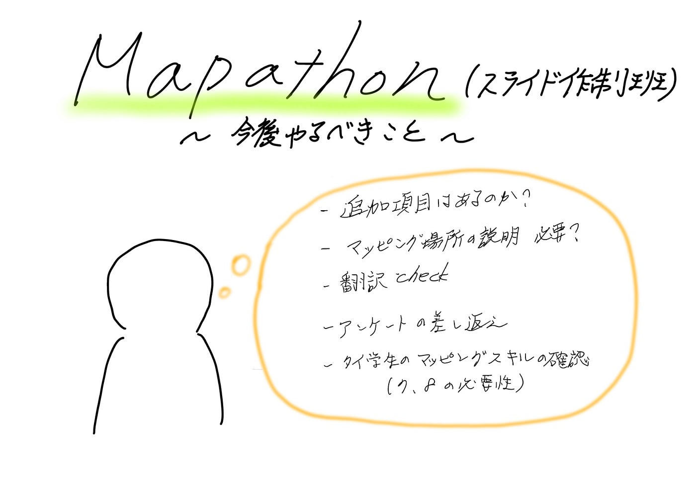

### Mapathon の準備(スライド作成班)

こんにちは！Youth②の週報を担当する寺土日南子です。

今回は、８月９日（土）開催予定のMapathonの準備についてです。

私とれんせいで当日使用するスライド作成を担当します。ゼミ座談会で使用したスライドを参考に主に**翻訳作業**を進めました。

スライド構成案

1. タイトル/参加にあたっての注意事項

1. YouthMappers AGU 紹介

1. シーナカリン大学のMappers 紹介？自己紹介？

1. TomTom 自己紹介

1. Mapathonについて

1. Hot Tasking Manager/OSMについて

1. アカウント作成、ログイン方法 （タイの学生はあるのか？）

1. マッピング方法 必要？

1. 挨拶＋アンケート

以上がスライドの構成です。

今回のMapathonは、

> 与論島の道路マッピングとタイでマッピングが足りていない場所をマッピングする

が現時点の内容です。（未確定）

作成途中のスライドです。確認お願いします(´;ω;｀)

グラレコ

