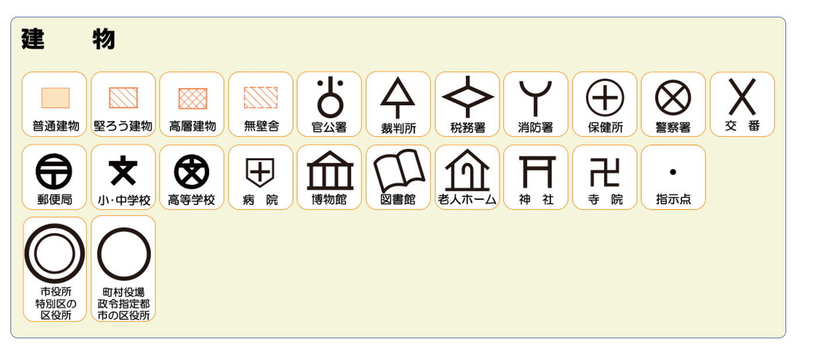
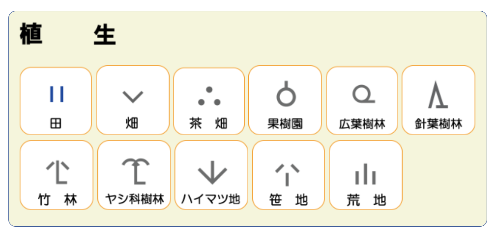
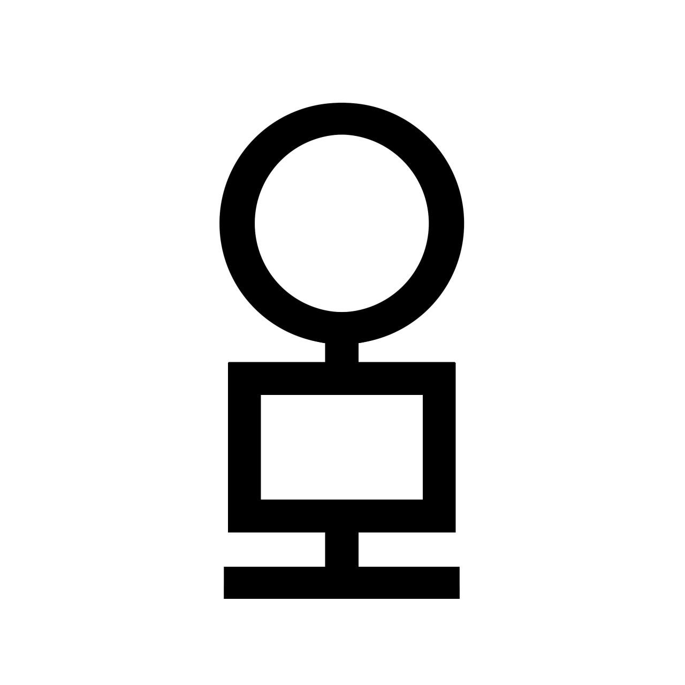
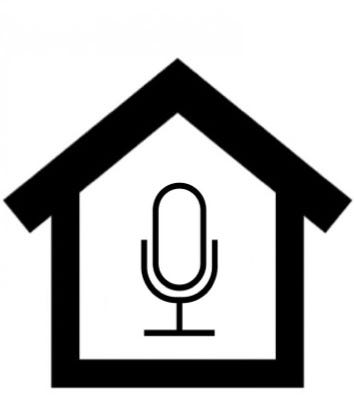
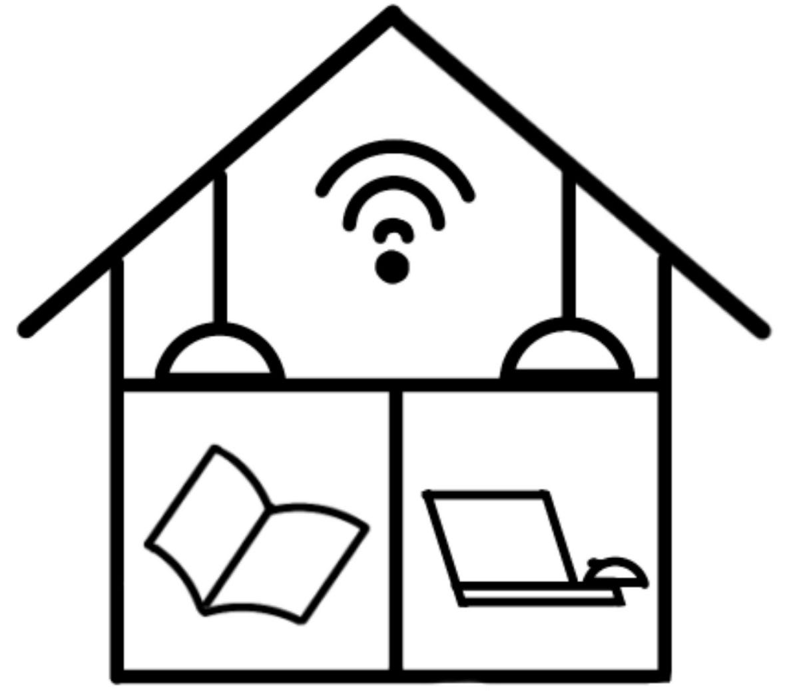
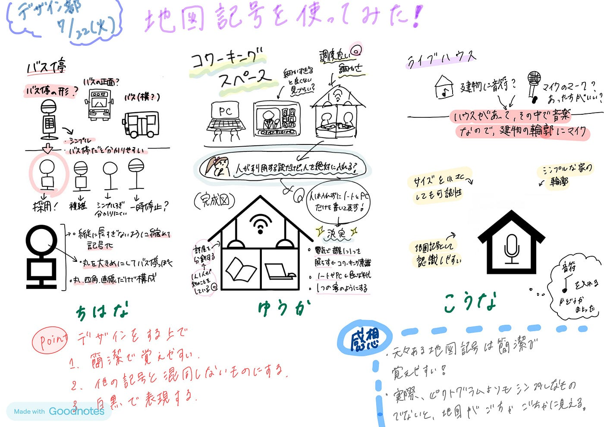

### 新しい地図記号をデザインしてみた【7/22デザイン部週報】

こんにちは、臼井です。

いよいよ今学期の授業も終わり、夏休み目前ですね。

今週、デザイン部では一人一つ新しく地図記号をデザインしてみました。

恐らく全員知っているとは思うのですが、地図記号とは**地図上で施設や土地利用などを分かりやすく表すために用いられるマーク**のことです。

例えば、以下のようなものです。

日本人なら小学校で習っているはず！(覚えているかはともかく)

実は地図記号の中には、古戦場、塩田など時代の流れから**使われなくなったもの**があり、逆に**新しく作られたもの**も存在します。

例えば最も新しいものだと過去に起きた自然災害の情報を伝える**自然災害伝承碑**などです。

そして、**老人ホーム**は小中学生から募集したデザインをもとにして作られました！

**これは言い換えれば、私たちが考えたデザインが実際に地図記号になる可能性がある(かもしれない)ということ…**

という事で、今回はまだ地図記号が存在しない施設の地図記号を新たにデザインしてみました。

（似たようなものにトイレやエスカレーターなどを表す、案内用地図記号、別名ピクトグラムがあるのですが、今回は地図記号に加えるならという視点で考えました。）

また、デザインする中で

**簡潔で覚えやすいこと**

**他の記号と混同しないものにすること**

**白黒で表現できること**

の3点に注意してデザインしました。

実際には地図記号が作られるのは、公共性と永続性を兼ね備えた施設ですが、今回は一度それらの条件を取っ払って自由に想像してみました！

では、デザインした地図記号を紹介していこうと思います。

#### ちはな

私が今回デザインしたのは「**バス停**」です。

バス停の形をそのまま取り入れるか、バスを正面から見た形にするか迷いましたが、バスそのままだとバス自体がそこにあるように感じられてしまうと思いバス停の形にしました。

また、時刻表を表す長方形を入れることで無いよりも複雑なデザインにはなりますが、ただの標識と混同しないようにしました。

記号自体は円や四角、直線を利用し簡潔なものになることを意識しました。

#### こうな

私がデザインしたのは「**ライブハウス**」です。

音符を使うか、マイクを使うか、両方ハウスの中に入れるか作成の際に迷いました。

最終的にマイクを使用したのは、音符では音を表していて、楽器等にも使用することができて、範囲が広く、的確にライブハウスと理解が難しいと思いました。またできる限りシンプルにしたいので、音符とマイクの組み合わせも諦めました。

#### ゆうか

私が今回デザインしたのは「**コワーキングスペース**」です。

記号が細かくなりすぎないように注意しました。ノートやパソコンを使っている人を記号の中に入れるか迷いましたが、人まで書いてしまうとかなり細かくなると考えたため、ただノートとパソコンを書くだけにしました。

また、同じ家の中に仕切りを作って、ライトも一人一つあるというデザインが工夫ポイントです。「コワーキングスペースらしさとはどんな所か」を考えながら作っていきました。

なるべく定規や円定規を使って、従来の地図記号に近いカクカクとした絵を描きました。とても楽しかったので企業ロゴも作りたいです。

いかがだったでしょうか。

今回自分でデザインしていると複雑な形になりやすく、元々ある地図記号は簡潔ながら覚えやすい形になっていることを実感できました。

実際の地図に載せることを考えた場合、ピクトグラムよりもシンプルなものでないと、分かりやすくするための地図記号のせいで、地図がごちゃごちゃしてしまう事態にもなりえると考えました。

今回は地図記号でしたが、企業やサービスなどのロゴ制作をするのもやってみたいです！

### グラレコ

