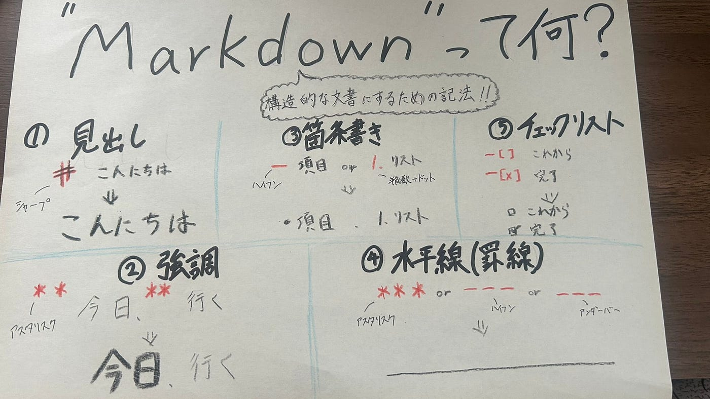

### 【7/22ドローン部1週報】Markdown形式をマスターしたい！

こんにちは、3年の井上です。

皆さんはMarkdown形式を使いこなせていますか？私たちZ世代の人たちは使いこなすのはおろか、存在すら知らない人ばかりというのが現実だと思います。

そこで、今回はMarkdown形式をマスターするための一歩目として、基礎的なものをいくつかまとめました。まずはこれから紹介する5つを覚えて、慣れていきましょう。

> Markdown形式とは

まず、簡単にMarkdown形式とは何か解説します。

Markdown形式とは、”**構造化された文書を作成するための技術**”です。特定の記号を用いることで、文章の見た目・レイアウト を簡単に指定することができます。

[GitHub](https://github.com/)や[Notion](https://www.notion.com/ja)だけでなく、最近では[WindowsのMarkdown対応のメモ帳が一般ユーザーにも開放されたり](https://news.livedoor.com/article/detail/29090931/)、[iOS26のメモアプリでもMarkdown形式で書き出しが可能になったり](https://www.excite.co.jp/news/article/Macotakara_macotakara_49044/)と様々な場面で使うことができます。

> 具体的な記法

具体的な記法について紹介します。調べるにあたってこれらのサイトを参考にさせていただきました。

・[【初心者向け🔰】今さら聞けない、「マークダウン」とは何か？（参考サイト付き）](https://qiita.com/to3izo/items/7057acda14c6d5f1f4e3)

・[Markdown記法/書き方（見出し・表・リンク・画像・文字色など）](https://notepm.jp/help/how-to-markdown)

#### ①見出し

・「＃」を文章の頭に付ける。

・シャープ（＃）の後に半角スペースを入れないといけない。（全角にしないように注意）

・シャープの数が少ないほど、大きな見出しになる。

#### ②強調（太字）

・強調したい文字の両側をアスタリスク（＊）２つずつで囲むと太字に！

・アスタリスクの外側（右も左も）に半角スペースを入れる（内側には不要）

#### ③箇条書き

・「－」を先頭に付ける

・ハイフン（－）の後に半角スペースを入れる

・番号付きの箇条書きにする場合は、「半角数字＋ドット」にする

#### ④水平線（罫線）

・「アスタリスク（＊）」「ハイフン（ー）」「アンダーバー（＿）」のいづれかのみをを3つ以上記す

#### ⑤チェックリスト

・先頭に ‐[ ] を付けるとチェックリストになる

・完了したタスクにはカッコの間に「×」を入れて、‐[×] にする

> まとめ

今回紹介したのはほんの一部で、まだまだたくさんの記法があることを知ることができました。とりあえず、Markdown形式を使いこなしていくための一歩を踏み出せたという点においては良かったです。

皆さんもおすすめの記法等があったら教えてください。

> グラレコ

