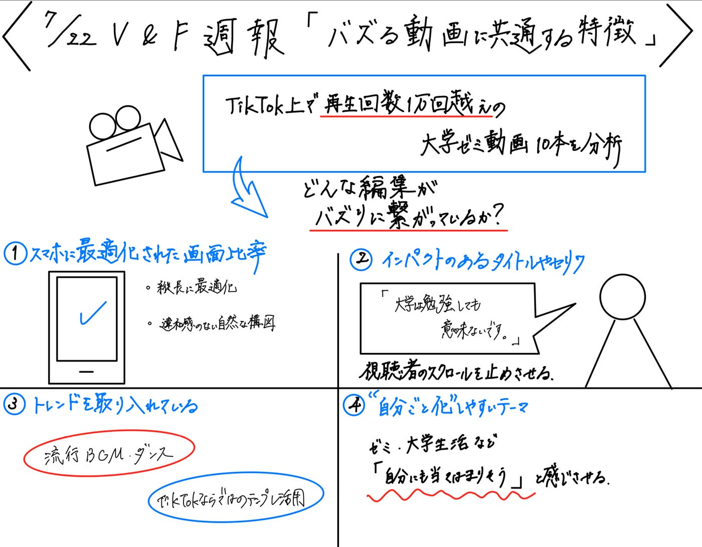

### 再生数1万回超え動画の特徴とは？TikTokバズ動画を徹底分析！【V&F週報】

こんにちは。V＆Fです。
 今週の週報では、[TikTok](https://www.tiktok.com/ja-JP/)でバズっている動画をいくつか分析しながら、「バズる動画に共通する編集の特徴」について考察してみました。

> **参考にした動画**

まずは、以下の条件に当てはまるTikTok動画を9本ピックアップしました：

•	再生回数が1万回以上

•	大学のゼミ活動に関連している

•	学生主体で投稿されている

これらの動画を選んだ理由は、今後自分たちが投稿するであろう動画と近い条件だからです。

つまり、同じように「ゼミ活動」かつ「学生発信」という点で共通しており、参考にする価値が高いと考えました。

- **[【公式】関西インカレサークル ACSEL**](https://www.tiktok.com/@acselkouryuukai/video/7401811507958254856?_r=1&_t=ZS-8yECMr6zrmr)

- **[立教大学経営学部 佐々木ゼミ**](https://vt.tiktok.com/ZSBKdo3VC/)

- **[intern_gannbaruzo**](https://vt.tiktok.com/ZSBKdwbVf/)

- **[横井ゼミナール【公式】**](https://vt.tiktok.com/ZSBKRgnbu/)

- **[こくめし(鈴木特別ゼミ)**](https://vt.tiktok.com/ZSBKRssT7/)

- **[TeikyoMoriSemi**](https://vt.tiktok.com/ZSBK8YAs3/)

- **[青学生とエリック教授**](https://vt.tiktok.com/ZSBKFePva/)

- **[日体大 清宮ゼミ**](https://vt.tiktok.com/ZSBKYYvcW/)

- **[青山学院大学経営学部玉木ゼミ🌟](https://vt.tiktok.com/ZSBKYkFLC/)**

> **動画の特徴**

これらの動画を分析した結果、**バズっている動画に多く見られる編集上の特徴**として、以下の4つが挙げられました：

1. **縦横比の違和感がない**
無理に横から切り出したような構図崩れがなく、スマホで自然に見られる画作りになっていた。

1. **動画冒頭にインパクトのあるタイトルやセリフがある**
「大学は勉強しても意味ないです。」のように、強い言葉や印象的なワードで視聴者の注意を引きつけており、**スクロールを止めさせる力がある**と感じました。

1. **トレンド要素が入っている**
流行中のBGMやダンス、テンプレ的な構成を活用し、視聴者の目に留まりやすくしている。

1. **視聴者が「自分ごと化しやすいテーマ」**
大学生活やゼミ活動など、共感されやすい題材が用いられているケースも多く、視聴者が「自分にも当てはまりそう」と感じる構成になっていた。

> **メンバーの分析**

この分析が他の人からどう見えるかも検証するため、ゼミ内サークルのメンバー3名にも同じ動画を視聴してもらい、それぞれの気づきを書いてもらいました。

**しょーた：**

「動画投稿用」としてネタを考えて撮影をしているわけではないのかなと感じた。日常の様子や、思い出をつなぎ合わせて気軽に見ることができるコンテンツになっているなと思った。「ネタ」があるわけではなく、広くゼミの雰囲気を発信するコンテンツの受けが良いのだろうと思った。

**こうな：**

個人的に動画を見る時に冒頭で見たい、見たくないが雰囲気やセリフで決めるので、これらの動画は冒頭の部分でまだ見てみたいと思わせうるインパクトがあると思いました。また、その内容も短いけど充実していて面白く見れると感じました。

**ちさと：**

冒頭のインパクトあるセリフが重要」という指摘に共感した。実際にバズっている動画を見てみると、最初の数秒で心をつかむような言葉や問いかけが入っているものが多く、スクロールを止めさせる仕掛けとして非常に効果的である。

また、「視聴者が共感しやすいテーマ設定」が重要という意見にも納得感があった。大学生活やゼミといった身近な題材を扱っているからこそ、視聴者が自分に重ねて見やすくなっており、それが再生回数や反応の多さにつながっている。

さらに、トレンド要素やスマホに最適化された画面構成についての分析も的を射ていて、バズっている動画には意外と“基本的な工夫”が丁寧に積み上げられていることに改めて気づかされた。

他の分析を見ながら、自分でもなんとなく感じていた違和感や注目点に言語化された形で触れることができ、分析そのものの納得度が高まった。バズる動画には、それぞれに共通する「伝え方の型」があるのだとわかった。

> **まとめ**

今回の分析を通して、TikTokでバズる動画には、視聴者の興味を瞬時に引きつける「工夫された編集」や「共感しやすいテーマ」が共通していることがわかりました。

なかでも、冒頭のインパクトある言葉選びやトレンドの活用は、スクロールを止めてもらううえで重要な役割を果たしていました。

また、大前提として、無理に横動画を切り取るのではなく、最初からスマホに最適化された縦画面で構成することが、違和感のない自然な視聴体験につながっていると感じました。

今後、自分たちが動画を発信する際にも、こうしたポイントを意識していきたいと思います。

> **グラレコ**

