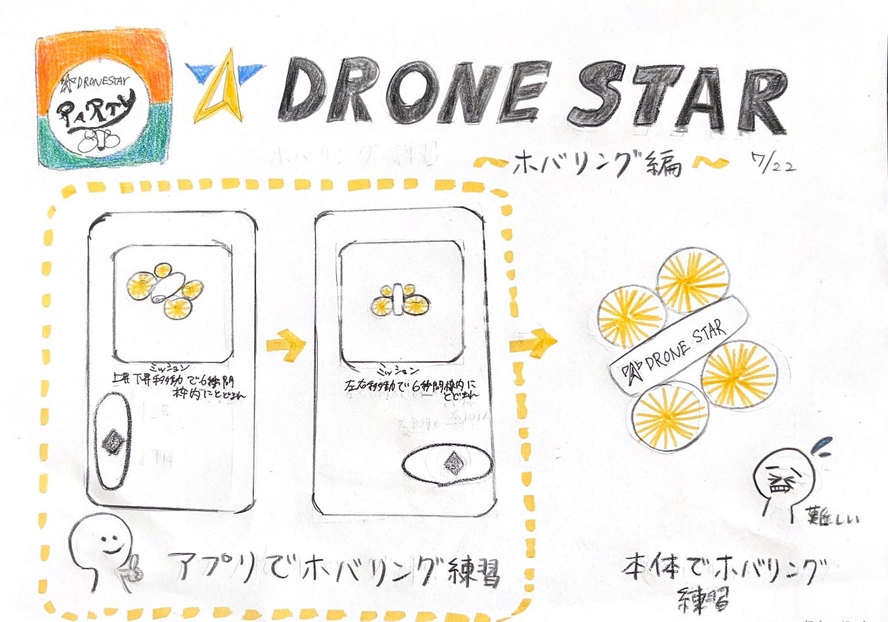

### アプリでホバリング練習【ドローン週報②7/22】

DRONE STARさんから頂いたドローンで今回も練習しました！

本体で練習する前に専用のアプリがあるということでアプリで練習を行ってから、本体を使ってホバリング練習をしました。
アプリはインストールしてメールを登録すれば、すぐに使えました。

#### **アプリ内のミッションに挑戦**

ミッション①上昇下降で6秒間枠内にとどまれ
ミッション②左右移動で6秒間枠内にとどまれ

なんなくクリア✨

その後はDRONE STARクイズに答えて用語もバッチリです。
クイズの内容は「ドローンがその場にとどまることを＿＿＿＿＿という」
答え ホバリング

といった具合にドローンを操縦する上で欠かせない基礎を学べる内容になっていました。

**アプリ内のミッション様子**

[https://youtube.com/shorts/uxHXfHV9LPg?feature=share](https://youtube.com/shorts/uxHXfHV9LPg?feature=share)

アプリ内での練習が終わったので、実際にホバリングを練習しました。

**ホバリング練習様子**

[https://youtube.com/shorts/xD1-W7X2GOc?feature=share](https://youtube.com/shorts/xD1-W7X2GOc?feature=share)

[feature=sharettps://youtube.com/shorts/LR9lFPSTo9c?feature=share](https://youtube.com/shorts/LR9lFPSTo9c?feature=share)

**感想**

始めはカメラ内にも収まらない暴れっぷりでしたが、カメラ内に収まるようになってきました。静止できるレベルまで頑張りたいです。

**今回の練習でつかんだコツ**

・ 風の影響がない場所（エアコン・換気扇の風が当たらない場所）を選ぶ
・ プロポのスティックを細かく動かさず“戻して止める”意識で操作する
・ スロットル（上昇・下降）の指の力を一定に保つ
・ ドローンの正面を自分に向けず、自分と同じ向きにして練習する
・高度を低め（目線〜肩程度）に保ち視認性を確保する
・ 細かく位置がずれるのは当たり前と考え、微修正で戻す練習を繰り返す

