## 今年もBUILD with Mapboxの季節がやってきた！

こんにちは。古橋研究室4年の林です。

みなさん、今年の夏はいかがお過ごしでしょうか。私は「大学生最後の夏」という特別な時間を、後悔のないように1日1日を大切に過ごしながら、思い出づくりに励んでいます！！

さて本題ですが、昨年に続き今年も 「BUILD with Mapbox」 に参加しましたので、その様子を報告したいと思います。

### BUILD with Mapboxとは

#### 概要

• **名称**：[BUILD with Mapbox 2025](https://www.mapbox.com/build)

•	**開催日時**：2025年9月8日〜12日

•	**形式**：バーチャル・オンラインでの開発者向けカンファレンス

•	**主催**：Mapbox

#### 目的

Mapbox が主催するオンラインイベント 「BUILD with Mapbox 2025」 は、最新の地図・ナビゲーション・検索・位置情報技術をテーマにした世界中の開発者向けカンファレンスです。期間中は、製品アップデートの発表や技術セッション、ハンズオン形式のワークショップが行われ、参加者は実際のコードを通して新機能を体験できます。さらに、Mapbox のエンジニアやコミュニティメンバーと直接つながれる機会が提供され、新たなアイデアやネットワークを広げる場としても注目されています。

#### イベントスケジュール

以下のリンクからご覧ください。

→[https://www.mapbox.com/build/agenda](https://www.mapbox.com/build/agenda)

### イベントの様子

毎日6公演くらいある中、私が参加して面白かったセッションを3つ紹介します！

#### 1. Building with the Navigation SDK on iOS

**セッション概要**

- 日時（JST）: 9/10 21:00–21:50

- スピーカー : Artem Stepuk

- 内容 : このセッションでは、iOS 用のナビゲーションSDKの使い方や、turn-by-turn方式のナビゲーションに必要な地図ビュー、進行方向の指示、速度制限、走行進捗などの 事前構築済み UI コンポーネントを紹介する。統合・カスタマイズ・拡張の方法を学ぶことで、より洗練されたナビゲーション体験を迅速に提供できるようになる。

- セッションの様子

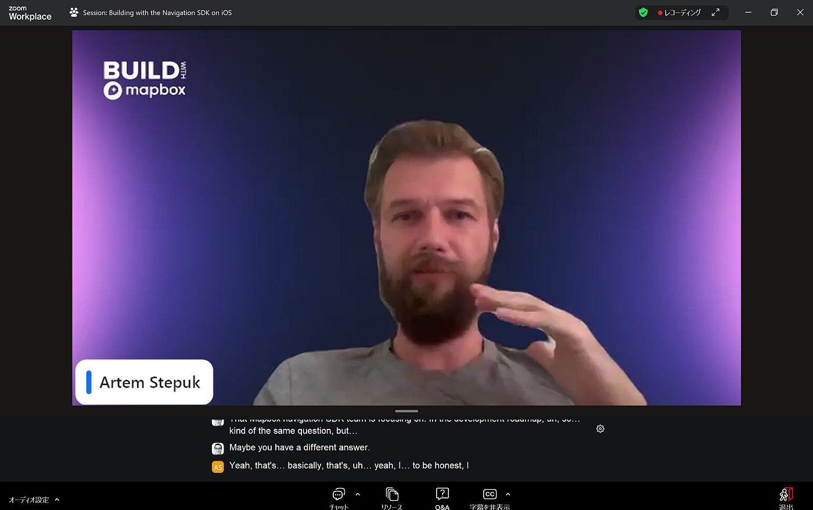

**感想**

実際に自分で手を動かして同時に操作することは技術的にできませんでしたが、コードの説明を通じて開発フローを順を追って理解できたのがとても有益でした。どのような順番で実装していくのかが明確になり、実際の開発プロセスをイメージしやすかったです。

**スピーカへの質問**

（質問内容）

iOS向けの[Navigation SDK](https://www.mapbox.jp/navigation-mobile)で、今後追加される機能や新しい開発の中で、あなたが一番楽しみにしているものは何ですか？

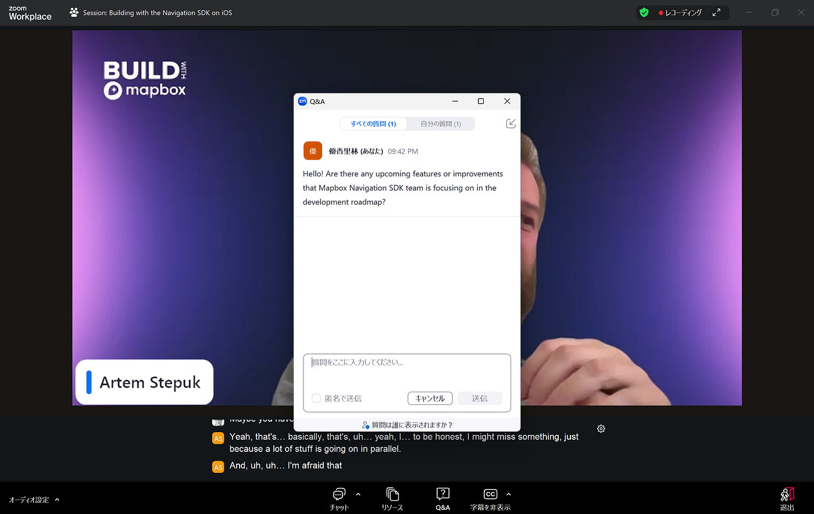

（質問回答）
 現在、「Maps」チームが特定の建物をハイライト表示する機能を開発しています。目的地の建物を正確に強調表示できるようになります。この機能が完成し、Mapbox Maps側からAPIが提供されたら、私たちのSDKでもそれを適用し、ナビゲーション中に目的地の建物が分かっていれば実際にハイライトできるようになります。これが私が思い浮かんだ中で一番ワクワクする機能のひとつです！

**グラレコ**

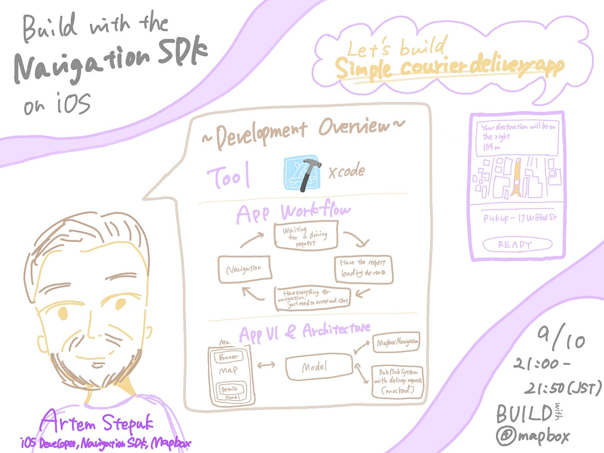

#### 2. The secrets behind great navigation

**セッション概要**

- 日時（JST）: 9/10 22:00–22:25

- スピーカー : Nikita Parfionau

- 内容 : このセッションでは、優れたナビゲーション体験を作成するために必要なものを検討し、MapboxがナビゲーションUXフレームワークに構築するベストプラクティスを共有します。

- セッションの様子

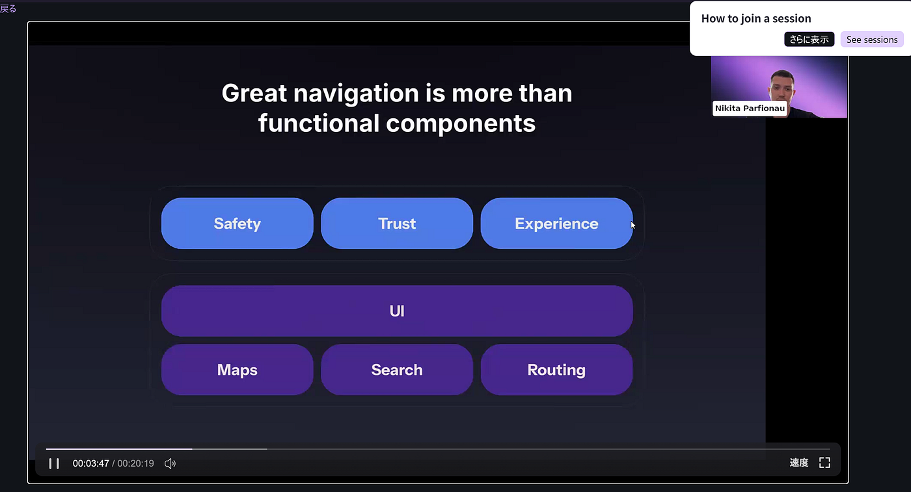

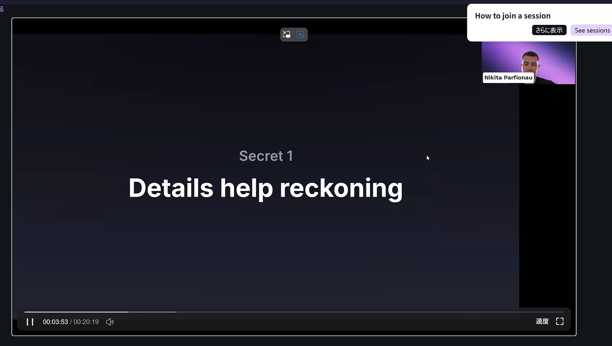

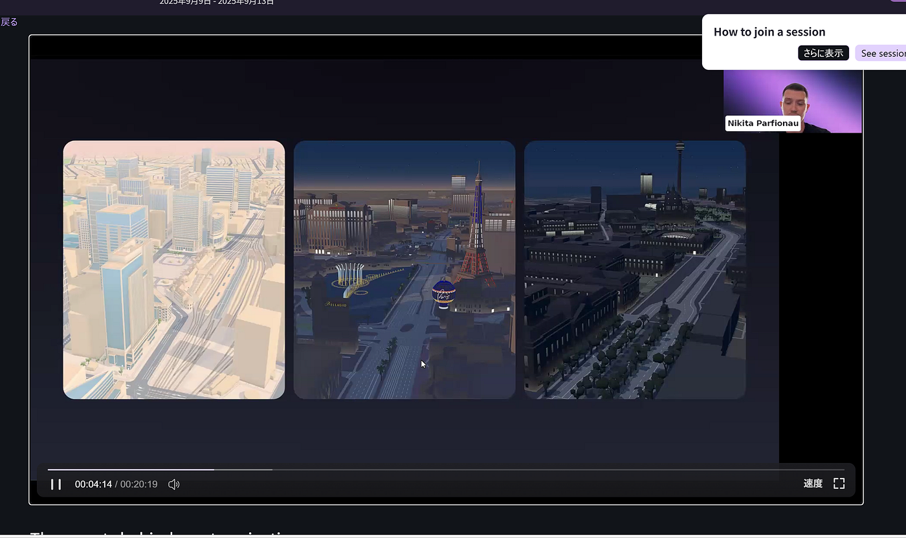

**感想**

ナビゲーション体験は単に地図を表示することではなく、ユーザーの状況や意図を先回りしてサポートすることが重要だと感じました。特にガソリンスタンドや駐車場など、利用者が次に必要とする場所を予測する視点は実用的で印象的でした。

**スピーカーへの質問**

（質問内容）

あなたのインスピレーションは何ですか？

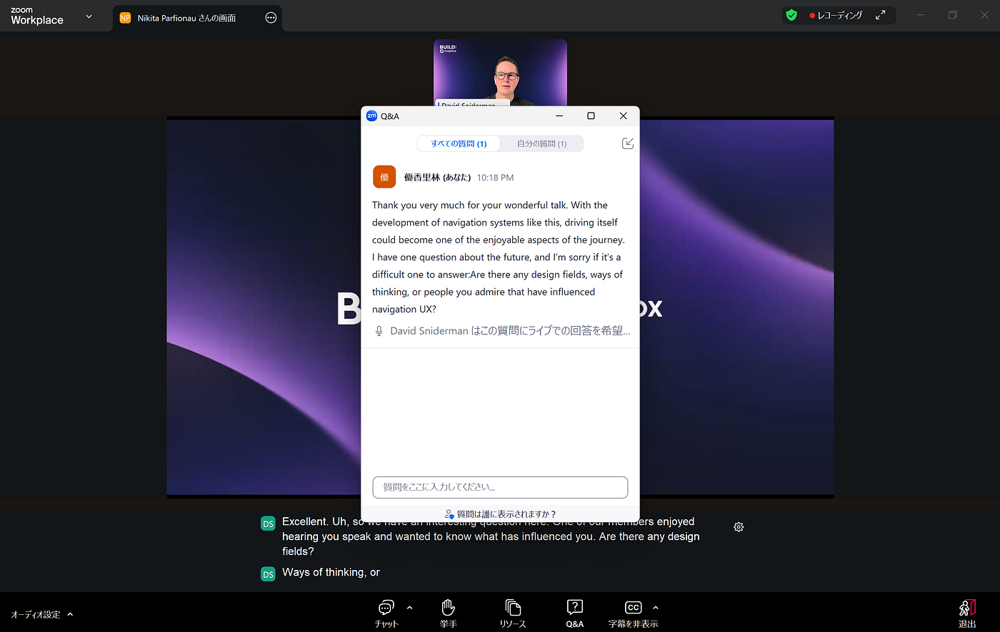

（質問回答）
正直に言うと、よく分かりません。私は優れたプロダクトから刺激を受けています。もちろん、私自身はMapBoxや私たちが作り上げた地図からもインスピレーションを受けました。そして、できるだけそれを活用しようとしています。
他にはAppleやGoogleのような競合、あるいはRivianやTeslaのように素晴らしい仕事をしている会社を見ています。彼らは常に限界を押し広げていて、それが私たちにとっても優れたプロダクトやデザインを生み出す刺激になっています。

**グラレコ**

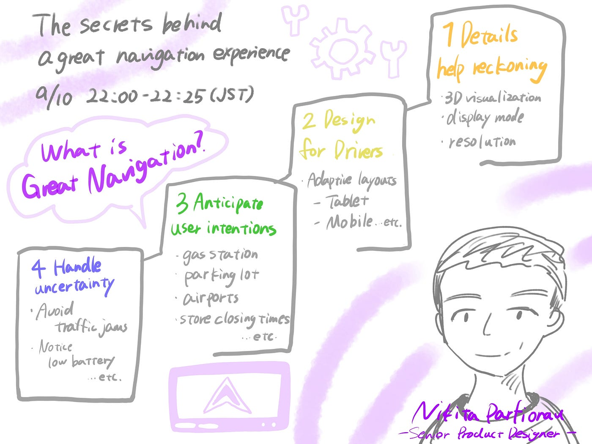

#### 3. Mapbox Search Box vs. Mapbox Geocoding

**セッション概要**

- 日時 : 9/11 1:00–1:25

- スピーカー : Robert Florance/Cris Byers

- 内容 :[ Mapbox Search Box API](https://www.mapbox.jp/blog/unlock-faster-smarter-search-with-mapbox-search-box-api) と[ Geocoding API ](https://www.mapbox.jp/blog/mapbox-geocoding-101-location-intelligence-essentials)のどちらを使うべきか迷っている方に向けて、このセッションでは、POI 検索、フォームの自動補完、住所の確認といった一般的なユースケースにおけるベストプラクティスを共有し、さらに API エンドポイントやパラメータ設定のコツを紹介して、その選択を分かりやすく解説する。

- セッションの様子

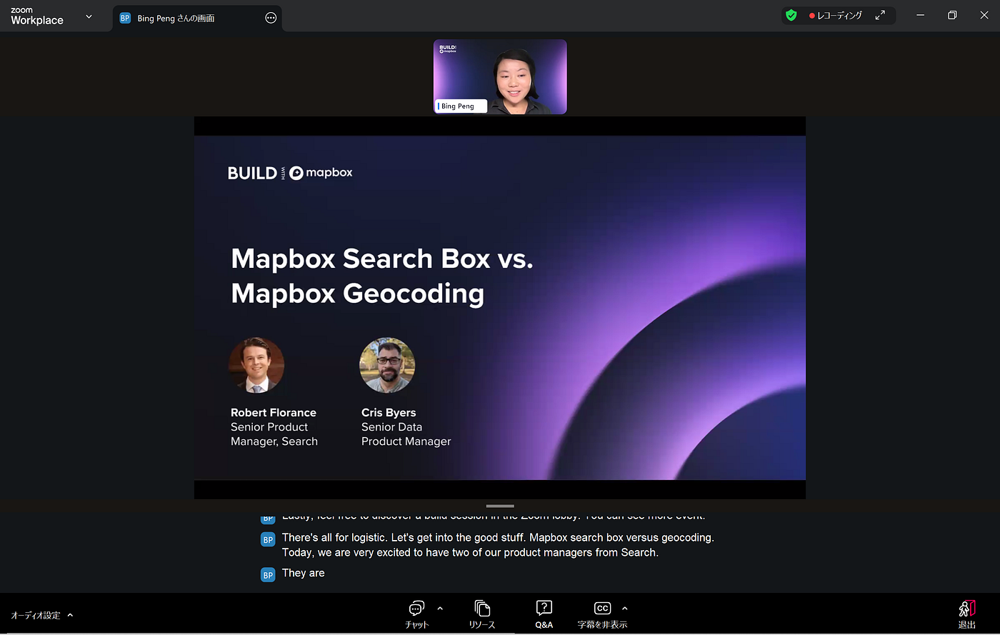

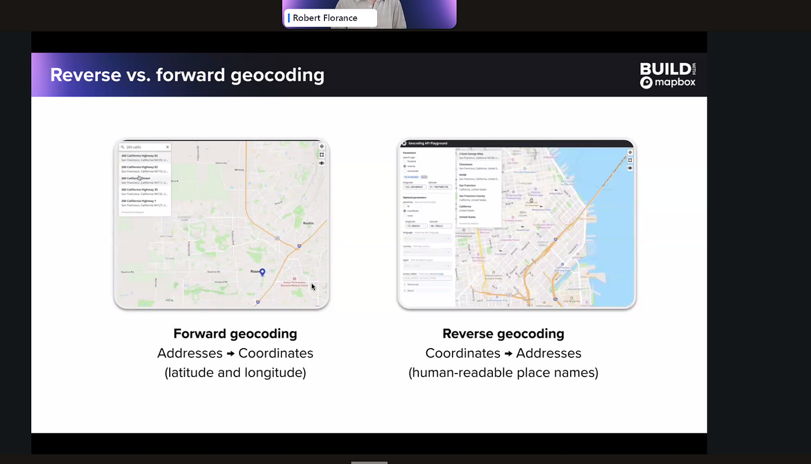

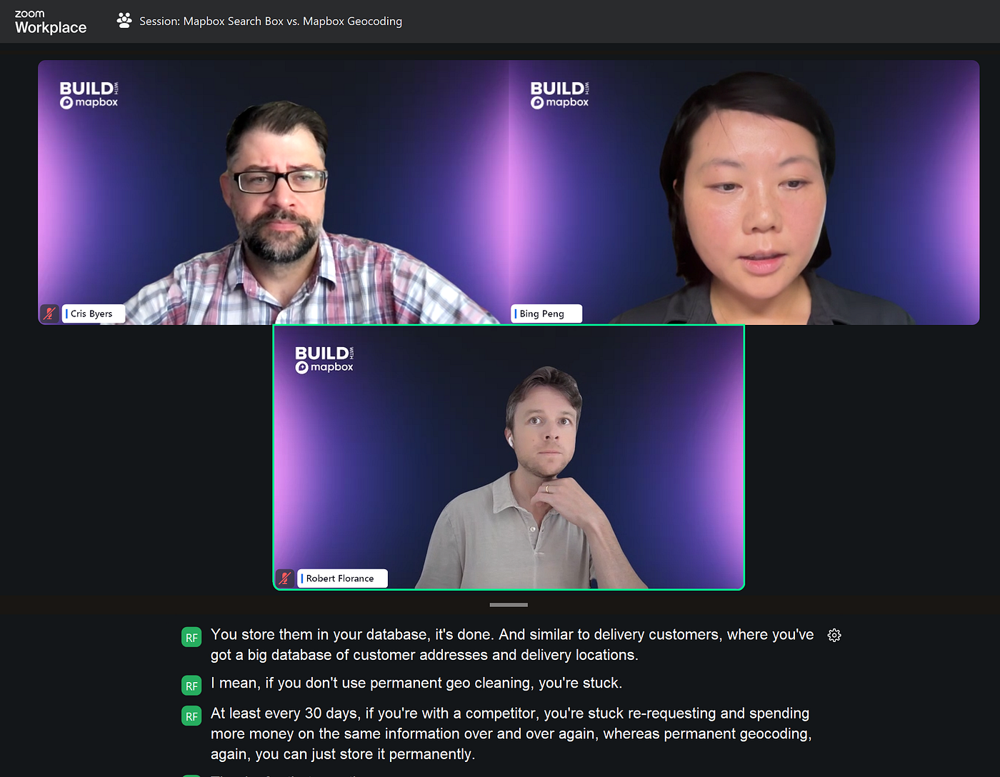

**感想**

セッションを聞いて、技術を単に理解するだけでなく『どう活用するか』を考える癖をもっとつけたいと思いました。ANWBやTripadvisor、Picnicの事例から、これらの技術が観光や物流など身近な分野で実際に役立っている様子がよく分かりました。

**スピーカーへの質問**

（質問内容）

将来ジオコーディングは、どんな新しい分野に広がっていくのか。また、AIや機械学習と組み合わせた応用例がありますか？

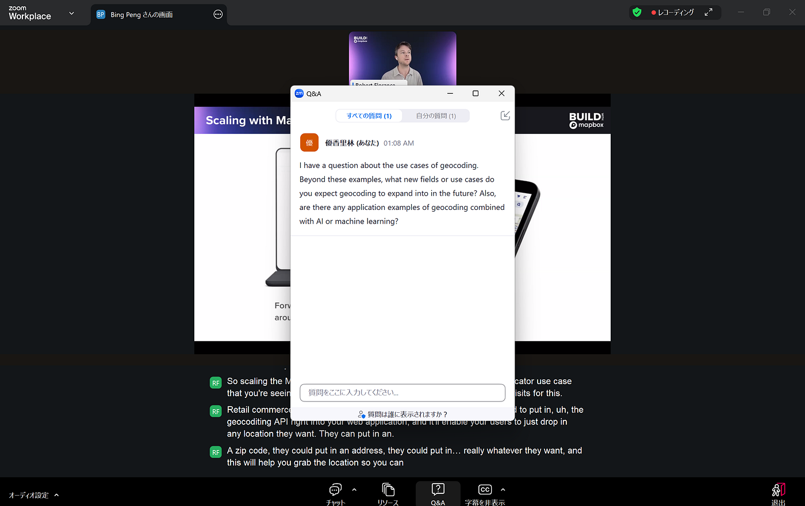

（質問回答）

現在のジオコーディングは、比較的しっかりしたAPIレスポンスオブジェクトを提供しています。たとえば、ある住所が属する地理的階層を返しますし、結果の精度レベル、つまり「屋上レベル」なのか、それとも地番と交差しているだけなのか、などの情報も返しています。

今後拡張を検討しているのは、住所APIのレスポンスに配達関連の属性情報を追加することです。具体的には、屋上や区画だけでなく、実際の「建物の入口」がどこかを返すようにする予定です。これは今後数か月間の大きな優先事項です。

さらにその先としては、その場所の性質に関するメタデータも追加していきたいと考えています。例えば、「その建物は多層階なのか」「テナントが複数入っているのか」「その住所がカバーするエリアはどれくらい広いのか」といった情報です。特に配達やナビゲーションのユースケースでは、現地に到着する前にどんな状況かを事前に把握できることが重要だからです。

AIとの関連では、Mapboxは最近[MCPサーバー](https://www.mapbox.com/blog/introducing-the-mapbox-model-context-protocol-mcp-server)をリリースしました。そして、現在そのMCPサーバーで最も利用されているのがジオコーディングです。理由は、AIツールに位置情報ベースの質問をしたときに必要になるからです。たとえば、「今私はここにいて、ラスベガスまでロードトリップをしているんだけど、犬を連れていて、途中でハイキングに立ち寄れる場所を探している」といった質問です。これに答えるには、ナビゲーション、検索、地図など複数のMapboxサービスを組み合わせる必要があります。ですが、そもそもAI（LLM）に「ラスベガスがどこか」「ユーザーがどこにいるか」「そのハイキングスポットがどこにあるか」を教える必要があります。つまり、ジオコーディングは、LLMがMCPサーバー経由で私たちのツールを使ううえで基盤となる部分となります。

**グラレコ**

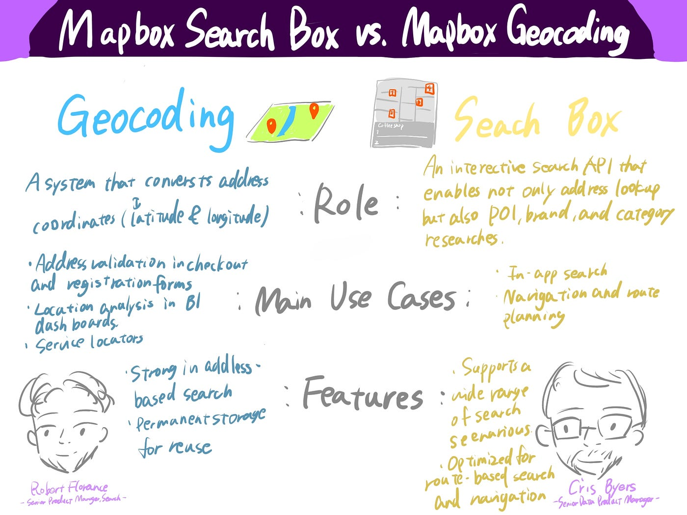

### 会議の振り返り

今年もMapboxのカンファレンスに参加してみて、去年より内容が頭に入ってきたことがうれしく思いました。ゼミや地図業界のインターンを通して、専門用語や地図の仕組みを学んでいたおかげで、「これ聞いたことある！」と日々の学びがつながる瞬間がありました。

一方で、やっぱり時差の関係で深夜や早朝のセッション参加はなかなか大変でした。ですが、セッションがアーカイブ配信されているので興味の持った内容を振り返ってみれるのはとてもありがたかったです。毎年9月に行われているイベントになりますので、ぜひ来年はみなさんもご参加ください！！
