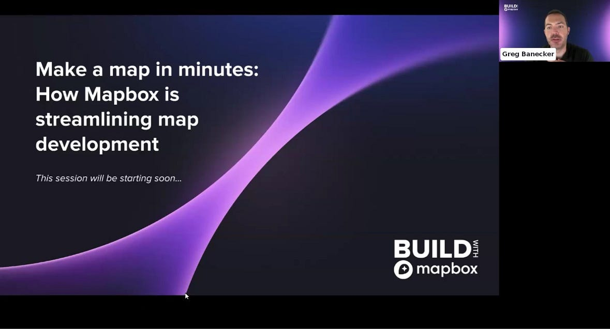
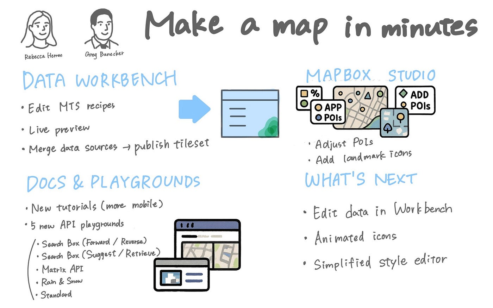
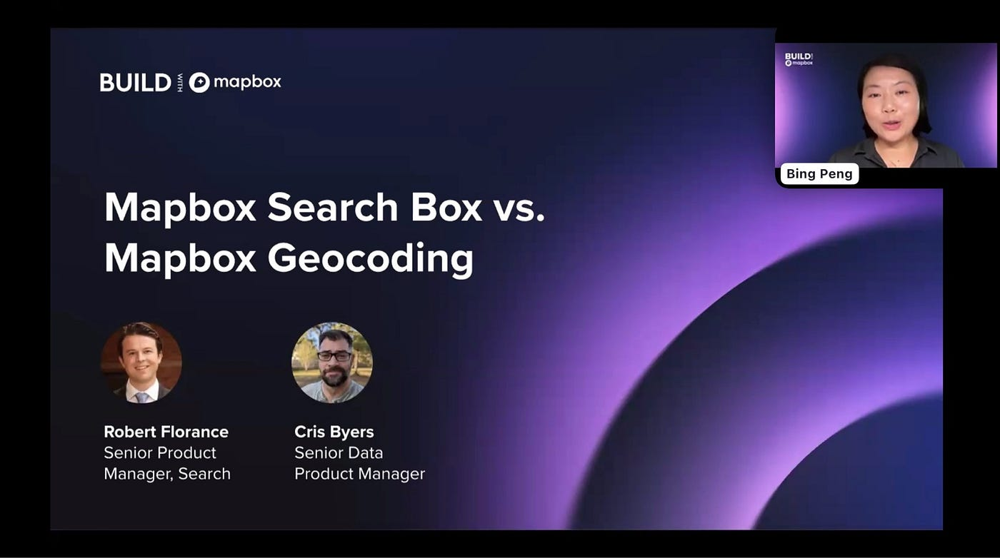
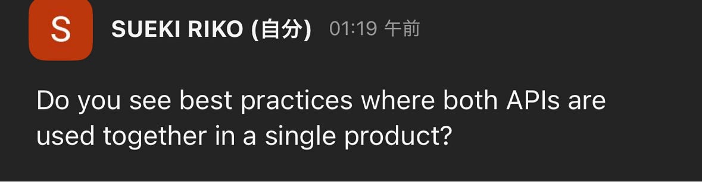
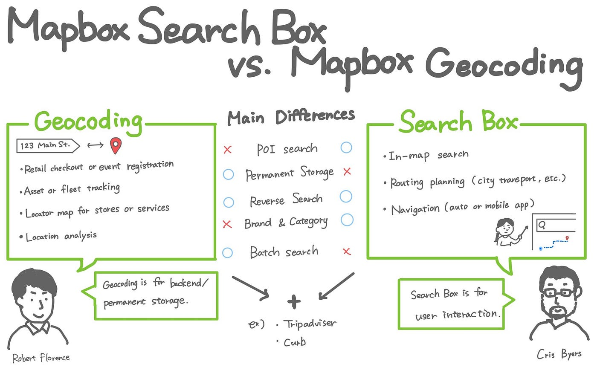
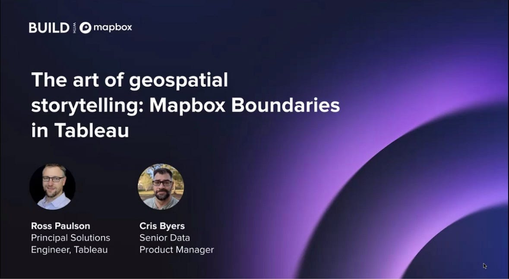
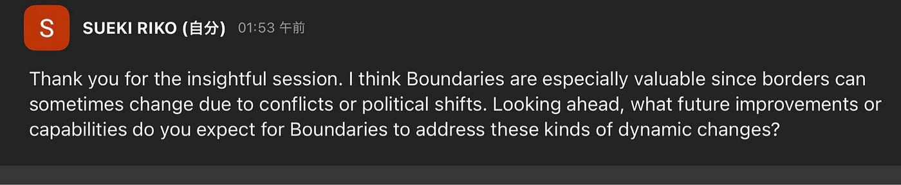
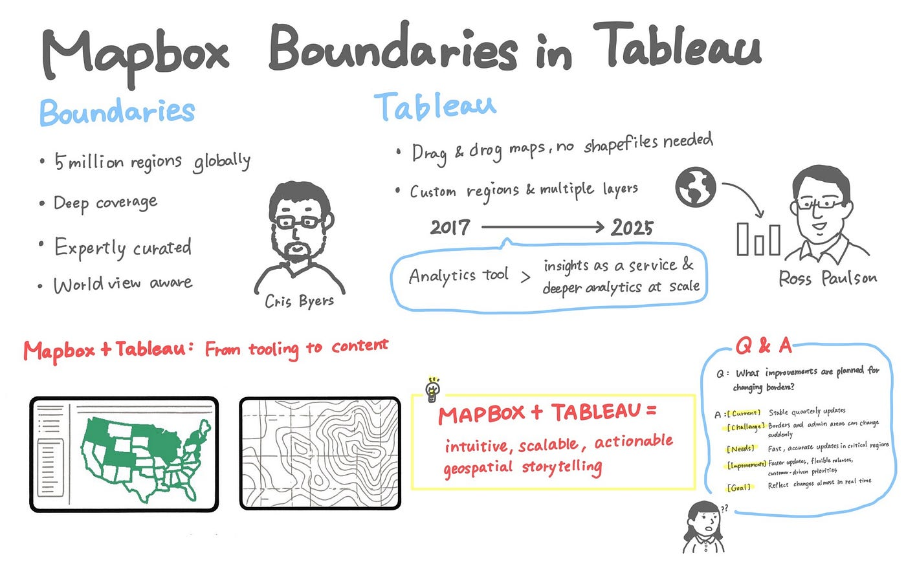

## BUILD with Mapbox で技術の進化を“地図”で感じた週

こんにちは。4年の末木です。

学生最後の夏休みが終わりに近づいていますが、遊ぶだけではなく、しっかりゼミ活動の一環である国際会議に参加してきました！

ということで、今回は9/8〜9/12に開催された[BUILD with Mapbox 2025](https://www.mapbox.com/build) に参加した様子を報告させていただきます。

### BUILD with Mapbox 2025とは

- 開催日時: 2025年9月8日〜9月12日

- 目的:

> 公式サイトより引用

> “BUILD with Mapbox is a week-long annual virtual conference exploring the latest in maps, search, and navigation. Hone your Mapbox skills, discover new features, and see why Mapbox is the location platform of choice for developers and innovators.”（出典： [BUILD with Mapbox 2025](https://www.mapbox.com/build)）

> 日本語_訳:_

> 「BUILD with Mapbox」は、最新の地図・検索・ナビゲーション技術を探求する、年に一度・1週間にわたるオンラインカンファレンスです。Mapboxのスキルを磨き、新機能を発見し、なぜMapboxが開発者やイノベーターに選ばれる位置情報プラットフォームであるのかを知ることができます。

- 形式: バーチャル・オンラインでの開発者向けカンファレンス

- 主催: Mapbox

- イベントスケジュール: 以下のリンクからご覧ください。

[Build with Mapbox 2025 | Event Agenda
Explore the agenda for BUILD with Mapbox and learn more about sessions and speakers.www.mapbox.com](https://www.mapbox.com/build/agenda)

### イベントに参加して

毎日いくつかの公演がありましたがその中で興味深かった3つを紹介します。

#### 1. Make a map in minutes: how Mapbox is streaming map development

**スピーカー: **Mathew Antony / Rebecca Herron

**セッション概要:**

テーマは 「数分で地図を作れるようにする仕組み」で、Mapboxがどのように開発者体験を改善し、地図作成を効率化しているかが紹介されました。

**主な内容:**

- Data Workbench: データを取り込み、プレビューしながら即座にタイル化できる。従来は公開しないと確認できなかった流れを大幅に短縮。

- スタイルエディタ: 色やラベル、POI密度、ランドマークアイコンをGUIで調整可能。カスタムアイコン編集やインタラクション設定も行え、生成されたコードをそのままアプリに組み込める。

- 学習環境: 新チュートリアルやAPI Playgroundで、初心者でもすぐ試せる環境を整備。

**感想:**

従来は時間がかかった 「データ準備→タイル化→公開→確認」 という流れが、Workbenchによって一気に短縮されているのが大きな進化だと感じました。さらに、GUIで設定したことをそのままコード化できる仕組みは、開発者にとって大きな効率化につながると思いました。また、初心者の私にとっては内容についていくので精一杯ではありましたが、新しいチュートリアルなどで、初心者でも手をつけやすいとのことだったので、試してみたいと思いました。

#### 2. Mapbox Search Box vs. Geocoding

**スピーカー: **Robert Florance / Cris Byers

**セッション概要:**

このセッションでは、Mapboxが提供する「Geocoding」 と 「Search Box」 の違いや活用方法について紹介されました。どちらも位置情報を扱う機能ですが、目的や使い方に大きな違いがあり、そちらについて紹介されました。

**主な内容:**

- Geocoding: 住所や地名を座標に変換したり、その逆を行ったりする技術。配送やフリート管理、住所入力補助などのバックエンド処理に強みがあります。特に「Permanent Geocoding」で結果を永続保存できる仕組みは、効率化やコスト削減につながるとのことです。

- Search Box: ユーザーが直接使う検索窓向けの機能。住所検索に加え、POI（施設・店舗情報）検索、カテゴリ検索、ルート沿い検索などが可能。多言語対応やオフライン利用もサポートしており、ユーザー体験を重視した設計になっているそうです。

- 活用事例（Q&A内容）:

Q: Do you see best practices where both APls are used together in a single product?（GeocordingとSearch Boxの両方のAPIを 1 つの製品での効果的な併用例はありますか？）

A: TripAdvisorが正確な住所管理（Geocoding）とPOI検索（Search Box）を組み合わせて使っているほか、欧州の配送サービスPicnicやライドシェアのCurbでも両方を活用しているとのことでした。

**感想:**

バックエンド処理にはGeocoding、ユーザー検索にはSearch Boxという使い分けが効果的だとわかり、普段アプリを使うときに「住所の入力がスムーズ」だったり「近くのお店がすぐ出てくる」と便利に感じますが、その裏側にこうした仕組みがあると知ってとても興味深かったです。特に、入力補助で地図が出てきて正確な場所を確認できるのは、ユーザーとしても安心感があります。今まで何気なく使っていた機能の裏に、ここまで工夫があるのかと実感しました。

### 3. The art of geospatial storytelling: Mapbox Boundaries in Tableau

**スピーカー:** Ross Paulson/Cris Byers

**セッション概要:**

Mapbox Boundariesの仕組みやデータ活用の可能性、そしてTableauとの連携によるストーリーテリングの実践方法が紹介されました。

**主な内容:**

- Mapbox Boundaries: 世界中の行政区画や郵便番号レベルまでカバーし、国境紛争や政治的状況を考慮した「Worldview」で柔軟に表示可能。軽量タイルセットにより高速な描画も実現。

- Tableau連携: スターバックス店舗データや世界の漁業データを例に、数億行規模のデータも直感的に可視化。ブランドカラーを取り入れたマップデザインや、独自データとの空間結合も紹介されました。

- 今後について（Q&A内容）:

Q: I think Boundaries are especially valuable since borders can sometimes change due to conflicts or political shifts. Looking ahead, what future improvements or capabilities do you expect for Boundaries to address these kinds of dynamic changes?（国境は紛争や政治的変化で動くことがありますが、今後そうした動的変化に対応するために、Boundariesにはどのような改善や機能拡張が予定されていますか？）

A: 現状は四半期ごとの更新を基本としているが、即時性に課題があり、今後は更新プロセスを改善し、より迅速に境界変化を反映できる仕組みを準備中とのことでした。

**感想:**

自分の質問に対して、境界の即時更新に向けた取り組みが進んでいると知り、データの正確さが社会や政治に直結することを改めて実感しました。これまでストーリーテリング自体はGoogle EarthやRe:Earthを使って、実践してきましたが、それが単なる地図表現にとどまらず「人を動かす伝え方」につながることを再認識しました。そして、今後ストーリーテリングにまとめたりする機会があったら使用してみたいと思いました。

### 全体の振り返り

今年の BUILD with Mapbox 2025 に参加して、技術そのものの理解に加えて「どう活用するか」を意識できたことが大きな学びでした。

一つ目のセッションでは、開発フローが大幅に効率化されている進化を体感しました。

そして二つ目のセッションでは、普段使っている検索や入力補助の裏側にある仕組みを知り、ユーザー体験を支える技術の重要性を実感しました。

さらに三つ目のセッションでは、データの正確さや動的な更新が社会的な影響に直結することを再認識し、ストーリーテリングの可能性を広く考えさせられました。

時差の関係で深夜の参加は大変でしたが、その分リアルなセッションから直接学べたことはとても貴重でした。

国際会議に参加するというミッションで英語での会議に少しハードルを感じてしまっている自分がいましたが、だからこそ久しぶりに聞いた専門的な英語を理解するのに苦しみました笑　今後はミッションはなくなりますが、英語に慣れるためにも、世界の情報に追いつくためにも積極的に気軽に聞いてみたいなと思いました。
