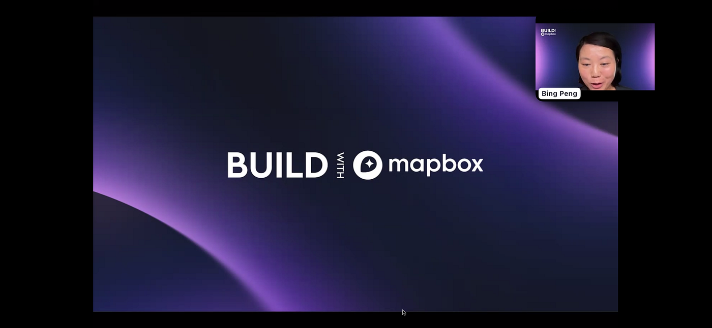
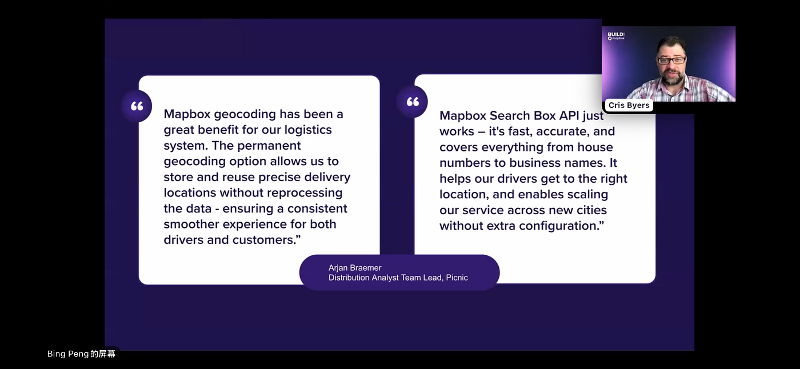
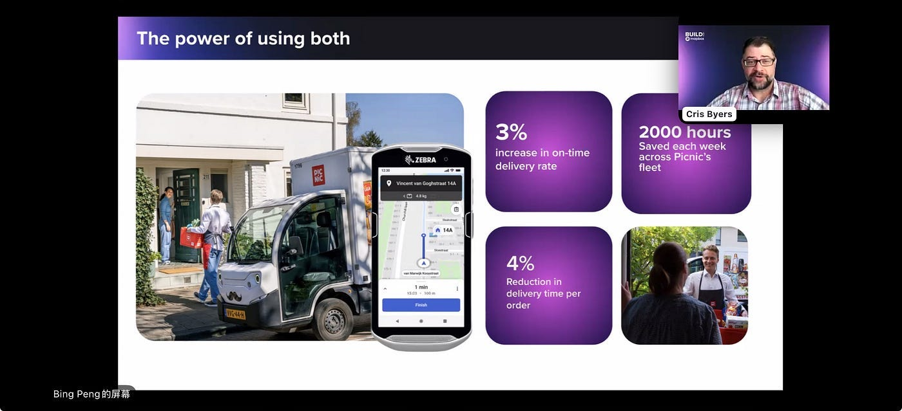
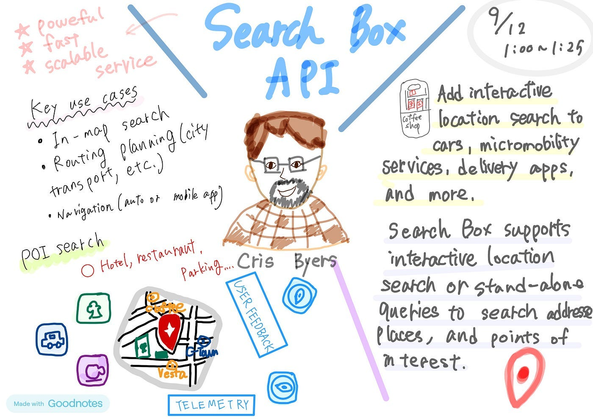
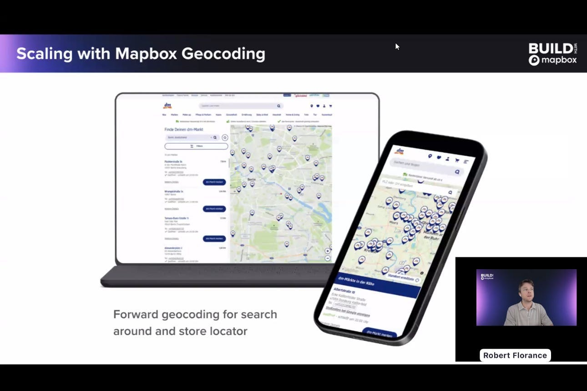
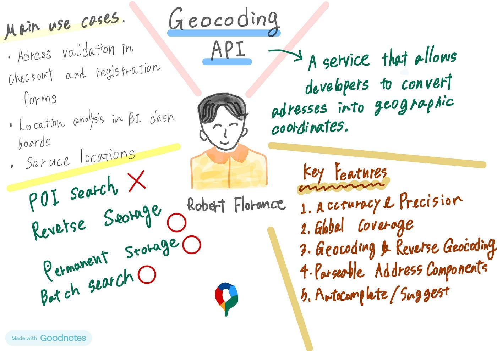
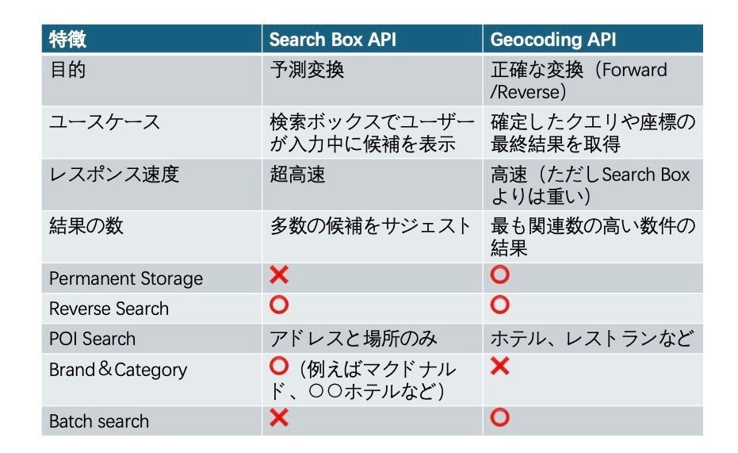
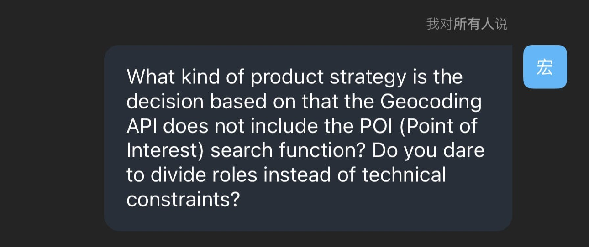
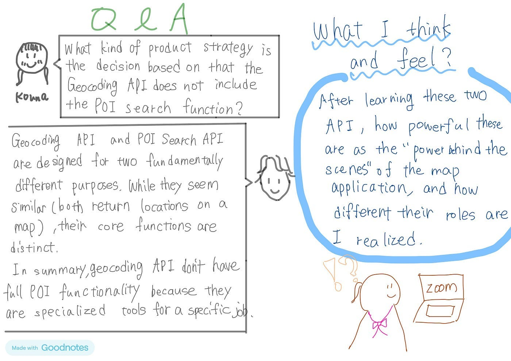

### Build with Mapbox 2025に初参加しました！

こんにちは、四年の福田です。

[Build with Mapbox 202](https://www.mapbox.com/build)5

Build with Mapbox 2025では、最新の地図、ナビゲーションを探求するy1週間にわたる年次仮想カンファレンスである。ここでは、Mapboxに関する新しい機能を発見し、スキルを磨き、Mapboxが開発者やイノベーターに選ばれる位置情報プラットフォームである理由を確認する。また、Mapboxコミュニティ内のクリエイターや業界のリーダーに会うことができる。そして地理空間テクノロジーの未来を形作る最新のトレンドを追跡する。

・日時：9月12日日本時間1：00〜 1：25（9月8日〜12日に渡り開催された）

・[スケジュール](https://www.mapbox.com/build/agenda)

・開催場所：オンラインZOOM

### 参加した講演の様子

登壇者の1人が説明をしています

簡単に自己紹介しながら講演が始まりました。

私が参加したセッションでは、[ Mapbox Search Box API](https://www.mapbox.jp/blog/unlock-faster-smarter-search-with-mapbox-search-box-api) と[ Geocoding API](https://www.mapbox.jp/blog/mapbox-geocoding-101-location-intelligence-essentials)の選択において、それぞれの特徴を紹介され、事例を使って説明が行われました。

### Mapbox Search Box API

内容を簡単に日本語訳すると：

> _Cris Byers：_

> _永久ジオコーティング機能では、正確な配送住所の保存と再利用をサポートし、重複データ処理を避けます。またドライバーと顧客に持続的安定したスムーズな体験を提供します。_

> _さらにMapbox Search Box APIの優れた性能として、プラグアンドプレイ（箱から出してすぐに使える）、高速応答と高精度を備えているだけでなく、カバー範囲が広いです（番地から企業名まで）。例えば、ドライバーの正確な位置を決める手助けや業務を新しい都市に拡張することをサポートします（追加配置不要）。_

全体を通じて：

技術特性とユーザー体験の結合を通じて、Mapbox Search Box API がどのように物流の効率を高め、運営コストを削減し、企業の規模化拡大を支えるか説明しています。

### グラレコ

### Geocoding API

Mapbox Geocoding APIの説明

Mapbox Geocoding APIについてたくさん説明を聞き、私が重要だと考えた内容を簡単にまとめました。他にも特徴やユースケースについてグラレコでまとめます。

> _Robert Florane:_

> _Mapbox Geocoding APIは、住所や地名といったテキストを、緯度・経度の座標（Forward Geocoding）に変換したり、その逆に、座標を人間が読める住所に変換するためのwebサービスです。Geocodingは「特定のクエリまたは座標の最終的な、最も正確な結果」を取得することに焦点を当てます。_

> _また、主要な機能は２つあります。一つ目に、Forward Geocoding、住所・地名→座標への変換、二つ目に、Reverse Geocoding、座標→住所・地名への変換です。_

### グラレコ

### Search Box APIとGeocoding APIの違い

### 質問

Geocoding APIにPOI検索機能が含まれていないのは、どのような製品戦略に基づく判断ですか？

### 回答

簡単に言うと、ジオコーディングAPIとPOI検索APIは、２つの根本的に異なる目的のために設計されているからです。それらは似ているように見えますが、コア機能は異なります。POIデータははるかに広く、より騒々しいソースセットから来ています。

ジオコーディングAPIは特定のジョブに特化したツールであるため、完全なPOI機能を備えていません。ビジネスやサービスの種類の検索に関連するものについては、常にマッピングプロバイダーから専用の場所、検索、またはPOI APIを探す必要があります。

### 会議に参加してみての感想

初めての参加で、最初は何の話をしているかついていけない感じがしました。しかし、スライドを見ながら、字幕をつけながら話をしっかり頭に入れ、説明を楽しむことができました（時間帯の関係で少し眠かったけど。。）。

そして私が参加したセッションでは主にGeocoding APIとMapbox Search Box APIについての紹介と説明で、これらが地図アプリとしての魅力を感じ、そしてそれぞれの役割を十分に実感することができました。この二つのAPIを覚えたという以上に、「検索」と言うユーザー体験を構築するための設計思想を学んだような気がします。

