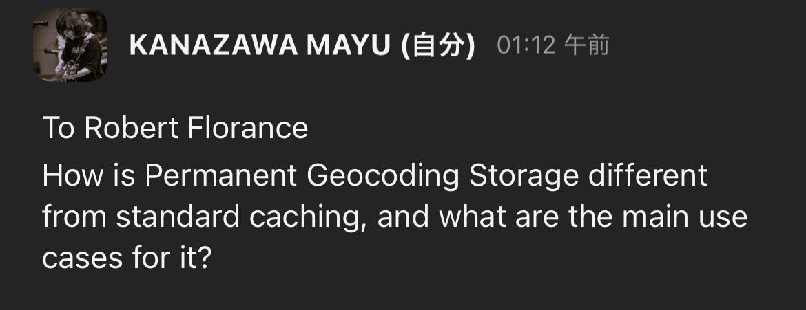
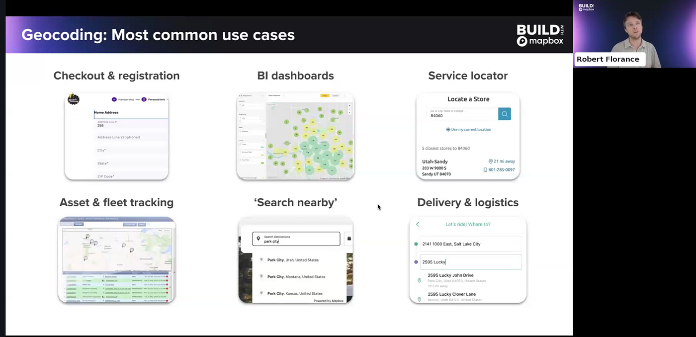
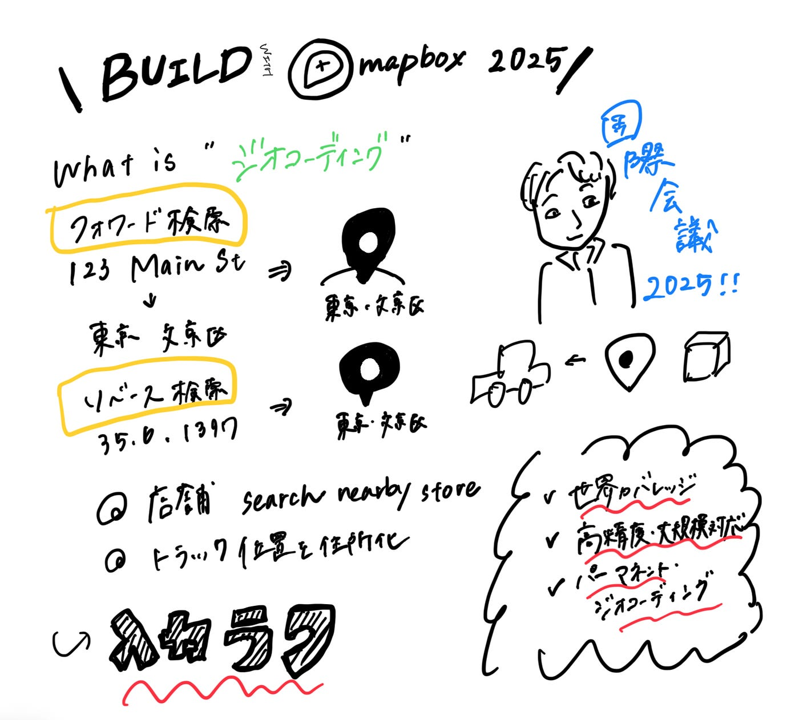
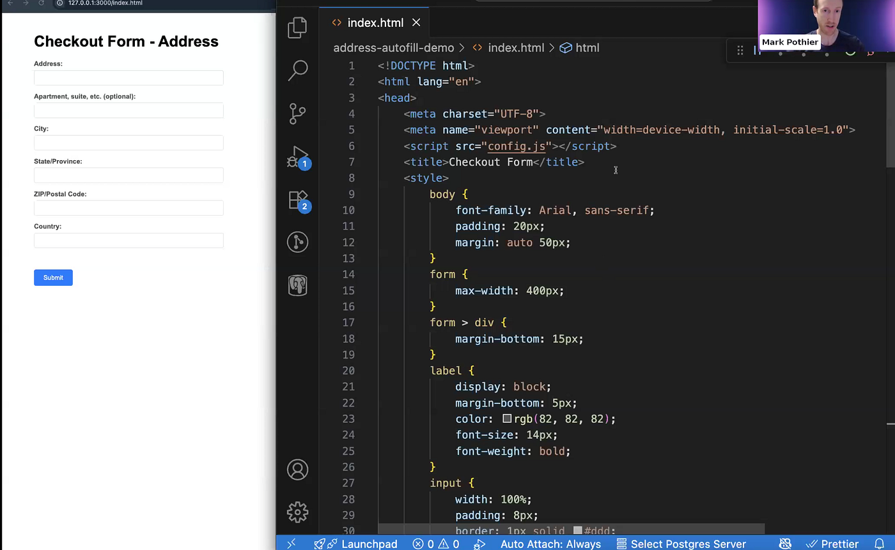
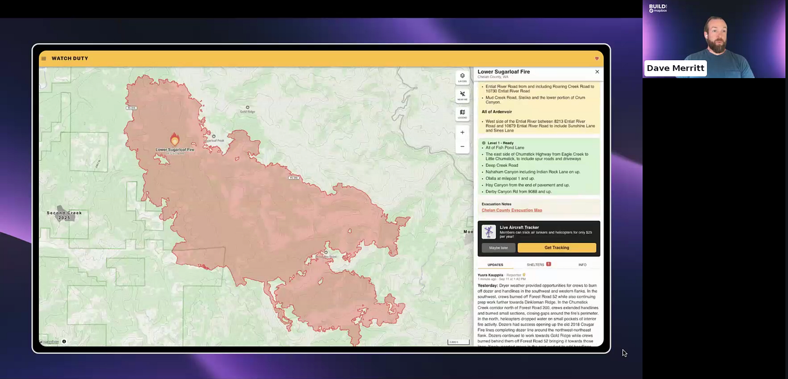

### BUILD with Mapbox に今年も参加した 2025

こんにちは。ユース４年の金澤です。

今年も国際会議に参加しました。国際会議には、大学２年生の頃から参加して３度目です。当時、タイに留学していたのを思い出します（笑）

さて、BUILD with Mapboxが9/8–12に開催されました。

概要は以下のURLとなります。

[Build with Mapbox 2025 | Event Agenda
Explore the agenda for BUILD with Mapbox and learn more about sessions and speakers.www.mapbox.com](https://www.mapbox.com/build/agenda)

### **１講演目 Robert Floranceさん (Thursday, Sep 11)**

Mapboxのプロダクトマネージャーが、検索・ジオコーディング機能の基本と活用事例を紹介されました。

> ジオコーディングとは？

- 住所や地名を緯度経度に変換する「フォワード検索」と、緯度経度から住所を特定する「リバース検索」がある。

- 例：ユーザー登録や配送先入力の際に住所を自動補完（Address Autofill SDK）したり、トラックのIoTデータを住所に変換してフリート管理に使える。

> 主要なユースケース

- ECサイトのチェックアウトや会員登録での住所自動補完

- BIツール連携による大量データの地理分析

- 店舗検索やサービスロケーター

- フリート管理・事故対応（位置情報を住所に変換）

- 周辺検索（POI検索）

- 配送・ロジスティクスの正確な配達先特定

> 特徴

- 世界的なカバレッジ（欧米・中東・南米・豪州など）。東南アジアや中国では住所対応は未整備だがPOI検索は可能。

- 高精度・高スケールに対応し、利用量が多いほど単価が下がる料金体系。

- 「パーマネント・ジオコーディング」により結果を無期限保存でき、再利用が可能。

- 導入が容易で、ECやフィットネス大手（Planet Fitness）のように会員登録・課金に幅広く利用されている。

> まとめ

Mapboxの検索・ジオコーディングは「入力の簡略化」「配送精度の向上」「データ分析」「店舗検索」など、多様な場面で活用できる強力な基盤となっている。

> 感想

ジオコーディングは単なる住所検索にとどまらず、配送効率やユーザー体験を支える基盤技術であると感じました。特に、結果を長期保存できる仕組みは企業にとって大きな利点であり、見えにくい部分で日常の便利さを支えている点が印象的でした。

> 質問とRobertさんからの回答

#### ⇨Historically, so that you can do analysis. For ezample, like paying back gas taxes, and you use temporary geocoding, like, anytime you even attempt to do analysis, you’re gonna trigger. Maybe billions of additional geocoding calls to your geocording provider, whereas. Your store them in your database, it’s done. And similar to delevery custome where you’ve got a big database of customer address. At least every 30 days, if you’re with a competitor, you’re stuck re-requesting and spending more money on the same information over and over again, whereas permanent geocording, again you can just store it permanentaly.

つまり、

**違いについて**

・標準キャッシュは一定期間で再リクエストが必要⇨コストが発生

・永続ストレージは一度保存すれば繰り返し利用できる⇨追加費用なし

**主なユースケースについて**

- ガソリン税の払い戻しや、配送顧客データベースなど、大規模データを使った分析や繰り返し利用のある場面。

だそうです。

### ２講演目 Emily Ryanさん (Saturday, Sep13 )

#### Streamline address form input with Mapbox Address Autofill

iOS向けのAddress Autofill SDKの実装デモが紹介されました。

> 実装の流れ

入力フォームに住所や郵便番号を入力すると、候補がリアルタイムで表示され、選択すると残りの項目が自動補完される仕組み。入力途中での検索制御や、選択後の入力制限など、ユーザー体験を意識した工夫が加えられている。

> デモ内容

実際にニューヨークのカフェやベーカリー、マサチューセッツの店舗を例に、入力途中から候補が出現し、自動で市区町村や郵便番号まで補完される様子が示された。

> Q&Aの要点

- Geocoding APIとの違い：データは共通だが、Address Autofillは選択後にデータを永続保存でき、コストも予測しやすい。

- 導入難易度：他社サービスからの切り替えも数日〜半スプリント程度で実装可能。

- 独自データの追加：Address Autofill単体では不可だが、Search Box APIやカスタム検索を組み合わせることで独自POIを補完可能。

> 感想

今回のデモを見て感じたのは、開発者体験とユーザー体験の両方を大きく改善できる仕組みだという点です。入力補助があることでユーザーはストレスなく正しい住所を選択でき、企業側は正確なデータを効率的に収集できる。さらに導入ハードルが低い点も魅力的で、既存システムからの切り替えもしやすいと感じました。

特に「選択時のみ課金」「データを永続保存可能」というモデルは、長期的に見てコストと信頼性のバランスが取れており、非常に実用的だと思います。

### ３講演目 Dave Merrittさん (Saturday, Sep13)

#### When maps are mission-critical: How Watch Duty powers wildfire safety with Mapbox

WatchDutyは、山火事の発生を人々に知らせ、地図を通じて状況を可視化するアプリ。

> **特徴**

- 火災の場所・風向き・住居との距離を直感的に把握できる。

- 脅威があると判断すれば、即座にプッシュ通知。避難指示が出る前に準備できる時間を与える。

- 消防活動や火災拡大の情報、航空機の動き、公式の火災境界線も表示。

- 特に「避難ゾーンの一元化表示」を重視し、バラバラな情報を整理して統一的に地図に反映。

> **利用状況**

- 直近12か月で 1,800万人以上のユーザー、700万件のインストール。

- ユーザーからは「地図のおかげで理解しやすい」と高評価。

- 開発上の工夫

- 多様な情報源を統合する一方、すべてを出すと混乱するため「取捨選択と整理」を徹底。

- 地図やUIには「必要な情報を見やすく配置」する工夫を行い、緊急時でも直感的に操作できる設計にしている。

> 感想

WatchDutyの強みは、「地図」という直感的な媒体で命に関わる情報を整理して届ける点だと感じました。従来は「○○通りの北側が避難区域」といったテキスト情報を自分で地図に投影する必要がありましたが、このアプリなら誰でもすぐ理解でき、また「すべての情報を出すのではなく、あえて整理・削る」という姿勢も印象的です。

全体を通じて、とてもレベルが高かったですが、自分で調べた時間なども通じて一夏の成長ができた気持ちです！
