### 夏休みの思い出！デザイン部週報【10/7】

こんにちは、四年の福田です！

今週のデザイン部週報としては、夏休みの思い出を紹介しつつ、三年生には今の位置情報ゲームの進展をまとめます。

**こうな：**

夏休みは奄美大島に旅行で黒うさぎを見に行ったり、TWICEのライブに行ったりして楽しみました。

ナイトツアーで「アマミノクロウサギ」をたくさん身近で見ることができました。

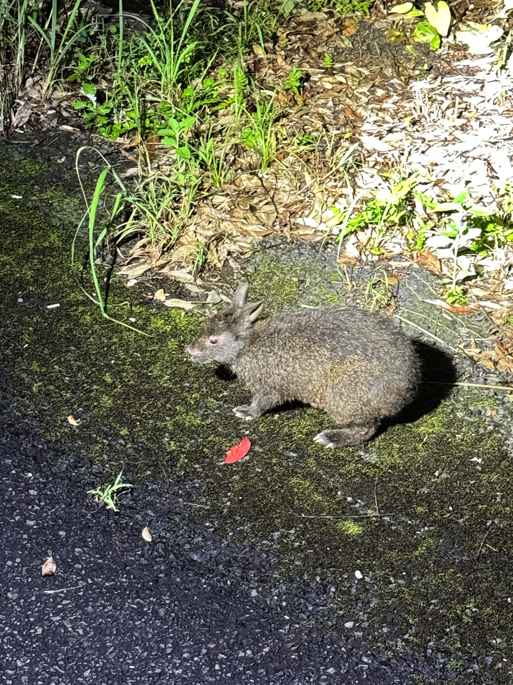

このウサギは絶滅危惧種で、奄美大島と徳之島だけに生息する「生きた化石」とも呼ばれる原始的な種です。体長は約50cmで、全体的に黒っぽく、耳・足・尾が短いのが特徴で、夜に森林の中を歩いて移動し、落ち葉や木の芽などを食べます。この地域で生存できる理由に、ウサギを食料にする大きな動物がいなく、天敵が少ないなど生態系に関わることなどもガイドさんによって紹介され、知識を覚えながら楽しむことができました。

ちなみに、哺乳類を一番この島で食べるのは猛毒を持つハブ（蛇）だそうです。

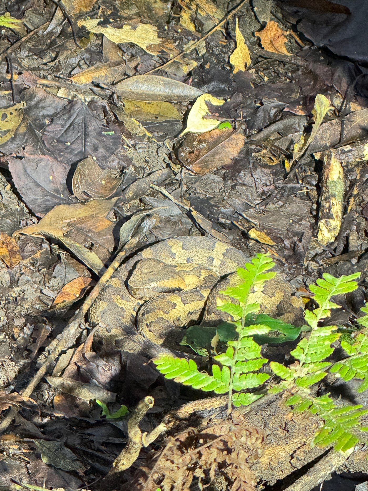

旅行ではその地域の景色だけでなく、生態系や歴史、文化について知る楽しさを感じることができました。

**グラレコ**

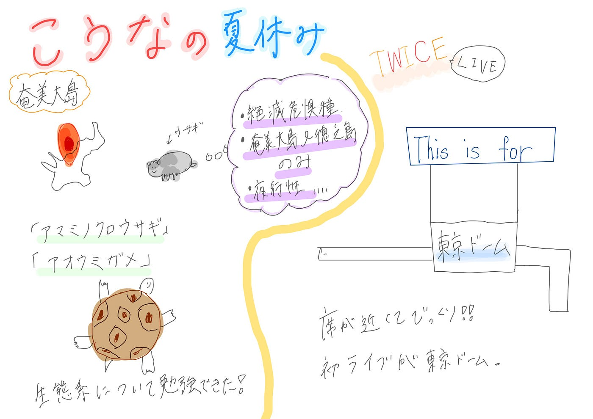

**ちはな：**

こんにちは、臼井です。
私は夏休みの間色々な所に行って来ました。
静岡にある祖父宅に行った際は、沼津港で美味しい海鮮を食べたり、深海水族館に行ったり、いちごのかき氷を食べたりしました。
ハイライトは雨が降っていたので室内で流しそうめんをした事です。

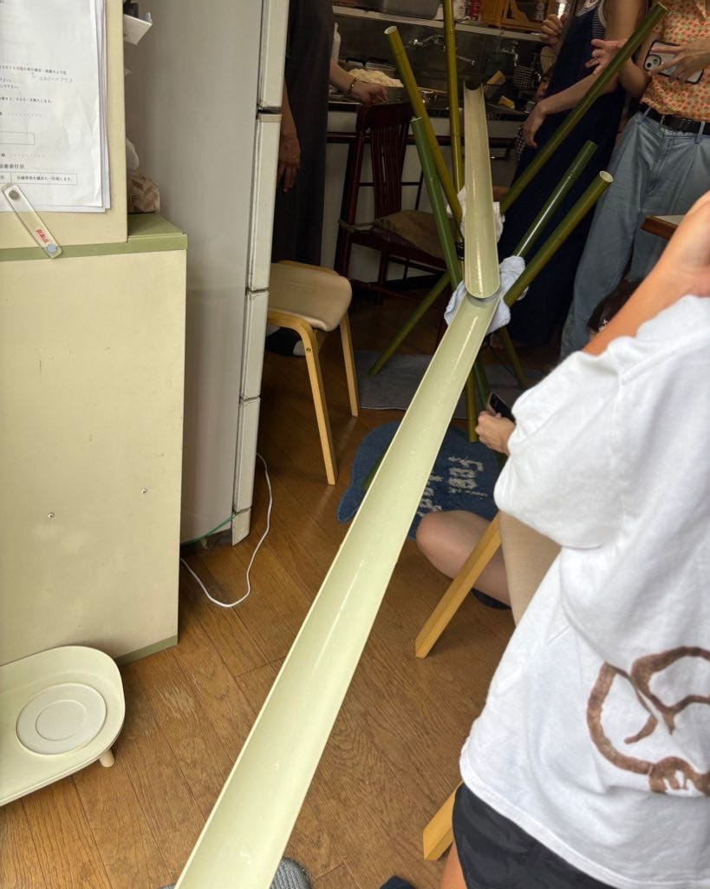

他は友達とボードゲームカフェに初めて行ったり、鬼滅の映画を見に行ったり、デザートビュッフェに行ったりしました。
グラレコにはどんなゲームをしたか、どんなケーキを食べたか分かるように細かく描いたのがこだわりです。

夏休みも終わりの時期には万博に2日間行ってきました！
とにかく暑いのと人が多いので大変でしたが、特にルクセンブルク館で食べたソーセージとパソナ館で見た人工心臓には感動しました。

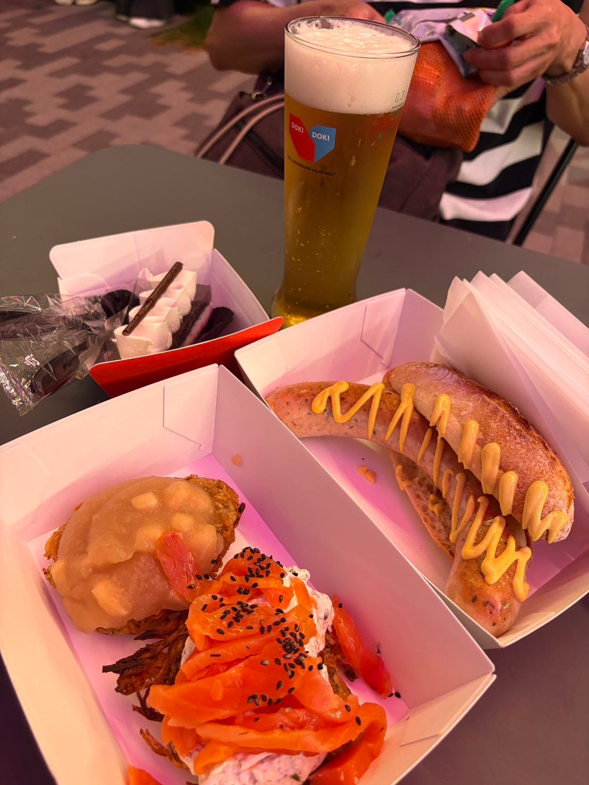

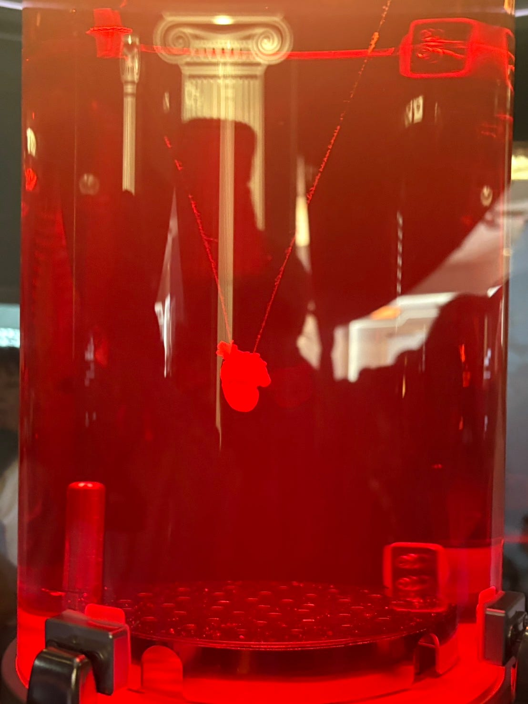

また、Ingressは目標レベルに達したので、夏休みの間はPikmin Bloom中心に取り組みました。
レベルも順調に上がってきていて嬉しいです！

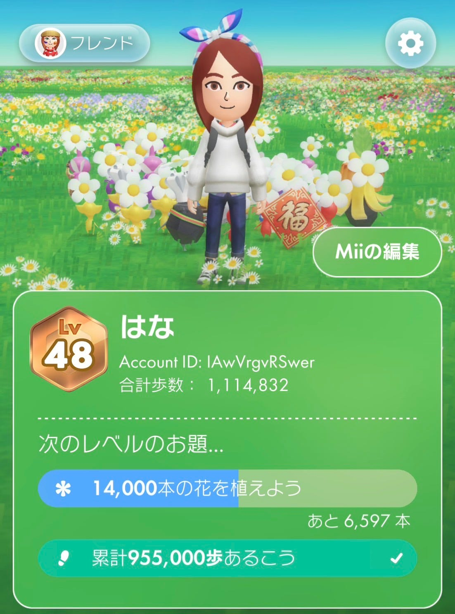

グラレコ

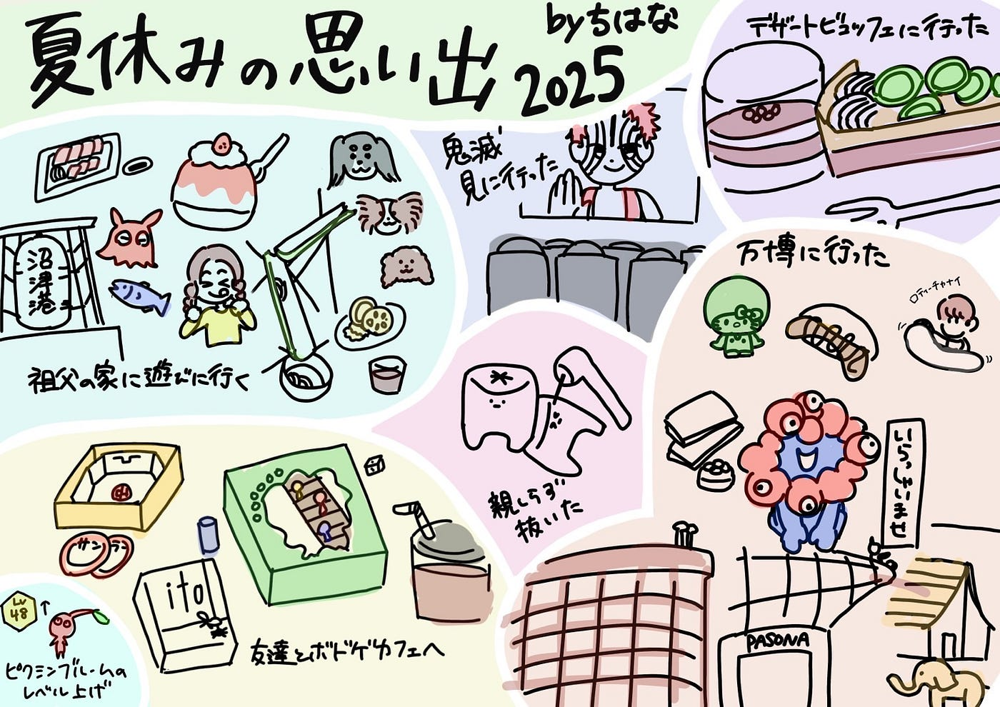

**ゆうか：**

最後に稲田からの報告です。
今年の夏休みは楽しいことも大変なことも沢山ありました。

まず、一番印象に残っているのは、江ノ島灯籠2025という限定ライトアップイベントに参加したことです。シーキャンドルに登って夜景を見たり、様々な色の幻想的な光に包まれた江ノ島の自然を楽しむことができました。神社も回り、お祈りもしました！

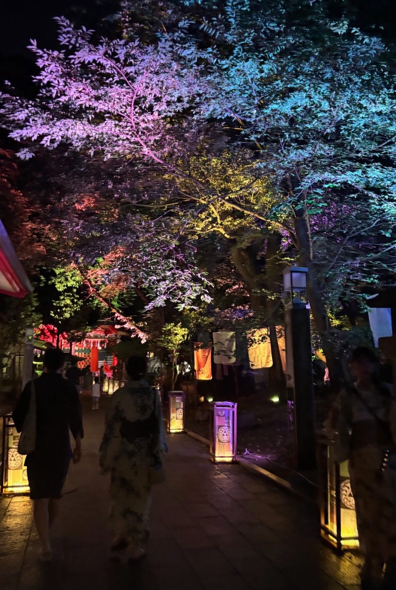

また、親戚と集まって家の中でお寿司屋さんパーティーをしたことも思い出です。机で大将役とお客さん役になって、いとこにお寿司を作ってあげたり、お店にはないから揚げ寿司を作ったり、とても楽しかったです。

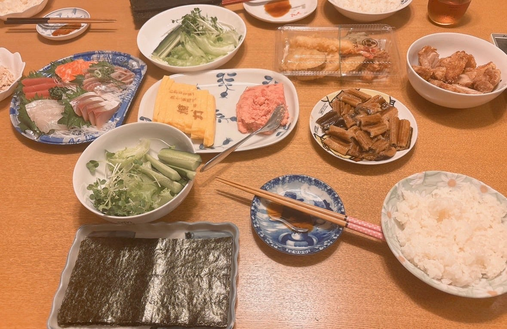

さらに、横浜ナイトフラワーズというイベントにも行きました。海と花火と赤レンガ倉庫の辺りを同時に見ることができてとても眺めが良かったです！！

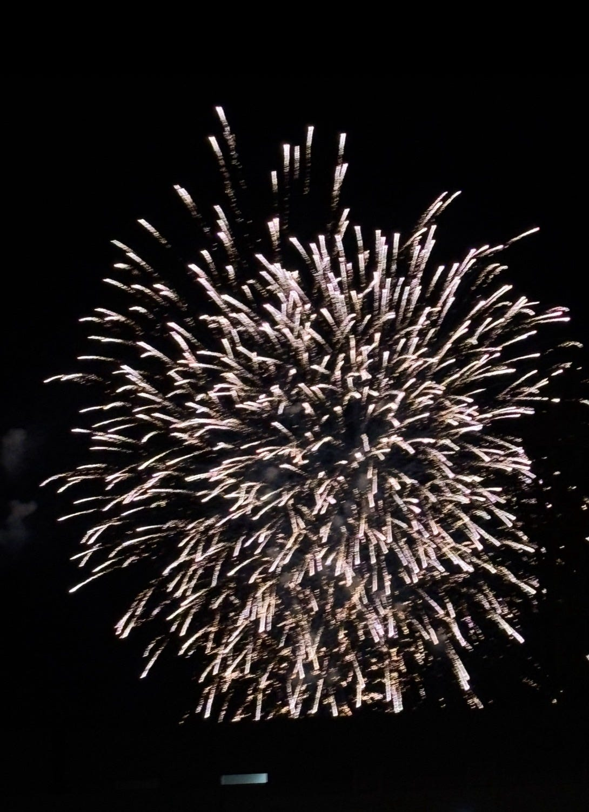

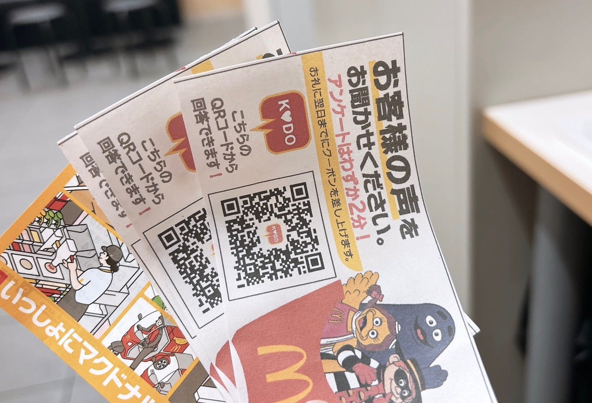

また、この夏頑張ったこととしては、マクドナルドのアルバイトがありました。普段は学校があるので夕方から夜にかけてだけ働いていましたが、夏休みは昼からもシフトに入りました！
連勤で店内のお客様にアンケート配布をして、満足度向上に務めました！忙しかったけれど、遊びも充実し、いい夏休みでした🌻

また、Ingress、ポケモンGOは両者ともにレベルをクリアすることができました。ポケモンGOに関しては他の古橋研究室メンバーに高いレベルの方がいるので、もっと上げられるように頑張りたいです！

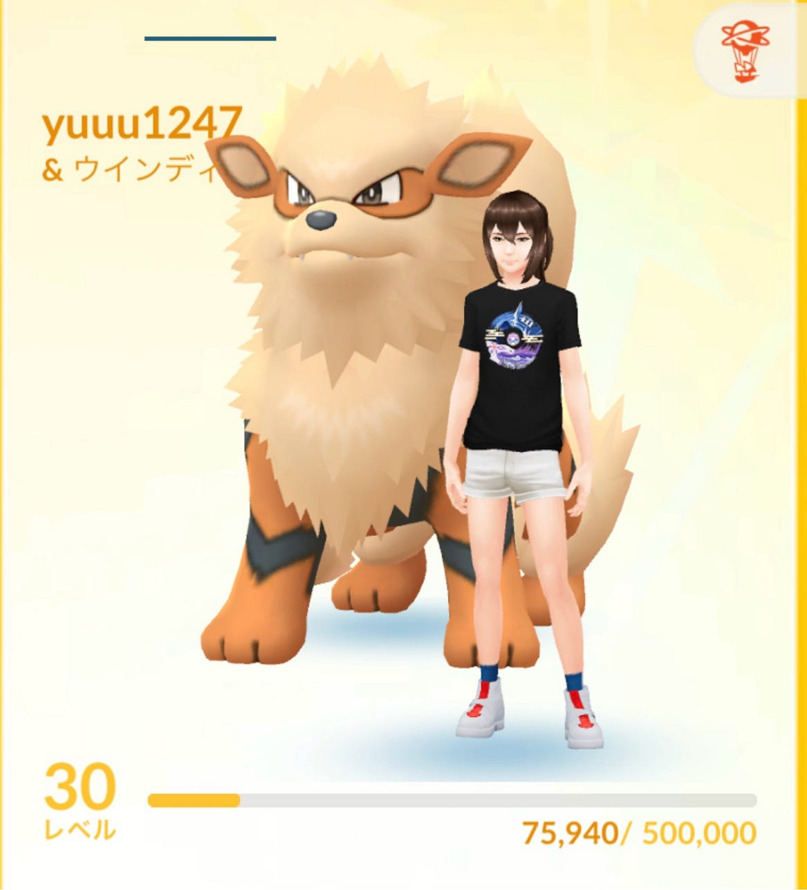

グラレコ

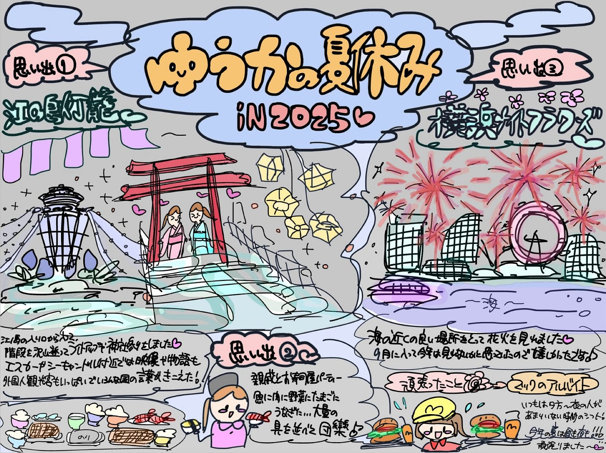
