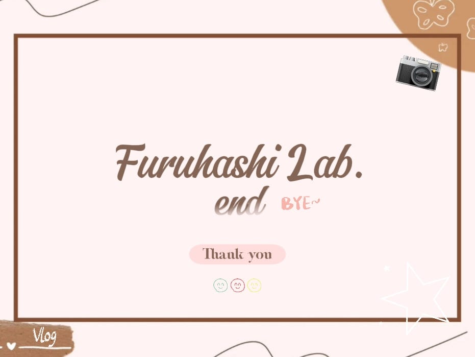
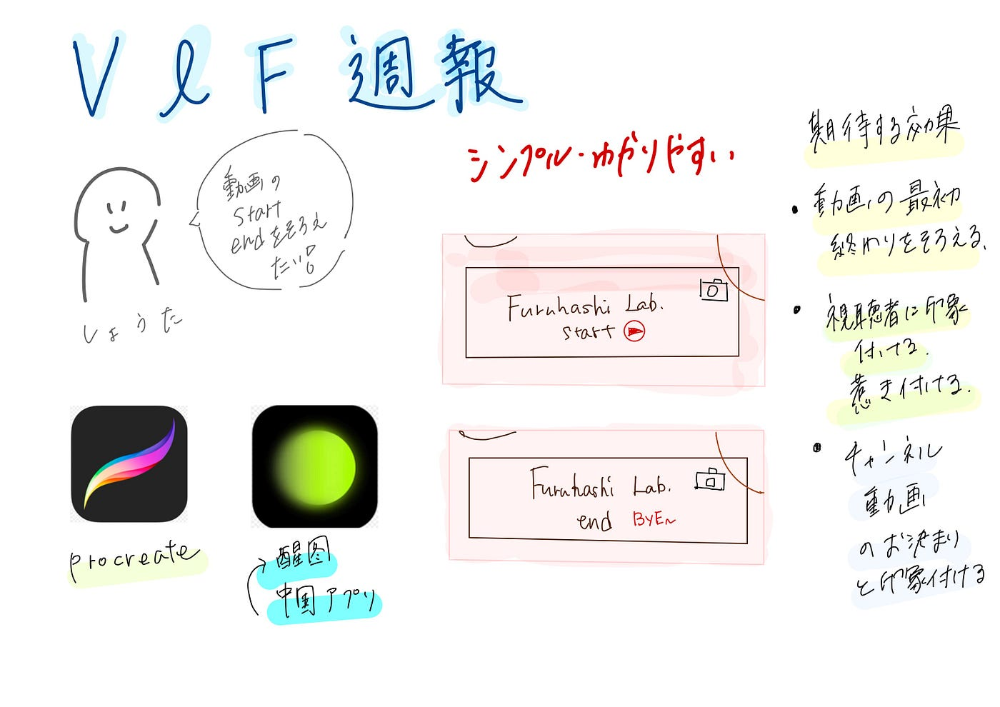

### V&F週報【10／7】

こんにちは！四年の福田です

今週の週報はしょうた（三年）のリクエストで私が作ったV&F動画の初め終わりに使う帯？を紹介します。

**作成したもの↓**

**作成に使用したアプリは**

・[Procreat](https://procreate.com/jp)e

・そしてカメラと笑顔のスタンプは中国アプリの「[醒图](https://note.com/china_magazine/n/nacd886e42ec2)」を使いました。

デザインは自分で考え、Procreateで作りました。

初めと終わりではstartとendで区別し、全体的にはシンプルに作りました。

**使用例（17秒のところにあります）**

**効果**

これで動画の初めと終わりを統一し、「カチンコ」や「コールバック」と呼ばれる手法で、視聴者に印象付ける、惹きつける効果を期待できます。（起承転結の効果？）繰り返し使うことで、チャンネル＆動画のお決まりとして視聴者の記憶に刻みます。

**グラレコ**

