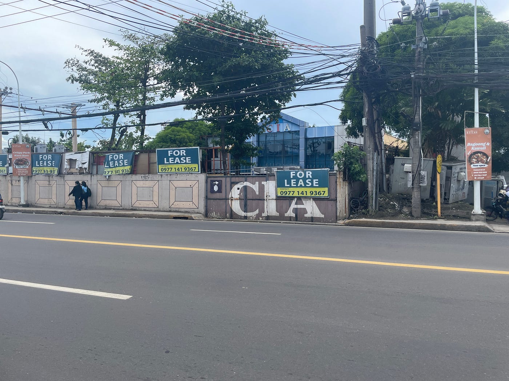
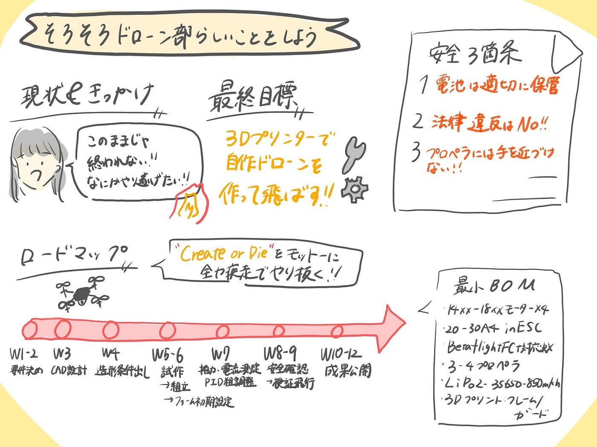

### そろそろドローン部らしいことしようよ

古橋研究室ドローン部3年山﨑です

#### ドローン部キャプテン林ゆかりの一言

「うちらってさ、前期ほとんど何もしてなくね」

確かに、、、、

私たち**”ドローン部”**、前期何をしたか考えてみたのですが、本当に思いつきません。Geo展の手伝いはゼミ全体でしたことで、ドローン部が主体となってしたことって本当に無さそうです。

このままでいいのでしょうか

私もイベントなどで他大学の方など古橋研究室について何も知らない人に、どんなことをしているのかと聞かれ

「研究室内のドローン部に所属して、日々基本的な操作とか学んでいる」と８割は嘘の回答をしている心当たりしかない

ゆかりさんは既に4年生、残された時間は僅かしかない

ドローン部として何か残したいと言うことで

超安直なのですが、、、、、、

#### ドローンを自作してみたい！！！

はい、私たちドローン部は後期にドローンを作成します😊

どのように？

私たちの研究室にはあるじゃないですか！！

３Dプリンターさんが

実際にnoteでも

> [200機のドローンを3Dプリンターで作ってわかったこと-vol.3- 3Dプリント生産ノウハウ](https://note.com/experiment_lab/n/n2698557a0804?sub_rt=share_pw)

とあるように作ることはできそう

挑戦の気持ちはドローン部が他のどこの部よりも持っていると日々の会話を通して感じます

**特にキャプテンのゆかりさんは何でも挑戦しないと気が済まない**

最後の年ということもあり気合がありまくっている**ゆかりさん**を後輩が支えなくてどうするんだ、、、

ぜひ成し遂げたいと思います

ドローン部は「Create or Die」という言葉をモットーに後期全力疾走していくつもりであります

#### ”ふるはしくんGPT5 Thinking”に聞いてみた

作ると言っても何から決めたらいいの？という疑問が残ります

そこで古橋先生の分身に聞いてみました

読み込んでもらった記事は以下の三つです

> [200機のドローンを3Dプリンターで作ってわかったこと-vol.3](https://note.com/experiment_lab/n/n2698557a0804)

> [3Dプリントを活用したドローンの製作方法](https://formlabs.com/jp/white-papers/how-to-build-a-3d-printed-drone/?srsltid=AfmBOorG1DosB86HdQkdsjEwcJh8A3rscHiJb8-q8KomeWdt6stIa9ub)

> [3Ｄプリンターでドローンを作ってみた その1](https://intamsys.jp/200709-2/)

実際にこれから何をしたらいいかを考えてくれました

> ロードマップ（10–12週）

**W1–2** 要件決め（屋内マイクロ推奨）、[KPI](https://mtame.jp/marketing_foundation/KPI_KGI/#:~:text=KPI%EF%BC%88Key%20Performance%20Indicator%EF%BC%9A%E3%80%8C%E9%87%8D%E8%A6%81%E7%9B%AE%E6%A8%99%E9%81%94%E6%88%90%E6%8C%87%E6%A8%99%E3%80%8D%EF%BC%89%E3%81%AF%E3%80%81%E4%BC%81%E6%A5%AD%E3%81%AB%E3%81%8A%E3%81%91%E3%82%8B%E7%9B%AE%E6%A8%99%E3%81%AE%E9%81%94%E6%88%90%E5%BA%A6%E3%82%92%E8%A9%95%E4%BE%A1%E3%81%99%E3%82%8B%E3%81%9F%E3%82%81%E3%81%AE%E4%B8%BB%E8%A6%81%E6%A5%AD%E7%B8%BE%E8%A9%95%E4%BE%A1%E6%8C%87%E6%A8%99%E3%81%A7%E3%81%82%E3%82%8A%E3%80%81KGI%E3%82%92%E9%81%94%E6%88%90%E3%81%99%E3%82%8B%E3%81%9F%E3%82%81%E3%81%AE%E4%B8%AD%E9%96%93%E6%8C%87%E6%A8%99%E3%81%A7%E3%81%99%E3%80%82%20KPI%E3%81%AFKGI%E3%81%AB%E8%87%B3%E3%82%8B%E3%81%BE%E3%81%A7%E3%81%AE%E5%90%84%E6%AE%B5%E9%9A%8E%E3%81%A7%E3%81%AE%E7%9B%AE%E6%A8%99%E3%81%AA%E3%81%AE%E3%81%A7%E3%80%81KGI%E3%81%B8%E3%81%A8%E3%81%A4%E3%81%AA%E3%81%8C%E3%82%8B%E6%8C%87%E6%A8%99%E3%82%92%E5%85%B7%E4%BD%93%E7%9A%84%E3%81%AA%E6%95%B0%E5%80%A4%E3%81%A7%E8%A8%AD%E5%AE%9A%E3%81%99%E3%82%8B%E5%BF%85%E8%A6%81%E3%81%8C%E3%81%82%E3%82%8A%E3%81%BE%E3%81%99%E3%80%82)設定、場所確保
 **W3** CAD設計（ホイールベース/ガード/配線逃し）
 **W4** 造形条件出し（乾燥→テスト片→最適化）
 **W5–6** 試作→組立→ファーム初期設定
 **W7** 推力・電流測定、PID粗調整
 **W8–9** 安全確認→検証飛行（屋内から）
 **W10–12** 成果公開（設計/条件/ログをオープン）

> 素材＆造形Tips

まず**PETG**、強度部は**PA/PA-CF**。ガード/ダンパーは**TPU**。
 乾燥最優先。試作は**ノズル0.6–0.8 / 層0.3–0.4mm**で高速化。

> 最小[BOM](https://www.techs-s.com/media/show/7)（屋内3–4インチ）

14xx–18xxモーター×4 ／ 20–30A 4in1 ESC
 Betaflight対応FC ／ 技適受信機 ／ 3–4"プロペラ
 LiPo 2–3S 650–850mAh
 3Dプリント：フレーム＋ガード＋脚（PETG/PA）

> 法規（日本・要点）

**100g以上**：機体登録必須。特定飛行は**許可/承認**（DIPS2.0）。
 **100g未満**でも空域・安全配慮は必須。

> 安全

ガード常用・テザー初飛行・LiPo管理（保管3.8V/セル）。
 事故時は通電遮断→プロペラ外し→原因記録。

> 公開（Publish or Die）

**IMRAD**でまとめ、**CAD/STL/プロファイル/ログ**をGitHub＋Noteで公開。

詳しく内容を読みたい方は**[こちら**](https://chatgpt.com/share/68e3d566-264c-800b-b87d-8dfd7b8e1579)から

#### 最後に

正直なことを言うと、回答で言われている言葉自体を私は理解できていないので不安ではあるのですが、何事も最初はそんなものでしょう

提示してくれた計画のように実際に上手く作成して飛ばす所までいくかは分からないのですが、挑戦してみてから何かしら見えてくると信じ頑張りたいと思います

早速！！

来週までにどんなドローンがあり、自分達はどのようにしたいかをそれぞれ話し合い動いていきます。

費用などを検討し、現実的なのかどうかと言うことを話し合うことも大切です。

**グラレコ**

