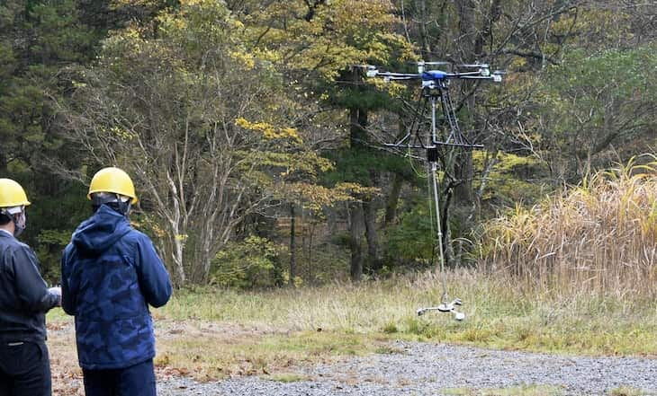
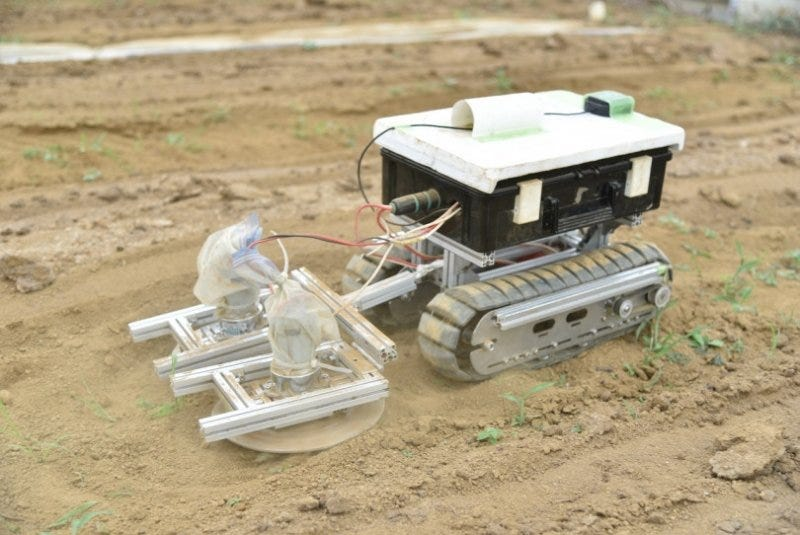
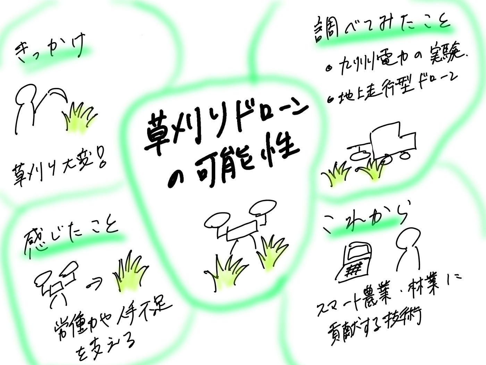

### 草刈りドローンの可能性について

ドローン部②の週報を担当する寺土です。

10/20.21のゼミ合宿での草刈りについて考えていきます。

前回３月？の合宿から約半年ほど経った古橋先生のご自宅は、草が生い茂っており、ゼミ生で草刈りをしました。

作業は一時間ほどで、草刈りは想像以上に体力を使う上、広い範囲を人の手で行うのは非常に時間がかかることを実感しました。この経験を通して、**「草刈りを自動化できる技術はあるのだろうか」**と興味を持ち、調べてみました。

#### 草刈りドローン

その中で、株式会社BlueBee（熊本市）、国立大学法人千葉大学（千葉市）、九州電力株式会社（福岡市）の３社がドローンを活用して草刈り作業の負担軽減を目指す実証実験を行っているという記事（産経ニュース, 2021年11月12日）を見つけました。

実証実験を行う理由として、

> 日本の林業には、慢性的な人手不足という課題があり、特に下刈り作業は、体力的に過酷で且つ危険が伴うため、林業従事者の離職の大きな原因の一つになっています。また、林業従事者の高齢化が著しいことから、下刈り作業の省力化（機械化）は喫緊の課題です。

このような現状から、ドローンの導入は高齢化や作業効率の面で大きな可能性を持っていると感じました。

#### 地上走行型のドローン

ドローンと言うのは**飛ぶ物**だというイメージが強いですが、近年空・海・陸で広く利用されており、今回ご紹介する地上走行型除草ドローンも草刈りに特化したドローンの一つです。

> 小さなクローラーを備えた地上走行型ドローンが、刃が回転するメカを引っ張りながら、畑の畝の間を抜けていく。生産者はただ見守るのみで、GPSとRTKにより自車位置を測定し、指定したルートを自動で走ってくれる。1反の[圃場](https://smartagri-jp.com/tag/%E5%9C%83%E5%A0%B4)を走破する時間は30〜40分ほど。夏の炎天下でも黙々と草取り作業に従事してくれる。

#### 伝統的な草取りとは？

有機農家にとって草取りはかなり負担となるようで、伝統的な草取りをロボットにさせることで負担作業の軽減につながります。

> 草が出るか出ないかのうちに、畑の表面を“草削り”と呼ばれる道具を使って削り取ります

今後は、このような「人の労働を補う技術」がどのように実用化されていくのか、特に地域社会や農林業への応用の広がりについても関心を持って調べていきたいと思います。

参考文献

[九電、ドローンで草刈り 林業の負担軽減へ実験 — 産経ニュース](https://www.sankei.com/article/20211112-23JQY2433FMDBMSVKKN3WWXIMA/)

[九州電力 令和３年度林業イノベーション推進総合対策のうち戦略的技術開発・実証事業に採択 －くじゅう九電の森（大分県由布市）にて下刈りドローンの実証試験を実施します－](https://www.kyuden.co.jp/press/2021/h211105-1.html)

[「伝統的な草取り」を再現した小型除草ドローンが有機農業を変える | 農業とITの未来メディア「SMART AGRI（スマートアグリ）」](https://smartagri-jp.com/smartagri/3471)

