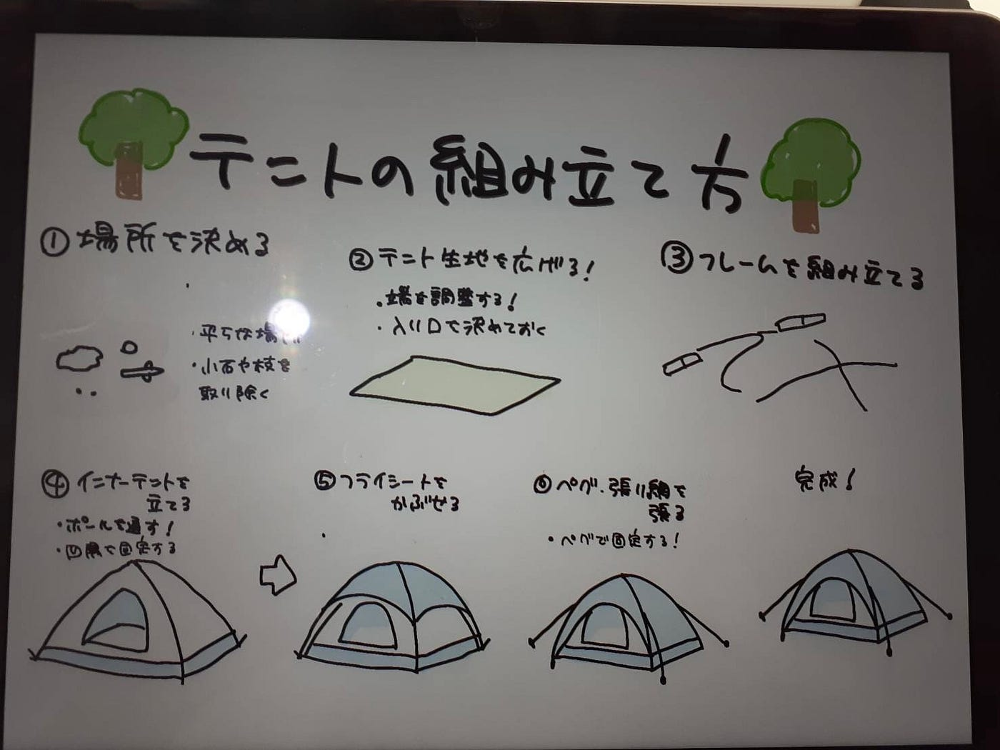

## 【Youth2 10/7週報】ゼミ合宿に参加しました！

こんにちは！3年の小崎です。

9月20日〜21日にかけて、埼玉県横瀬町にある古橋研究室ANNEXで合宿を行いました！

本来であればテントを建てて寝る予定でしたが、なんと川の反対側に渡れないという予想外のハプニングが発生し、予定していたテントの設営ができませんでした。

そのため、2日目に場所を移して、テントの設営練習のみを実施しました！

家族では何度かキャンプに行ったことがありましたが、自分一人でテントを組み立てるのは初めてだったので、いつでも見返せるように組み立て方をまとめようと思います。

#### **テントの組み立て方**

**① 場所を決める**

・平らで、水はけの良い場所を選ぶ

・地面の小石や枝を取り除いておく（床を傷めないため）

・風向きや日差し、斜面などにも注意

**②テント生地を広げる**

・グランドシートがある場合は、あらかじめ敷いておく

・シートの端がテントからはみ出さないように調整

**③ フレーム（ポール）を組み立てる**

・ショックコードでつながっているポールをまっすぐに伸ばす

・フレームを交差させてテントの骨組みを作る

**④ インナーテントを立てる**

・ポールをスリーブに通す or フックで吊るす（テントの種類による）

・四隅を固定して、形を整える

**⑤ フライシートをかぶせる**

・インナーテントの上にフライシート（雨や日差し除け）をかける

・通気口がふさがらないように注意

**⑥ ペグダウン・張り綱を張る**

・四隅や必要な箇所にペグを打ち、しっかり固定する

・風が強い場合はガイロープ（張り綱）も使用して安定性を高める

**⑦ 最終チェック**

・シートがたるんでいないか、ペグが抜けそうになっていないか確認

**学んだこと・気づき**

・テントの撤収時、ポールは端からではなく“真ん中から外す”ことで、ポール内部のゴムへの負担を減らすことができると学びました！

・実際に組み立てや解体を行うことで、テントの構造や取り扱いのコツをより深く理解できました。

・予期せぬトラブルが起きた際にも、柔軟に対応し、学びの機会に変えていく姿勢が大切だと感じました。

**感想・次回に向けて**

今回は予定どおりにいかない場面もありましたが、2日目に集中して設営練習ができたことで、結果的に学びの多い合宿となりました。

今週末にツリーハウス合宿があるので、今回の練習を活かして楽しみたいです！

