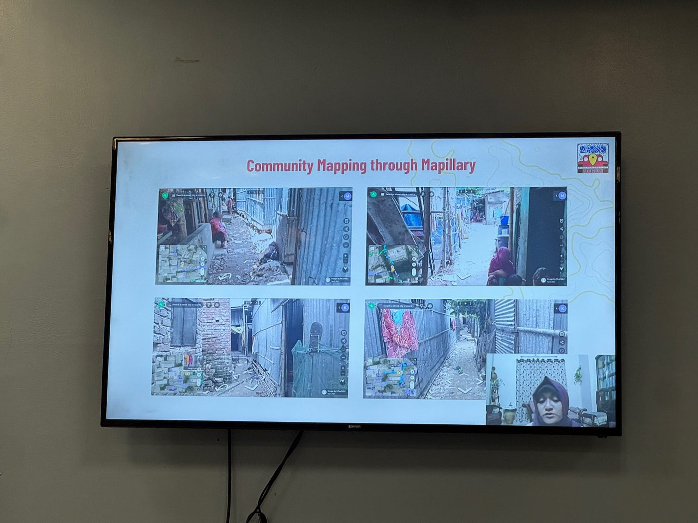
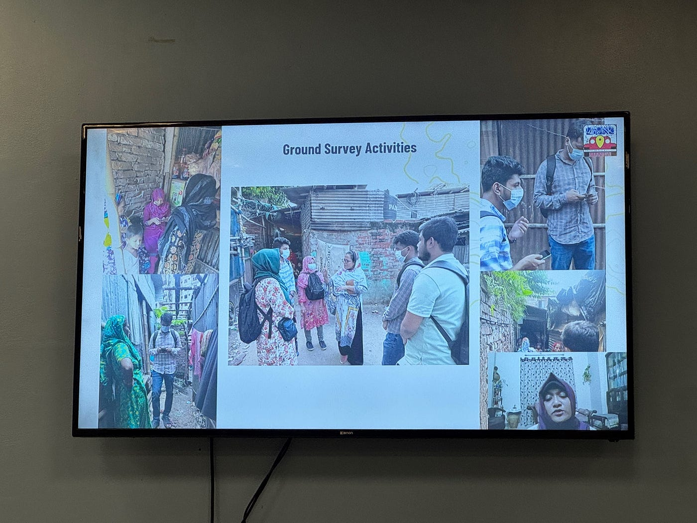
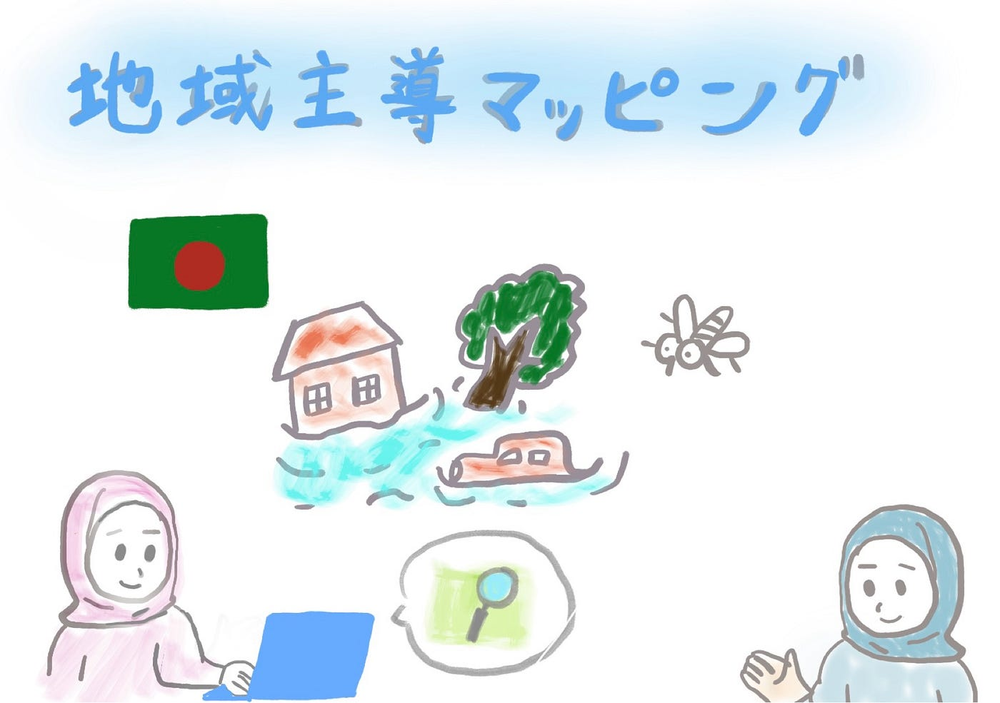

## 地図がつなぐ地域の力 ― SotMマニラで学んだ地域主導型マッピング【10/7 Youth1 週報】

こんにちは！3年の安生です。

今回は、先日マニラで開催されたSotM（State of the Map）2025に参加して、印象に残った事例を紹介します。

地域住民が主体となって課題を可視化し、解決に向けて行動していくプロジェクトが紹介されていました。

**発表タイトル**：

「Resilience Starts with a Map: Community-Led OSM Action in Dhaka’s Climate-Vulnerable Settlements」

**発表者**： Faiza Wazihaさん

**発表概要**：

バングラデシュの首都ダッカは、気候変動の影響を強く受けている都市の一つであり、特にインフォーマル・セトルメント（法的権利がない土地に、法律や建築基準に準拠しない形で建てられた居住地や地域のこと）では、冠水やデング熱などのリスクが深刻な問題となっています。しかし、こうした地域は公式な地図やデータに十分反映されていないため、行政による的確な対策が難しいという課題があります。

この発表では、OpenStreetMap（OSM）を活用して地域の人々が自ら地図を作り、リスクを「見える化」する取り組みが紹介されていました。現地の若者や女性たちが中心となり、冠水エリアや感染症リスク地点をOSM上にマッピングし、その地図をもとに防災や衛生改善に関するワークショップを実施したそうです。発表者のFaizaさんは、この活動を通じて、住民が「自分たちの地域を自分たちで守る力」を高めることができたと述べていました。

このように、地域主導でデータを作成・共有していくプロセスは、単なる技術的支援にとどまらず、地域社会のつながりや協働性を高める重要な手段であると感じました。

**感想**：

この発表で特に印象に残ったのは、地図づくりが「データのため」ではなく「人のため」に行われているという点です。住民が自分たちの課題を地図上で共有し、そこから現実の行動や協力につなげている流れは、とても理想的だと感じました。

私たちも普段、HOT Tasking Manager を使ってマッピング活動を行っていますが、改めて「このデータが現地でどのように活用されているのか」という視点の大切さを実感しました。衛星画像をもとに建物や道路をマッピングしていると、つい「データを作ること」自体が目的になってしまうことがあります。しかし、今回のように現地の人々が地図を活用して命や生活を守る行動につなげている事例を知り、私たちの作業の意味をより具体的にイメージできるようになりました。

また、女性や若者の参加を重視している点にも強く共感しました。私たち学生がマッピングを通して社会課題に関わることも、同じ流れの一部だと思います。地図をきっかけに、多様な人が社会問題に関心を持ち、行動に移すという循環こそが、オープンマップの最大の魅力だと感じました。

この発表を通して、今後は「誰のためのマッピングなのか」「どのように現地に還元されているのか」という視点をより意識しながら、マッピングの活動にも取り組んでいきたいと思いました。

