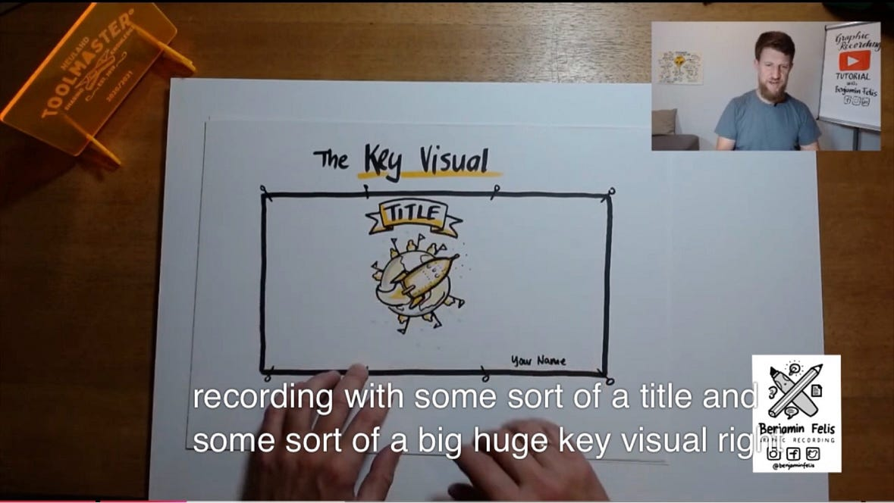
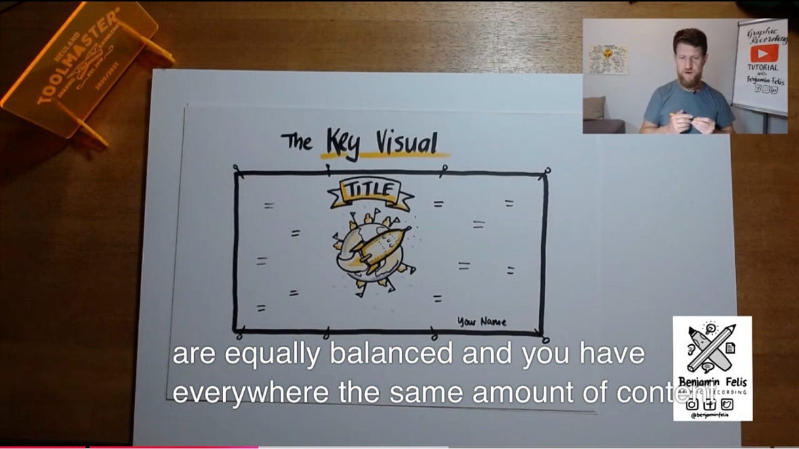
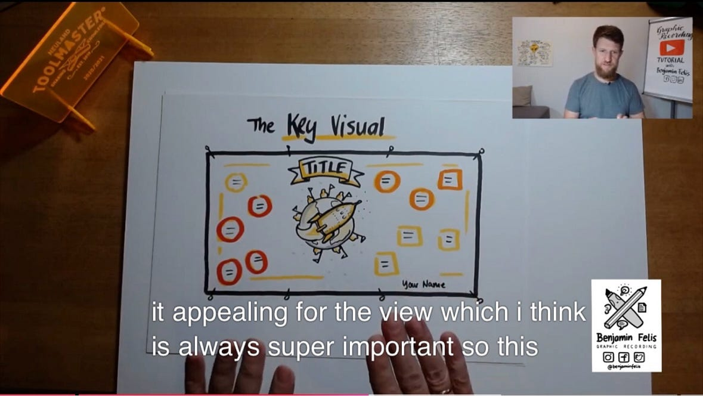
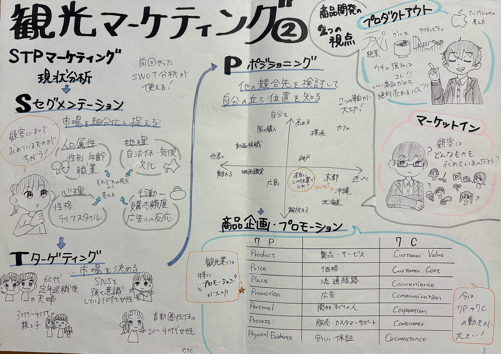
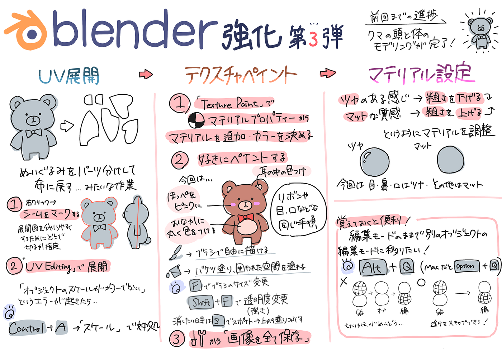
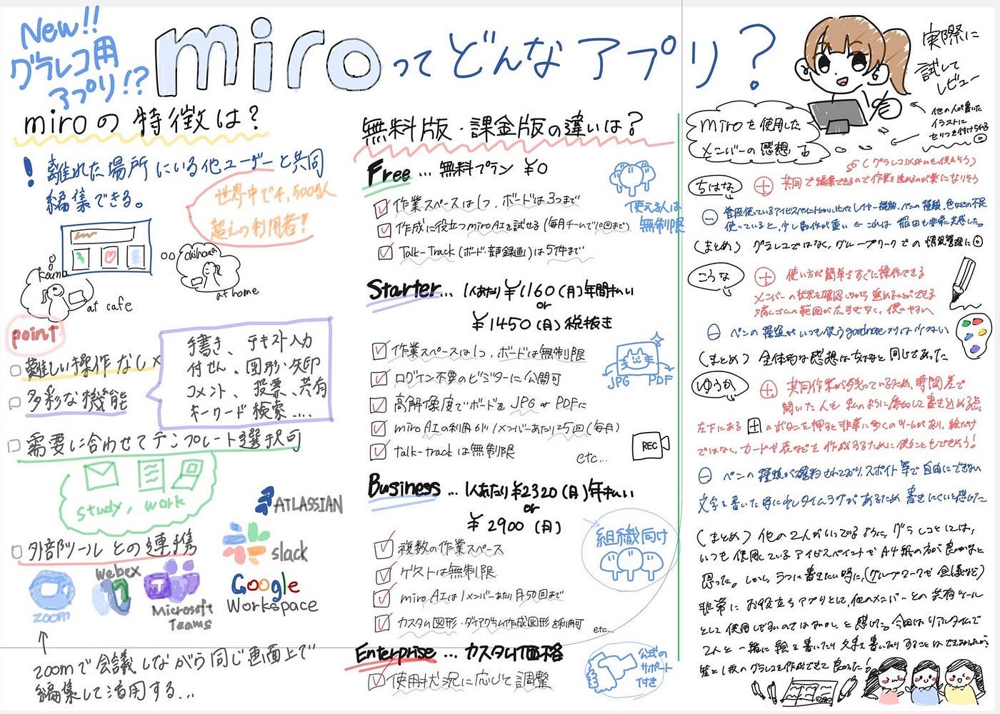
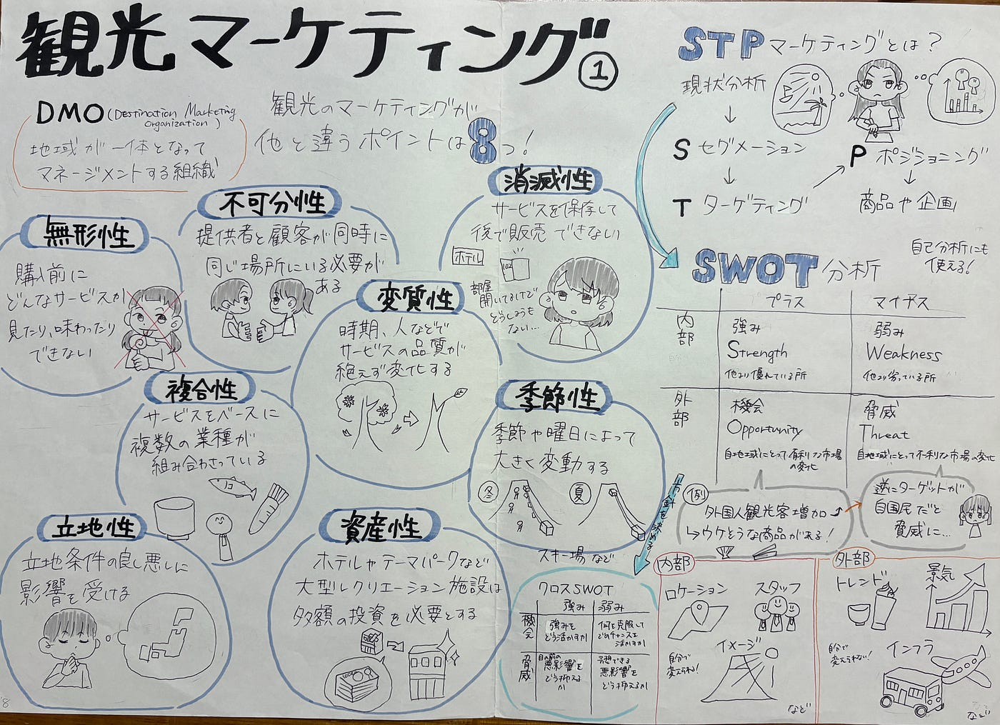
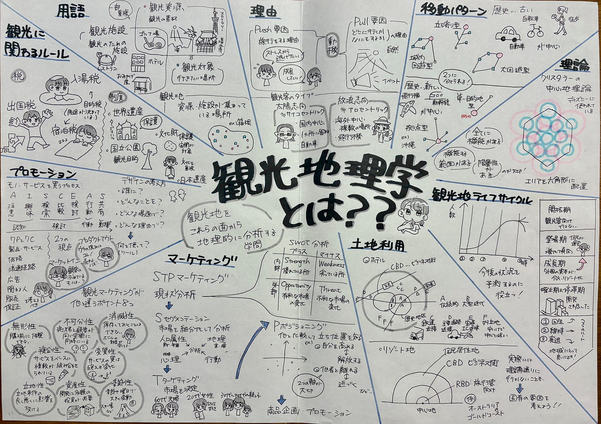
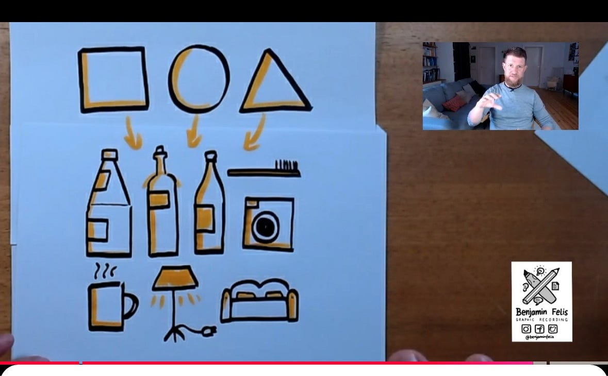
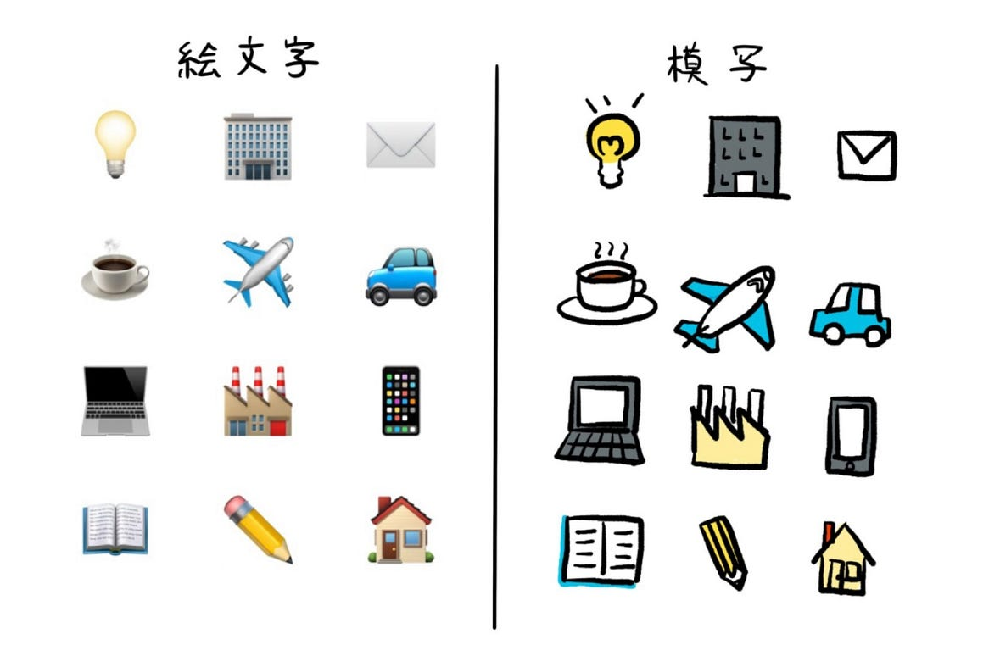

## 【グラレコ達人に！】 「速さ」と「分かりやすさ」を両立するには？

こんにちは。デザイン部3年の稲田優花です。

10月に入って涼しくなりましたね！ゼミでは長野のツリーハウス合宿が迫っています🦌🍄

今回は、週報にも活用できるグラフィック・レコーディング（以下グラレコ）の技量をあげる方法をテーマにしようと思います。

古橋教授が火曜日におっしゃっていた「発表が終わった瞬間に描き終えているのが本物のグラレコ」という言葉を受け、確かに！早く書けるようになりたい！と思いました。そこで、今週はいかにしてリアルタイムに、かつ分かりやすく描き切るかを調査し、情報共有していきます。

### 1. グラレコについて

まず、「そもそもグラレコって何なの？リアルタイムなの？」という所から入ろうと思います。

〈グラレコとは…〉

「セミナーやシンポジウムなどの登壇者の話や，会議での議論の様子を，文字だけではなく，図や絵を用いてリアルタイムに可視化する手法」

[グラレコとは？プロセスを記録する | 2019年 | 記事一覧 | 医学界新聞 | 医学書院
グラフィックレコーディング（ 通称，グラレコ ）とは，セミナーやシンポジウムなどの登壇者の話や，会議での議論の様子を，文字だけではなく，図や絵を用いてリアルタイムに可視化する手法のことです。 ...www.igaku-shoin.co.jpつまり、要点を絵を使ってまとめ、話が終わった瞬間に完成しているべきなのです😭2. 描き切るためのポイント](https://www.igaku-shoin.co.jp/paper/archive/y2019/PA03350_05)

### ２. 描き切るためのポイント

今回は、プログラフィックレコーダーのBenさんがYouTubeに投稿しているフリー講座、動画を視聴して、有効だと感じた描き方をまとめました。

**（1）レイアウトを決めて描き進める！**

Benさんが初心者にも綺麗に描きやすいテンプレートを紹介していたので共有しようと思います。

**①まずタイトルと鍵となる絵を描く**

**②周りに均等にコンテンツを描く**

➡️(文でもイラストでも良いなと思いました)

**③全体とコンテンツを縁取る**

**④異なる情報に色を付けてみる**

➡️(重要な情報をアピールできる)(3色程度)

この４ステップでした！

動画には時系列で描くもうひとつのテンプレートも紹介されていました！

※「他の描き方はどのようなものがある？」とChatGPT (version5.0)にも聞いてみました。

・**Z字型**（左上から右下に流れる）

・**グリッド型**（複数の箱に分ける）

・**放射型**（中央から広がる）

話の長さや内容の多さに応じて「今日はこの感じで書こう」などと決めておけば、描き始めるときに迷わずに進められそうです！🪄🖼

（ちはな補足）

以前私が書いたグラレコの中で上３つのレイアウトのものがあったのでいくつか載せておきます！

**（2）シンボルを決めておく**

Benさんによれば、「四角・丸・三角」が基本となるそうです。

①四角・丸・三角から派生して絵を描く

②四角・丸・三角を見ながら蛍光マーカーで影を引く

また、私たちがスマートフォンでよく使う「絵文字」は、誰でも分かるシンボルになっています！どんな絵がいいかが分からない時には、絵文字を見ながら描いてみるといいかもしれません。

[グラレコ初心者が上達する練習法・描き方の基本4STEP【絵が下手でOK】
こんにちは！ グラフィックレコーダーのとんぷです。このページをご覧になっているということは、少しでもグラレコに興味がある方だと思います。 「私もこんな風にまとめられるようになってみたい！！」 「でも、自分の絵に自信ないしなぁ...」 ...thomp-grareco.com](https://thomp-grareco.com/2021/05/22/grareco-lesson/)

**（3）リアルタイム練習**

最後に、合同会社かしかしによる記事を引用し、「リアルタイムで描けない😖💧」を解決したいと思います。話を聴きながらグラレコを書くためには、TE**Dx Talksや、**Yo**uTubeの動**画などを用いて練習するのが良いそうです。

始めからリアルタイムで描くことを目指さず、まずは動画を止めたり戻したりしながら描き、慣れてきたら止めずに描く練習をすることをコツコツやることが大切だと記載されていました。

[グラレコ初心者が上達する練習法・描き方の基本4STEP【絵が下手でOK】
こんにちは！ グラフィックレコーダーのとんぷです。このページをご覧になっているということは、少しでもグラレコに興味がある方だと思います。 「私もこんな風にまとめられるようになってみたい！！」 「でも、自分の絵に自信ないしなぁ...」 ...thomp-grareco.com](https://thomp-grareco.com/2021/05/22/grareco-lesson/)

### **3. デジタルツールについて**

ちはなによると、iPad版のAffinity Photo 2, Designer 2, Publisher 2 が現在無料配布されているそうです。私自身も、デジタルで描くことはグラレコを素早く完成させる上で、大きな武器になると感じています。

**〈紙ではなくデジタルで描くと良い理由〉**

**①レイヤーを分けて文字と図を管理できる**

➡️後からすぐに編集できる🙆‍♀️！書き直す時にも便利！

**②色の塗りつぶし機能があり、無駄な時間を短縮できる**

➡️色を一瞬で変更できる🙆‍♀️！ペンの持ち替えも不要！

**③囲みや矢印をテンプレート化して呼び出せる**

➡️自分ですべてを描く手間が省ける🙅‍♀️！時間短縮になる！

**④文字やイラストの大きさや位置をすぐに変えられる**

➡️後からレイアウトの調節ができる🙆‍♀️！手間が省ける！

ちなみにデザイン部の学生はiPadとApple pencilを使って書いている学生がいました。使用アプリは、iBis Paint、Goodnoteがありました。皆さんもぜひ活用してみてはいかがでしょうか。

### 4. 今回の感想

調査を終えてみて、リアルタイムで、かつ分かりやすく描くためには、

- **まずテンプレートを考える**

- **シンボルを描けるようにする**

- **動画を見てリアルタイムで練習をする**

この3つの練習の積み重ねを行う必要があると分かりました。次回から、週報のグラレコを担当する際には、今回調べて得た知識を使ってまとめてみようと思います。また、発表が終わった時点で分かりやすく完成しているグラレコを描けるようになることを目標に、これからもデザイン部として頑張っていきたいと思います！📝

こうな：

記事をまとめてくれてありがとう！ゆうかがまとめた内容を読み、自分の今まで描いてきたグラレコを振り返り、グラレコを描く上で不足していたところが見えてきました。

描ける描けない関係なく、今まではレイアウトを気にしてなく、散乱としていたり、国際会議に参加した際もリアルタイムで描くことができなかったり色々と反省点がありました。ゆうかとちはなのグラレコをまねしつつ、画力を上げて、分かりやすくて綺麗に描けるように上達することをゴールにします。

### グラレコ

