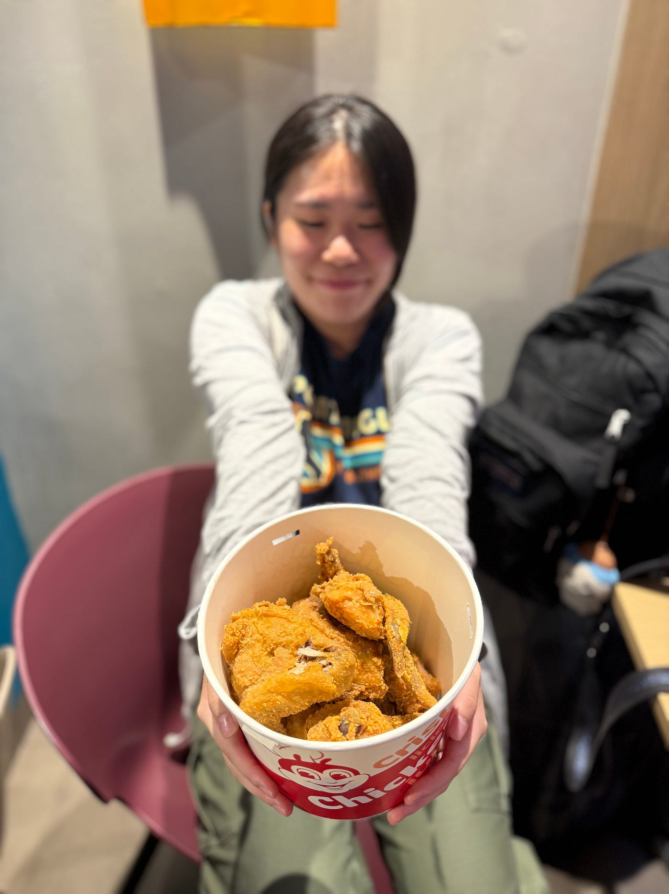
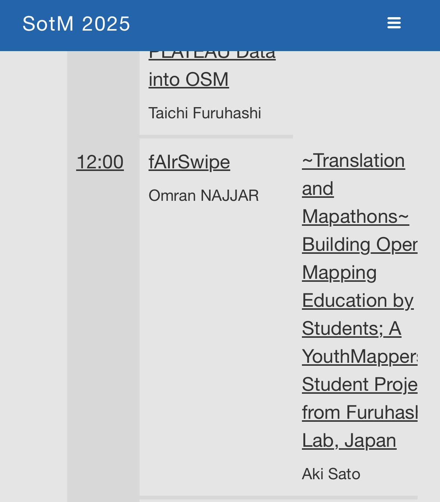
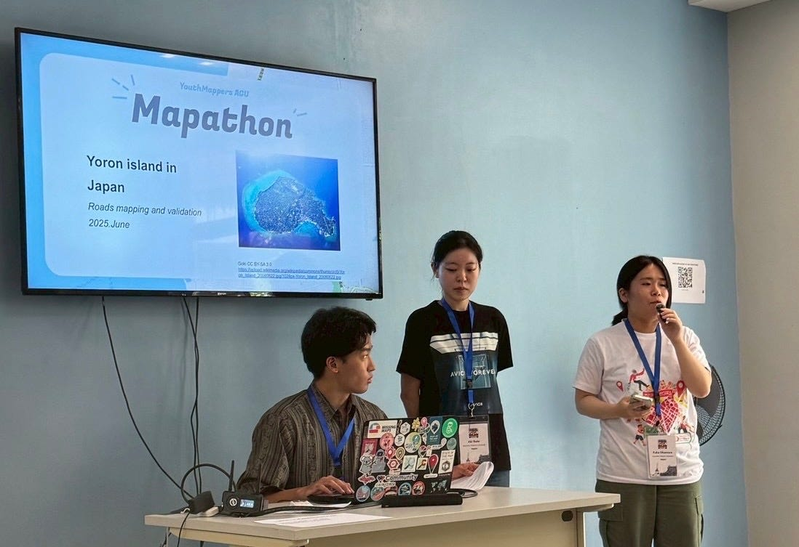
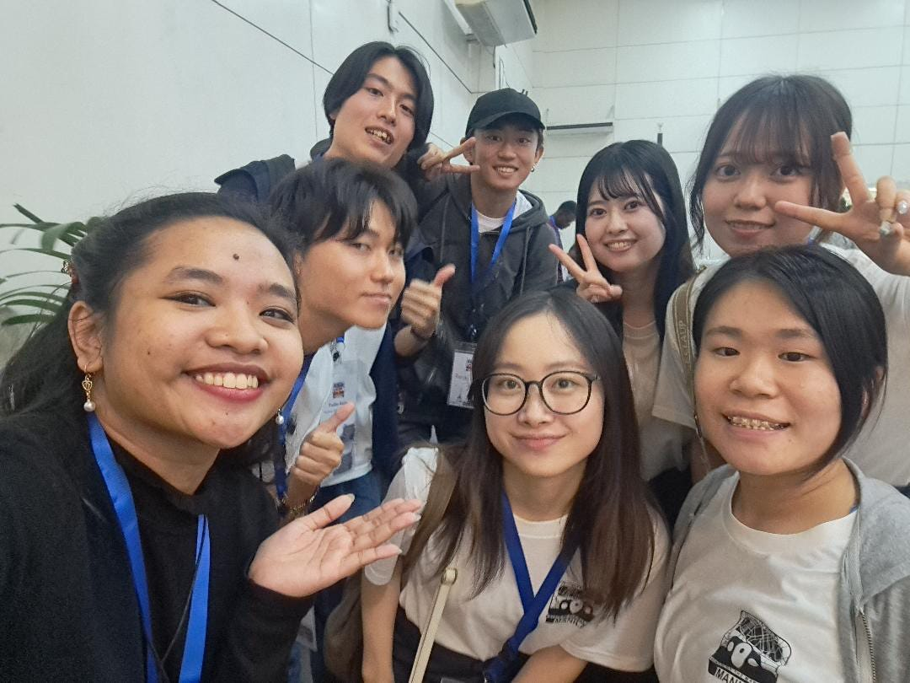

### SotM 2025 Manilaに参加しました！

お久しぶりです。古橋研究室所属の岡村です。
国際会議 SotM 2025 Manilaに参加したので、報告します。

国際会議、フィリピン、そして登壇と、初めてのことばかりでしたが、たくさん学び、充実した5日間を過ごすことができました。

#### **会議概要**

会議名: SotM Manila 2025 [State of the Map 2025 — Manila](https://2025.stateofthemap.org/)
開催時期: 2025年10月3日〜10月5日
開催場所: GT Toyota, University of the Philippines Diliman (UPD)

#### **ワクワク・ドキドキ会議の前日**

私は、会議が始まる前日の２日の午後３時頃（PHT)に､ Ninoy Aquino International Airportに到着し、大量の荷物を持ったまま、SM mall of Asiaに向かい、フィリピンのファストフード、Jollibeで夜ご飯を食べました。

#### **国際会議登壇日**

私は2日目に、Aki Satoのゲストスピーカーとして、登壇し、主に、Mapathonについて紹介しました。
[Programme — State of the Map 2025 — Manila](https://2025.stateofthemap.org/programme/)

与論島の建物をマッピング対象とし、初心者をマッピングに取り込むことを目的としたイベントを紹介しました。
 OpenStreetMapのアカウント作成から、実際のHOT Tasking Managerの使い方まで丁寧に説明することで、参加者にマッピングの基礎を習得してもらいました。
 また、バックグラウンドやマッピング歴の異なる人々が一堂に会し、共にマッピングを行うことで、マッパソンを通じて人と人とが繋がる機会を創出できたことの意義を訴えました。

質疑応答の時間には、「他にマッパー同士やさまざまな人と繋がれるイベントは行っているのか」という質問がありました。
 それを受けて、今後はタイのシーナカリンウィロート大学と合同で実施したマッパソンを、よりオープンな形に発展させ、より多くの人々に参加してもらえるイベントを主催したいと考えるようになりました。

今回の国際会議では、これまであまり接点のなかったOSM関係者と直接会うことができ、自分がこれまで取り組んできたマッピング活動の意義を改めて見つめ直す機会となりました。
 また、フィリピンの学生との交流を通じて、同世代の熱意や姿勢に刺激を受け、今後の活動へのモチベーションにもつながりました。

[発表スライド](https://docs.google.com/presentation/d/1cET-Q-v9xsfhglM0Fk8w_sGf1KanJXO5/edit?slide=id.p1#slide=id.p1)はこちら

[~Translation and Mapathons~ Building Open Mapping Education by Students; A YouthMappers Student…
Talk at State of the Map 2025 - Manila. The global OpenStreetMap conference. 2025 in Manila & online.2025.stateofthemap.org](https://2025.stateofthemap.org/sessions/8VMYYW/)

#### **最後に**

2025年9月30日にフィリピン・セブ島北部沖で、マグニチュード6.9の地震が発生しました。10月1日時点では、少なくとも26人の死亡と147人の負傷が報告さてており、約2万人が避難している状況です。

引用: 日本赤十字社 [【速報】フィリピン・セブ島北部沖でマグニチュード6.9の地震発生、赤十字は迅速な救援活動を展開｜トピックス｜国際活動について｜日本赤十字社](https://www.jrc.or.jp/international/news/2025/1001_049249.html)

これに伴い、Tasking Managerのタスクが立ち上がりました。[HOT Tasking Manager](https://tasks.hotosm.org/projects/32511/)
私は、現時点で、4タスク完了させました。これからも、マッピングを通して、迅速な現地復興に貢献していきたいです。
[My stats — HOT Tasking Manager](https://tasks.hotosm.org/contributions)

また、本日10月10日には、フィリピン南部のミンダナオ島沖でマグニチュード7.4の地震が発生しました。
 被害に遭われた方々に心よりお悔やみを申し上げるとともに、私たちにできることとして、OSMの充実を通じて復興支援に貢献していきたいと思います。

#### **移動軌跡 Strava**

https://strava.app.link/EQ8qUUtPrXb
