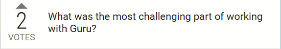
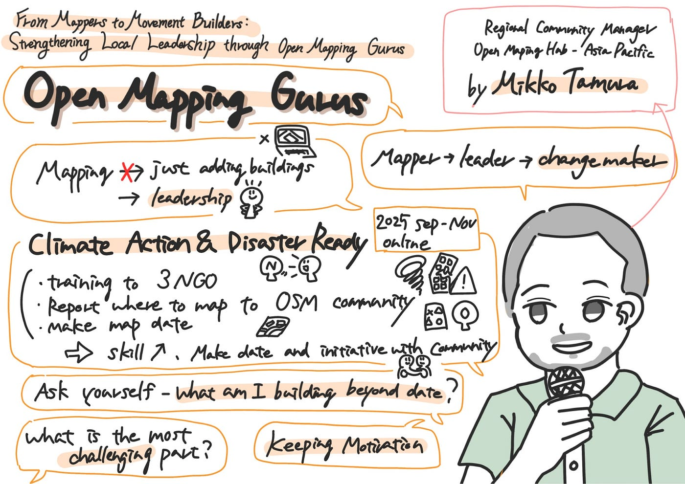
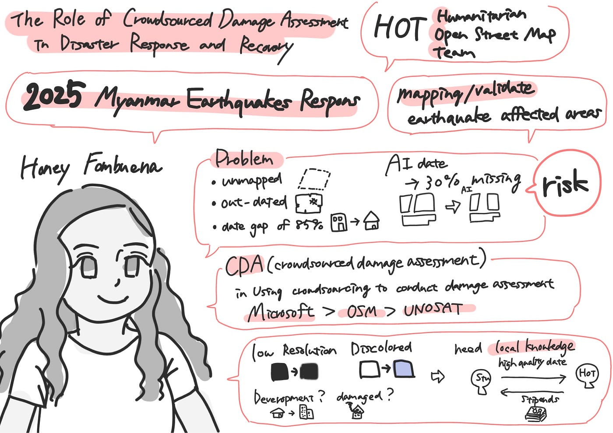
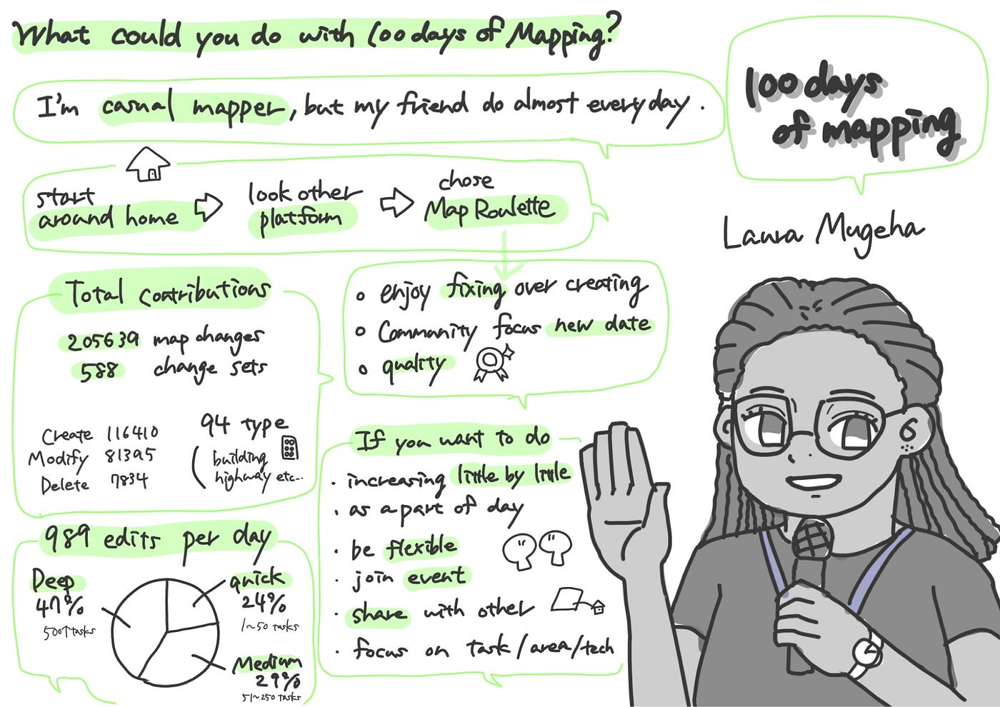

### SotM2025にオンラインで参加しました！

こんにちは、臼井です。

今回は2025年10月3日～5日の3日間マニラで行われたSotM(State of the Map)にオンラインで参加したので、そのレポートをしていきます！

まずは簡単にSotMの説明をしていきます。

Open Street Map（以下OSM）は誰でも無料で利用できるように作成、公開されている地図サービスです。

そしてSotMとはOSMコミュニティが開催する、OSMやマッピングについての内容を発表、議論し共有する交流の場です。今回、2025年はフィリピンのマニラで開催されました。

ゼミ生の中には現地で参加した人もいましたが、今回私はオンラインで参加しました。

では、ここからは私の聞いた3つの講演について書いていきます。

### 1講演目: Mikko Tamuraさん(Sunday, Oct 5)

#### 講演名: From Mappers to Movement Builders: Strengthening Local Leadership through Open Mapping Gurus

**内容:**

MikkoさんはOpen Map Gurusというグループでの活動について紹介してくださいました。

マッピングはただ建物や道を地図上に追加するだけの行為ではなく、リーダーシップを育むのにも繋がるのではないかという所からGuruの活動が始まったそうです。

GuruではMapper→Leader→Changemakerというように成長することを目的としています。Changemakerになるためには、①任命されるのではなく、自然に築き上げられる、②メンターシップとして影響力を増やす、③共通のアイデンティティによってグループを強化するという3つの条件が大切だという事で、実際にアジアでGuruとしての活動を行う中で気を付けているそうです。

現在(2025年10月)もGuruが活動をフォローしている「Climate Action & Disaster Ready」というイベントがオンラインで開催されているそうです。具体的には3つのNGOに対してトレーニングを行う、今後2年以内にマッピングすべき場所をOSMコミュニティに通知する、マップデータを作成する、という活動をしているそうです。この活動によってマッピングのスキル向上、データの作成、地域のコミュニティとのイニシアチブができるといった効果が臨まれています。

**感想:**

この講演を聞いて、マッピングとは個人のリーダーシップを育むことにも大きく貢献しているのだなと思いました。マッピングは顔を直接合わさないでもできる行為ではあるものの、結局人と人との繋がりが影響を持っていて、そのコミュニティを広げることが今後の発展に繋がるのだと感じました。

**質問:**

私「Guruのメンバーと活動する中で最も難しかったことは何ですか？」

Mikkoさん「様々なメンバーが様々な目的をもって集まっているので、個々人がモチベーションを維持するのが少し大変でした。しかし、活動は私にとって楽しいことであり、そこまで苦労はしませんでした。」

### 2講演目: Honey Fombuenaさん(Sunday, Oct 5)

#### 講演名: The Role of Crowdsourced Damage Assessment in Disaster Response and Recovery

**内容:**

HoneyさんはHOT(Humanitarian OpenStreetMap Team)で行った、2025年のミャンマー地震でのサポートの事例から被害評価について紹介してくださいました。

2025年のミャンマー地震に対するHOTのサポートは3月31日から始まり、被害地域のマッピングや検証を行いました。

その中で初期に使われたマップには、地図化されていないエリアがある、地図が古く、地図に85％もの変化があるなどの問題が含まれていました。また、AI処理した地図データには平均30％の欠落が存在し、地震の被害評価に使うにはリスクのあるものでした。

そのためCDA(Crowdsourced Damage Assessment)を立ち上げ、データの評価を行うことにしました。地元のマッパーと連携して評価を行ったところ、OSMのデータはUNOSATよりも優れていましたが、Microsoftの方が精度が上だったそうです。

地震の被害地域をマッピングするときは解像度の低さ、変色、開発されているのか損傷なのか分かりづらいという問題点があります。そのため、現地のマッパーの力が必要になります。今回の例では地元の学生に協力を依頼し、マップデータを受け取る代わりに奨学金の援助を行うなどの活動がされました。

**感想:**

地震の被害地域のマッピングはHOT Tasking Managerで実際に行ったことがあったので、今回の話は興味深かったです。今までは日本以外の外国の被害地域のマッピングしかしたことがありませんでしたが、今後日本で地震被害が出たときは、もちろん自分の安全が確保された状況ではありますが、地元のマッパーとして協力してみたいと思いました。

### 3講演目: Laura Mugehaさん(Sunday, Oct 5)

#### 講演名: What Could You Do with 100 Days of Mapping?

**内容:**

Lauraさんはマッピングを100日した記録を共有してくださいました。

Lauraさんは元々毎日マッピングをするようなタイプではありませんでしたが、友人がほぼ毎日マッピングをしているとSNSで知り、自分もやってみようと思ったそうです。

初めは家の周りから始め、徐々に範囲を増やしたそうです。

様々なプラットフォームを試しましたが、最終的にマッピングの修正が沢山出来る、コミュニティが新しいデータを作るのに積極的、クオリティの問題からMap Rouletteを選んだそうです。

最終的にLauraさんは100日間マッピングを続けた結果、205639回ものマッピングを行いました。新たに増やした建物は116410個、修正は81395回、削除した数は7834個になりました。建物、主要道路などマッピングした物の種類は94種類でした。

一日に平均989回の編集を行ったそうで、1～50タスクの日は24％、51～250タスクの日は29％、500タスク以上こなした日は47％でした。

同じことをしたい人には、7→30→100日のように少しずつ目標を増やしていく事、休憩時間にはマッピングをするなどマッピングを生活の一部にする事、忙しい日は簡単なタスクをやり、暇な日は長くこなすといったように柔軟に行動する事、また、地域の人に声をかける、イベントに参加する、結果をどこかで共有する事、タスクの種類、マッピングのエリア、技術的にできる物に挑戦するなど種類を決める事といったアドバイスをしていました。

**感想:**

100日間精力的にマッピングを行うとここまでの成果がでるのかと驚きました。Lauraさんは仲間と協力したり、時には競い合ってマッピングをしていて、コミュニティ内で高めあえる環境であることは素晴らしいと感じました。私も年度末までにマッパーレベルを中級に上げなければならないので、まずは短い期間の目標を立ててマッピングを習慣にしていきたいです。

### **全体の感想**

今回初めて国際会議に参加してみて、英語での公演だったこと、専門的な知識があまりないことから、理解するだけで精一杯という感じでした。

土曜日の公演では会場のインターネット環境があまり良くなかったことで内容が途切れ途切れになってしまったり、何も映らなくなったりオンライン参加の難点も感じました。

しかし、公演の内容はためになるものばかりで、マッピングへのモチベーションが高まるイベントでもありました。自分の活動してきた内容と一部重なることもあり、今後もっと積極的に活動していきたいと強く思いました。
