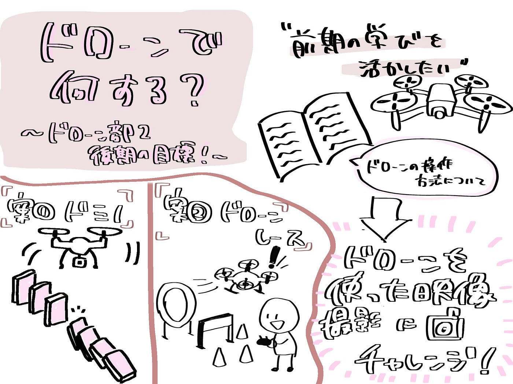

### **【10/14ドローン部2週報】ドローンで何してみる？**

こんにちは。3年の小崎です。夜は半袖だと寒い季節になってきましたね🍁🍂

後期も始まり、ゼミ活動が再開しました！先週の週報でドローン部1がドローンを作成するという話を聞いて、私たちドローン部2も何か面白いことをやりたい！！と思いメンバーたちで話し合いました✨️

話し合いの結果…

**ドローンを使って何かを撮影して形にしたい！**

という案が出ました！

#### **何を撮影するか？**

外でドローンを飛ばすためには許可取りが大変ということを前期で思い知ったので、室内で実施できるものを想定しています。

現状候補として上がっているのは、

- ドミノをドローンで追い撮り

- 障害物を使ったドローンレース

の2つです。

#### **ドミノ**

ドローンの空撮は何度か見たことがありましたが、追い撮りを見たのは初めてで興味深かったので、室内でドミノを組み立てて倒すシーンをドローンを使って臨場感溢れる撮影をしてみたいです！

#### **ドローンレース**

前期の活動で、ドローンの操作方法について学んだので、それを活かせるドローンレースも面白そうだなと思いました。

イメージとしては、

この動画が理想形です。

ただ、いきなりこの形を作るのは難しいので、最初はただのコースを作ってコース通りに進むタイムを競うようなものが出来たらいいなと考えています。

映像をメインで考えるならドミノ、ドローンを飛ばすことを重視するならドローンレースだと思うので、どちらを先に取り組むかは実現可能性も含めてメンバーと話し合いながら決めていこうと思います。

**考えないといけないこと**

- 飛ばす場所(大学か大学外か？許可取りは可能か？)

- どんなスペックのドローンが必要か(カメラ性能・飛行時間・安全性など)

- 役割分担

後期はは「安全に・楽しく・見せるドローン活動」をテーマに、段階的にスキルを伸ばしていけるよう計画していきます！

