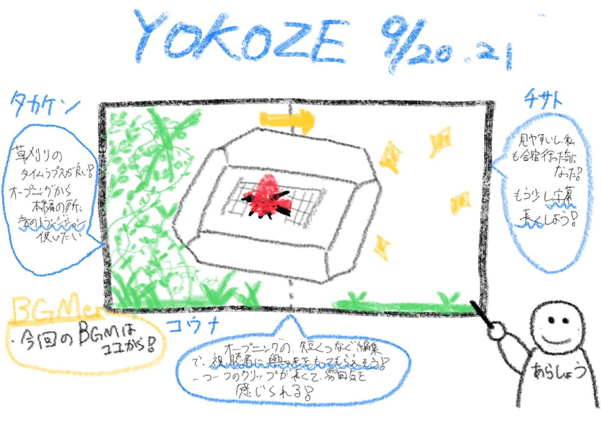

### 【10/14週報】やっとこさ横瀬合宿の動画を世に出す準備ができました。

こんにちはーV&Fの荒川です。今週は、9/20.21の横瀬合宿の様子をまとめた動画を発表しようと思います。実は9月末には完成していたのですが、みんなの前で発表する機会がなかったのでやっとこさ今回の週報で発表です。

V&Fメンバーやゼミのみんなからのフィードバックを参考にして、修正を加えたのちに古橋研のYouTubeで公開したいなと考えています。

> _**今回使用した音源等_**

[ガーデンパーティー | BGMer](https://bgmer.net/music/421) (オープニング)

[Chilled Cow — Foil Card | BGMer](https://bgmer.net/music/lt059) (メイン)

[クリック音](https://soundeffect-lab.info/sound/search.php?s=%E3%82%AF%E3%83%AA%E3%83%83%E3%82%AF) (効果音）

今回は、BGMは[BGMer](https://bgmer.net/) (ビージーエマー)から楽曲を選んで使用しました。([利用規約](https://bgmer.net/terms))

また、効果音に関しては[効果音ラボ](https://soundeffect-lab.info/)を使用しました。

([利用規約](https://soundeffect-lab.info/agreement/))

> _**動画_**

[先週のV&Fの週報](https://medium.com/furuhashilab/v-f週報-10-7-94b6ad152c30)でフィードバックを頂いた、動画の切り替えに使う画像も、最新版が完成したので差し替え予定です。

> _**メンバーからのコメント_**

チサト

すごくいいと思う！見やすいし私も合宿行った気持ちになった笑
強いていうならもう少しだけ字幕表示する時間長くてもいいかなという感じです！
とっても楽しそう！！

コウナ

最初の編集が色んな場面を短く繋げることで視聴者に興味を持たせるように工夫してるなと思った！
プラス一つ一つの場面少しだけ撮影じゃないから、その場の雰囲気を上手く感じ取れる！

タカケン

草刈りの様子をタイムラプスで撮っていて、変化がわかりやすく、とても見やすかったです！映像の工夫が感じられてよかったと思います。
強いて言えば、オープニングから本編に切り替わる時に音が急に消えるので、フェードアウトのトランジションを使って音を徐々に小さくしていくと、より自然で見やすくなると思いました！

> _**まとめ_**

字幕の長さなど、自分では気づくことのできなかった点を指摘してもらえて感謝です。ありがとうV&F。

フィードバックをもとに修正し、YouTubeにアップしていただこうかなと考えています。また、後半編もすでに編集が終わっているので、近いうちにまた共有します！

> _**グラレコ_**

