## Manila速報

こんにちは！三年の本吉顕です。ここ最近はフィリピンなりゼミ合宿なりとても忙しかったですが、ここでは僕のマニラ滞在中のお話をしようと思います。

#### 11時の便で成田→ニノイアキナへ

Air Asiaのフィリピンへの直行便を使い、マニラに3時ごろに着陸しました。日本からフィリピンだとトランジットなど含めず、格安航空で直行するのが安くて吉です。マニラの交通は激混みなので高速を使っても宿のInfina tower まで2時間強かかりました。晩御飯はフィリピンといえばのJolibeeでchicken joyを頼みました。ハンバーガーも含めて200ペソくらいだった気がします。僕はこのグレイビーソースが好きなんだ！

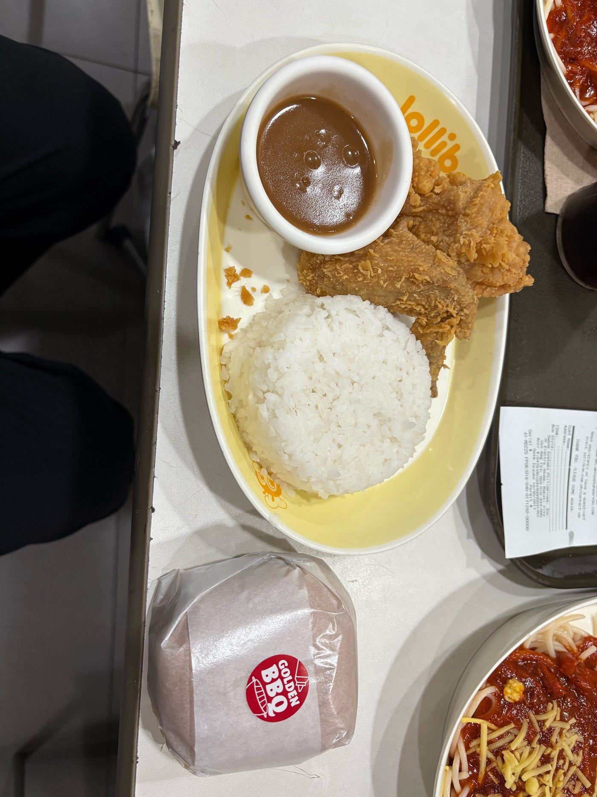

#### 2日目〜4日目

#### State of the Map 2025へ！

何を隠そう我々はこのために来たのです。ここでState of the Map (以下SOTM)はなんぞやという人のために簡単な説明を。

> The State of the Map (SotM) conference is the annual, international conference of OpenStreetMap. Organised by the OpenStreetMap Foundation it has been held each year since 2007 (except 2015 and 2023).

[OSM wiki](https://wiki.openstreetmap.org/wiki/State_of_the_Map)にはこのように書いてありますが、日本語訳すると「SOTMとは2015,2023年を除き、2007年から毎年OSM Foundationにより開催されるOSMの国際会議である」となります。世界中のマッパーたちが一堂に会し、自分の功績や考えを発表し合う場であり、ひよっこの我々からすると世界中のマッパーと繋がり学ぶ貴重な機会でもあります。1日目はひたすらプレゼンを聞き、自分の英語力の拙さを自覚しました。古橋先生の発表はイタリア人から熱烈な感謝の握手を求められるほどの好評でした。

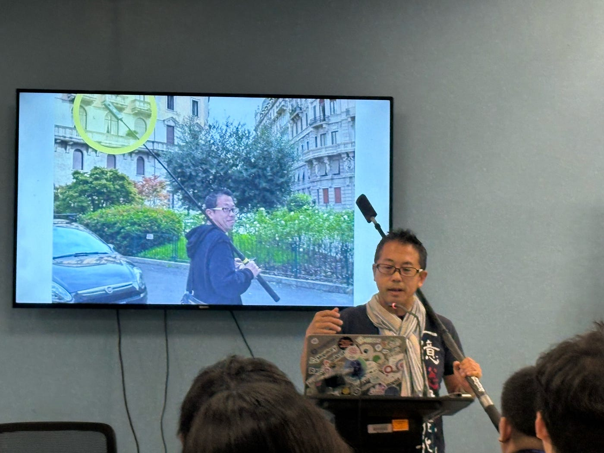

僕の印象に残った発表のうち一つが[Brazil SinghのMaking OpenStreetMap More Accessible for New Mappers](https://2025.stateofthemap.org/sessions/TX88WD/)です。この発表ではどのようにして新規マッパーを増やすべきかについて焦点が当てられていました。この発表によると、最初はマッピングに対する情熱があるものの、サポートの欠如が原因でフラストレーションが溜まり、マッピングをやめてしまうことがあるとのことでした。そこで、HOT Community Mentorship Program を提案し、初心者に自信をつけさせることやよりコミュニティと関わる機会を増やすことが必要だとしていました。

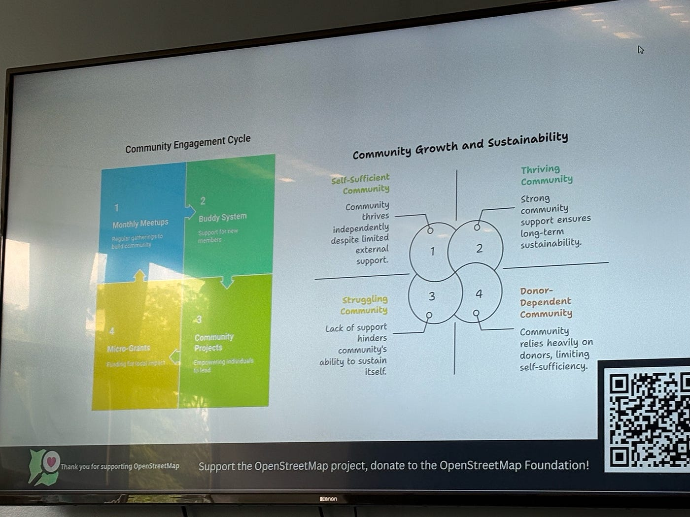

マッピング初心者の僕としてもこの国際会議によりコミュニティに参加することの重要性を再認識したので、初心者にとってなんでも聞ける存在がいることはモチベーションを大きく向上させる要因になりうると感じました。

#### 自分たちの発表

我々はAGU Youth Mappersとして~[Translation and Mapathons~ Building Open Mapping Education by Students; A YouthMappers Student Project from Furuhashi Lab, Japan](https://2025.stateofthemap.org/sessions/8VMYYW/)の発表をしました。

この発表ではOpen Mapping towards Sustainable Development Goalsの日本語訳とマッピング活動について話しました。感想としては、自分の英語力不足とOSMの知識不足を再認識させられました。質問が飛んできてもそれに十分な答えを出すことができず、今後の活動を通して両方のスキルを上げていく必要があると感じました。

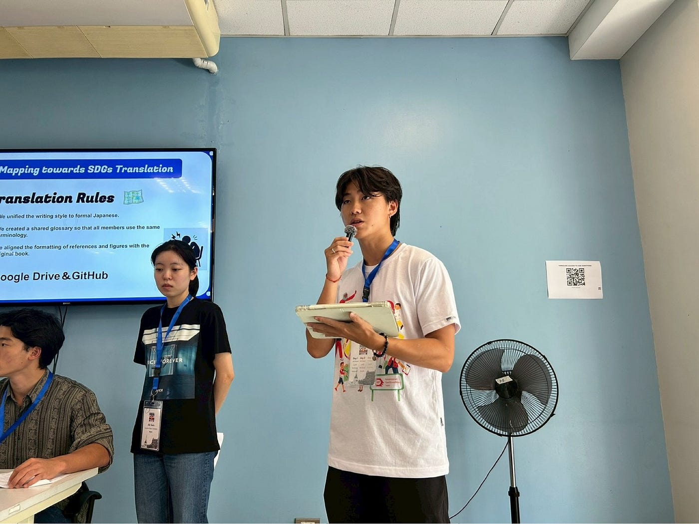

#### マニラ旅行記

最後に自慢をさせてください。本来はInfina Towerに最後まで残っていたメンバーで帰りも同じ航空券を買っていたのですが、僕だけ日程を変更されてしまったのでその間にした冒険をまとめます。

まず、マニラの観光地は少ないです。半年ほど前にマニラに来た僕にとって、マニラ近郊で残された観光地はほとんどありませんでした。よって、誰にも知られていないマニアックな場所に行くことを決めました。僕がバイクタクシーで1時間強かけて向かったのはAngonoというLaguna 湖の辺りにある街です。まず、Antennna hillという丘に上がり、昼食。Tボーンステーキです。ライスと合わせて200ペソもしないのにめちゃくちゃ美味い。

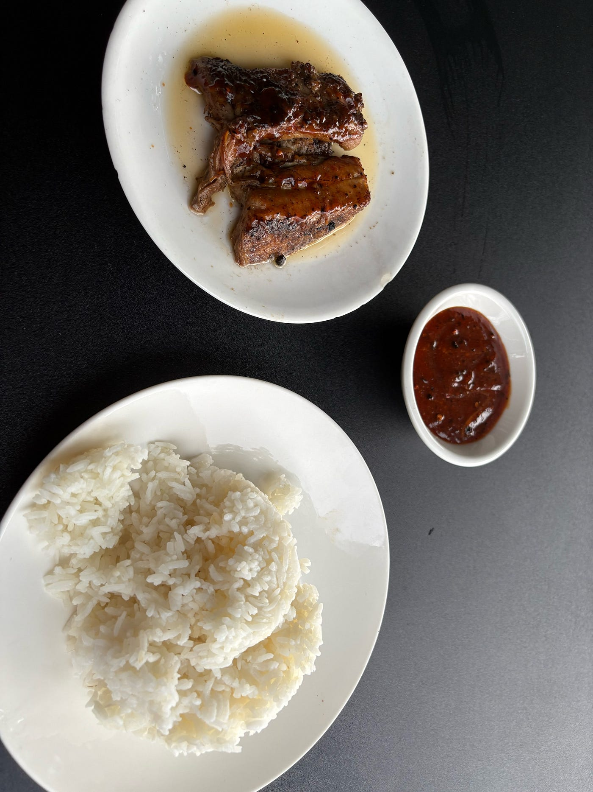

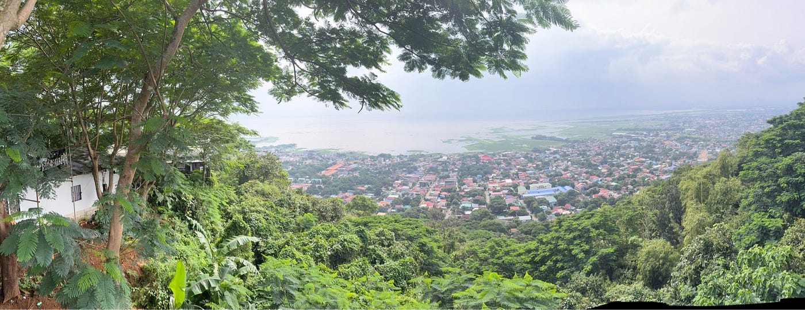

その後は丘の上からの眺めを見たり、地元の子供達とバスケをしたりしながらLaguna湖に向かいました。フィリピンの子はバスケが上手い。もう汗だくです。

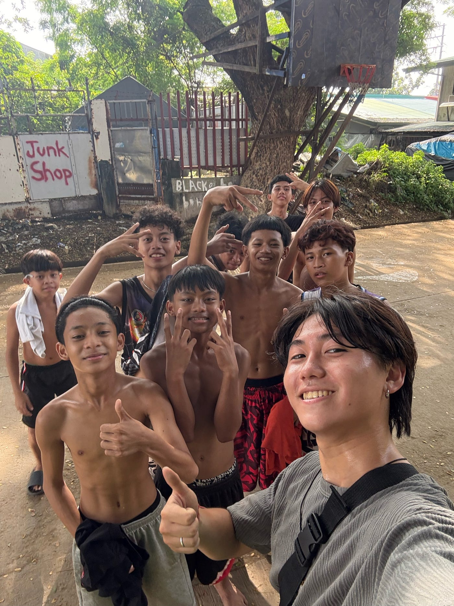

Laguna 湖に着くと地元の子供達に話しかけられました。話を聞くとさらに景色がいい場所があるとのことでトライシクルに乗りました。

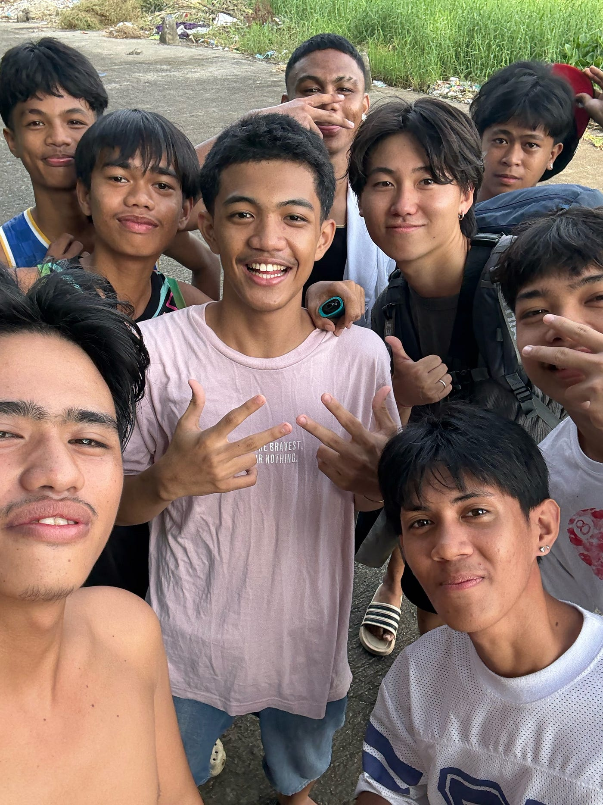

と思ったのですが、途中で降ろされてしまい、ここからは歩いて行けと言われました。道を見てなるほど。冠水しています。竹の上を歩いて目的地のWawa公園に向かいますがもちろん入れず。ただ、それでも景色はとても綺麗でした。

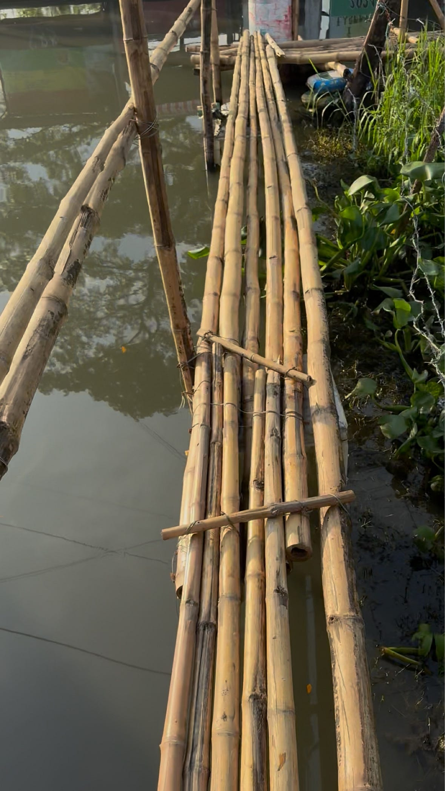

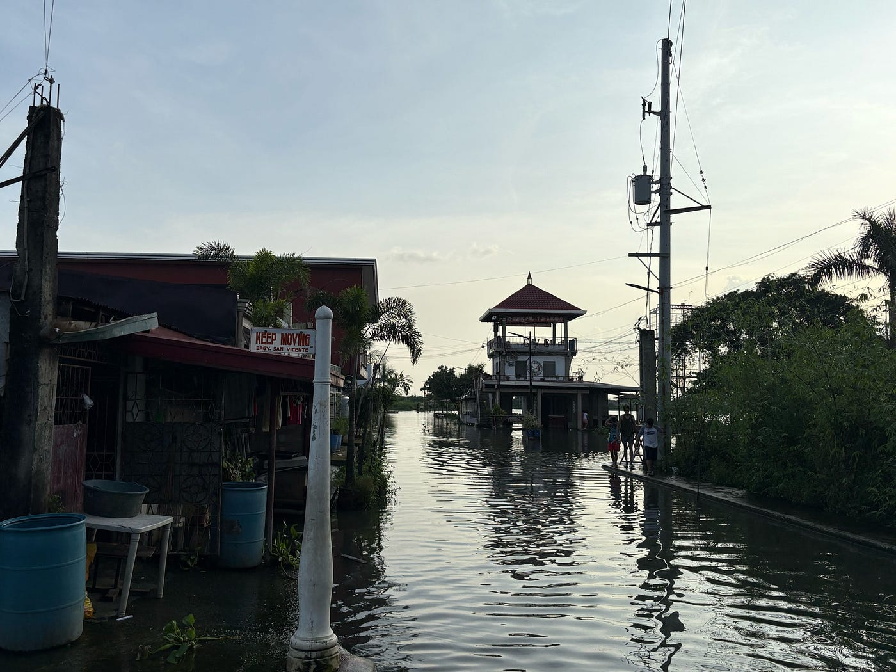

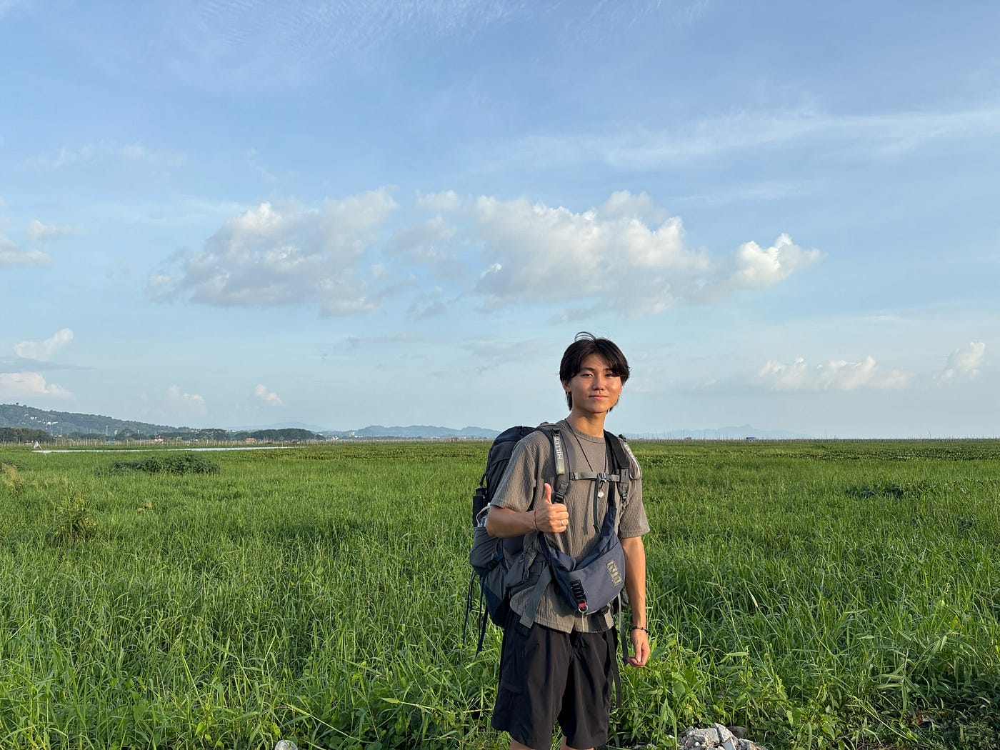

最後に山の上のカフェから夕陽を眺めて終了。国際会議のある日とはまたテイストの違う刺激的な1日になりました。

### Strava

SOTMの[Strava](https://strava.app.link/g8xZ8bsPrXb)のデータです

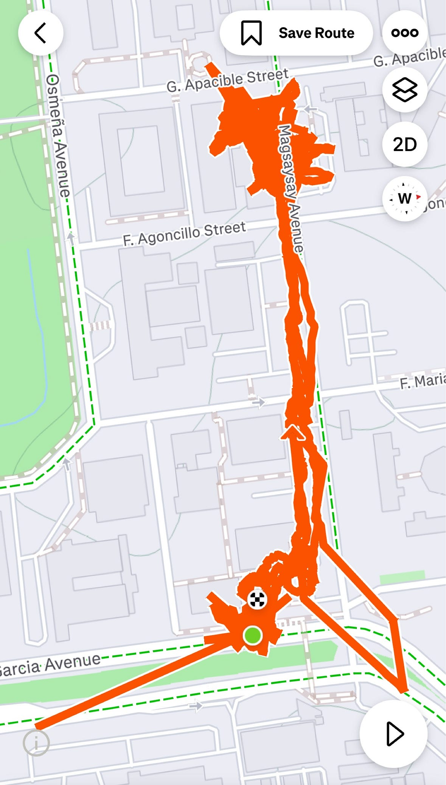
