## はじめてのSotM！

こんにちは。3年の安生です。

最近はやっと少しずつ涼しくなってきました。私の好きな寒い季節が近づいているのを感じて嬉しいです⛄️

国際会議にゼミ合宿と、9月〜10月はなかなかハードなスケジュールでしたが、無事に終えることができて安心しています。

ただ、気温の変化も重なってなのか久しぶりに風邪をひいてしまい、今は少し喉が痛いです。季節の変わり目なので、みなさんも体調に気をつけて過ごしてください。

今回は、先日フィリピン・マニラで開催された国際会議「State of the Map 2025（SotM）」について報告したいと思います。

**SotMとは**

SotMは、世界中のOpenStreetMap（OSM）コミュニティが集まり、地図を通じたさまざまな取り組みや経験を共有し合う、年に一度の国際イベントです。

2025年は10月3〜5日にマニラで開催され、私も古橋研究室のメンバーとして現地で参加しました。

**急遽、登壇することに**

私は今回の国際会議で発表する予定はなかったのですが、

古橋先生から「せっかくだからライトニングトークをやってみたら？」という提案をいただきました。

急な話に驚きつつも、「やってみよう！」と決意。テーマに選んだのは GPSローイング（ジオドローイング） でした。

ジオドローイングはスマートフォンなどのGPSの軌跡を使って、実際に街を歩きながら絵や文字を描くアートです。私は初めて挑戦しました。今回は **“SOTM” **の文字と、今年の国際会議のロゴにもなっているフィリピンの乗り物 **ジープニー** をGPSで描いてみることにしました🚗

**マニラの街を歩いて描く**

まずは会場周辺の地図を眺めながら、どの道ならうまく形を作れそうかを探すところからスタート。みんなに伝わるようにジープニーを描くのは難しく、苦戦しました。

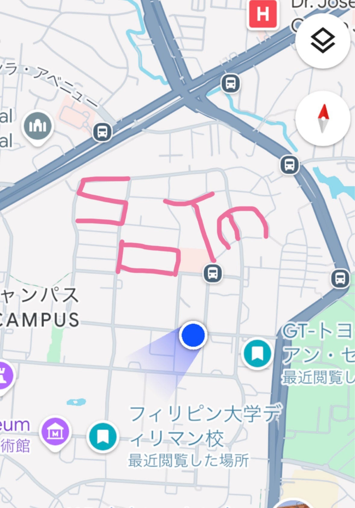

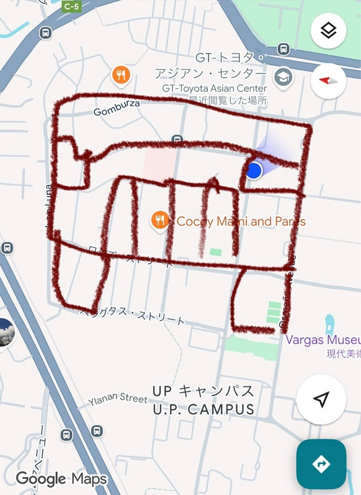

ジープニーは複雑な形だったので、どうしたら効率よく記録を取れるか、一生懸命ルートを考えてくれたメンバーたちに感謝です。

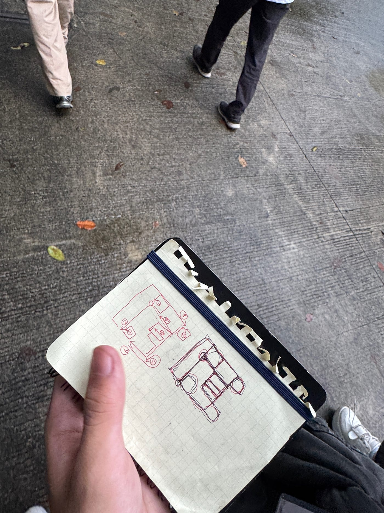

歩き始めたのは14時半ごろ。途中で休憩をはさみながら、17時半ごろまで約3時間かかって完成しました。

Stravaのリンクはこちらです。

M

[strava.app.link](https://strava.app.link/gsl8QdlRrXb)

O

[strava.app.link](https://strava.app.link/wpiLpXpRrXb)

特にジープニーはノンストップで約1時間半、6.6km歩き続けたのでさすがに足が疲れましたが、普通に過ごしていたら通らないような道をみんなで歩くことができて楽しかったです。

線と線の間に隙間が空かないように確認しながら丁寧にあるいたのがポイントです。

途中で雨が降ってきて雨宿りをしたり、坂道があったり、犬が吠えていて怖かったり、苔で滑りやすい道もありましたが、みんな無事に戻ってこられてよかったです。

**完成作品**

こちらが完成した作品です。

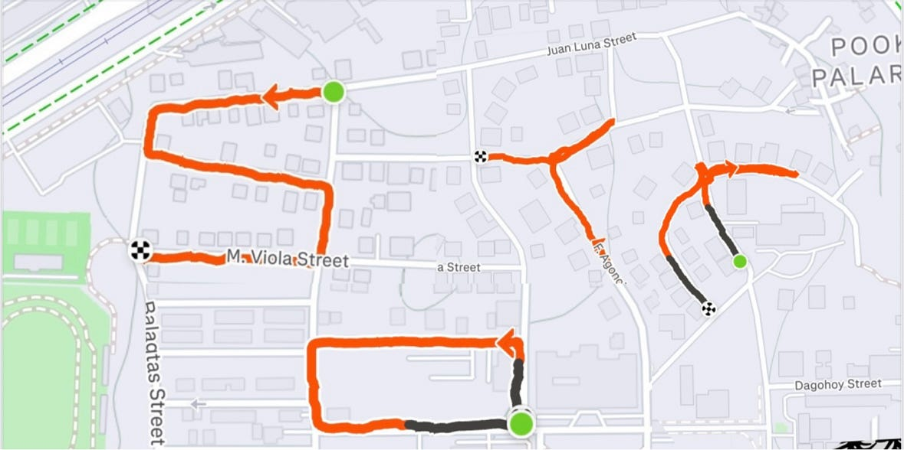

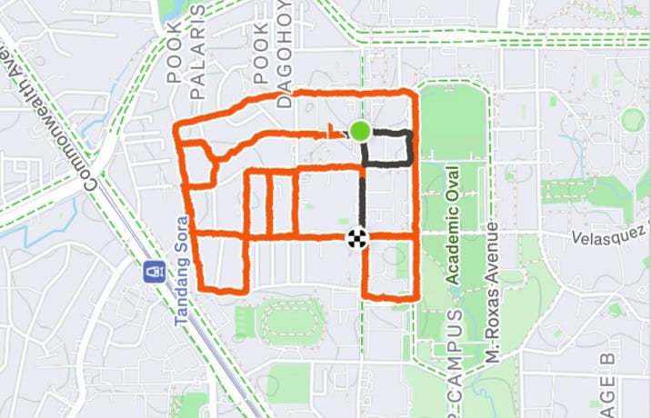

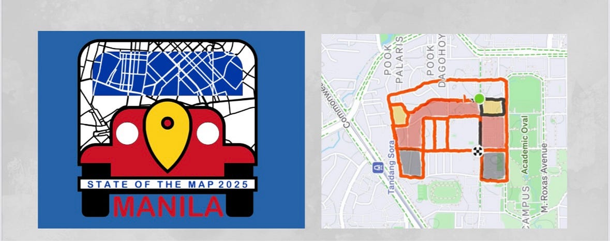

今回の試みがなければ、マニラの街をこんなに歩くことはなかったと思います。

ただ目的地に向かう「移動」ではなく、“描くために歩く”という体験の中で、普通なら通らない路地や見ることができない風景、人々や動物との出会いがありました。

**登壇の様子**

ライトニングトークをすることを決めたのは発表の前日だったので、準備時間も限られていました。

英語での発表はとても緊張しましたが、会場のみなさんはとてもあたたかく、笑顔で話を聴いてくださいました。

私たちの描いたジープニーの絵がちゃんと伝わったようで安心しました。

発表スライドは[こちら](https://www.canva.com/design/DAG0yXjXGaM/lvqxTCE2j4X8FA6Lisv3rA/view?utm_content=DAG0yXjXGaM&utm_campaign=designshare&utm_medium=link2&utm_source=uniquelinks&utlId=hf2ffe2ee9a)です。

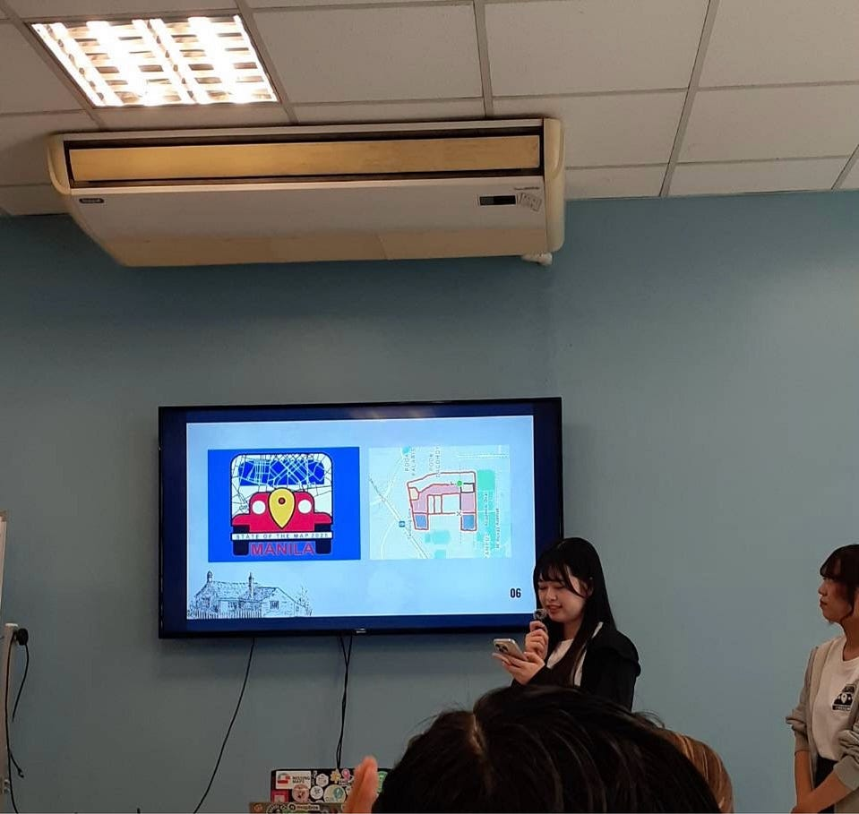

**学んだこととこれから**

SotMでは他の方々の発表も聞くことができ、知らなかった活動やツールに出会いました。

世界中の人がそれぞれの形で地図を使って活動していることを改めて実感し、私も何か役に立つことをしたいという気持ちが一層強まりました。

また、SotMはただの発表の場ではなく、参加者同士が交流し、支え合う温かい空間でもありました。現地で知り合ったフィリピンの方が、私たちの発表を応援しに来てくださったのがとても嬉しかったです。言葉や文化が違っても、地図を通じて人とつながれることを実感しました。

マニラでの体験を糧に、来年広島で開催されるFOSS4G では運営側としても頑張りたいと思います。

そして、また別の場所でもGPSドローイングに挑戦してみたいです。

この貴重な機会をくださった古橋先生、そして一緒に歩いてくれた仲間たちにとても感謝しています😊

**Stravaログ**

[strava.app.link](https://strava.app.link/nvw8gnnDrXb)

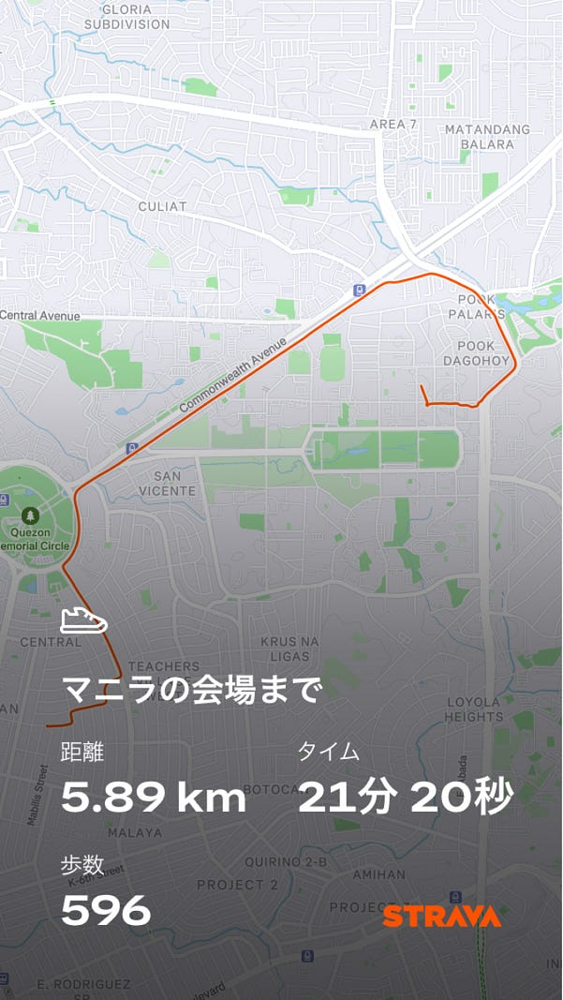

最後に歩きながら撮った写真たちです📷

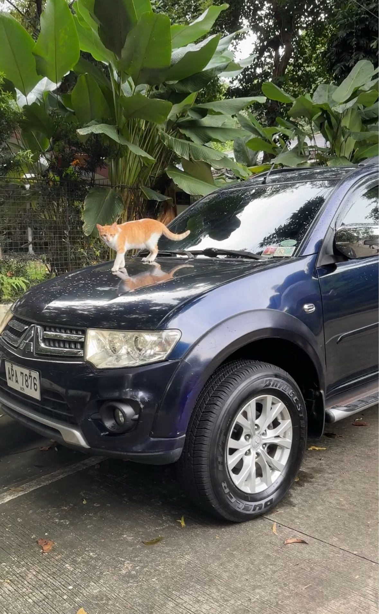

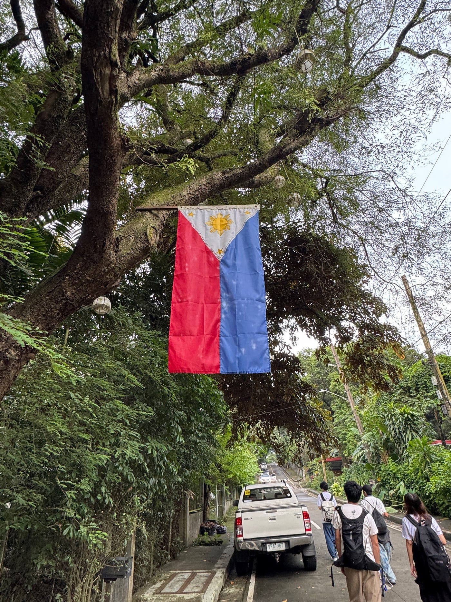

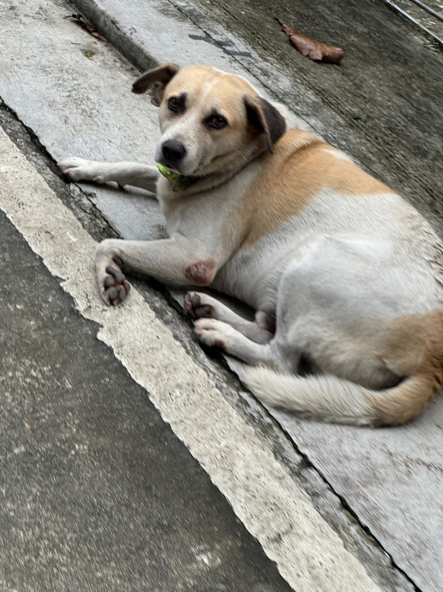

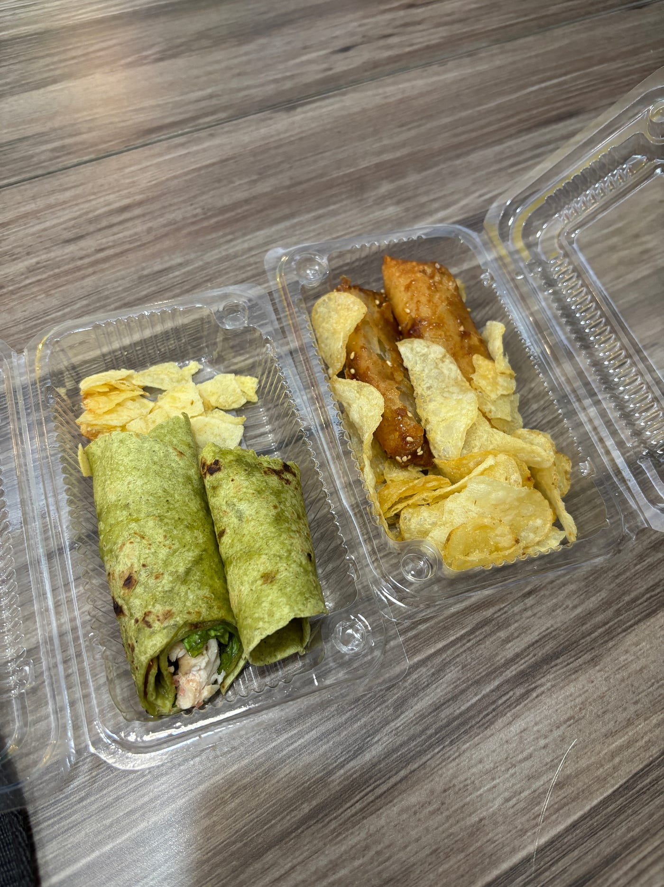

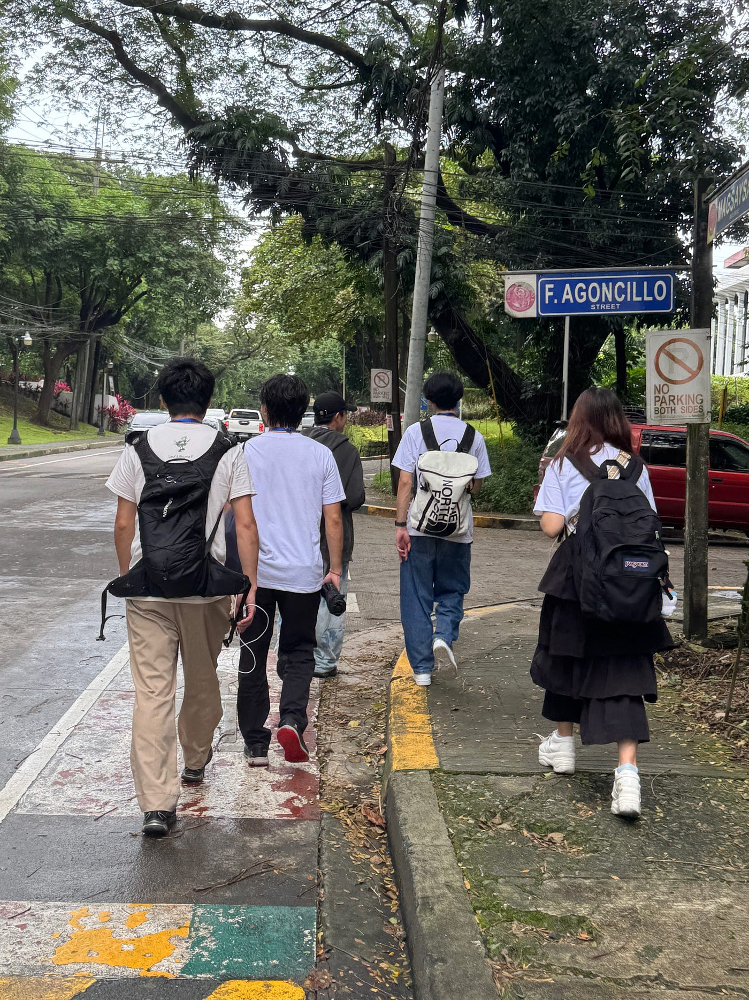
