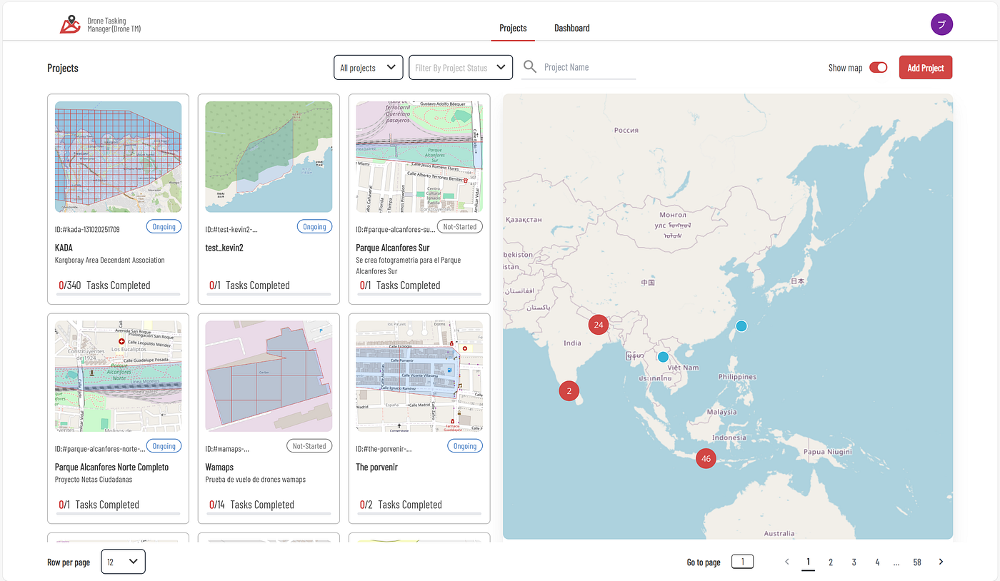
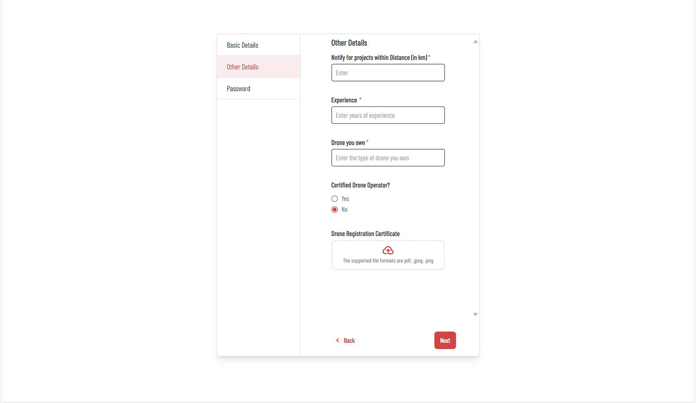
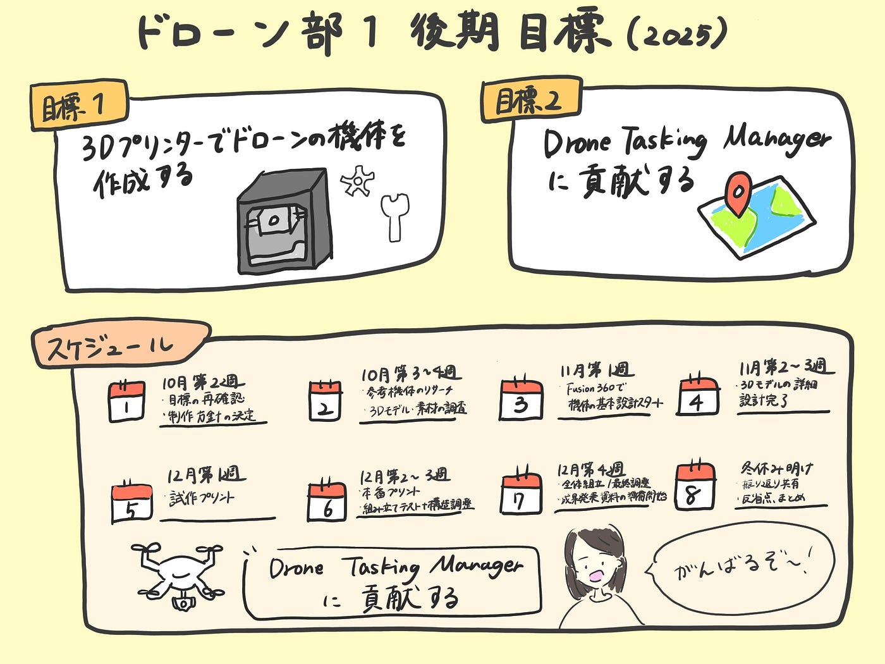

## やっと決めました！ドローン部1の後期の目標はこれだ！

こんにちは。ドローン部4年の林です。

さてさて、先週のドローン部の週報いかがでしたでしょうか？

ドローン部1は後期ちゃんと目標をもって、行動していくことに決めました。

詳しくは[こちら](https://medium.com/furuhashilab/%E3%81%9D%E3%82%8D%E3%81%9D%E3%82%8D%E3%83%89%E3%83%AD%E3%83%BC%E3%83%B3%E9%83%A8%E3%82%89%E3%81%97%E3%81%84%E3%81%93%E3%81%A8%E3%81%97%E3%82%88%E3%81%86%E3%82%88-a6ae2a119d19)の記事をご覧ください。

今週の週報では、具体的にどんなことをしていくのか、より現実的な面で考え直してみることにしました。

以下に報告します。

### ドローン部1のやりたいことは2つある！

ドローン部1の後期の2つの目標を掲げます。

#### 目標1：3Dプリンターでドローンの機体を作成する（飛行は前提としない）

まず1つ目の目標は、設計から3Dプリンターを使って機体をつくること。

操縦可能なドローンを作るという案も出ていましたが、部品調達でのコスト面や作成期間などを検討した上で、まずは「飛行を前提としないドローン機体の製作」からスタートすることにしました。

#### 内容詳細

- [Fusion 360](https://www.autodesk.com/jp/education/edu-software/overview) などでCAD設計をし、3Dプリント

→Fusion 360は学生なら1シート無料。相模原キャンパス内のPC教室でも利用可能。

- プロペラやモーター部分などはダミーを想定（将来的に搭載可能な構造に）

- チームで1機 or 個人で小型モデル（用途やテーマを決めて）を製作

- 最終的には、展示できるような仕上がりを目指す

→来年のジオ展とかドローン部紹介の内容に使えるかも！？

#### スケジュール

1. 10月第2週（10/7〜10/13）

- 目標の再確認、制作方針決定

2. 10月第3〜4週（10/14〜10/27）

- 参考機体のリサーチ/既存の機体構造・3Dモデル・素材の調査

3. 10月最終週〜11月第1週（10/28〜11/3）

- Fusion 360 で機体の基本設計スタート/部品構造のラフモデリング

4. 11月第2〜3週（11/4〜11/17）

- 3Dモデルの詳細設計完了（分割、寸法調整など）/3Dプリント前のエラー検証（厚み／パーツ接合）

5. 11月第4週〜12月第1週（11/18〜12/1）

- 試作プリント（PLA素材などでテスト

- パーツの収まり／接合の検証

6. 12月第2〜3週（12/2〜12/15）

- 本番プリント

- 組み立てテスト＋構造調整

7. 12月第4週（12/16〜12/22）

- 全体組立・塗装・最終調整

- 写真撮影／成果発表資料の準備開始

8. 冬休み明け

- 振り返り共有・反省点まとめ

#### 目標2：[Drone Tasking Manager（DroneTM）](https://dronetm.org/)の活用＆貢献に挑戦する

2つ目の目標は、DroneTMの活用とドローンマッピングへの関与です。

DroneTMは、災害時の被災地撮影や都市マッピングなどで活用されるオープンソースの「空撮ミッション管理ツール」。このツールでの貢献実績をつくることを目標とします。

- [DroneTMの機能や使い方](https://dronetm.org/tutorials)を学習し、学んだことを日本語でうまくまとめる

- ▲次回の合宿時もしくは12月〜1月に日帰りで行けるエリアで実際にDroneTMをやってみたい（できれば）

#### 現状

・DroneTMの利用方法の[チュートリアル動画](https://dronetm.org/tutorials)は現在英語のみ

→できる範囲内で日本語版を作成してみよう！

・日本エリアのプロジェクトはない

・プロジェクトの作成のみのアカウント登録はできるが、ドローン操縦者としてアカウント登録をする際には、ドローンの操縦資格を登録しなければいけない

#### **相談事**

Drone Tasking Managerを実際に使って、ドローンでの航空撮影を試してみたいと考えているのですが、その際、ドローン操縦者として先生にも同行していただき、高画質で撮影できるドローンを使わせていただくことは可能でしょうか？

### 最後に

ドローンを作ることも、使いこなすことも、簡単ではありません。ただ、私たちは、その一歩手前にある「考える」「設計する」「支える」といったプロセスを通じて、その中で得た気づきやノウハウを、将来の自分たちや次のメンバーの活動に繋げていければと思っています。

先週もお伝えしたように、ドローン部1は「Create or Die」をモットーに掲げ、上記の目標に向けて行動していきます！

ラストの授業までにどこまで完成しているのかわくわくします！！

