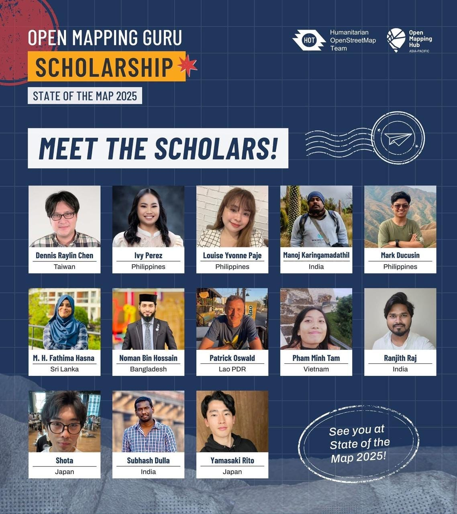
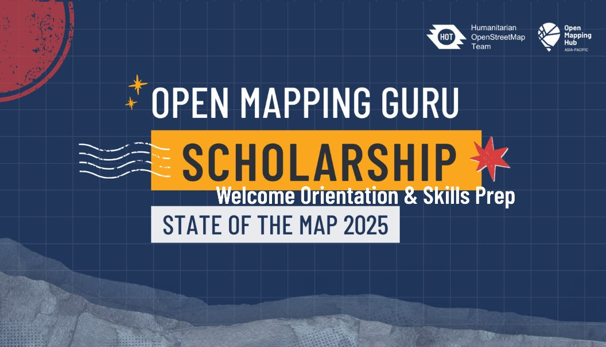
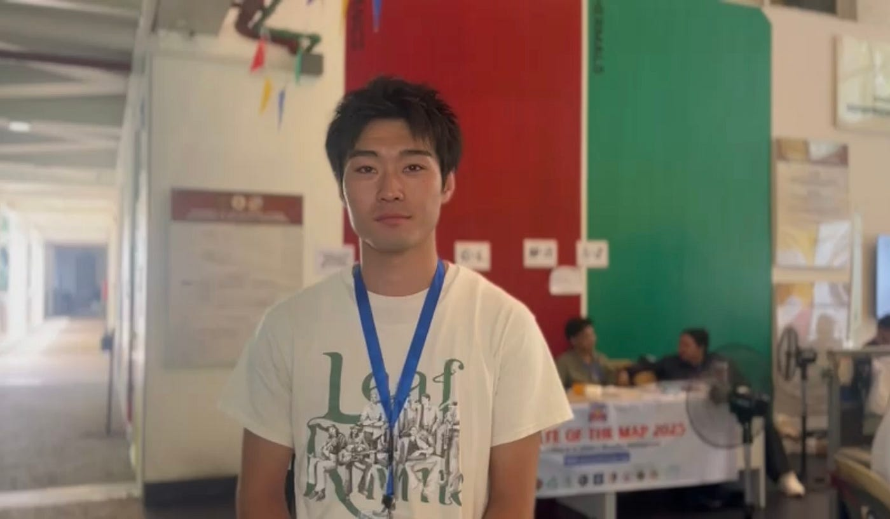
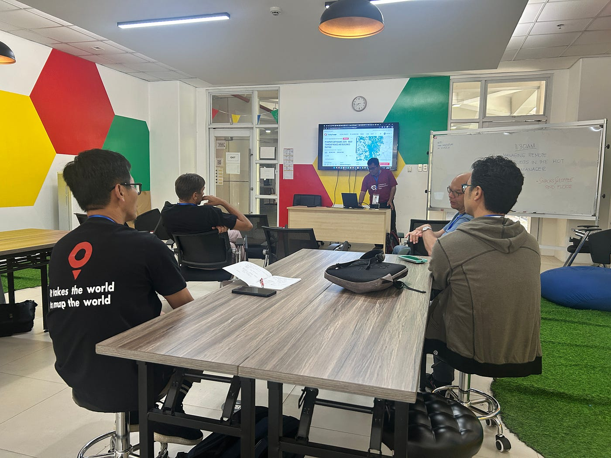
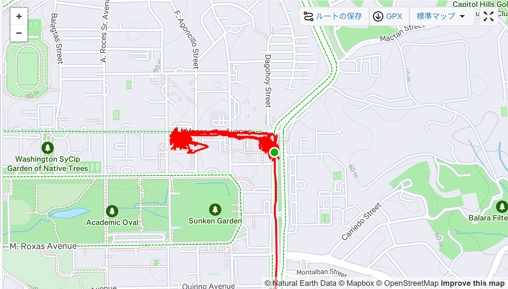

### 世界中のマッパーと仲良くなったヨ

こんにちは！マニラから帰国したと思ったら、次の週末はツリーハウス合宿ということで、忙しー！と思いながらもみんなでキャンプすることにワクワクしている荒川です。

この記事では、「State of the Map 2025 in Manila」に奨学生として参加したので、会議中の様子や感じたことをまとめようと思います！

> _**State of the Map とは_**

OSMerは、地図データの改善という共通の目標に向けて、コミュニティを築き、ツールやリサーチを共有し、お互いにネットワークを作る手段として、[State of the Map](https://wiki.openstreetmap.org/wiki/State_of_the_Map)での会合を毎年開催しています。 その規模は様々で、ローカル、リージョナル、グローバルに組織されていますが、その目的はいつも同じです。 ローカルとリージョナルのSotMは地域コミュニティによって組織され、グローバルSotMはOSM財団によって組織されます。

State of the Mapカンファレンスは、OSMマッパー、コミュニティ活動家、オープンソース開発者、大学や学術機関の研究者、デザイナー、地図製作者、民間企業や公的機関の技術専門家などの架け橋となります。

([OpenStreetMap Blog](https://blog.openstreetmap.org/2023/07/07/why-state-of-the-map-conferences-are-so-important-to-osm/?lang=ja) より引用)

年一回開催されるSotM(State of the Map)が、今年度は[フィリピンのマニラ](https://www.openstreetmap.org/search?query=GT-TOYOTA+Asian+Center+Auditorium&zoom=17&minlon=-90.51570296287538&minlat=14.613215020156698&maxlon=-90.50677657127382&maxlat=14.620855869283815#map=17/14.657053/121.074325)で開催されました！

フィリピン大学での開催ということで、現地の学生やキャンパスの様子も見ることができて個人的に面白かったです。

> _**奨学生としての役割_**

会議の前にオンラインでミーティングが行われ、顔合わせや仕事内容の説明等がありました。具体的な仕事内容としては、会議中のセッションの写真・動画撮影やインタビュー動画への出演がありました。

インタビュー動画や撮影した写真・動画に関しては、今後SotMのSNSアカウントで公開されるのかなと思います。

正直、シフトとして決められていた仕事は多くなかったので、かなり自由に動くことができました。自身のシフト以外のセッションの撮影にも協力することができたので、古橋研の動画編集チームを代表してSotMの様子をまとめたショート動画を作成して公開しようかなと考えています。

> _**会議を通して得たもの_**

奨学生として参加させていただいていたので、少しでも今回のSotMを盛り上げられるように動こうと意識しました。しかし、参加者や登壇者は私よりはるかに知識も経験も多い、、、。

そんな私にできることって何かなーと考えたときに、_**「色んなマッパーさんと知り合ってコミュニティを広げよう！」_**という結論に至りました。SotM参加前は、私のマッパー仲間って誰だろうと考えたときに思い浮かぶのは「古橋研のみんな・ジオ展でおしゃべりした人・シーナカリン大学の人たち」ぐらいなのかなと思います。シーナカリン大学の方々に関しては、オンラインでやりとりしただけで、正直実感がわきにくい、、、。

奨学生をまとめてくれていたミッコさんをはじめ、現地の学生や世界中のマッパーと知り合うことができました。同じ学生という立場から、古橋研究室に興味を持ってくださる方もいたので、マッパソンの規模を広げることへの可能性も感じました。

また、帰国後にHOT tasking manager に取り組んでいると、協力者履歴に見覚えのある名前がちらほら、、、。友人の名前と顔が一致することで今後の活動に体重が乗りやすいなと強く実感しました。

> _**来年に向けて_**

今回の会議に参加して、国際会議の楽しさを実感しました。来年は、FOSS4Gが日本開催ということで、SotM2025以上の盛り上がりを巻き起こすことを目標に運営側として参加したいなと思います。

[Stravaログ](https://www.strava.com/activities/16019853813)

