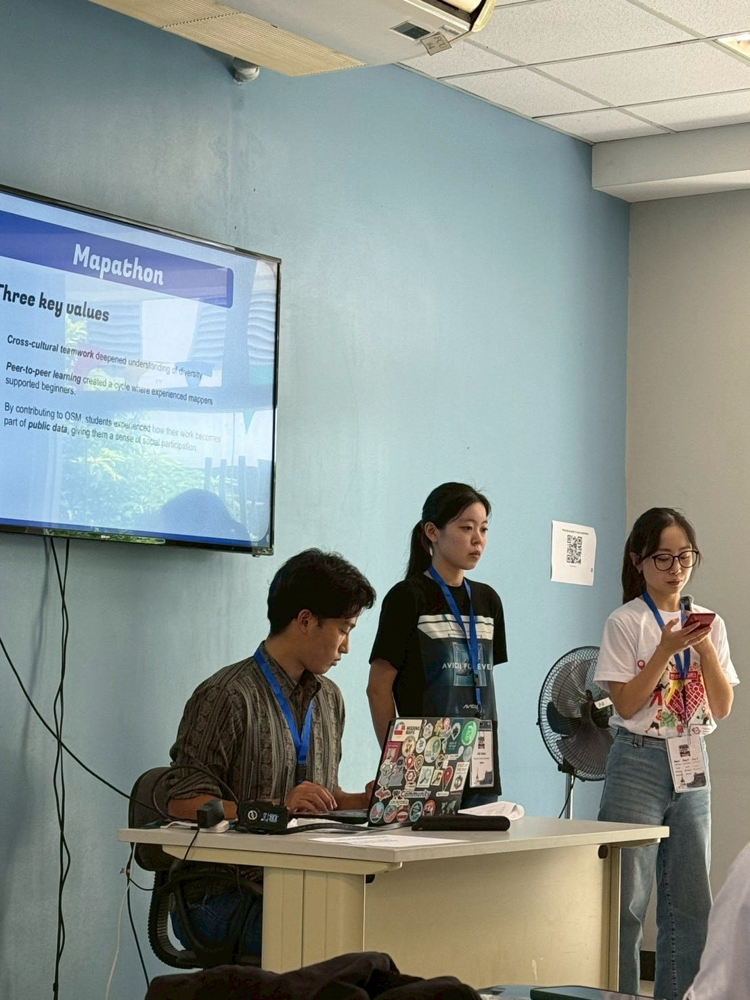
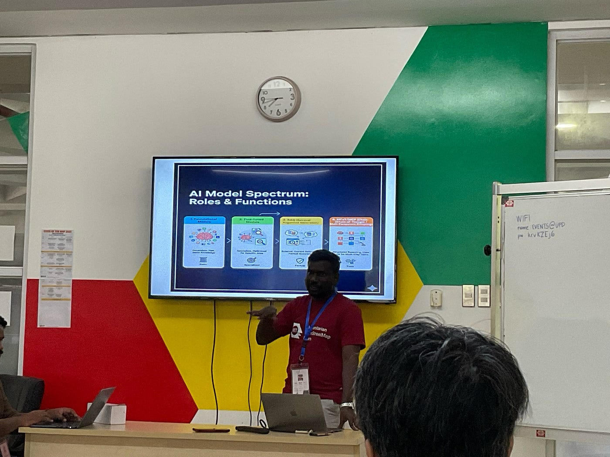
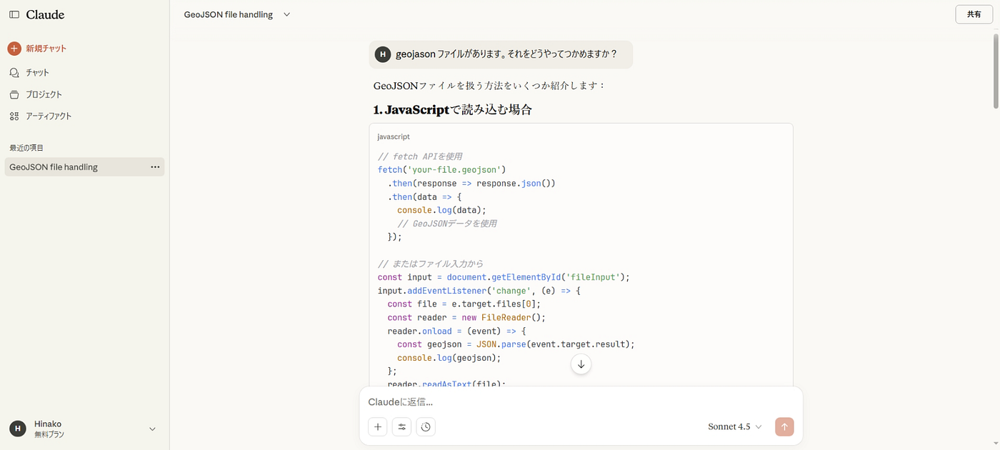
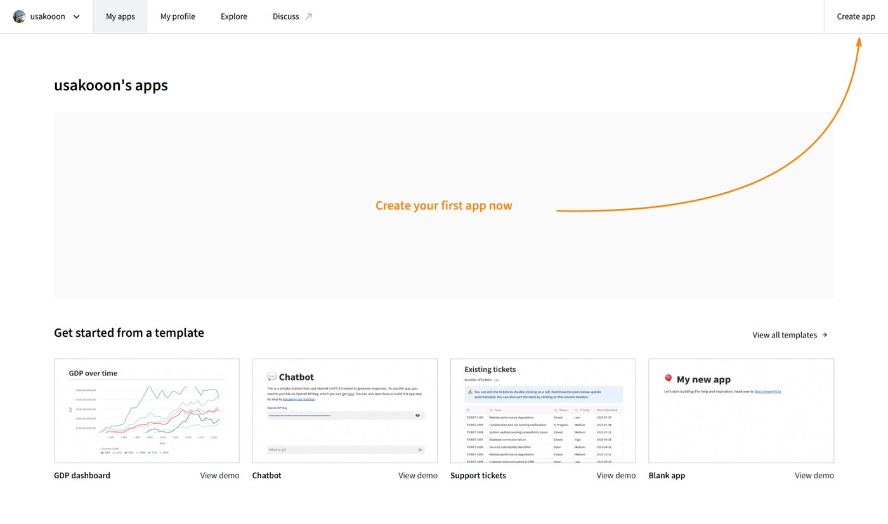
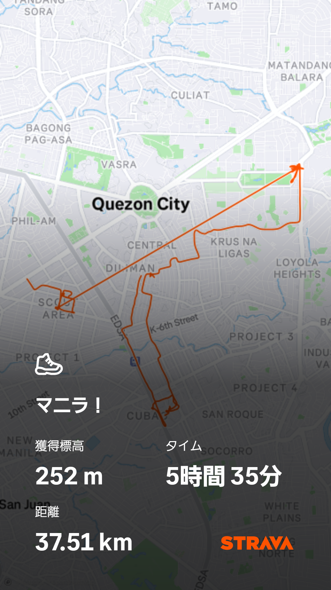

初の国際会議参加しました！

こんにちは。テラドです。

マニラで行われた国際会議の成果ついてご報告します。

### 概要

**イベント名：**State of the Map 2025 — Manila

**開催日程：**2025年10月3日（金）〜 10月5日（日）の3日間

**開催地（会場）：**フィリピン、マニラ首都圏 **ケソン市**にある**フィリピン大学ディリマン校 (University of the Philippines Diliman, UPD)**

**テーマ：**OpenStreetMapの歴史、現状、そして将来の方向性を議論するとともに、東南アジア地域におけるOSMの関連性と包摂性を探求する

**特徴：東南アジアで初めて開催**される国際的なSotMカンファレンス

### 登壇者として

#### 1. 登壇のテーマと舞台裏

まずは、登壇に至るまでの経緯を簡潔に紹介します。

> _**【登壇テーマ：8月開催のマッパソン報告】_**

> _今回、私は「State of the Map 2025」にて、今年8月に実施されたマッパソン（地図作成イベント）についての活動報告をしました。_

> _発表のほとんどは、メインスピーカーである先輩が準備してくださったおかげで、私は比較的スムーズに登壇することができました。_

#### 2. 登壇直後の率直な感想（恥ずかしさと気づき）

登壇者だからこそ感じた率直な感想と、他の登壇者との違いを具体的に記します。

> _**【原稿依存からの脱却：痛感した「プロ」との差】_**

> _登壇を終えて痛感したのは、自身の発表スタイルです。発表中、私は原稿から目を離すことができず、終始**原稿を読み上げる**形になってしまいました。_

> _一方、他の登壇者は違いました。彼らはパワーポイントの資料を軽く確認するだけで、あたかも聴衆と会話をするかのように、自分の知識を**自由自在に、流暢な英語で**説明していたのです。この時の「恥ずかしさ」が、私にとって最大の学びのきっかけとなりました。_

#### 3. 次に向けた目標と国際レベルの基準

> _**【卒論発表への挑戦：国際会議が求める「3つの壁」】_**

> _私は、来年以降、自身の卒業論文を今回の「State of the Map」のような国際会議や学会で発表することを目標としています。今回の参加は、まさにその目標達成のために、**どの程度のレベルが求められるのか**を肌で感じる貴重な機会となりました。_

> _具体的には、国際的な舞台で成功するために必要な課題は以下の3点です。_

- **専門知識の絶対量:** 知識が曖昧だと、英語での表現が崩れる。まず日本語で完璧に説明できる専門知識が土台。

- **専門用語の英語化:** 専門分野の概念や用語を、瞬時に、**正確な英語**でアウトプットできる語彙力。

- **原稿に頼らない説明力:** 自分の研究テーマを、原稿なしで、**誰にでも伝わるように話す**能力。

> _今後は、知識のインプットと、それを自由に説明するアウトプット能力を徹底的に磨き、原稿を一切見なくても聴衆に語りかけられるような発表者を目指します。_

### ワークショップでの学び

_**From Maps to Models: Building AI Context Tools for OpenStreetMap_**

このセッションは、OSMデータと AI（大規模言語モデル：LLM）を組み合わせて、マッピング作業を支援するツールを **オープンかつローカル実行型** で構築することを目的としています。

このワークショップの最大の学びは、**AIをマッピングに使う際の役割分担**です。

#### ① Overpass QL Generator：データ抽出（インプット）

**目的**：OSM（OpenStreetMap）から必要な情報を正確に取得する

**やること**：

Overpass Turbo などでクエリ（Overpass QL）を作成

- 例：「横浜市内の `amenity=cafe` をすべて取得」

- OSMデータベースから**生データ（GeoJSON, XML, JSONなど）**をダウンロード

**役割**：

・研究・分析対象となる“地物（建物、道路、公園など）”を抽出

- 余計なデータを取らず、必要な範囲・条件に絞る

#### ② Claude（LLM）：データ処理・分析・コード生成

**目的**：抽出したOSMデータを「意味のある形」に加工・分析する

**やること**：

・ClaudeやGPTなどの大規模言語モデルに、データ構造を抽出**PythonやGeoPandasなどのコードを自動生成してもらう**

・データの整形（クリーニング）、空間分析（面積、距離、統計処理など）

**役割**：

・コードを自分で一から書く負担を減らし、分析プロセスをスピードアップ

・分析の方向性や処理の自動化にも活用可能

#### ③ Streamlit Apps：可視化・ツール化（アウトプット）

**目的**：分析結果を、誰でもアクセスできる形で「見える化」する

**やること**：

・StreamlitでWebアプリを構築

・地図・グラフ・統計情報などをインタラクティブに表示

・コードを書かないユーザーでも操作できるようにする

**役割**：

・研究成果を共有・発表しやすくなる

・ユーザー参加型プロジェクトや政策提案にも応用可能

### 最後に

今回の国際会議では、色々な発表やワークショップに積極的に参加することが目標でそれは達成することができたのですが、あまりにも専門的なことだったり、自分の英語力の問題もあり話を理解することができず悔しい思いをしました。現地参加したからにはコミュニティを広げることを今後意識していきたいです。

### Strava

[https://strava.app.link/9Ks5jLevqXb](https://strava.app.link/9Ks5jLevqXb)

