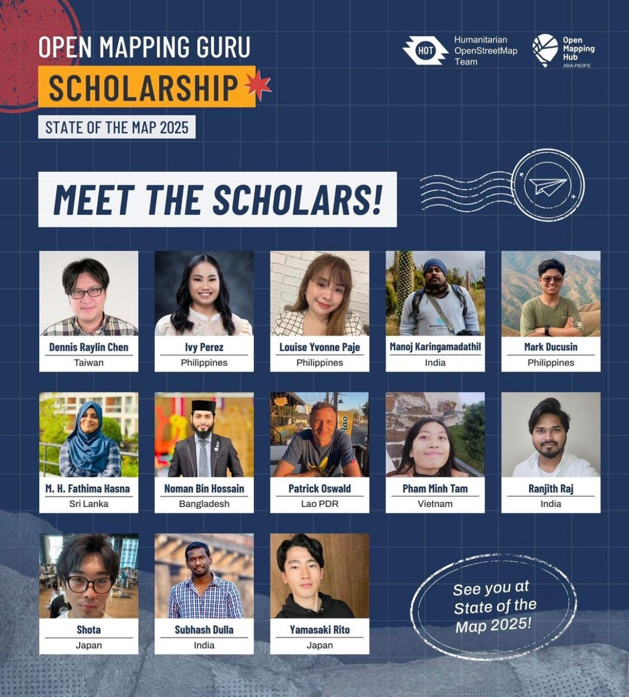
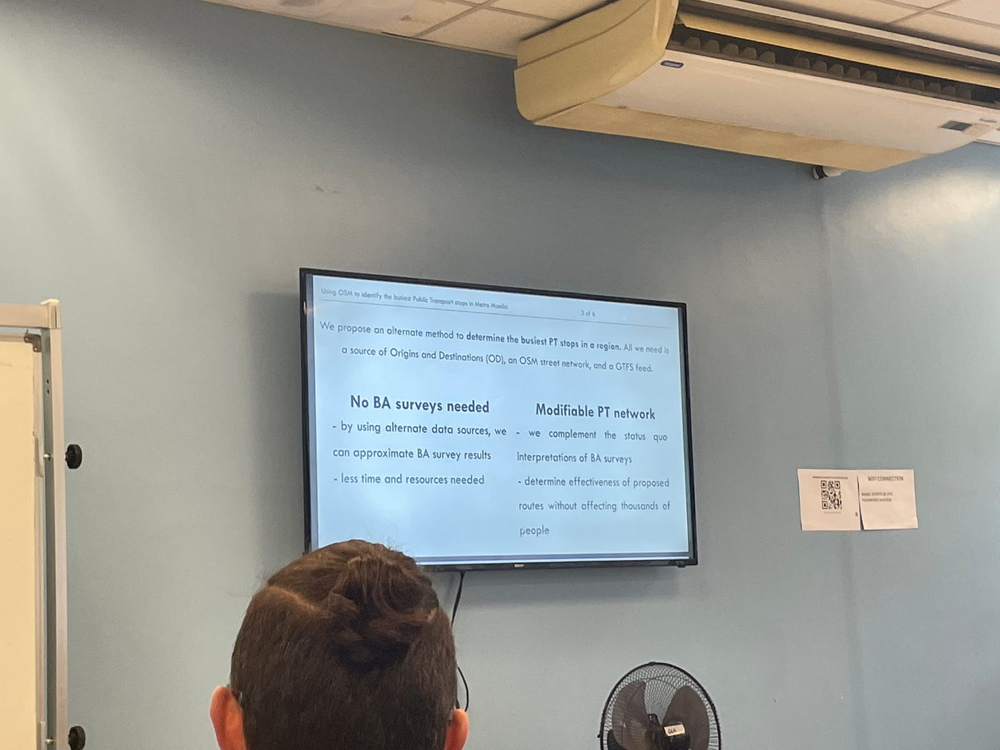
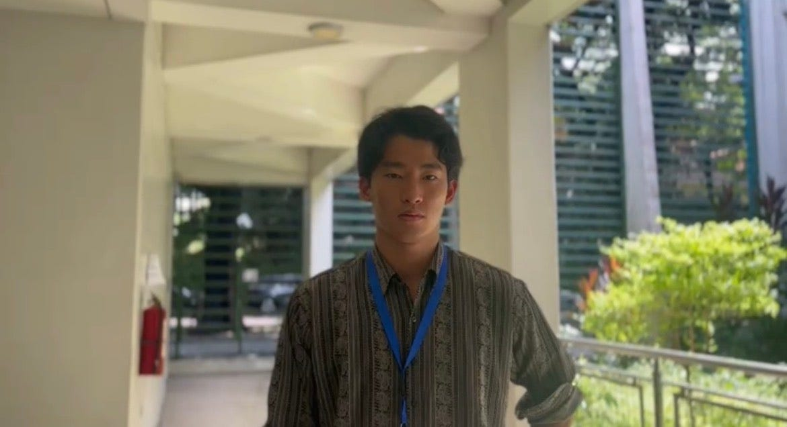
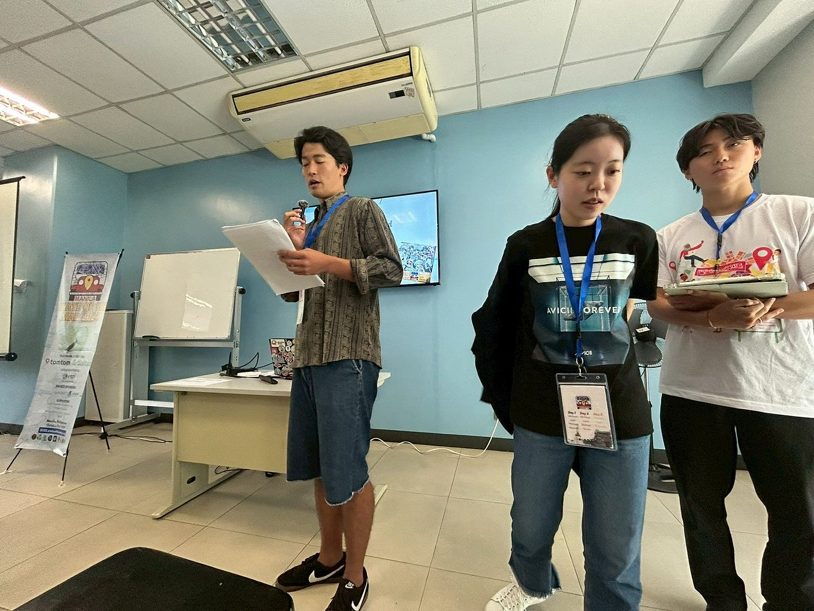
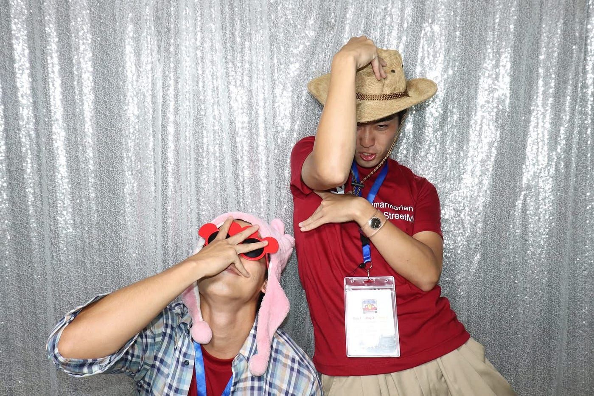
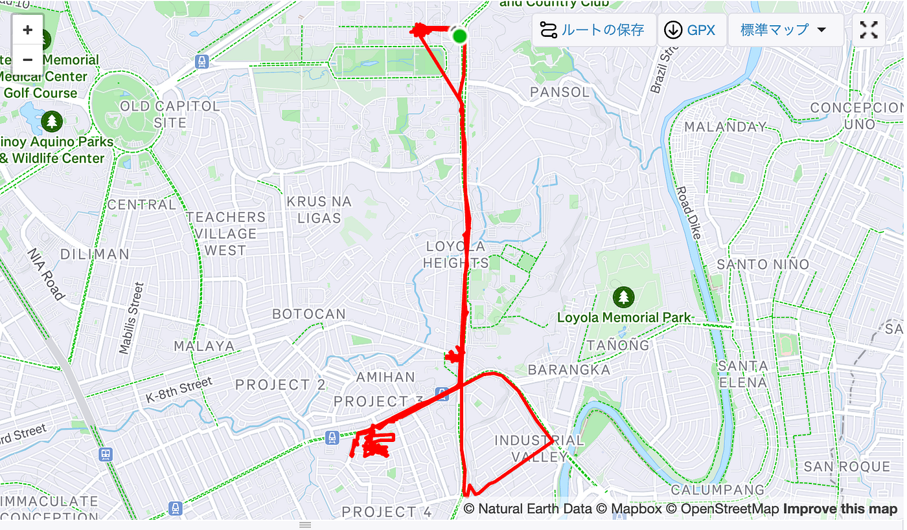

### 初めての会議は海外！？

こんにちは山﨑です

今回は私が参加した[State of the Map 2025 — Manila](http://2025.stateofthemap.org/)についての報告をしたいと思います！

#### 何をしたのか

私が初めての国際会議で何をしたのかというと、、、

・スカラーシップ生として運営補助（写真撮影係）＋インタビュー

・[青山学院大学ユースマッパーズの成果報告](https://2025.stateofthemap.org/sessions/8VMYYW/)
 [スライドはこちらから](https://docs.google.com/presentation/d/1cET-Q-v9xsfhglM0Fk8w_sGf1KanJXO5/edit?slide=id.p1#slide=id.p1)

などなど、てんこ盛り

#### 撮影中

#### インタビュー中

#### 登壇の様子

#### 実際に参加した感想

初めての国際会議、初めての東南アジア、
苦難に見舞われながらも、なんとか会議当日を迎えることができました
日本から来ている学生は私たちだけ、周りにいる方たちはGISの最先端を担うトップレベルの専門家たち
最初は会場の雰囲気に飲まれそうになっていたのですが、ここで誰とも話さないで終わるのは時間とお金の無駄使いでしかない
そんなことのためにマニラに来たんじゃないでしょ！って自分に言い聞かせて、色々な人に話しまくってみたのは良い経験です
最初は何も知らない学生が話しかけたら笑われて終わるのかなと心配もあったのですが、案外、みんな話を聞いてくれて名刺をはじめとした連絡先もGET！
今回の繋がりを消さないためにも日本の写真を送るなどして日々奮闘中
最初は会議と聞いて硬い印象もあったのですが、ガッチリした会議というよりはお互いが地図を使って如何に世の中をよくしようとしているかを発表し、コミュニティを作るような場所なのだなと実感しました
次回の会議も楽しみです！！

#### Strava 軌跡[ Airbnb to GT Toyota](https://www.strava.com/activities/16026353336)

