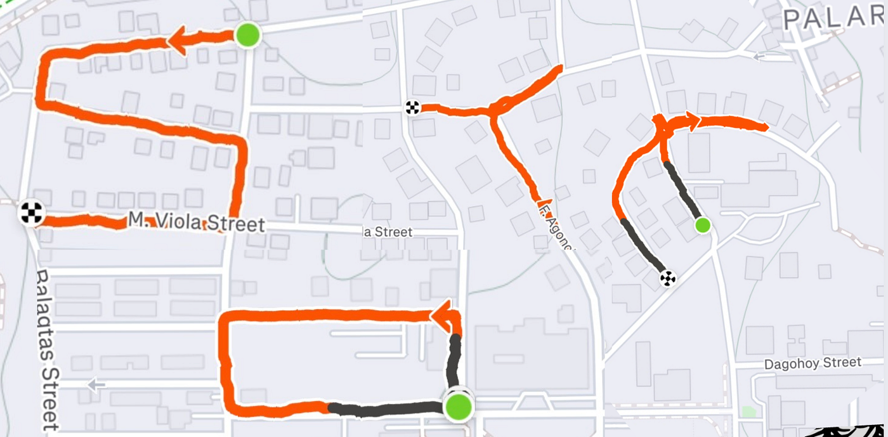
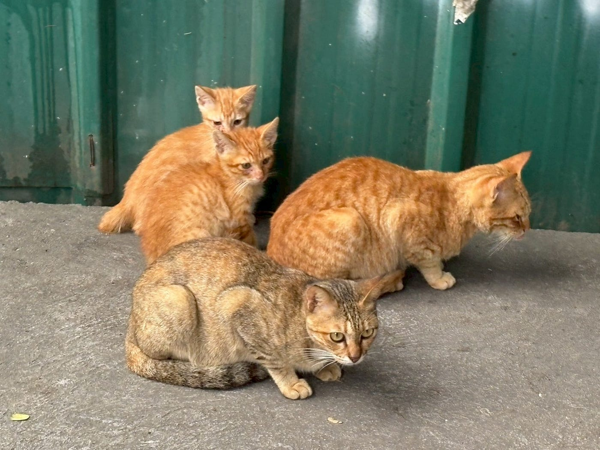
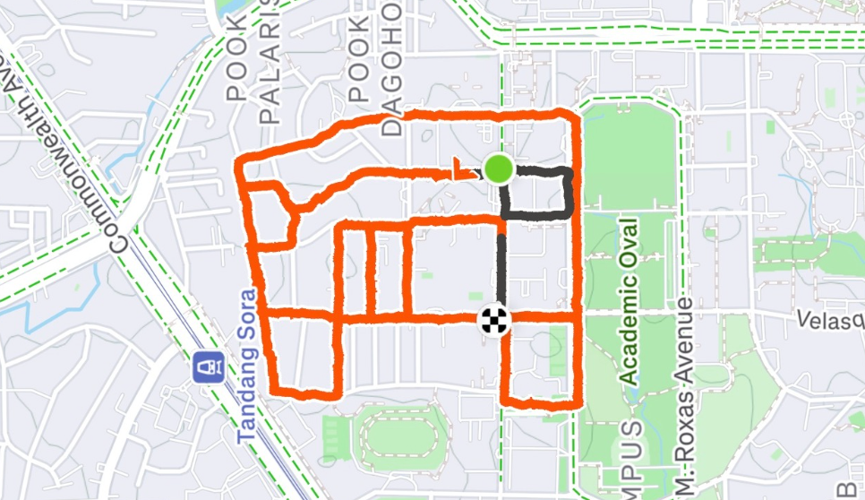
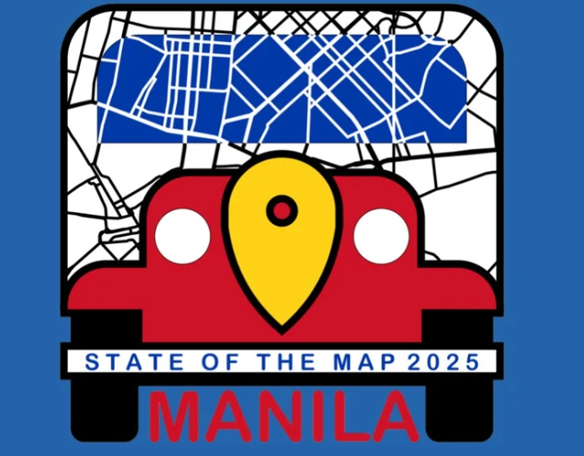
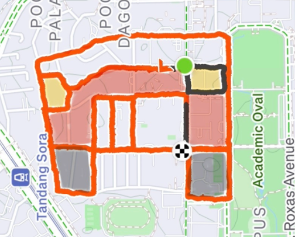
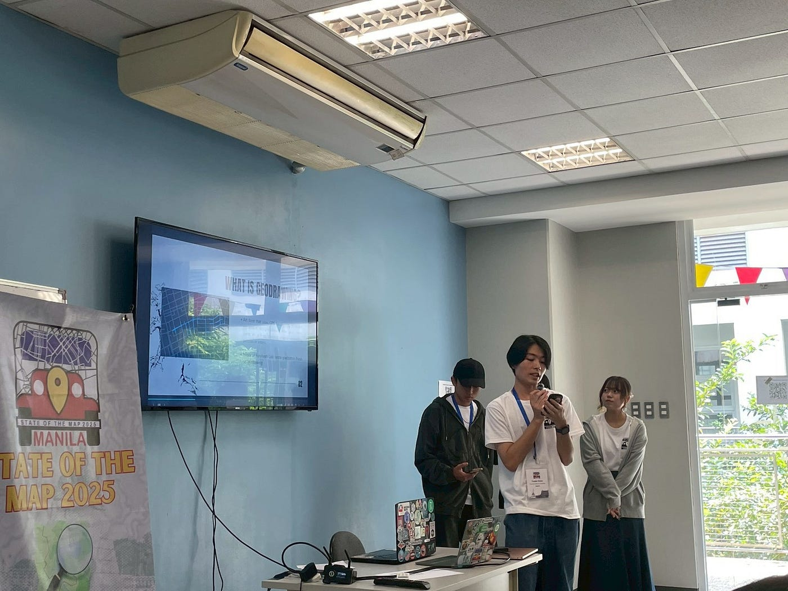
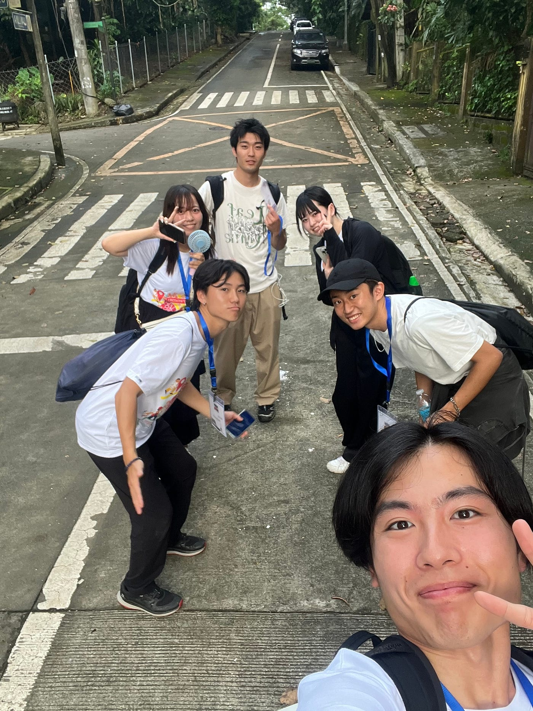
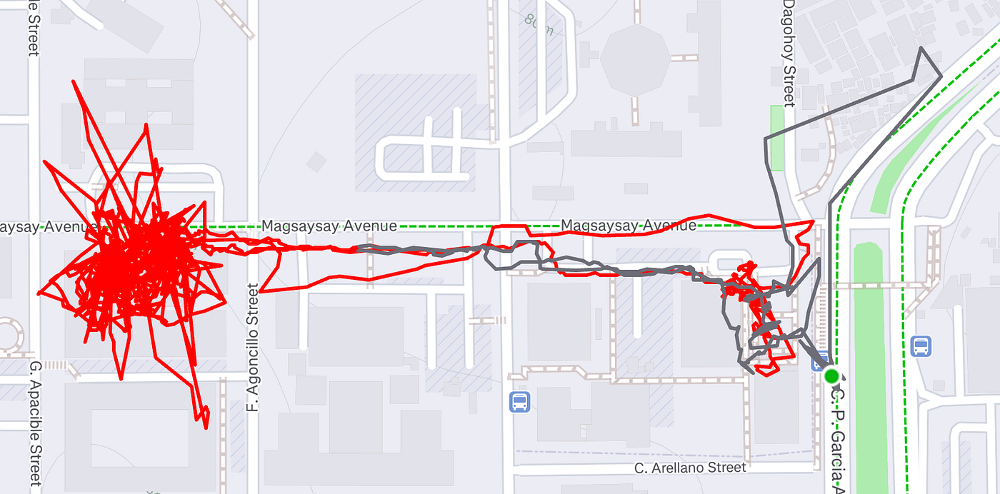

### 国際会議に参加したら急遽登壇までしちゃった件

こんにちは！古橋研究室3年の加藤です。やっと過ごしやすい気候になってきましたが皆さんはいかがお過ごしでしょうか？僕は9月序盤から始まった怒涛の忙しさが秋合宿でひと段落したことに歓喜を覚えています。9月2日3日からの万博を頭に、愛媛、千葉（幕張）、千葉（野田）、横瀬、マニラ、そして千年の森（長野）。2ヶ月半で7カ所。全部泊まり。我ながらおかしいと思います。

そんなことはさておき、私は10月3日から5日にフィリピンの首都マニラで開催された「State of the Map 2025」に参加してきましたので今回はその報告をしたいと思います。

> **State of the Map とは？**

・**日時：2025年10月3日から5日**

・**場所：フィリピン・マニラ＆オンライン**

・**概要**

State of the Map is the annual event for all mappers and OpenStreetMap users. In 2025 the State of the Map conference will be taking place in Manila, Philippines and online. It will be a three day conference packed with talks, workshops, discussion rounds and more. ([State of the Map 2025公式サイト](https://2025.stateofthemap.org/)より参照)

**日本語訳**

State of the Mapは、一年に一度開催されるすべてのマッパーとOpenStreetMapユーザーのためのイベントです。2025年のState of the Mapカンファレンスは、フィリピンのマニラとオンラインで開催されます。講演、ワークショップ、ディスカッションラウンドなどが盛りだくさんの3日間のカンファレンスとなります。

本来であれば登壇の予定はなく、参加者として登壇者の話を聞いてグラレコ書かなきゃなーなんて思っていたその時、世界のTaichi Furuhashiから鶴の一声、「ライトニングトークに登壇すれば？」と。

ライトニングトークとは当日会場で直接アサインして1グループ当たり大体5分くらいの枠で発表するもの。しかもこれに登壇すればグラレコも免除されるとのこと。なんということでしょう。古橋研ただの参加者メンバー4人の自分、れんせい、みあ、もえはこの話を聞いた瞬間に登壇することで意見が一致、発表に向けての準備にシフトチェンジしました。検討に検討を重ねた結果、テーマは[Strava](https://www.strava.com/?hl=ja-JP)のGPSログ機能を使った「ジオドローイング」。「S・O・T・M」の4文字とフィリピンではお馴染みの交通手段「ジープニー」をジオドローイングすることに決めました。ここからは準備段階から発表までの一連の流れを報告します。

> _**Phase1 「どうする？テーマ・ルート選定」（Day2 10/4 AM）_**

まずはテーマを選定。せっかくやるからにはどデカいことをやってウケを取りたい。というわけで「S・O・T・M」と今回のSotM2025のロゴにもなっている「ジープニー」を今回のテーマに。ここまではすんなり決まったのですが、ここで一つ目の壁「ルート選定」が我々に襲ってきました。特にジープニーが困難を極めました。「さすがにこれはジープニーには見えなさすぎる、、、」、「うまく行けそうなのにここだけ道が繋がっていない、、、」などという苦難に苦しみながらも、必ずしも北が上側に来なくてもいいじゃん、と見方を変えて約30分くらいでようやくルートが完成。すでに昼食が近づいていたのでご飯で英気を養ってから実際にてくてく歩くことに決めました。

> _**Phase2 「てくてくドローイングタイム」（Day2 10/4 PM）_**

ルートが決まったのであとはやることは一つ。そう。てくてく歩くのです。雨の降るなかチームライトニングトークと愉快な仲間たちは会場の外へと足を踏み出しました。まず取り掛かったのは「S・O・T・M」の4文字。ここは役割分担をして難なくすんなり完成。僕はTとMを担当。その2文字のStravaのリンクはこちらから。

Tのリンク

[https://www.strava.com/activities/16026729394](https://www.strava.com/activities/16026729394)

Mのリンク

[https://www.strava.com/activities/16026673321](https://www.strava.com/activities/16026673321)

そして完成形はこちら

そしてみなさまお待ちかねジープニー。会場であるUniversity of the Philippines Dilimanの周囲はアップダウンがかなり多く雨で足元が悪かったこともあり想像以上に体力を消費、その上すごくディープな住宅街で大型ワンコに吠えられたり、途中で両足に靴擦れができたりと踏んだり蹴ったり。猫の手も借りたいということはこういうことなのかと学べました。

ごめんなさい猫様。こうして私たちチームライトニングトークと愉快な仲間たちは猫の手は借りずに計1時間37分、6.6kmの道のりを歩き切ることに成功しました。

ジープニー作成のリンクはこちら

[https://www.strava.com/activities/16027886774](https://www.strava.com/activities/16027886774)

そして完成品はこちら

ここからは余談↓

さてジープニーも完成したことだし会場に戻ったところなんと驚愕、会場がもぬけの殻に。そう、参加者はすでに次のイベントのために別の会場へまさにそのジープニーで移動していたのです。はあ、これはGrabで移動だ、、と落胆していたところ目の前に最終便ジープニーがいるのではないですか！こうしてなんとか次の会場に移動できましたとさ。

> _**Phase3 「ハプニング発生？！どきどき登壇タイム」（Day3 10/5 PM）_**

あとはサクッとプレゼン資料準備してキチっと登壇しておしまい！というわけにいかないのが国際会議です。いざ自分たちの番になりパソコンをセッティングしようとしたところに気づいてしまいました。「変換アダプタなくね？」と。なんとか古橋先生の手も借りて周りに助けを求め、アダプタを借りることができました。今一度古橋先生およびアダプタを貸してくださった[田中さん](https://www.facebook.com/share/1AQFZRcCwM/?mibextid=wwXIfr)に感謝申し上げます。資料作成までのプロセスで満足してしまい、最後まで頭が回らず、自分の詰めの甘さを実感しました。

こうしてなんとか無事に発表は終了。多くの参加者に聞いていただき、フロアを「wow…」と笑顔で埋めることができ、直接「Good job!」の声をいただくことができました。

発表スライドは[こちら](https://www.canva.com/design/DAG0yXjXGaM/lvqxTCE2j4X8FA6Lisv3rA/view?utm_content=DAG0yXjXGaM&utm_campaign=designshare&utm_medium=link2&utm_source=uniquelinks&utlId=hf2ffe2ee9a)

> _**感想_**

今回初めて国際会議というものに参加してみて、その道のプロフェッショナルたちが一同に集まって自身の成果を発表する場に、研究室に入って半年のただの学生なんてただの場違いかな、と不安な気持ちも正直ありましたが、蓋を開けてみればただ淡々と話を聞くだけではなく、多くの交流イベントも存在し国籍、年齢、性別関わらずみんなフレンドリーに私たちに接してくださり、多くの刺激を感じOpenstreetMapコミュニティの一員になれたとこの肌で感じることができました。一方、自分よりも遥かにレベルの高い学生とも交流することができ自分のちっぽけさを痛感しました。ただこれをネガティブに捉えるのではなく、ポジティブに「伸びしろしかないな！もっと頑張るぞ！」という気持ちの方が強く感じています。そして実際に急遽登壇をして、先ほども言及しましたが自分の詰めの甘さを感じた一方、たった二日間で国際会議の登壇を完成させたという経験は自身の経験値として成長につながったと感じています。

次は来年の夏に開催されるFOSS4G Hirosima 2026！我々がホストとしてどれだけ盛り上げられるか今から楽しみです！

[Strava](https://www.strava.com/activities/16018291507)

