## 夏最後の思い出！国際会議に参加してみた

こんにちは。3年の小崎です。

10/3~10/5にフィリピンのマニラで開催されたSotM(State of the Map)という国際会議に参加しました！

> **概要**

英文:

“State of the Map (SotM) is the annual event for all mappers and OpenStreetMap users – the community who create and make use of the OSM data. It is a three-day conference that brings together the OSM community from around the world to celebrate, share, and learn.”

([State of the Map 2025公式サイト](https://2025.stateofthemap.org/)より引用)

和訳:

「State of the Map（SotM）は、OSMデータを作成し利用するコミュニティである、すべてのマッパーとOpenStreetMapユーザーのための毎年恒例のイベントです。 世界中のOSMコミュニティが集まり、お祝い、共有、学習を行う3日間の会議です」

簡単にまとめると、

世界中の地図好きや研究者が集まって、OpenStreetMapについて話し合う国際会議です。

オンライン参加も可能でしたが、現地でしか得られないこともある！と思い現地参加を決意しました。

> **SotMで何をしたか**

本来私は登壇する予定はなく、参加者として色々な方のお話を聞きグラレコを3つ書く予定でしたが、優しい優しい古橋先生が登壇して発表してみなよ、とお声かけしてくださったので登壇予定がなかったメンバーでチャレンジすることにしました！

どうせ発表するなら笑いを取ってこい！とのお達しがあり、発表テーマは**ジオドローイング**を選んでみました。

ジオドローイングとは、GPSや地図アプリを使って「地図上に絵を描く」アート表現のことです。

ただ、発表を決めたのは前日の午前。つまり発表まで24時間で何が書けるんだろう⁉️🙀とメンバー全員でじーーっくりと話し合いました。

どうせならこのイベントに関連したものをやりたい！という全員の意見から、

- SotMの文字列

- ジープニー(SotMのロゴにも使われているフィリピンの乗り物)

の2つを表現することにしました。

**SotMの文字列**

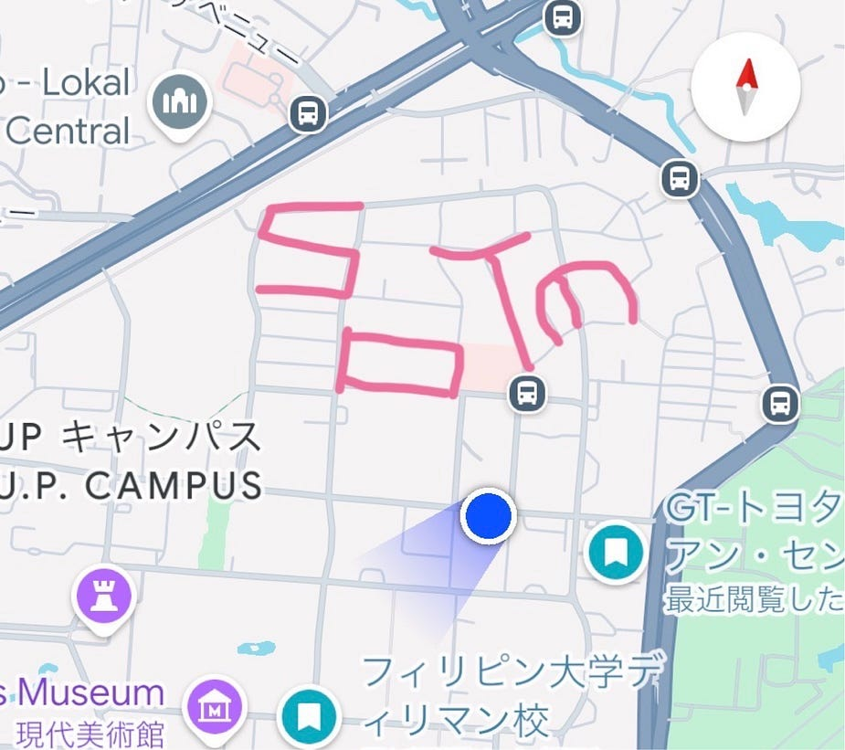

SotMの文字から歩くことに決定。

お昼ご飯を食べてみんなで意気込んだあと、早速雨が降ってきて傘を持っていない約半数のメンバーは濡れながら歩きました☔️

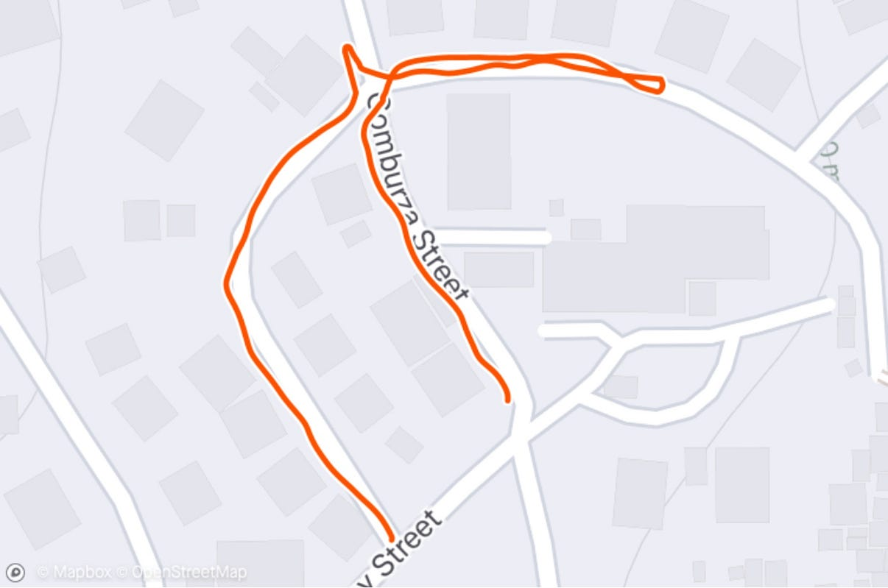

[https://www.strava.com/activities/16026673999](https://www.strava.com/activities/16026673999)

無事Mの文字を完成させたあとは、3つに分かれてSotの部分を作成しました。

私はSを担当しましたが、思ったよりも歩く距離が長かったのと、坂があり終わった頃にはだいぶヘトヘトで日頃の運動不足を実感しました。

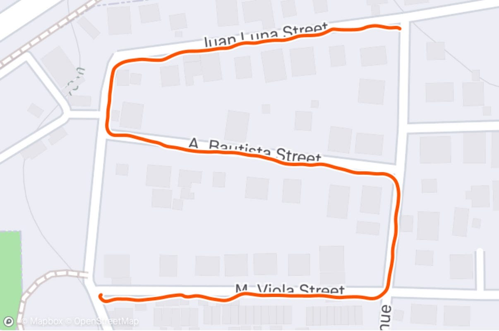

[https://www.strava.com/activities/16026813175](https://www.strava.com/activities/16026813175)

そして、全員の文字を組み合わせた完成系がこちらです。

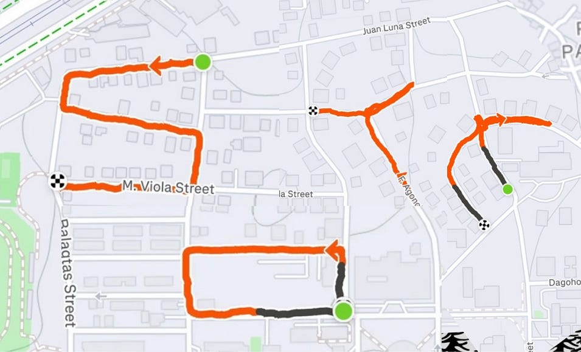

**めちゃくちゃ大変だったジープニー**

この時点で私はだいぶヘトヘトでしたが、謎の意地が出てきていて全部やりたい！となりジープニーを表現することも決めました。

ルート決めの時点からとても苦戦して、地図の向きを変えて考えてみたり、近付けたり遠ざけたりしてどうにかしてジープニーに見える部分がないかを考えました。

優秀なメンバー達が考えてくれたコース約6.69kmの距離をほぼノンストップで歩き続けて完成させたものがこちらです！

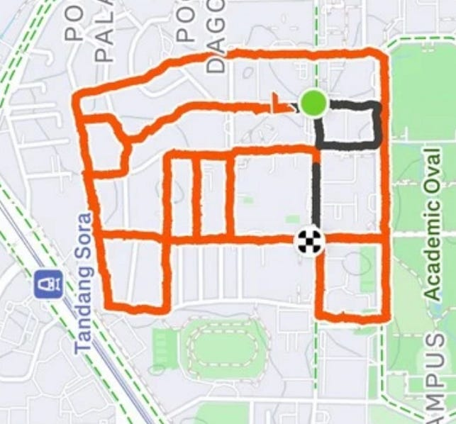

[https://www.strava.com/activities/16027891300](https://www.strava.com/activities/16027891300)

もうこの時点で発表まで終わらせたような達成感を感じていましたが、本番は発表です。

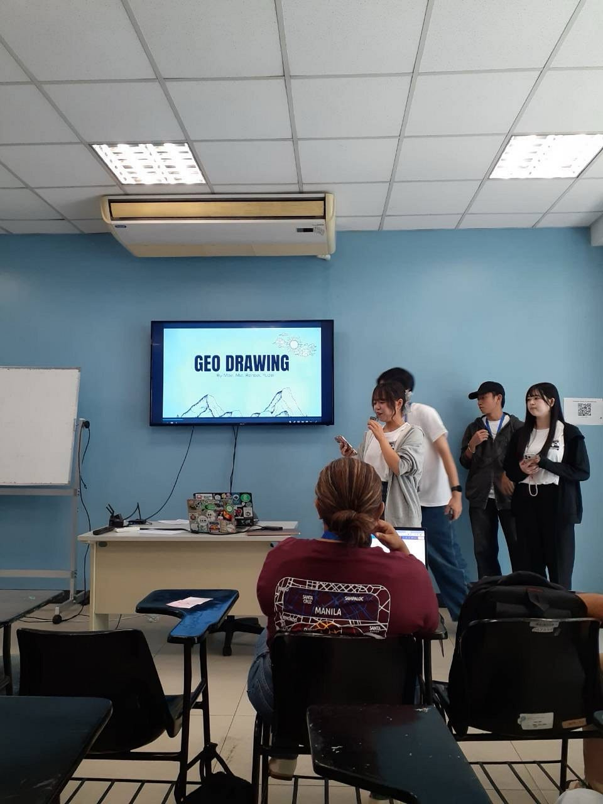

発表内容としては、

- ジオドローイングとはなにか？

- 何をテーマにしたか

- 作成過程

- 完成物の発表

について話しました。

どんな反応が来るかドキドキしながら発表しましたが、私たちが思っていた以上に反応が大きくてとても嬉しかったです。

**参加してみて感じたこと**

この3日間、発表や様々な人との交流を通して、自分が思っていた以上にOSMに関わっている人が多くいて、思っていた以上に熱量が高いことを実感しました。

ゼミに入ってから地図について学び始め約半年が経過し、OSMという言葉にも馴染みが出てきていましたが、自分が思っていた以上に界隈が盛り上がっていて、関連した研究を行っている人がたくさんいました。そういう方人達の話を生で聴き、自分がどれだけ何も知らないかを痛感すると同時に研究意欲も上がったことが今回現地参加をした一番の収穫だったと思います。

来年はFOSS4G HIROSHIMA 2026があると聞いて運営の方々にも着目してみましたが、とにかく盛り上げ上手で場の空気が冷えているタイミングが全くなかったなと感じます。私たちも来年頑張りたいです。

**Strava記録**

[strava.app.lin](https://strava.app.link/pIsGoEXTqXb)

[https://www.strava.com/activities/16111196888](https://www.strava.com/activities/16111196888)

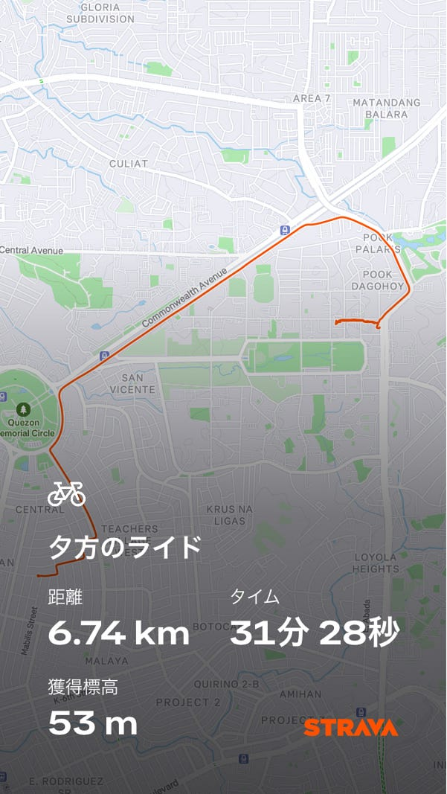

**以下思い出まとめ**

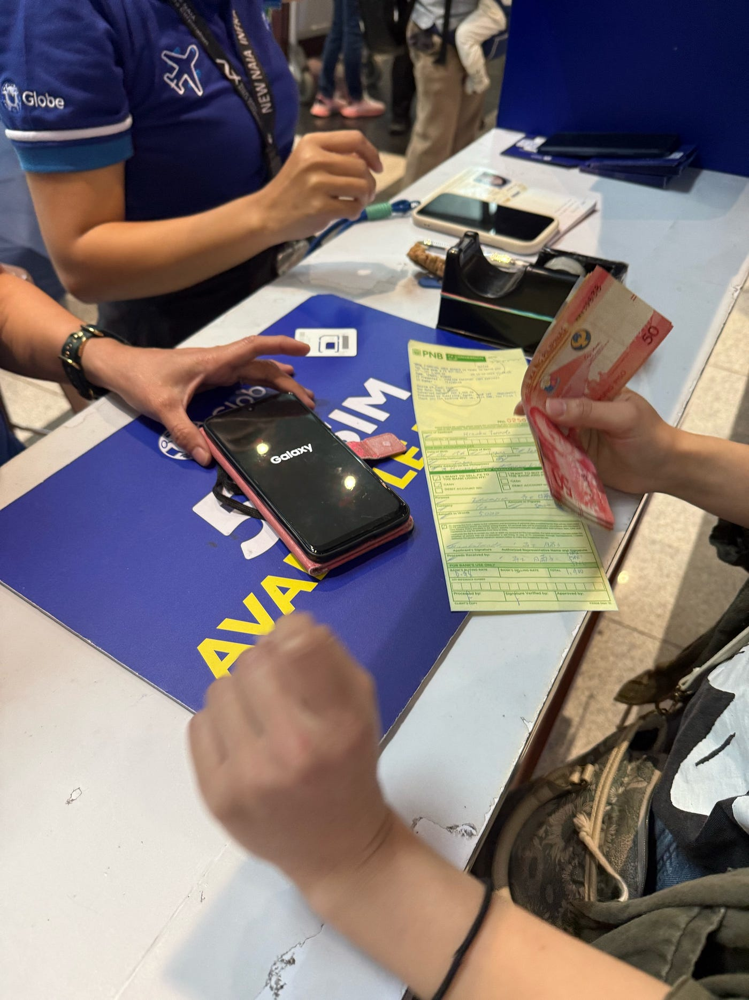

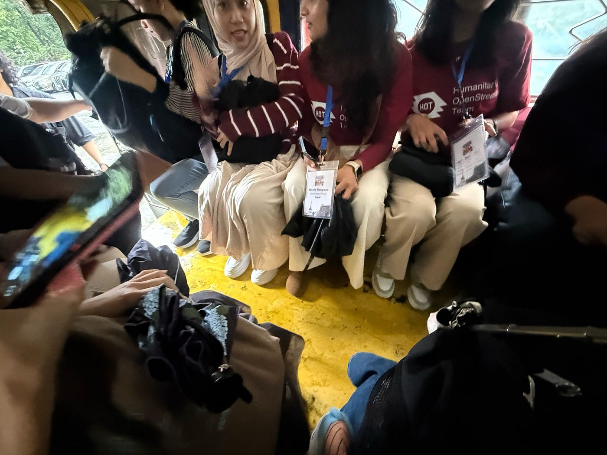

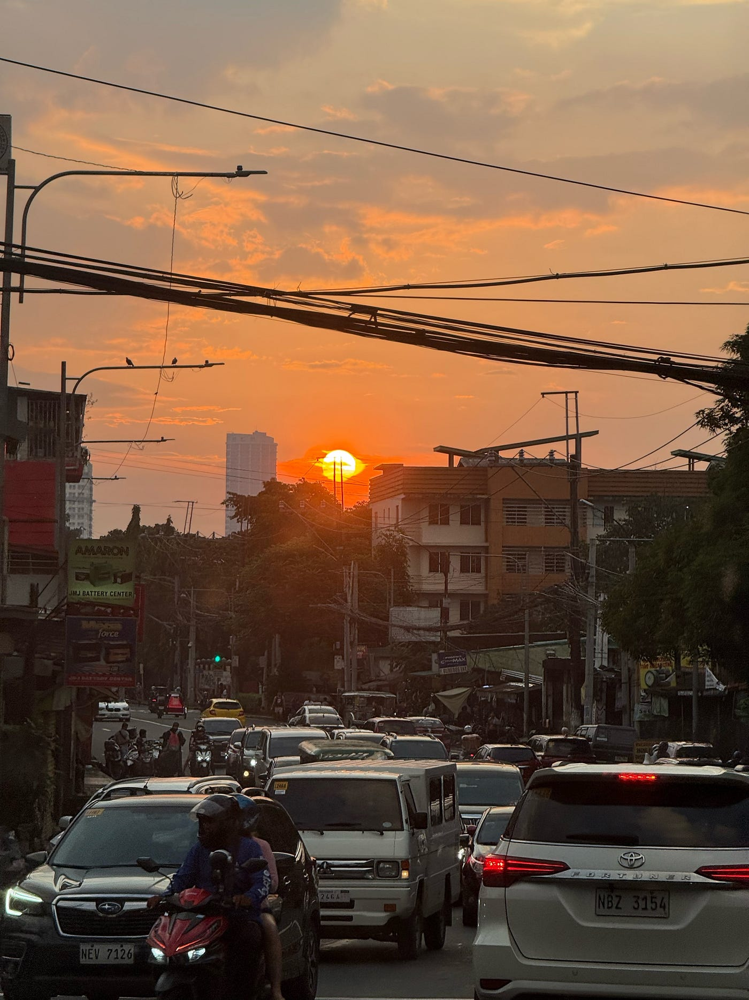

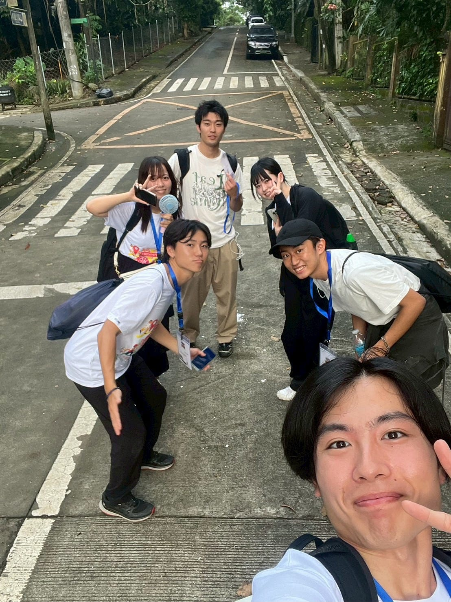

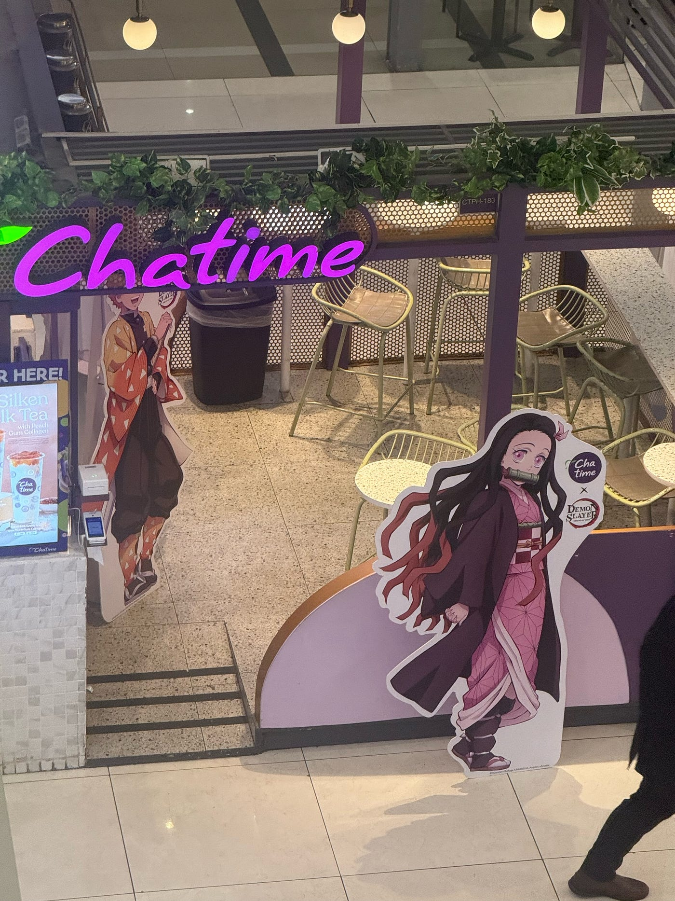

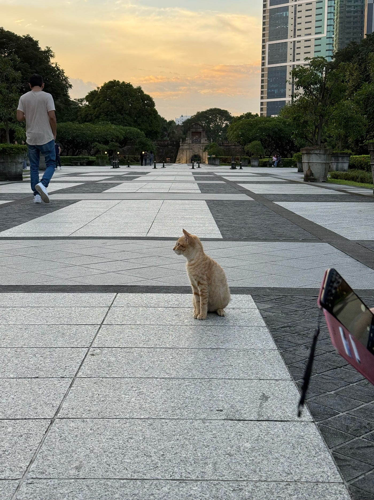

学びの面でも、遊びの面でも、とても充実した4日間だったと思います！疲労も凄かったけどその分楽しかった！
