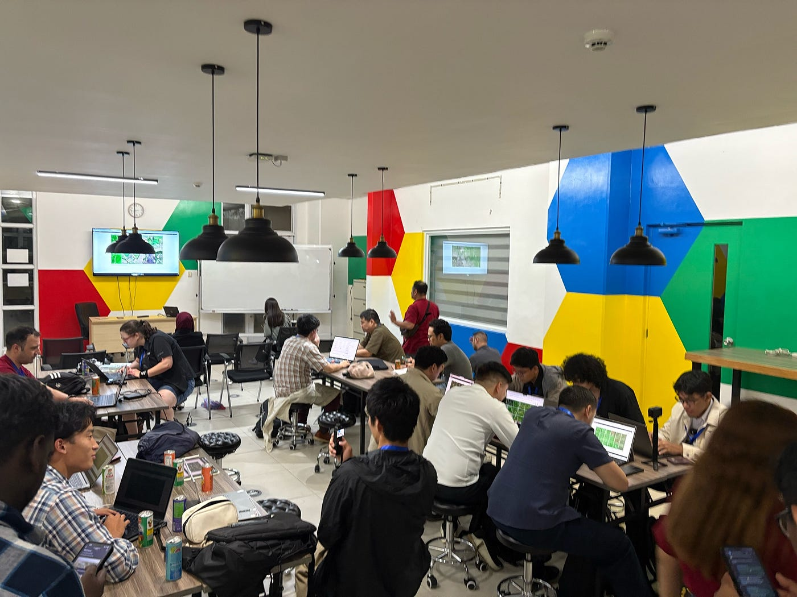
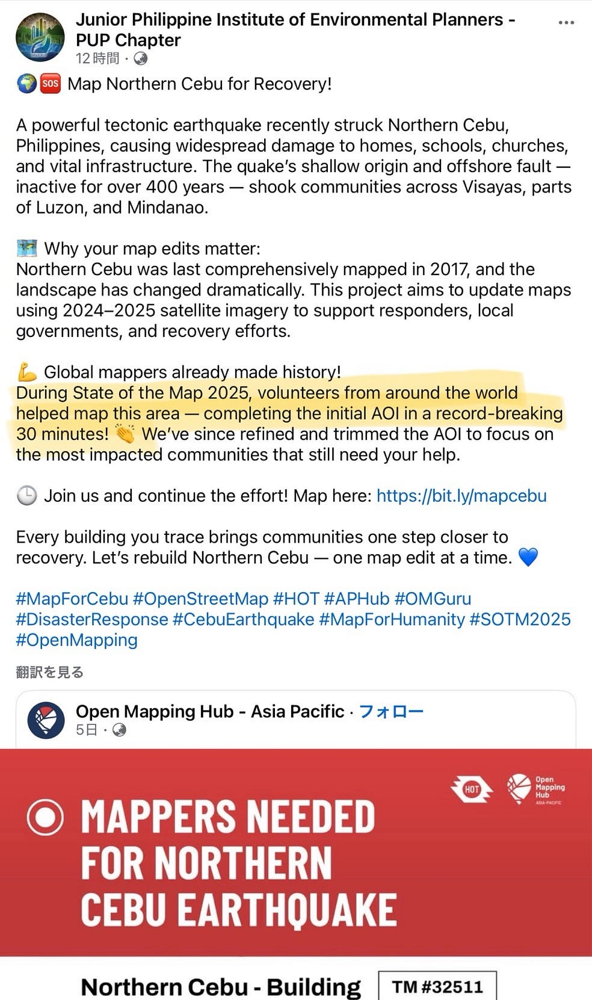
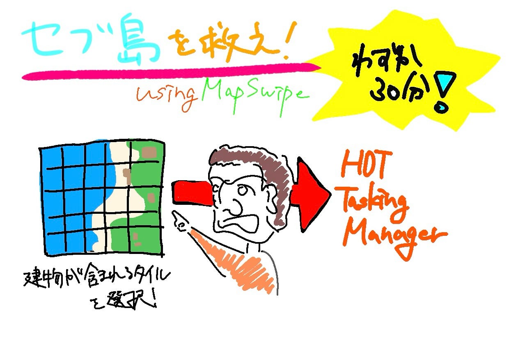

## 最速でセブ島を救った話【Youth2週報】

こんにちは！三年の本吉顕です。今回は9月30日にフィリピンのセブ島を近海で発生したマグニチュード6.9の地震に対するクライシスマッピングについてまとめていきます。

### ことの始まり

SOTM2025でマニラに世界中のマッパーたちが集まった中、Mikko Tamuraさんが招集令をかけました。セブ島を襲った地震に対して、クライシスマッピングのタスクが上がったので全員でマッピングをしようということです。そこで、一室にボランティアのマッパーたちが集まりました。

### 最速記録！

タスクとしては、[Map Swipe](https://mapswipe.org/en/projects/-Oa_hl0WiHjHeRU-Al1i/)の作業です。タイル分けされた被災地の衛星画像をもとに、建物が含まれているタイルを選択する作業です。Mikko Tamuraさんによるとこの作業はこれからのクライシスマッピングの建物のマッピングなどのすべてのもとになる作業です。この作業をもとにHOT Tasking Managerに優先的に取り上げる場所を選定し、効率的にマッピングを進めるための基盤を作ります。

しかし、これだけの人数が一斉に始めるとなるととても早い！なんと作業は30分もかからずに終わってしまいました。このプロジェクトに参加したマッパーたちに拍手です。ちなみにこの活躍はFacebookでもとりあげられています。

[ボランティアを称える投稿](https://m.facebook.com/story.php?story_fbid=pfbid023MWBvE2fG8MCQmjt7prbte1yETUSh8VLKWCYNEYWFprHjTrMhsvJoTATeqAiPdcMl&id=100067530816954)

### いざ、マッピング

しかし、クライシスマッピングはこれで終わりではありません。これはあくまで最初の段階。これから地道なマッピング作業が必要になります。現在、HOT Tasking Managerには我々のMap Swipeの成果のこのセブ島の建物のマッピングの[タスク](https://bit.ly/mapcebu)が上がっています。これを完了することでクライシスマッピングは完了するのです。いざ、マッピング。

### グラレコ

