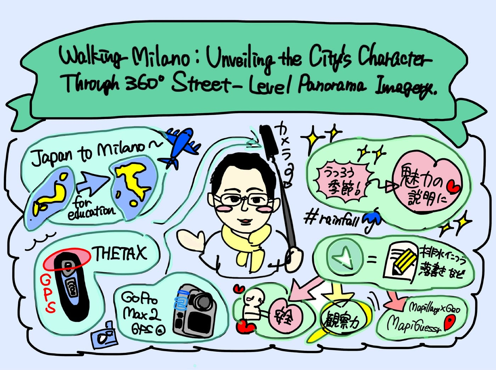
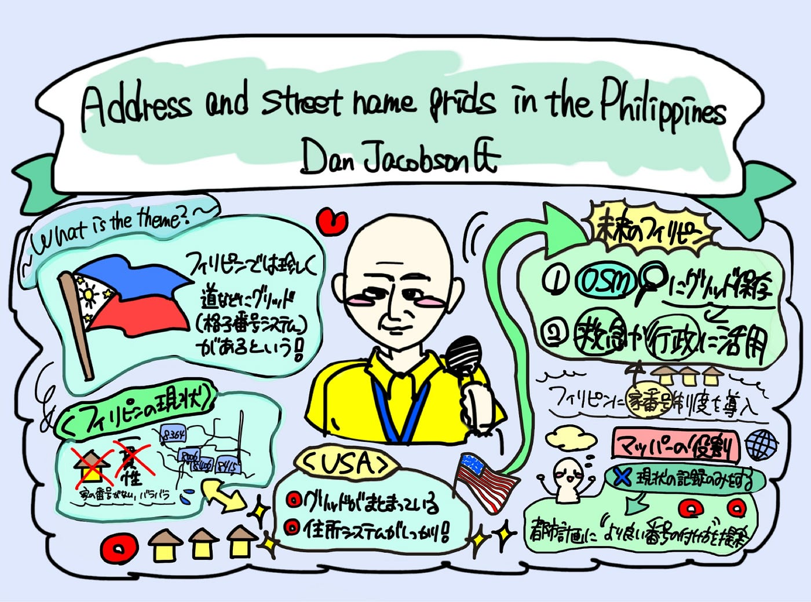
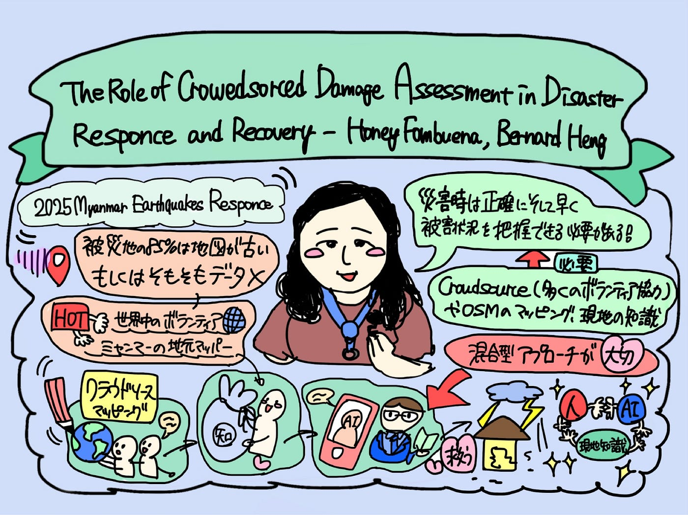

## State of the Mapに参加！

こんにちは！3年の稲田優花です。

ツリーハウス合宿お疲れ様でした🏕

今回は、10月3日から5日にオンライン参加した国際会議について報告をしたいと思います！

#### **SotM2025とは？**

まず、State of the Map（SotM）がどのような会議なのかについて説明しようと思います。

この国際会議は、OpenStreetMap（OSM）コミュニティが主催するイベントで、OSMやオープンマッピングに関わる研究や調査、取り組みなどが発表やワークショップを通して共有される場です。研究者、ボランティア、学生などが集まり、地図データの利活用についてや、災害対応や各国でのコミュニティ作りなどさまざまなテーマについて知ることが出来ます。

2025年の今回は、フィリピンのマニラで開催され、私はオンラインでMayonとPulagの2つの会場でのライブ配信を視聴しました。

### 〈1つ目の講義〉

### Walking Milano: Unveiling the City’s Character Through 360° Street-Level Panorama Imagery

（10月3日 13:30〜13:50）

#### 講義の内容

古橋先生による発表で、ミラノでの大規模なストリートレベル画像を約100万枚も収集したというプロジェクト報告が行われました。先生は2024年9月〜2025年8月にかけ、360°カメラで約100万枚のパノラマ写真を撮影し、Mapillaryへアップロードしてオープンデータ化していました。

この取り組みは、高解像度のストリート写真を集めることで、落書きから都市の安全性を確認したり、降雨後の冠水状況を理解したりと、人々にとって非常に役立つものになります。

また、マッピゲッサーという、MapillaryとGeo推測の融合したゲームについての紹介もあり、 360°カメラで撮影された画像は、多方面で活用できる情報だと理解できました。

#### 感想

街を歩いて地図を作成した伊能忠敬のような撮影方法が、現代においても効果的であることを実感しました。また、以前から、先生のInstagramなどSNS上で、今回紹介されていたカメラを持っている写真などが投稿されているのを見ていたため、発表を身近に感じることができました。

実際に撮影された写真とともに説明を聞く中で、360°画像が、解像度の高い情報として都市のためにさまざまな方面で利活用できることを理解し、驚きました。

特に、季節の移ろいや街に描かれた落書きなど、細かなデータを集めることが、都市の魅力を理解することや、防災、安全、観察力、ゲームにまで繋がっている点が面白いと思いました。自分も普段から散歩やランニングをするのが好きなので、普段から行動をMapillaryやStrava、GoogleEarthなどで記録付けすることで、可視化するような取り組みをし続けていきたいと感じました。

#### 私の質問

#### What was the biggest challenge you faced during the collection of one million 360° images in Milan? (失敗、課題は？)

#### 頂いた回答

The biggest challenge was camera overheating during the hot summer. I brought two cameras but both broken due to high temperatures. To address this, I plans to collaborate with camera manufacturers, like a DJI, GoPro, Ricoh to detect more heat-resistant devices. Because I’m an ambassador for a camera company, so I can request the models that optimized for higher-temperature operation to make stable cameras.

(持っていった2つの360°カメラが両方壊れてしまったこと。次への課題としては、カメラ会社とコラボして熱に強いモデルを作ること。)

### 〈2つ目の講義〉

### Address and Street Name Grids in the Philippines

（10月5日 10:30〜10:50）

#### 講義の内容

OpenStreetMapのデータ分析により、フィリピンにはアジアでは珍しく住所番号のグリッド(格子番号)システムが存在する地域があることについてお話されていました。フィリピンでは、これまでの条例などを踏まえ、家の番号が無いパターンや、奇数系ストリートが偶数系に混ざるパターンなど、地域ごとにさまざまなスタイルの番号の並びがありました。

それに対し、アメリカでは一貫したグリッドや住所システムがありました。そこで、将来に向けたフィリピンへの提案として、アメリカのように扱いやすく救急や行政に活用しやすい未来の地図作成に向け、OSM上にグリットを保存するべきということと、そのためのマッパーの役割(現状の記録を着実に行っていくようにすること)についてもまとめられていました。

#### 感想

住所や番地は人々が目印として日常的に必要とする情報だが、フィリピンでは地域によってさまざまなパターンがあり興味深かったです。特に、設置の過程奇数の抜けた数値の並びが生まれていたというお話には、災害や地震などの緊急時などに人々が困るであろうと感じました。一方で、アメリカではグリッドがまとまっており、住所システムもしっかりしているといい、フィリピンにとっての大きな課題を強調するのにいい例だと感じました。

#### 私の質問

#### What are your next steps after this grid pattern research? (グリッド調査の次のステップとしてなにを目指しているか)

#### 頂いた回答

時間の都合で講演中に明確な回答は得られませんでした。

そのため、自分自身で質問に対する回答を考えました。次のステップとしては、住民向けの案内として、住所表記の見直しを考えていることを伝え、影響力を持たせ、実際に人々の役に立つ変更にしていくことが考えられます。

### 〈3つ目の講義〉

### The Role of Crowdsourced Damage Assessment in Disaster Response and Recovery（HOT）

（10月5日 11:00〜11:20）

#### 講義の内容

Humanitarian OpenStreetMap Team(以下、HOT)が実施した2025年のミャンマー地震対応についてのお話と、Crowdsourceによるアプローチについての報告でした。ミャンマーでは被災地の地図、OSMデータの約85%が古いものであるといいます。しかし、災害対応にAI生成の自動データのみに頼ることはリスクがあるそうです。そのため、HOTはmyOSMなど地域コミュニティと連携し、Tasking Managerなどを用いてボランティアの手作業マッピングと検証（一般ボランティア→地域専門家→AI情報の順で連携する）を行いました。

プレリミナリー分析では、手作業データは専門家のマッピングよりも高い建物数を示すことがあり、AIのみでは欠落が多いことが指摘されていました。低解像度・色ずれ・影など画像品質の問題がある中で、地域知識を取り入れた混合的アプローチが、正確さの向上に重要であるそうです。

#### 感想

私たちがAIに依存して地図を作ることに対する危険性や、地域マッパーの知識が持つAIよりも大きな価値を理解でき、とても驚かされました。

実際に、自らもマッピング作業をこれまで古橋研究室で行ってきたことで、「災害対応」においては、より正確にすることが人命や支援につながると理解していました。そのためプロセスとしてまず一般の人々による設計、その後に専門家やAIも含めて混合的なアプローチを取るという万全な策にはとても素晴らしいと感じました。そして、自らもOSMを通じてこれからも災害マッピングに関わっていきたいと強く思いました。

#### 私の質問

#### If resources are limited, what should be the first priority when checking for damage to a building? (情報が少ない時にどのようにして建物の破壊を見抜きますか？)

#### 頂いた回答

May be first the poster speak imagery is one of the first thing that you have to use and when assessing damage, I think really you have to check damage all over and all over again because as for me, even though I am training the gurus. They I also get insights from them. So yeah, I think you have to familiarize yourself all over again.

(ダメージを何度も何度も確認する必要がある。私自身はグルを指導しているにもかかわらず、彼らから洞察を得ることもあるため。)

#### 全体を通した感想

今回初めてSotMの国際会議に参加してみて、まず、テーマの幅広さに驚きました。OSMやオープンマッピングに関するお話ではあっても、ゲームに関する発表や、バングラデシュの過酷な状況についての発表、私たち青学生の発表など、さまざまななテーマがあり、とても刺激になりました。

オンラインであったため、会場のネットワークの問題などで配信が途切れる場面もあったものの、2日目以降は回線も直り、全体を通して、ゼミでの防災マッピングに対するモチベーションが高まる機会となりました。来年度の広島での開催に向けて精一杯頑張りたいと思います！
