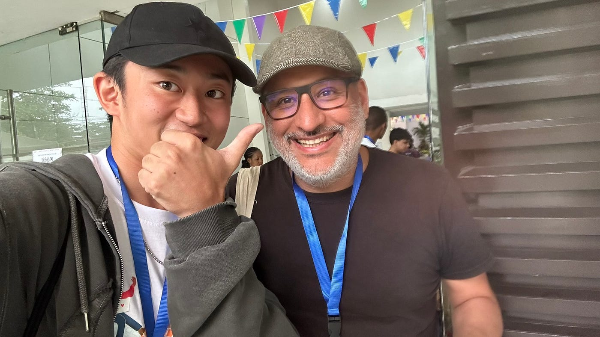
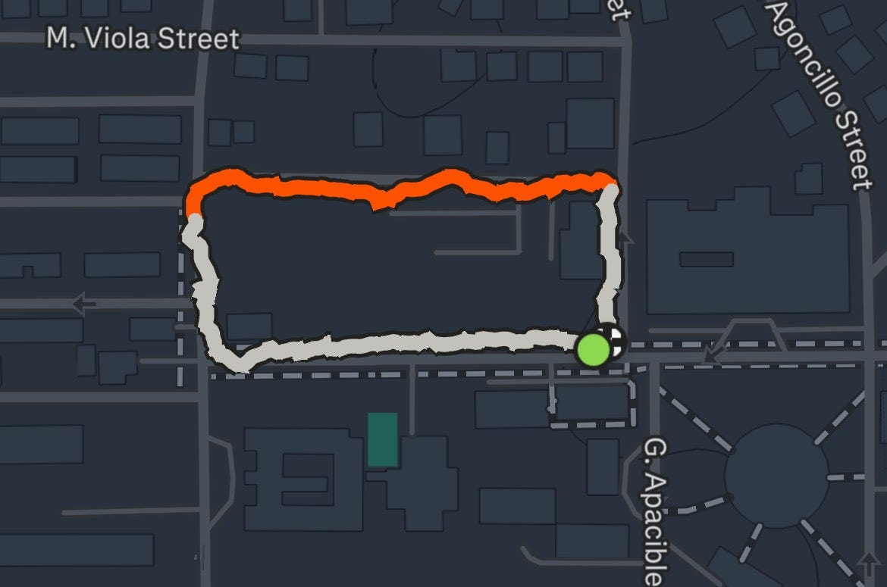
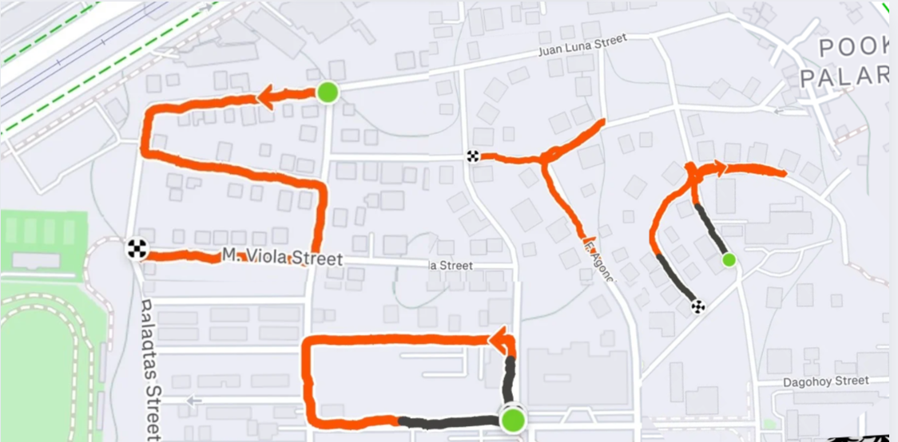
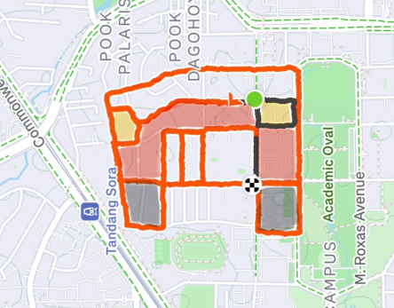
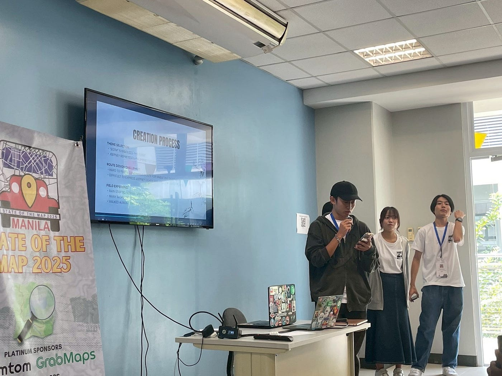
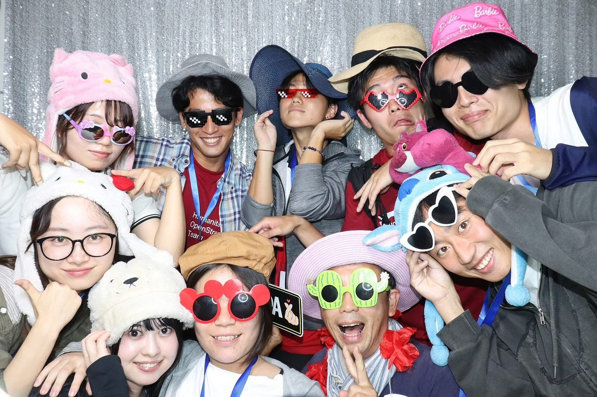

### 国際会議に参加！まさかの発表まで

こんにちは、3年の井上です。

皆さん、今年の夏休みはいかがだったでしょうか。私はかなり忙しく過ごしていた影響でしょうか、謎の発熱によりダウンしてしまいました(笑)。季節は食欲の秋という事で、いっぱいおいしいものを食べて体力回復に努めたいと思います！

さて、今回は10/3～10/5にフィリピンのマニラで開催された、State of the Map 2025に参加してきたということで、その報告をしたいと思います。

> _**概要_**

今回参加した国際会議に概要は以下の通りです。

”State of the Map (SotM) is the annual event for all mappers and OpenStreetMap users — the community who create and make use of the OSM data. It is a three-day conference that brings together the OSM community from around the world to celebrate, share, and learn.”

([State of the Map 2025公式サイト](https://2025.stateofthemap.org/)より引用）

日本語訳

State of the Map (SotM)はすべてのマッパーとOpenStreetMapユーザーのための年次イベントです。世界中のOSMコミュニティが一堂に会し、祝い、共有し、学ぶ3日間のカンファレンスです。

つまり、世界中のマッパーや有識者が集まり、意見交換や交流を深める場という事です。

> _**会議での活動内容_**

私が今回の国際会議での活動は主に二つです。

1．登壇者の発表を聞く

2．LT（ライトニングトーク）に登壇

この二つになります。それぞれの活動内容や感想を紹介します。

#### 1．登壇者の発表を聞く

1日目と2日目は主に様々な人の発表を聞きました。タイムテーブルを見て各々が気になる発表を聞きに行きました。我らが古橋先生の堂々とした発表も見ることができました！

そんな中、特に印象的だった発表を紹介します。

それは、Jaime Gutiérrez Alfaroさんの[OSMTracker](https://wiki.openstreetmap.org/wiki/OSMTracker_(Android))に関する発表でした。

そもそも、OSMTrackerとは移動した軌跡やウェイポイントの記録、ジオタグ情報の付与やビデオの撮影などを可能とするアプリで、記録した軌跡はGPX形式のファイルとしてエクスポートすることができ、OpenStreetMapへアップロードすることも可能です。

この発表内容に関しては自分自身のゼミ論にも生かせるのではないかと考えて登壇者と何度かお話ししました。実際に一緒に歩きながらレクチャーしてくださったり、何度も分かりやすく説明したりととても親切な方でよかったです。androidのアプリという事でiPhoneユーザーである私がこのアプリを直接使う事はできないかもしれないですが、今後のヒントになる機会でした。

改めてJaime Gutiérrez Alfaroさんありがとうございました。

#### 2．LT（ライトニングトーク）に登壇

このライトニングトークは本来登壇予定はなかったものでしたが、紆余曲折あって、ゆうだい、みあ、もえの3人と一緒に最終日に登壇しました。

発表内容はSotM会場周辺でのジオドローイングで、”SotM”の文字とフィリピン名物で、今回の会議のロゴにも使われている”ジプニー”のイラストを描きました。

”SotM”の文字については、私は”o”の二文字を描きました。

完成したのがこちらです。

また、その時のStravaの記録はこちらです。

[https://strava.app.link/XntLKfoLrXb](https://strava.app.link/XntLKfoLrXb)

続いて、ジプニーです。

完成した作品がこちらです。分かりやすくするために色を付けています。

その時のStravaの記録はこちらです。

[https://strava.app.link/x8kWygGLrXb](https://strava.app.link/x8kWygGLrXb)

急遽決まった中で、個人的には満足できるジオドローイングができたかなという風に思っています。

ジオドローイングの時に大変だったのは、長距離の移動とルート設定でした。移動については言うまでもないのですが、合計して10㎞近い道を歩く必要があっただけでなく、会場周辺は坂が意外と多かったためかなりしんどかったです。ルート設定については、特にジプニーについて、どうすればきれいに、かつ効率的にジプニーを描けるかのルートを決めるのに苦労しました。

肝心の発表本番についてなんですが、簡潔に内容をまとめることができ、多少の笑いも生むこともできたので良かったのかなと思います。ただ、原稿をずっと読みっぱなしだったのは改善点です。

発表スライドはこちらです。

> _**まとめ_**

今回は初めての国際会議という事で初めは緊張もあって楽しめるか不安だったけど、参加してよかったなと思っています！現地で直接話すことの重要性であったり、面白みに気づくことができたのは一番の収穫です。ただ、自分自身の知識の無さや英語力については悔しい部分があったので来年広島で開催される国際会議に向けて、努力すべきだと感じました。

来年が待ち遠しいです！

最後に会議中のStravaの記録と個人的お気に入りの写真です。

[https://strava.app.link/oY5OsNDMrXb](https://strava.app.link/oY5OsNDMrXb)

