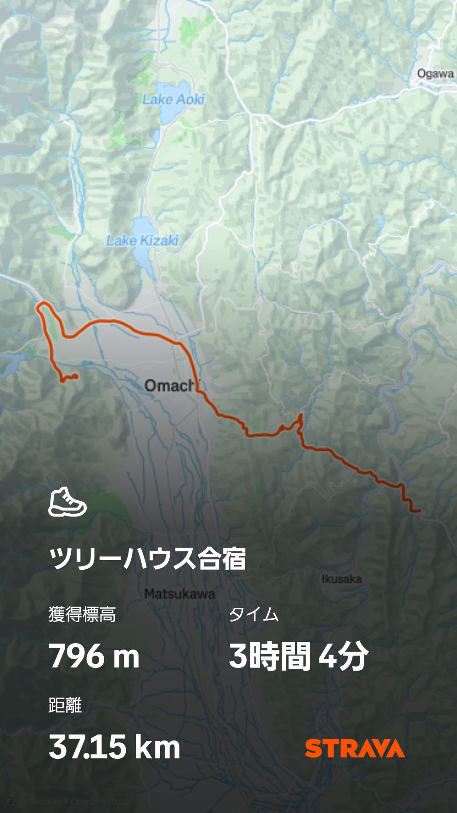
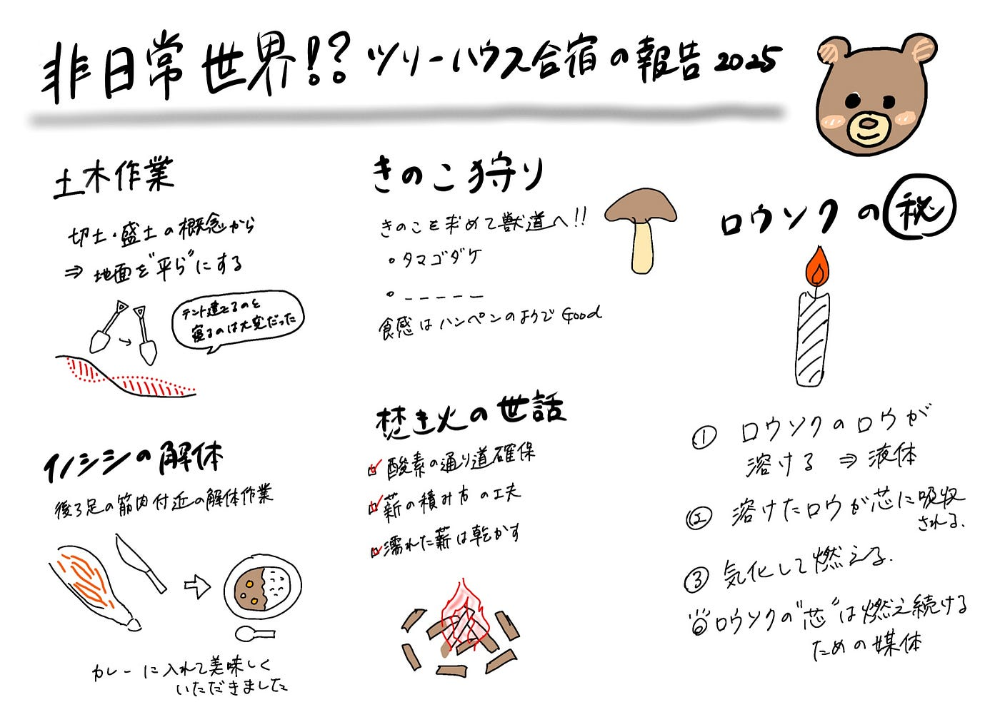

### 非日常の世界に身を置いて-ツリーハウス合宿2025 活動レポート -

秋の長野・大町で行われたFuruhashi Labのツリーハウス合宿。

森の中での生活を通じて、「自然と人の関わり」「自分たちで“場”をつくること」を体験的に学ぶ2日間でした。

今回は、その中でも特に印象に残った活動を中心に振り返ります。

### 土木作業

初日のメインは、寝床を確保するための整地作業。

斜面を「切土・盛土」の概念でならしていく作業です。

雨の中、スコップを手に土を掘り、運び、固める。

たった1時間？ほどでしたが、体感的にはあっという間。

手も服も泥だらけになりながら、みんなで力を合わせて“地面を平らにする”という原始的な行為の面白さに気づきました。

テントの中は雨でびしょびしょで、本当に寝るかどうか迷いましたが、疲れが勝ってぐっすり。

寝心地は正直あまり良くなかったけれど、あのような環境でも眠れた自分を少し誇らしく思えた瞬間でした☺️

### きのこ狩り

2日目はきのこ狩りへ。

およそ1時間半の山登り。後半は獣道のようなルートで、まさに冒険でした。

見つけたのはタマゴダケと、もう一つ名前を思い出せないのですが、白くてハンペンのような食感のきのこ。

“自分で採ったものを食べる”という体験の特別さを、久しぶりに感じました。

### イノシシの解体

合宿中には、イノシシの解体にも立ち会いました。

すでに作業が進んでいた状態から、私は足の筋肉を削ぐ作業を少しだけ手伝いました。

普段は見ることのない光景に最初は戸惑いましたが、「食べる」という行為の重みを実感する時間でもありました。

夜にはその肉をカレーに入れていただきましたが、想像以上に柔らかくて美味しかったです。

### 焚き火の世話

夜はずっと焚き火の番をしていました。

酸素の通り道を確保し、薪の積み方を工夫し、濡れた木を乾かす。

焚き火は思っていた以上に“生き物”のようで、油断するとすぐに火が消えそうになったり煙が多くなり、不完全燃焼を起こします。

どのように火を保てば良いのか古橋先生からレクチャーもしていただき、今後焚き火をする機会があればトライしたいです。

### 最後に

今回のツリーハウス合宿では、どれだけ自然の中で暮らすことが大変なのかを見にしみて体験することができました。

寝る場所の確保から食糧調達、暖の取り方、飲料水の確保、トイレ。自分たちで動いて生活する環境を整えていく体験は貴重なものです。

鹿や猿といった野生動物なども道中見かけましたが、そういった生き物たちが生きる環境に身を置くことは危険なこともありますが、自然を肌で感じられる良い機会でした。

生活環境が整った日常生活を少しだけでも忘れることで、気分もリフレッシュできて良い時間を過ごすことができました。

