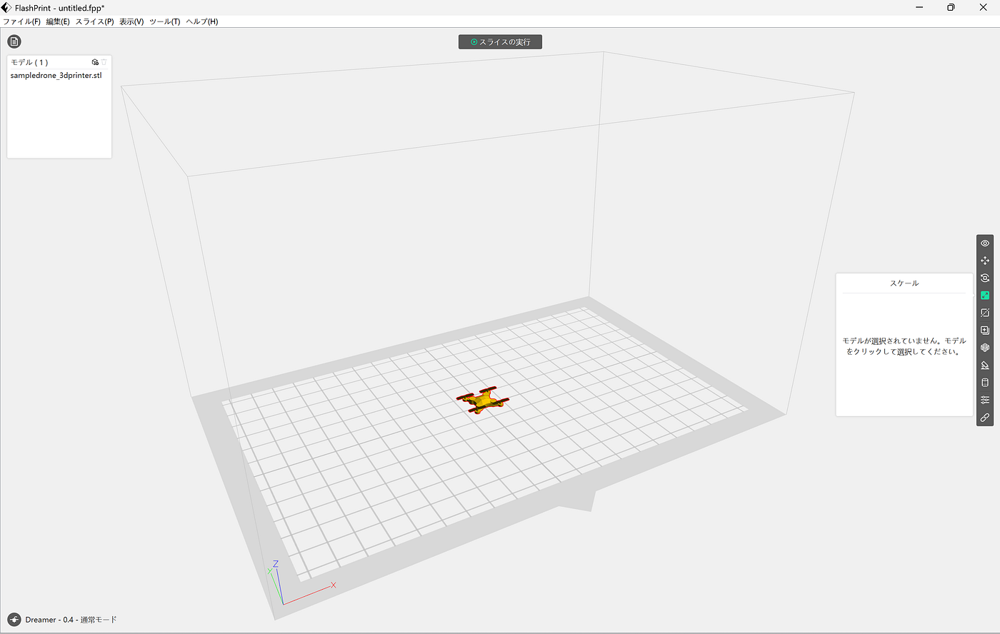
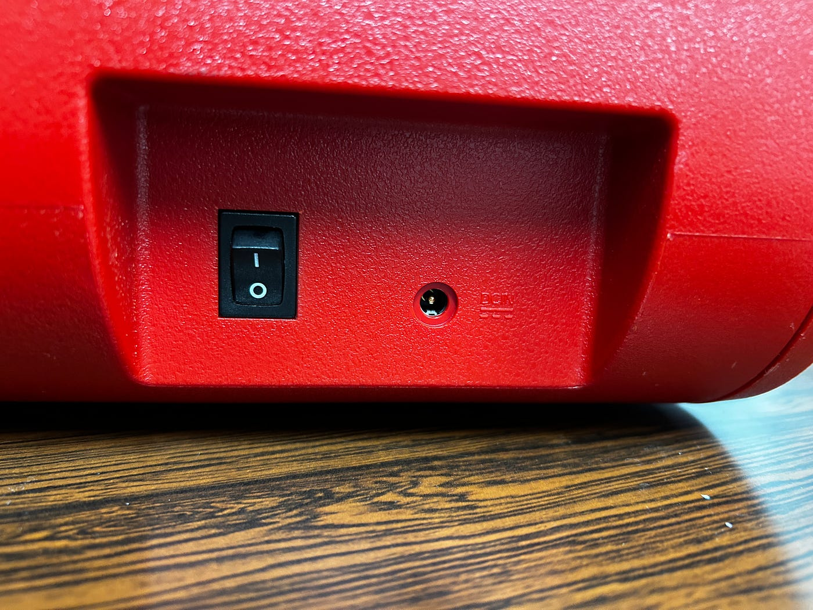
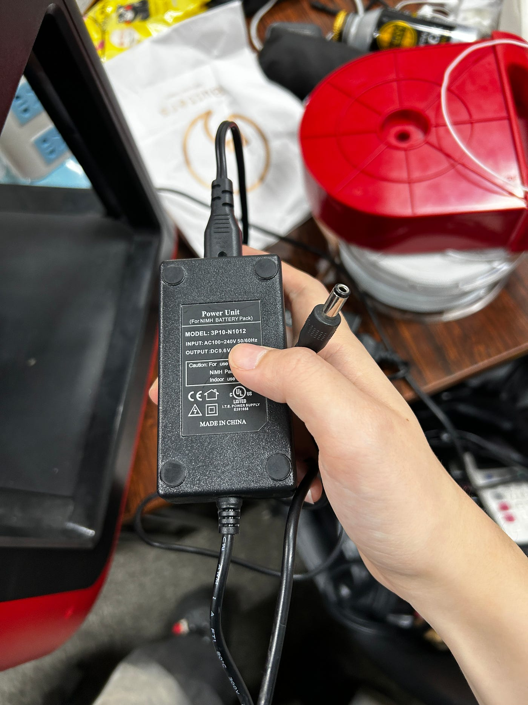
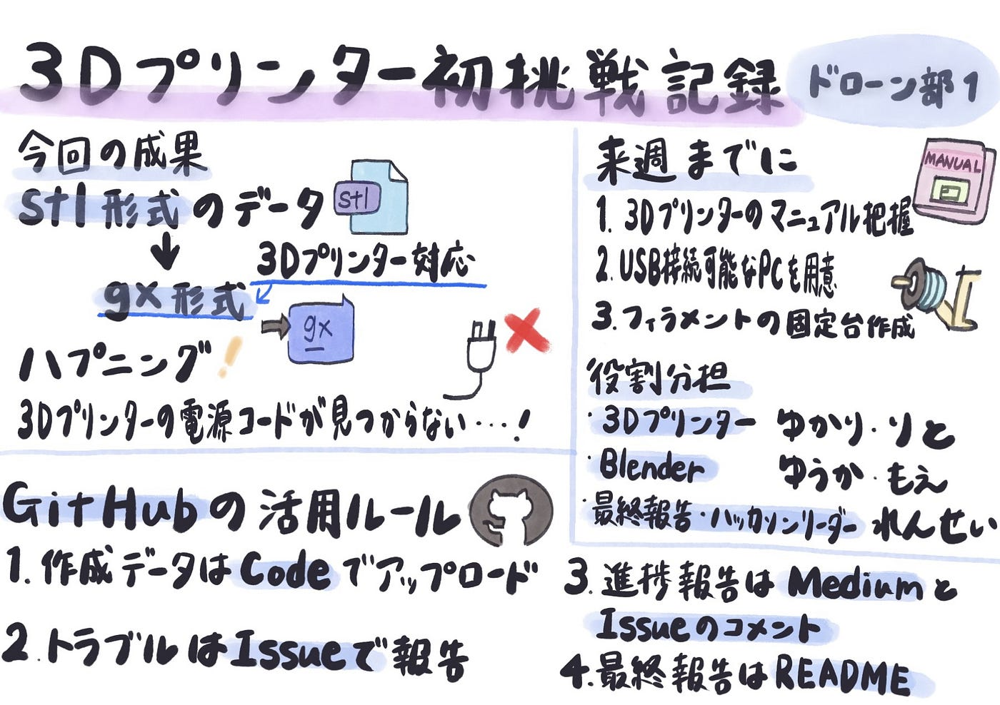

### ドローン部1の3Dプリンター初挑戦記録

こんにちは。ドローン部4年の林です。

先週の週報で、後期の目標を「3Dプリンターでドローン機体を作成する」と決めました（目標を掲げた週報は[こちら](https://medium.com/furuhashilab/%E3%82%84%E3%81%A3%E3%81%A8%E6%B1%BA%E3%82%81%E3%81%BE%E3%81%97%E3%81%9F-%E3%83%89%E3%83%AD%E3%83%BC%E3%83%B3%E9%83%A81%E3%81%AE%E5%BE%8C%E6%9C%9F%E3%81%AE%E7%9B%AE%E6%A8%99%E3%81%AF%E3%81%93%E3%82%8C%E3%81%A0-5ecea457a24c)）。

今週は、早速3Dプリンターに触ってみた活動内容を報告します。

### 今週の活動と役割分担

目標達成に向けて、メンバーごとに担当を決めました。各担当は作業を進め、何か進捗があれば、随時、成果報告と情報共有を行うようにする体制にしました。

- **3Dプリンター**：りと、ゆかり

- **Blender（モデリング）**：もえ、ゆうか

- **最終報告・ハッカソンリーダー**：れんせー

### 3Dプリント前の準備

まず、実際に何をプリントするかを決めるために、過去の先輩の作品から`.stl`形式の素材を探しました。候補ファイルの中から、[FlashPrint 5](https://flashforge.jp/flashprint5/) を使って 3Dプリンターで扱える `.gx` 形式に変換を行いました。

変換データは[GitHub](https://github.com/furuhashilab/drone1_3dprinting_project)に追加しています。

### 3Dプリンター実機トライ：思わぬハプニング

研究室でいよいよ3Dプリンターを起動しようとしたところ、電源コードが見つからないことが判明しました。

一度ぴったりはまって「これだ！」と見つけたコードは、よく見るとニッケル水素電池用のバッテリー用のコードで、適合しませんでした……（泣）。

先生に相談したところ、同じ電源コードが先生のご自宅にあるとのことで、来週のゼミ時に持ってきていただけることになりました。ありがとうございます！

### 来週までにやっておくこと

来週火曜日には3Dプリンターを動かせることを期待して、事前に以下を進めます。

1. 3Dプリンターのマニュアルを読み、全体を把握する

1. USB接続が可能なPCを用意する

1. フィラメントを固定する固定台を作成する

### 作業管理：GitHub の活用

今回、林の判断でプロジェクト管理に GitHub を本格導入することにしました。今後、3年生もゼミ論で GitHub を使う機会が増えるため、ドローン部1のプロジェクトでも運用ルールを整えました！

#### 活用方法（ルール）：

1. 作成したデータファイルは GitHub の **Code** でアップロードする

1. トラブルや不具合は **Issue** にて報告する

1. 各週の進捗報告は Medium に加えて、該当の**[Issue**](https://github.com/furuhashilab/drone1_3dprinting_project/issues/8)にコメントとして記録する

1. 最終報告は GitHub の **README** にまとめる

この4つをルールとしてプロジェクトを進めます。

#### GitHubのリポジトリ

[furuhashilab/drone1_3dprinting_project](https://github.com/furuhashilab/drone1_3dprinting_project)

ゼミが終わったあと、りととゆかりで改めて3Dプリンターへの再挑戦を行う予定です。来週こそは実機を動かし、最初のテストプリントを成功させたいと思います。今後の進捗も引き続き報告していきます！

### グラレコ

