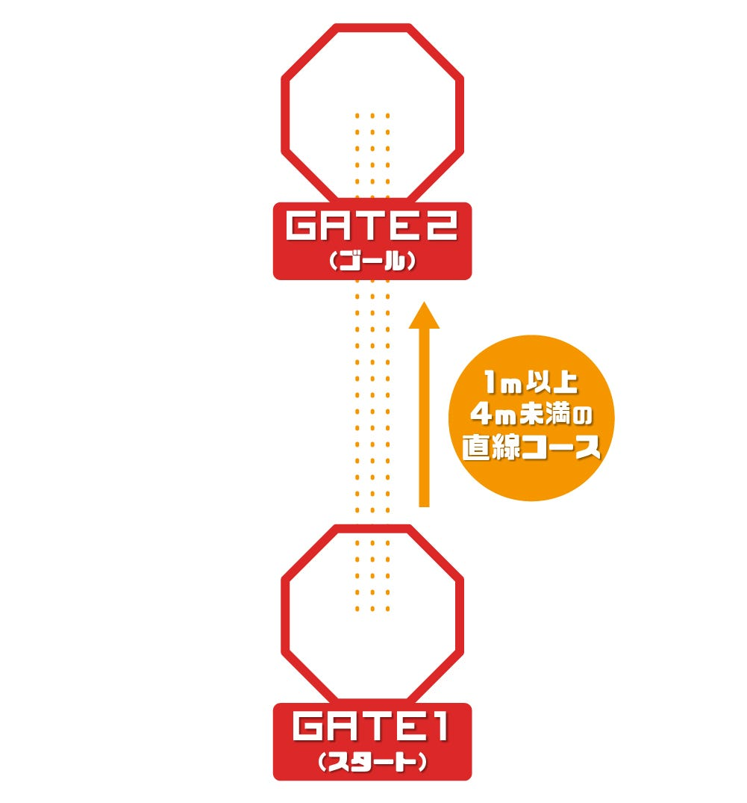
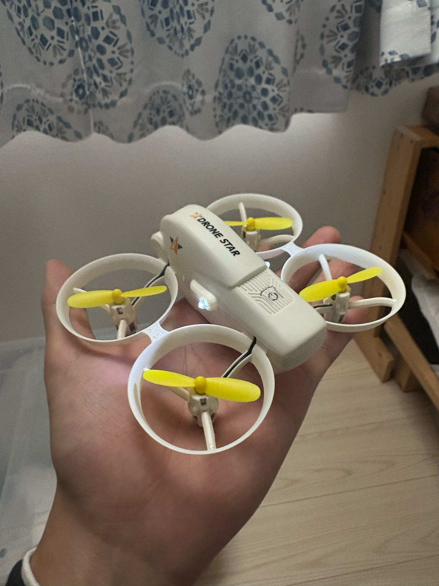
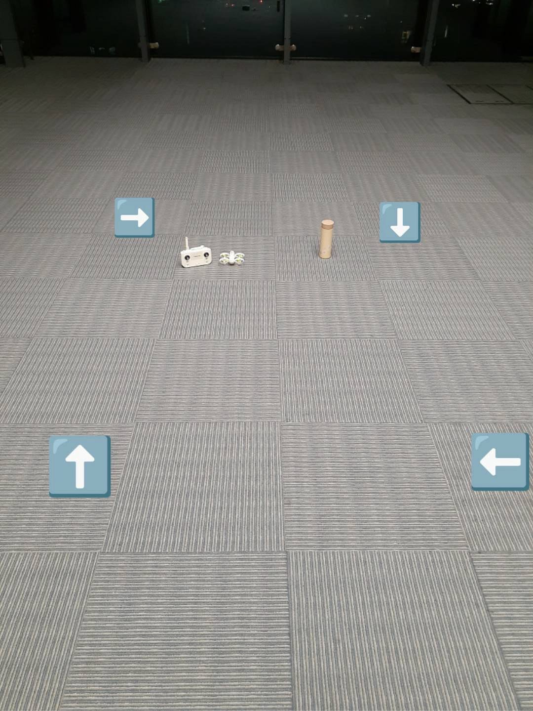
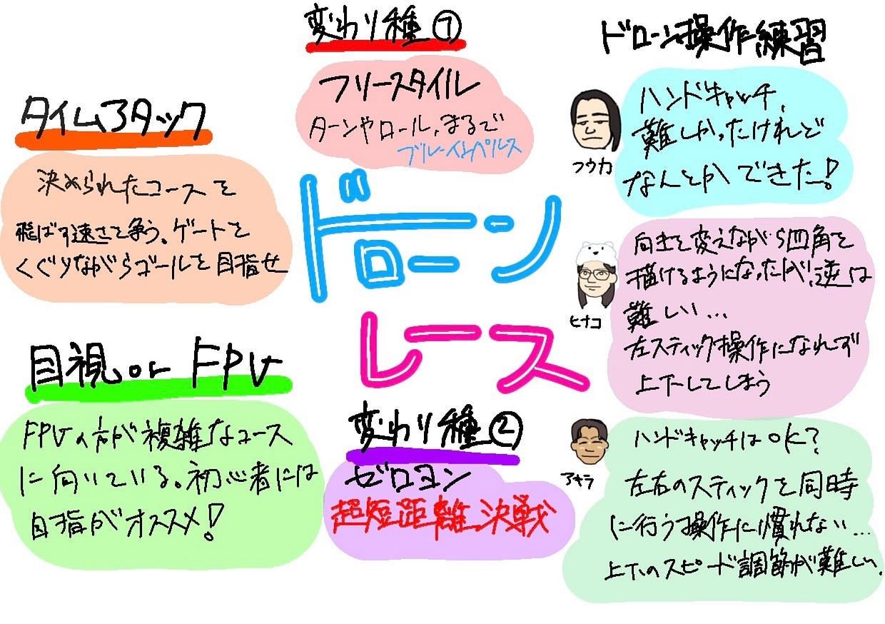

### ドローンレースがしたい！【10/21 ドローン2 週報】

こんにちは！ 本吉顕です。すっかり夏も終わり、秋の雰囲気ですね。秋といえばスポーツの秋。ということで今回はドローンレースについてです。ドローンレースの実現に向けて、まずは現在行われているドローンレースについて調べてみました。

### ドローンレースの概要

#### 決められたコースを飛ばして行うタイムアタック形式

コースの途中にセンサー付きのゲートがあり、それを通りながらゴールを目指さなくてはなりません。ゲートを潜らなければ失格になる場合もあります。

#### FPV or 目視

主にレースは FPVか目視に分けられます。FPVの場合はゴーグルをつけて行い、目視とはコースが違います。FPVの方が複雑なコースにも対応できますが、目視レースの方が簡単なコースが多いため初心者向きです。

> なお、FPVゴーグルは5.8GHz帯の電波を使用するため、ホビーユースの場合はアマチュア無線4級、業務ユースでは第三級陸上特殊無線技士の資格が必要。なおかつ、総務省への無線局開局申請が必要になる。

[超小型マイクロドローンが面白い！ドローンレースの第一人者の視点から見た Tiny Whoopの今とその魅力
ビデオSALONウェブでは前回の記事で、Tiny Whoopと呼ばれるマイクロドローンを使用したPV撮影の模様...genkosha.pictures](https://genkosha.pictures/movie/18081312834)

#### 変わったドローンレース

ここまではタイムアタック形式のドローンレースを紹介しましたが、ドローンレースはドローンの大きさや部門ごとに階級分けされており、中には一風変わったものもあります。ここでは僕の独断と偏見で、面白いと思ったドローンレースを紹介します。

**フリースタイル**

FPVで、縦に回転したり横にロールしたりと、まるでブルーインパルスのようなことをドローンで行います。

**ゼロヨン（ドローンバトル）**

一般的なゼロヨンと同じくストレートのフルスロットル、加速勝負です。ただし、ドローンの場合は400ｍではなく4m未満の距離で行われます。勝負は一瞬で決まります。

参考：[https://skyfight-drone.com/cont/race/](https://skyfight-drone.com/cont/race/)

余談ですが、ゼロヨンを主催している株式会社ドローンネットより、スカイファイトをテーマにした漫画が出ています。

[日本初！無料で読めるドローンバトル漫画をスカイファイトポータルサイトで毎月第2・第4月曜日配信開始！
株式会社ドローンネットのプレスリリース（2021年5月6日 11時00分）日本初！無料で読めるドローンバトル漫画をスカイファイトポータルサイトで毎月第2・第4月曜日配信開始！prtimes.jp](https://prtimes.jp/main/html/rd/p/000000091.000028886.html)

### ドローンの操作練習

さて、ドローンレースの開催のためにはドローンを思うように飛ばせるようになることが必須条件です。そこで改めてドローンの基本的な動作を練習しました。今回はYoutubeに上がっている練習方法を参考にしました。

### 感想

アキラ：ハンドキャッチはボタンを押すだけだから簡単にできたが、二重操作が難しかった。思ったよりも上昇のスピードが速く、コントロールしきれない。高さをゆっくり調整できるようになることが必要だと感じた。

ふうか: ハンドキャッチは，空撮する際に、地面が平らでない時に役立つと聞いて、やってみた！片手で、コントローラーを操作するのは難しかったが、なんとかキャッチできた！機体の向きを変えながら四角を描くことを練習したけど、やっぱり難しい。

ひなこ : 慣れてきて向きを変えながら四角を描くことはいい感じになったけど、反対はムズかった。あとはドローン本体の向きが分からなくなって壁にぶつかったりしてた。左側のコントローラーはドローン本体の向きを変えるやつだけど、よく分からなくなって上下に動かしてしまったりした。個人的には左の操作が難しいです。

### グラレコ

