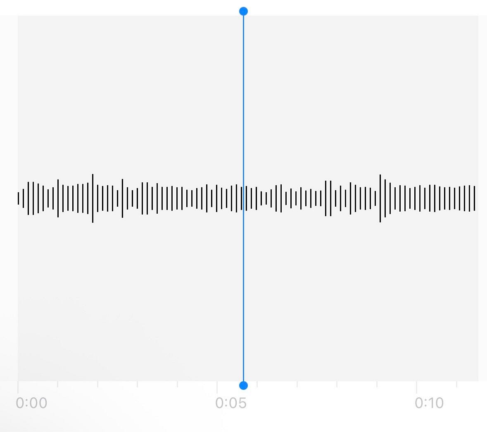
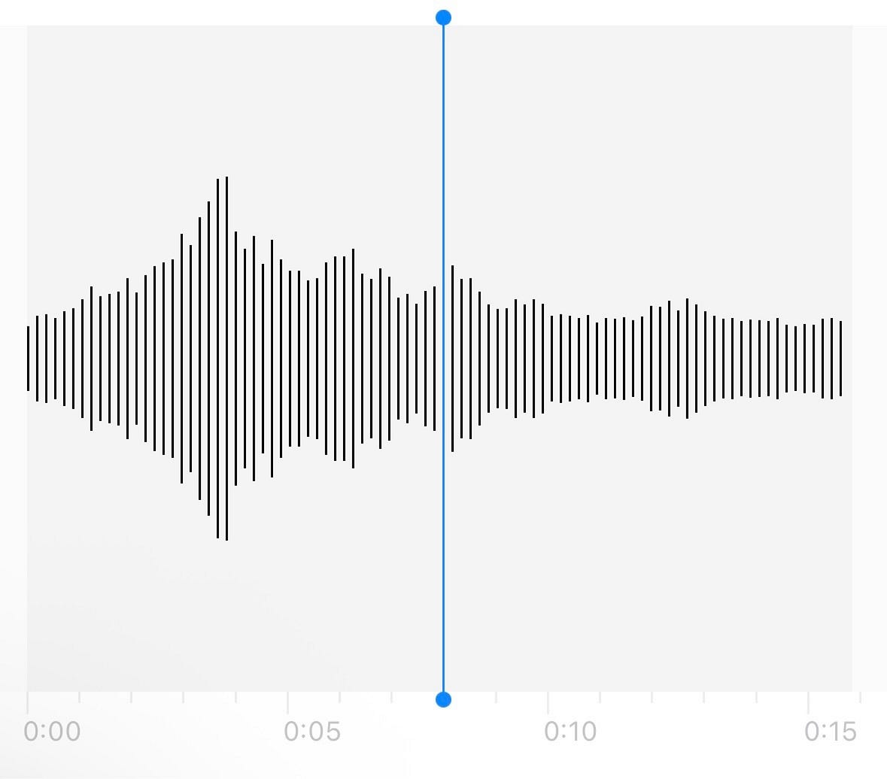
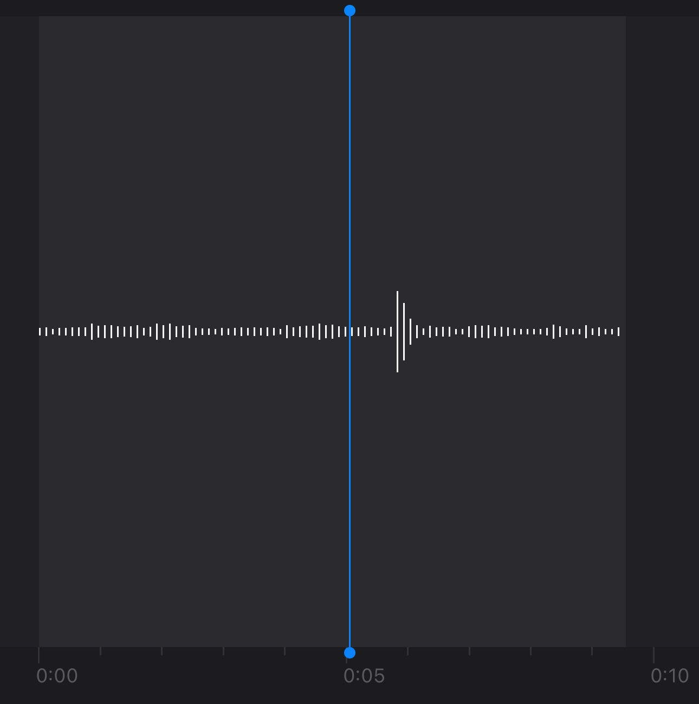
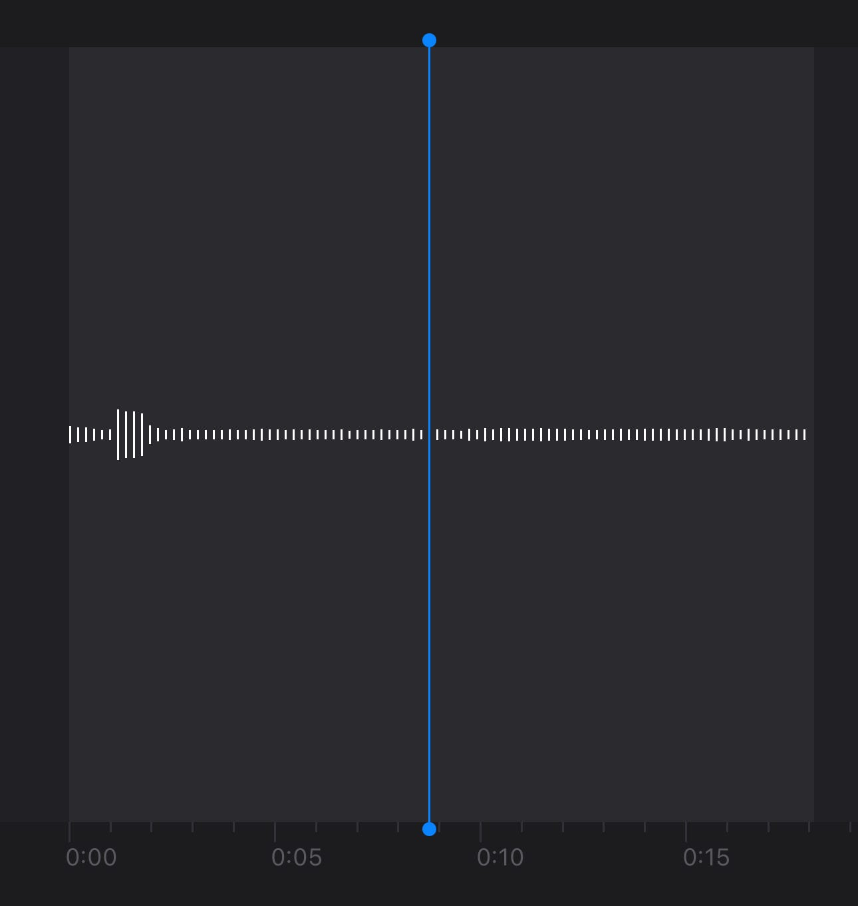
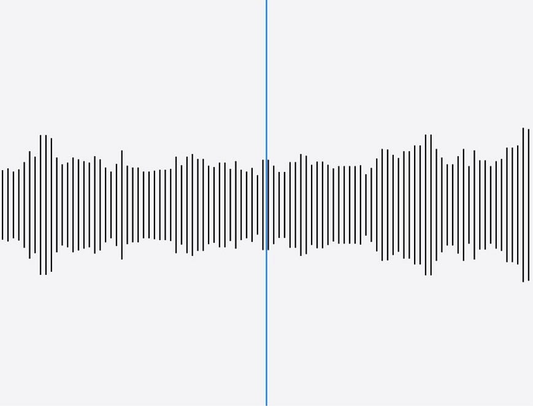
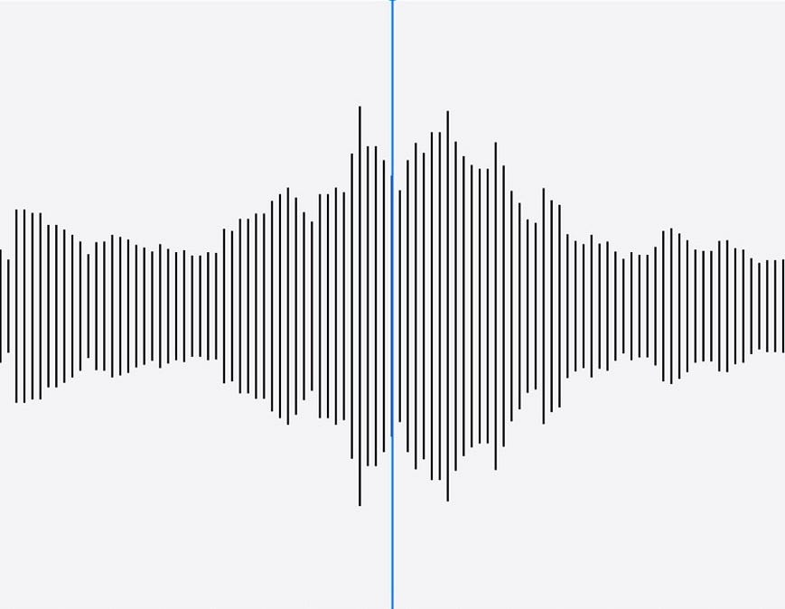

### 街ではどんな音がする？波形から分析してみた！デザイン部10/21週報

こんにちは、臼井です。

今回デザイン部では街中で音声を録音し、音声やその波形から分かることを分析してみました。

それではさっそく見ていきましょう。

**ちはな**

私が今回音を録音した場所は公園と大きめの道路です。

どこに訪れるかは迷いましたが、騒がしめな場所で比較してみたいと思い、この場所に決めました。録音日時はどちらも日曜日の昼頃です。

**公園の音**

公園で録った音声

音声を聞くと、休日の公園という事もあり子供たちの声がします。

録る前は、話し声は一定の音量ではなく、もっと凸凹になると予想していましたが、波形を見るとほぼ一定でした。話している人が多いと声が大きくなるタイミングがばらけて大きさに差が無くなるのではないかと思います。

**道路の音**

道路で録った音声

こちらは比較的交通量の多い道路に面した場所で録音しました。バイクや車の排気音や信号の音が聞こえます。

波形を見てみると、先ほどの公園と比べてかなり音量が大きいことが伺えます。

録っている時は公園と道路、どちらも騒がしいと思っていたのですが、音量的には道路が圧倒的でした。

公園では高い子供の声がしていたので、それが実際にも騒がしいと感じる一因になっていたのではないかと思います。

また、バイクが通り過ぎる瞬間に音が大きくなっていて、通り過ぎると段々と小さくなっている様子が波形にもよく表れています。

今回は録音にiPhoneに標準搭載された[ボイスメモ](https://apps.apple.com/jp/app/%E3%83%9C%E3%82%A4%E3%82%B9%E3%83%A1%E3%83%A2/id1069512134)というアプリをつかいましたが、なかなか綺麗に音が録れていると思います。

**こうな**

今回の録音はちはなと同じくボイスメモを使用しました。

私も今回録音する場所にすごく迷いました。最終的には、朝教習所にいたとき（免許取ります）と夜自分の部屋から聞こえた音にしました。

**朝の教習所の音**

[朝の教習所.m4a
Stream 朝の教習所.m4a by kouna on desktop and mobile. Play over 320 million tracks for free on SoundCloud.soundcloud.com](https://soundcloud.com/kouna-877245106/m4a-1?utm_source=clipboard&utm_medium=text&utm_campaign=social_sharing)

朝まだ人がすくなく、みんな1人ひとりで座っていて話し声はないです。よく聞くと、おはようございますと職員の方が挨拶している声と扉を開けしめしている音が聞こえます。朝は比較的静かですが、昼から午後にかけては話し声が多くなります。（今回は録音できなかったです。）

もっと大きく波形に現れるのかと思いましたが、扉を開け閉めする部分で少し変化したくらいです。

**夜部屋から聞こえる音**

[夜部屋から聞こえた音.m4a
Stream 夜部屋から聞こえた音.m4a by kouna on desktop and mobile. Play over 320 million tracks for free on SoundCloud.on.soundcloud.com](https://on.soundcloud.com/g8F80peXxPTSct9ylt)

たまたまですが、近隣の方が車の故障か何かで車からの音がすごかったので録音したのですが、聞こえる音の大きさに対して録音して波形で見るとそんなに凹凸にはならなかったです。波形からだけでは大きな音を出していると想像できないです。

普段夜はもっと静かなので、多分私の息する音しか入らないかなと思いました。

今回の録音は教習所の朝昼の比較をしたかったのですが、授業の時間がなかなかうまく合わなく、このような形になりました。何ヶ所か録音したのですが、普段あまり気にしなかった音を録音して聞き返しで気づいたり、自分の想像と違う波形になったりが今回の録音をして感じたことです。

**ゆうか**

私も録音ではボイスメモを使用していきました。

2人がsoundcloudを用いて、Mediumから直接聞くことのできる引用を行っていたため、私も便乗して、この方法で共有したいと思います。

何度も撮りたいと考えていたため、最寄りでの録音にしました。駅、 高速道路の上にある橋、車が最も多く集まっている東急スクエアビルの駐車場出口の全3箇所で録音を行いました。

駅①

日曜の朝11時で、あしなが育英会募金の活動が丁度始まった頃でした。学生たちが精一杯募金活動を行っている声と、休日にお出かけする人々が駅を行き交っていました。

駅②

こちらは、同じ日の午後15時です。私は買い物を終えて帰ってきた所でしたが、子ども連れが午前中よりも増えたように感じました。人通りが増えたことで、募金活動の声量も上がっており、駅がより活発になっているように感じます。

続いて、高速道路の上にある橋での録音です。

橋① 朝11時でトラックと静かな車ばかりでした。

橋② 15時半頃であり①よりも車通りが多くなりました。ビューンと鳴る強い風の音や、切れる寸前のバイクの音など、さまざまな要因の音(天気や乗り物)などの音が聞こえるようになりました。

駅ビル駐車場出口

15時の出庫の合図音に立ち会えました。人通りも多かったですが、ピロピロ音とともに大きなトラックがぞろぞろ動いていたので録音しました。

音声ボリュームの比較としては、最も差が感じられた駅の午前午後について挙げようと思います。

駅②はギザギザした波形になっています。これは「募金よろしくお願いします！」という男の子の大きな声によるものでした。午前より学生たちが必死になっていた要因として、人通りや家族連れ(快く募金してくれそうな、休日を楽しむ人々)が増えたことが大きいのではないかと思いました。

……いかがでしたでしょうか。

私は街中で録った音声でも場所ごとに全く違ったものになっていて面白いという感想を抱きました。そこにいる人の年齢、どんな物が近くにあるか、交通量はどれほどか、など様々な要因で変化する街の音声は、街が生きていることを実感させてくれました。

また、今回は各自別の場所で録音し分析しましたが、学校周辺、など決まった地域の音声を録音し、音声マップを作るのも楽しそうだと感じました。機会があればそちらもやってみたいです！

#### グラレコ

今週のグラレコはゆうか〜

