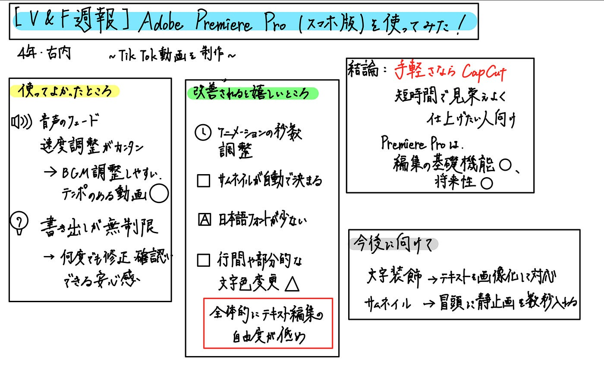

### 【V&F週報】Adobe Premiere Pro（スマホ版）を使ってみた！

こんにちは、４年の古内です。今回私はスマホ版 Adobe Premiere Pro (mobile)（以下「Premiere Proスマホ版」）を使用して、実際に TikTok 用の動画を制作・投稿しました。普段使用している CapCut と比較しながら、実感をもとに「良かった点」「気になった点」等を整理します。

### 実際に使ってみて感じた「良かった点」

まずは、「使ってよかった」と感じた部分を整理します。

- **音声のフェードや動画の速度調整が直感的で使いやすい**
 BGMの追加や音量調整がスムーズで、フェードイン・フェードアウトも簡単。スローや早送りなど、テンポのある編集にも向いていました。また、動画クリップの速度を変える（スロー／早送り）機能もスムーズに使え、「動きにメリハリをつけたい」「テンポ良く見せたい」という意図がある編集には非常に適していると感じました。

- **無料で書き出し（エクスポート）が好きなだけできる点が最大の魅力**
 過去にCapCut の無料プランを使った際、「書き出し回数に制限（月数回まで）」という仕様がネックになった経験があります。一方で、Premiere Proスマホ版では無料での書き出しに**回数制限がなく、高画質で出力できる**という点は大きなメリットでした。何度でも修正・確認して書き出しできる安心感があり、これはかなり大きな強みだと感じます。

### 実際に使ってみて感じた「気になった点」

続いて、「もう少しこうだったらいいな」と感じたポイントです。

- テキストクリップに設定されているアニメーション（文字やグラフィックの出現／消失）について、開始・終了の**秒数（速度）を自由に設定できませんでした**。意図的に動きをゆっくり・速くなど演出を変えたかったのですが、操作可能な調整幅が限られていて、思い描いたテンポ感に仕上げるのが難しく感じました。

- 動画を書き出す際、SNS向けには「現在表示中のフレームをサムネイルとして選べる」場合がある一方で、**端末に保存・書き出しをする際には任意のサムネイルを選択できず、自動で“適当なフレーム”が選ばれてしまったという感覚があります**。TikTokなどで「目を引くサムネイル」にこだわりたい時には、少し手放しでは使いづらい印象を受けました。

- テキスト（タイトル・字幕）周りの“フォント選び”について、**日本語フォントの種類が少なく、選択肢が限られている印象でした。**使いたい雰囲気のフォントが見つからず、もう少しバリエーションが増えると嬉しいと感じました。

- テキストの見え方・レイアウト調整において、「行間を詰めたい／広げたい」「文字色を行の中で部分的に強調したい（例：この単語だけ赤字にしたい）」と感じる場面がありましたが、**“直感的に思う通りに細かく調整できた”という手応えは少なめでした**。たとえば「この行だけ色を変える」といったことを試みた際、少し手間がかかった印象があります。

### 結論：スマホ編集ならCapCut、でも“伸びしろあり”なPremiere Proスマホ版

今回TikTok用動画を実際に編集してみて感じたのは、**使いやすさではCapCutのほうが一歩リードしている**と感じました。
 フォントや文字装飾、行間などの自由度が高く、短時間で仕上げたい時に向いています。

一方で、**Premiere Proスマホ版は編集の基礎機能がとても優秀**です。
 音声のフェードや速度調整が直感的で、さらに**書き出し制限がない**のは大きな魅力です。
 特に、私たちV&Fのように継続して動画を作っていく立場からすると、Adobe製品とのつながりや使い慣れやすさなど、「これからもっと活用できそう」と感じる部分が多かったです。

### 今後に向けて

今回感じた**文字装飾の制限**は、テキストを画像として作成してから読み込むことで、ある程度自由にデザインできます。
 また、**サムネイルが自動で選ばれてしまう問題**も、動画の最初にサムネ用の静止画を数秒入れておくことで、希望のフレームを選ばれやすくする工夫ができます。

### まとめ

編集アプリの良し悪しは、目的や作業スタイルによって変わります。
 私個人の感想としては、**「気軽に映える動画を作る」ならCapCut、**
 **「しっかり作り込みたい」「将来PC編集に発展させたい」ならPremiere Proスマホ版**を選ぶのが良いと感じました。

今回作成した動画は古橋ゼミのTikTokアカウントに投稿しています！
 よければチェックしてみてください。
 👉 h[ttps://vt.tiktok.com/ZSUbYeGA4/](https://vt.tiktok.com/ZSUbYeGA4/)

### **グラレコ**

