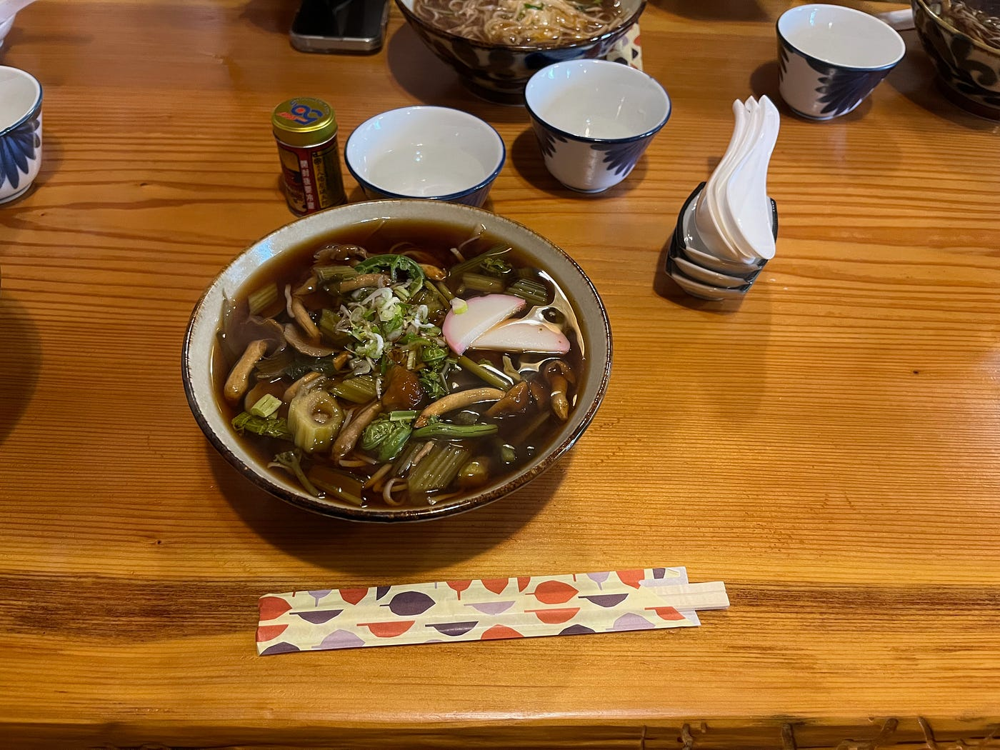
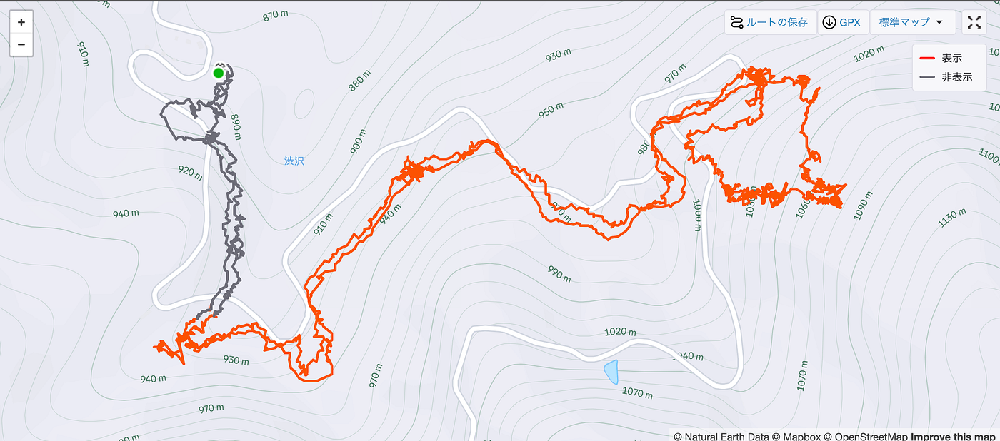
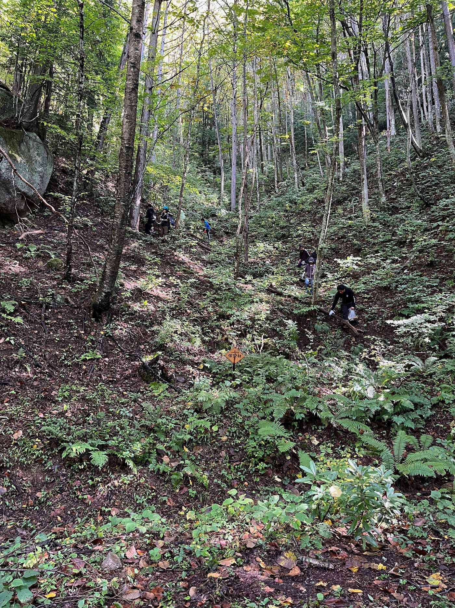
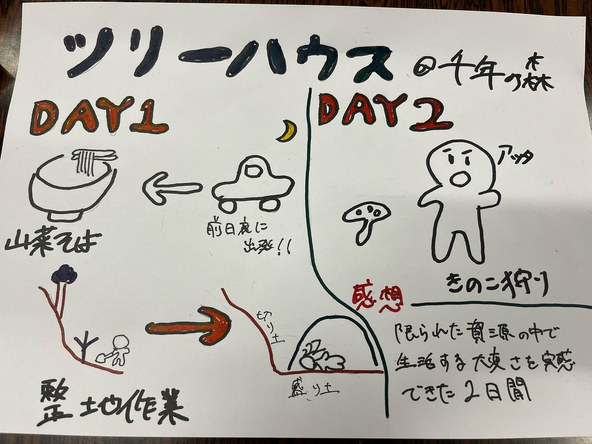

### きのこ狩りに行ったら崖を登らされた件

みなさんこんにちは！3年の加藤です。2週連続の登場ですがみなさんはこの一週間いかがお過ごしでしょうか。私は何もしていません。

ということで今回は10月11日から12日にかけて行われた古橋研秋合宿＠千年の森自然学校についての報告です。

#### **まずは腹ごしらえ**

高速代を浮かすために前日の夜から出発した我々、しっかりとした睡眠は取れておらず、すでに体はへとへと？な雰囲気も見受けられましたが無事に無事故無違反で一つ目の目的地、わっぱら屋に到着。長野といえば蕎麦ですよね、雨も降っていたということもあり温かい山菜そばをいただきました。お店の雰囲気もよく蕎麦も心温まる美味しさでした。

#### 擬似マイクラ？？

腹ごしらえも済んだところで一同は千年の森へ。途中の山道にも怯えずに無事到着！想像していたよりも山！崖！で驚きを隠せませんでした。そんな中初めに行ったのが地球の広場の整地作業。スコップを使って斜面を切り込み、その土を盛り平地を作るという作業。ほぼマイクラです。スコップの形状の違いを活用して、切り込み部隊、盛り土部隊の二手に分かれ永遠に切り崩しては盛るの繰り返し。人数が多かったこともありマンパワーゴリ押しで二段も平地を作ることに成功！

そして実際に作った平面の上にテントを敷いて一夜を明かすことに。横になってみると若干斜めになっていることに気づくのではないでしょうか。見た目では整地ができているように見えても実際はまだまだ甘かったことに気づきました。

#### きのこ狩り（崖のぼり）

こうして斜めの夜も明けて二日目。前日とは打って変わって空模様も良好。絶賛のきのこ日和です。古橋研メンバーが進んだのは山を登っていくコース。序盤は林道脇に生えているキノコをぬくぬく採取。なんだ、きのこ狩り、余裕じゃん。そう思ったのも束の間。ガイドさんが虎視眈々と進む先は急傾斜の尾根。しかし侮ることなかれ。そこはキノコ王国。至る所にきのこが生えており。我々の1番のお目当てであったウラベニホテイシメジもたくさん！

下山後は採ったキノコをうどんと醤油バター炒めに美味しく調理していただきました。自分たちで採ったきのこの味は格別でした。

きのこ狩り中のStrava記録は[こちら](https://www.strava.com/activities/16112044723)

#### 感想

今回、電気、ガス、水道のないという思ったよりも限られた資源の中で二日間生活をしてみて、いかに色々なものに頼って普段生活をしているのかを実感しました。いつもの生活では体感できない生きることの大変さ、儚さがここには存在しており、その価値観を下の世代に継承するために千年の森のスタッフの方々が奮闘している姿が見えました。そして私たちがこれから何をすべきか、考えさせられた二日間でした。

