## はじめてのテント泊！自然と向き合った2日間

こんにちは。3年の安生です。

今回は、先日参加したツリーハウス合宿について報告します。

10月11日〜12日の2日間、長野県大町にある千年の森自然学校で過ごしました。

自然に囲まれた環境の中で、自給自足に近い生活を体験し、初めてのことばかりでとても新鮮でした。

たくさんの体験をしましたが、特に印象に残っていることを3つ紹介します。

**① 土地を切り開く作業🌳**

一つ目は、斜面をスコップで掘って平坦にし、テントを張るための土地を広げる作業です。

古橋先生から「切土」と「盛土」について教えていただきました。スコップで掘って削り、ならした部分を「切土」、掘った土を盛ってならした部分を「盛土」といいます。

盛土よりも切土の方が地盤がしっかりしており、安全だということも学びました。　もし将来、土地を購入する機会があったら、今回学んだことを活かして切土の土地を選びたいと思います。

掘った中から出てきた大きな石は土地の縁に並べて土留めにしたり、盛土の中に落ち葉を混ぜてふかふかの地面にするなど、いろいろな工夫をしました。

その結果、大きめのフロアと小さめのフロアを一つずつ完成させ、無事に全員がテントを張ることができました。

雨の中での作業は大変でしたが、かっぱを着てみんなで協力しながら頑張った時間も良い思い出です。

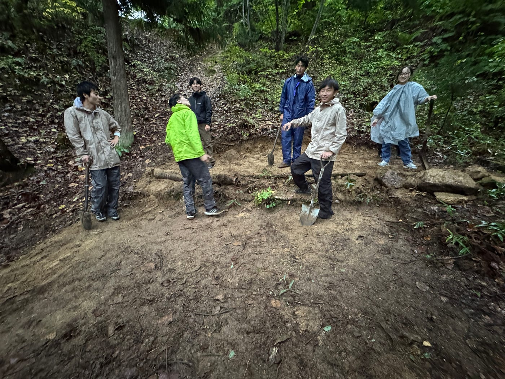

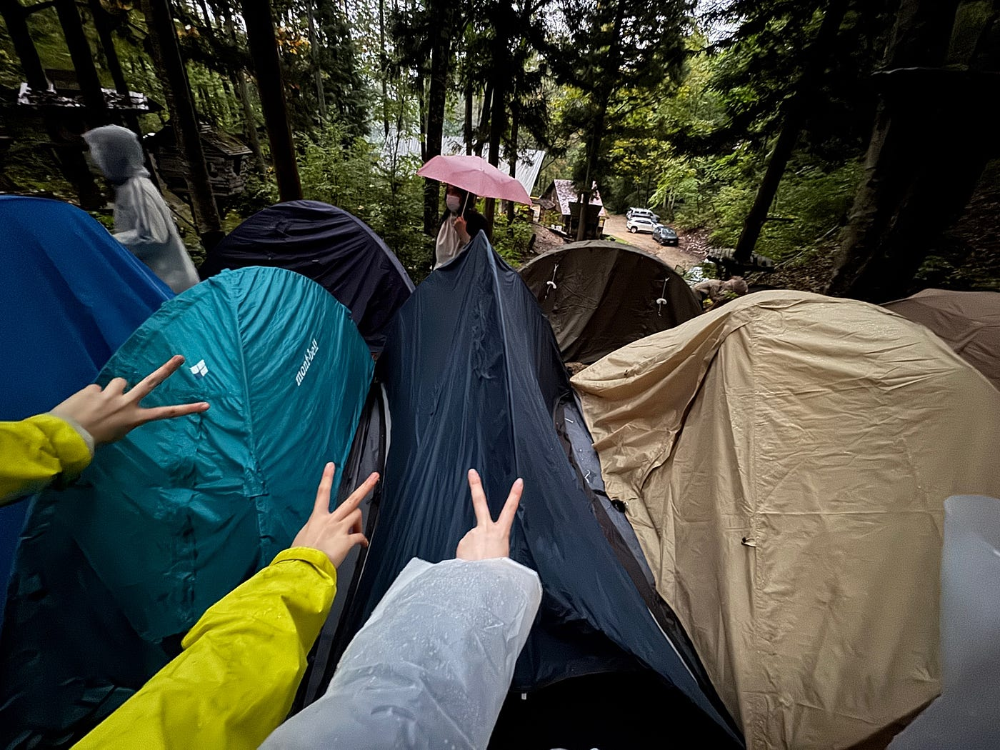

**② きのこ狩り**🍄

二つ目は、きのこ狩りです。

私は初めてのきのこ狩りで、広い平地でのんびり探すイメージをしていたのですが、実際は登山のような急斜面を登りながらの難易度高めのきのこ狩りでした。

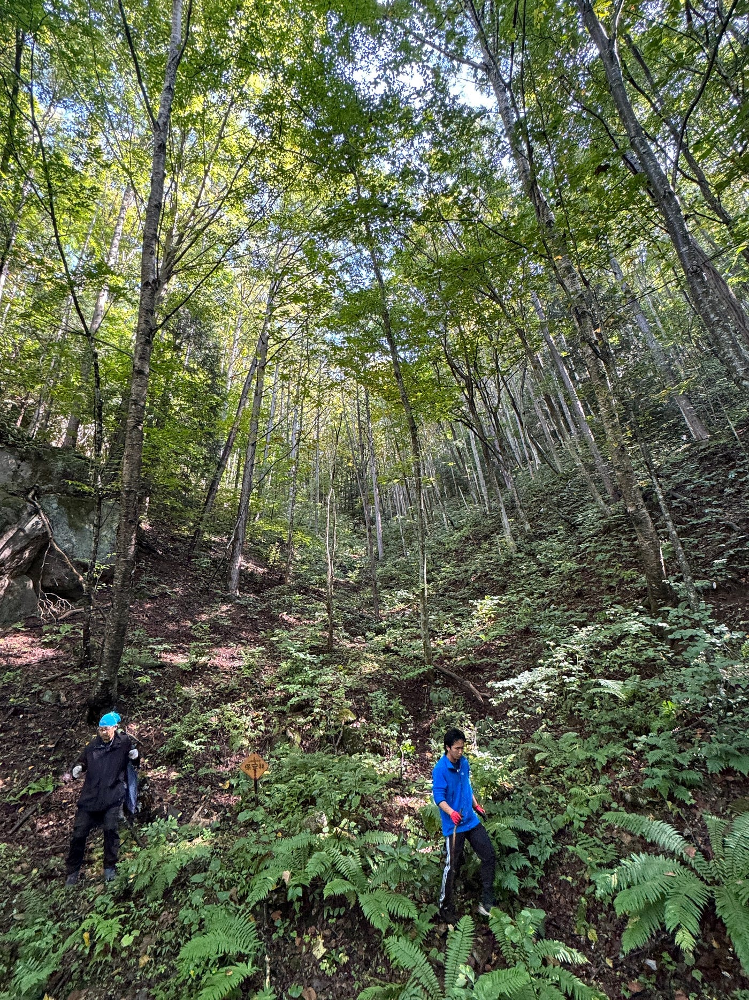

写真では伝わらないほどの急傾斜で、下を見るのが怖いくらいの斜面を登ったり下ったり。

下りのときは何度も滑ったり転んだりと必死でしたが、そんな中でも次々ときのこを見つけていくメンバーがいて本当にすごいと思いました。

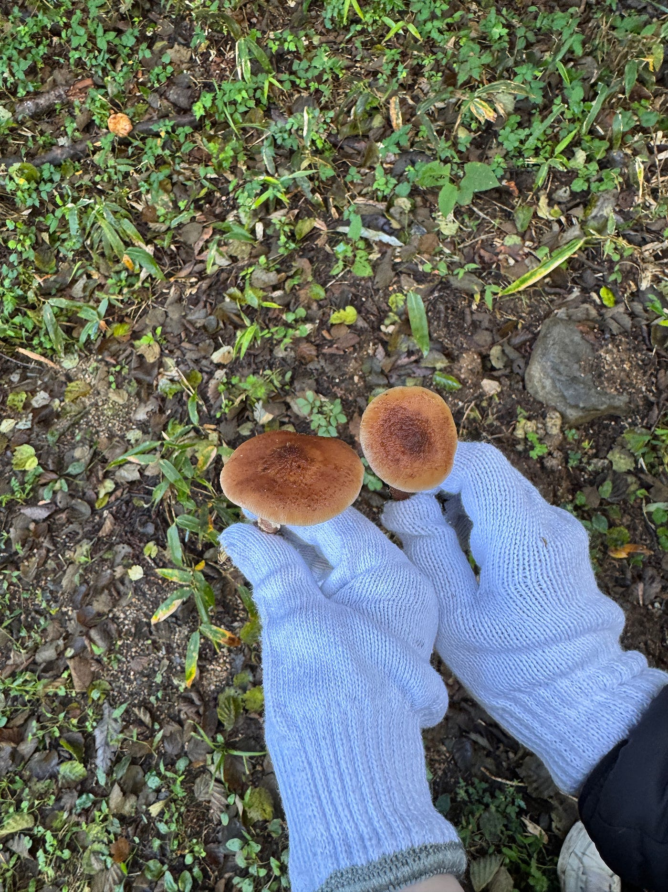

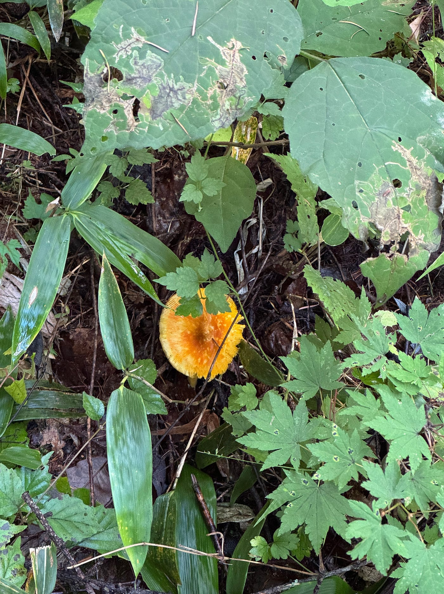

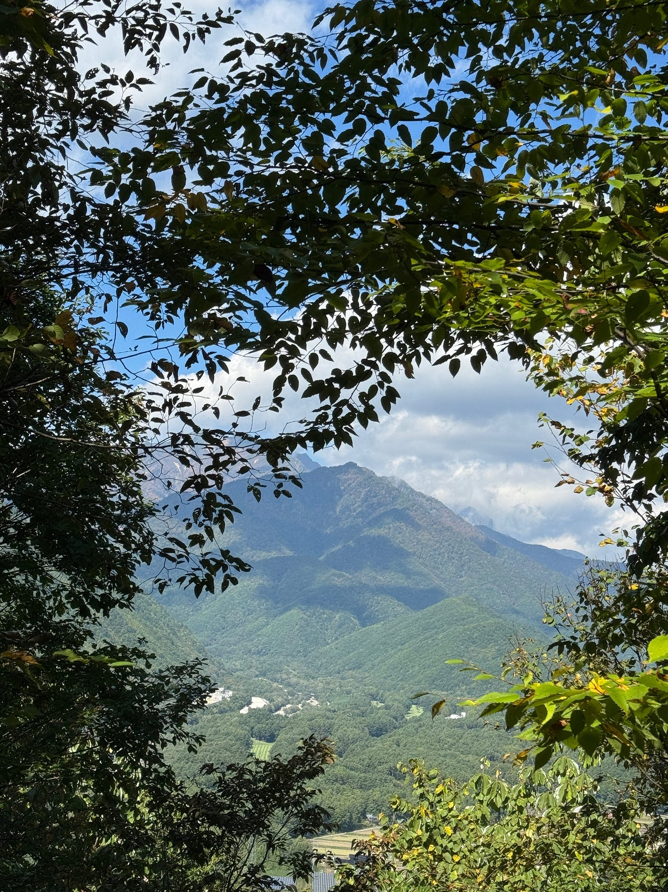

みんなで採ったきのこを使って作ったうどんは、とてもおいしかったです🍄

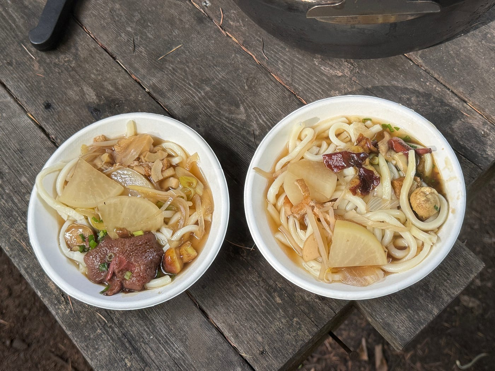

**③ 初めてのテント泊🏕**

三つ目は、初めてのテント泊です。

雨の中、限られたスペースでテントを立てるのは想像以上に大変で、特にポールを1人で立てるのに苦戦しました。

先生に手伝っていただきながら何とか立てることができたので、次回は手順を工夫して1人でも安全にポールを立てられるようにしたいです。

夜は、今テントから出たら熊がいるかもしれないと考えながら過ごしましたが、気づけば疲れすぎてそのまま寝てしまい、朝を迎えていました。

**最後に**

他にも、灯油ランプの点灯の仕方や安全な薪割りの仕方、焚き火の際に気をつけるポイントや、山の上から引かれた湧き水を汲む作業など、電気もガスもない自然の中で「生きる力」を学びました。

夕食では、人生で初めて解体した直後のイノシシの肉を食べることができ、自然の恵みをいただくことのありがたさを改めて感じた瞬間でした。

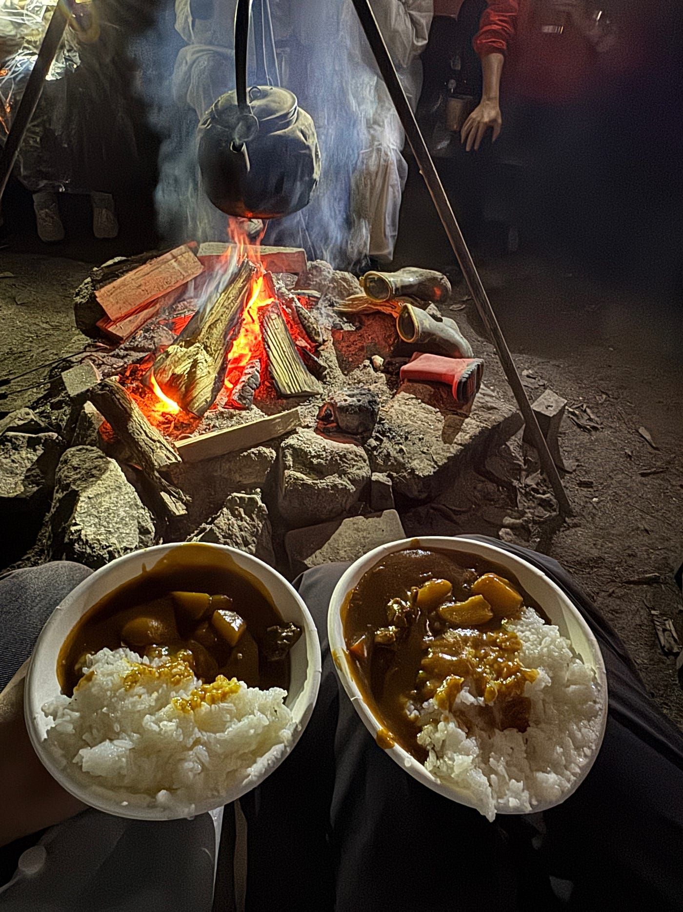

熊に遭遇することもなく、全員無事に帰ってくることができて本当によかったです🐻

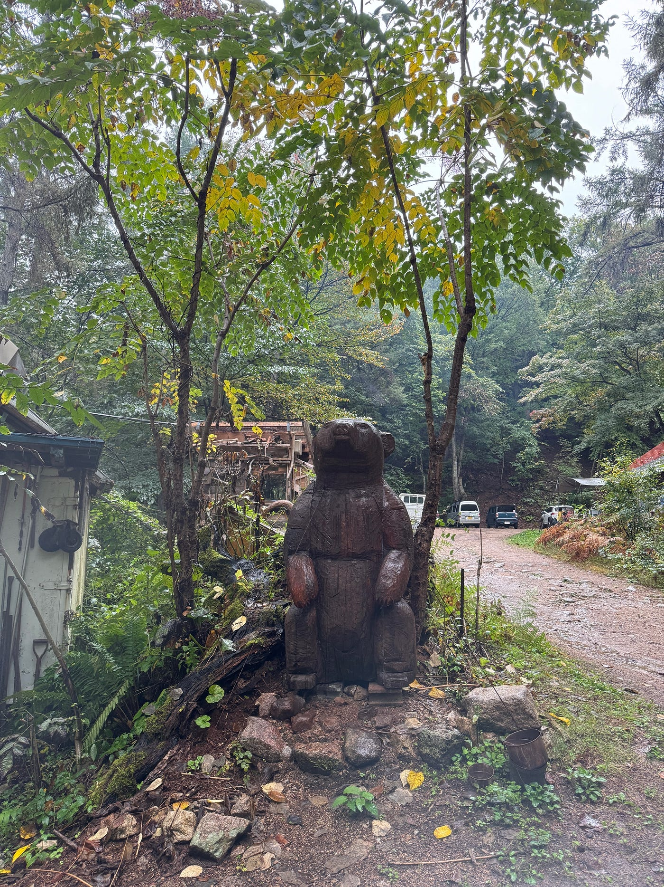

自然の中での生活は危険と隣り合わせですが、それ以上に、自分たちの力で工夫して生きる楽しさや仲間と協力する温かさを感じられた貴重な2日間でした🌲

きのこ狩りのStravaの記録です。

https://strava.app.link/3wCn8hNpDXb

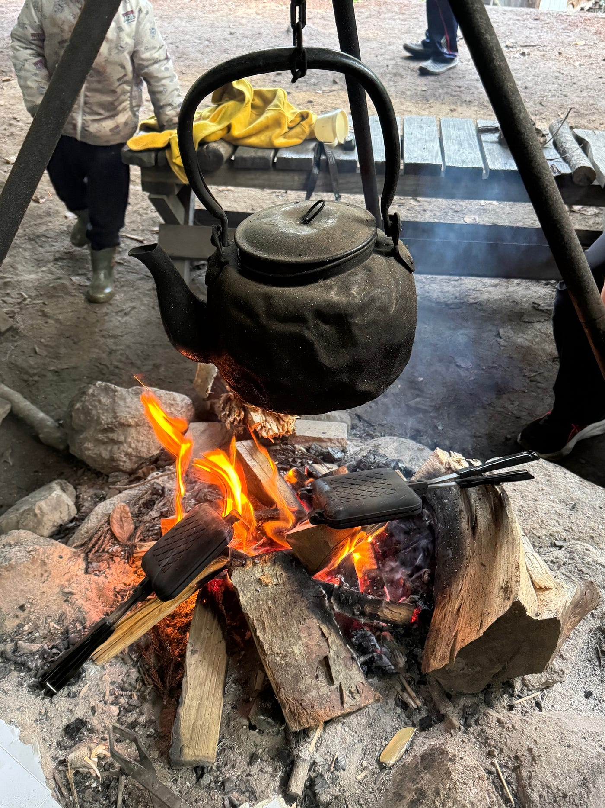

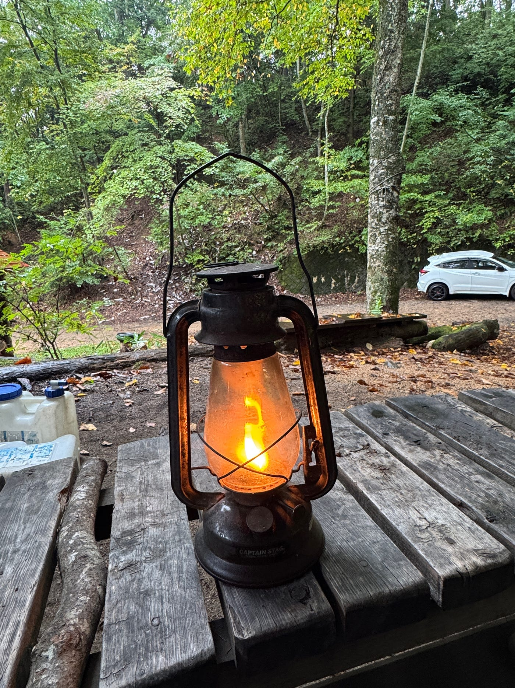

**グラレコ**

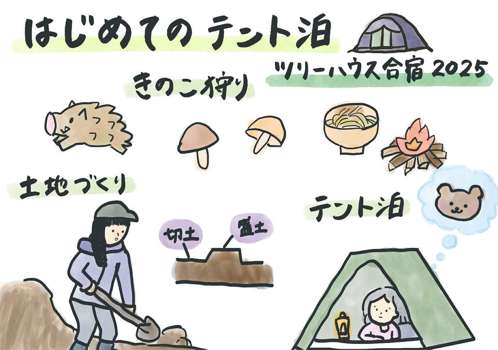
